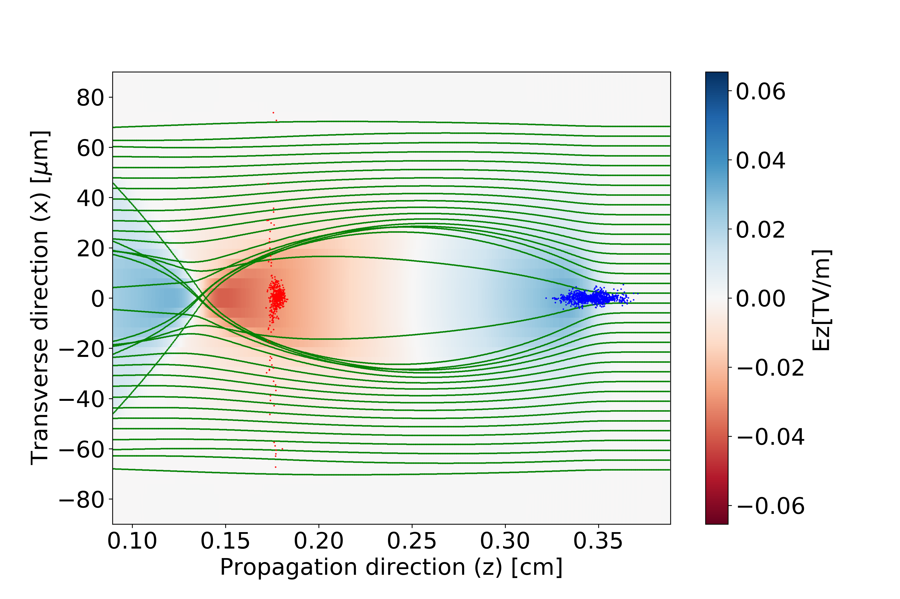

In-depth explanation of a PWFA simulation setup
===============================================

As described in the :doc:`intro`, one of the key applications of the WarpX exascale computing platform is in modelling future, compact and economic plasma-based accelerators.
In this section we describe the simulation setup of a realistic electron beam driven plasma wakefield accelerator (PWFA) configuration.
For illustration porpuses the setup can be explored with **WarpX** using the example input file :download:`PWFA <../../../Examples/Physics_applications/plasma_acceleration/inputs_2d_boost>`.

The simulation setup consists of 4 particle species: drive beam (driver), witness beam (beam), plasma electrons (plasma_e), and plasma ions (plasma_p).
The species physical parameters are summarized in the following table.

======== ============================================================
Species  Parameters
======== ============================================================
driver   :math:`\gamma` = 48923; N = 2x10^8; σz = 4.0 μm; σx = 2.0 μm
beam     :math:`\gamma` = 48923; N = 6x10^5; σz = 1.0 mm; σx = 0.5 μm
plasma_e n = 1x10^23 m^-3; w = 70 μm; lr = 8 mm; L = 200 mm
plasma_p n = 1x10^23 m^-3; w = 70 μm; lr = 8 mm; L = 200 mm
======== ============================================================

Where :math:`\gamma` is the beam relativisitc Lorentz factor, N is the number of particles, and σx, σy, σz are the beam widths (root-mean-squares of particle positions) in the transverse (x,y) and longitudinal directions.

The plasma, of total lenght L, has a density profile that consists of a lr long linear up-ramp, ranging from 0 to peak value n, is uniform within a transverse width of w and after the up-ramp.

With this configuration the driver excites a nonlinear plasma wake and drives the bubble deploited of plasma electrons where the beam accelerates, as can be seen in Fig. `[fig:PWFA] <#fig:PWFA>`__.

   [fig:PWFA] Plot of the driver (blue), beam (red) and plasma_e (green) electron macroparticle distribution at the time step 1000 of the example simulation.
   These are overlapping the 2D plot of the longitudinal electric field showing the accelerating/deccelerating (red/blue) regions of the plasma bubble.

Listed below are the key arguments and best-practices relevant for chosing the pwfa simulation parameters used in the example.

2D Geometry
-----------

    2D cartesian (with longitudinal direction z and transverse x) geometry simulaions can give valuable physical and numerical insight into the simulation requirements and evolution.
    At the same time it is much less time consuming than the full 3D cartesian or cylindrical geometries.

Finite Difference Time Domain
-----------------------------

    For standard plasma wakefield configurations, it is possible to model the physics correctly using the Particle-In-Cell (PIC) Finite Difference Time Domain (FDTD) algorithms (:doc:`picsar_theory`).
    If the simulation contains localised extremely high intensity fields, however, numerical instabilities might arise, such as the numerical Cherenkov instability (:doc:`boosted_frame`).
    In that case, it is recommended to use the Pseudo Spectral Analytical Time Domain (PSATD) or the Pseudo-Spectral Time-Domain (PSTD) algorithms.
    In the example we are describing, it is sufficient to use FDTD.

Cole-Karkkainen solver with Cowan coefficients
----------------------------------------------

    There are two FDTD Maxwell field solvers that compute the field push implemented in WarpX: the Yee and Cole-Karkkainen solver with Cowan coefficients (CKC) solvers.
    The later includes a modifitication that allows the numerical dispersion of light in vaccum to be exact, and that is why we choose CKC for the example.

Lorentz boosted frame
---------------------

    WarpX simulations can be done in the laboratory or `Lorentz-boosted <https://warpx.readthedocs.io/en/latest/theory/boosted_frame.html>`_ frames.
    In the laboratory frame, there is typically no need to model the palsma ions species, since they are mainly stationary during the short time scales associated with the motion of plasma electrons.
    In the boosted frame, that argument is no longer valid, as ions have relativistic velocities.
    The boosted frame still results in a substantial reduction to the simulation computational cost.

.. note::
   Regardless of the frame that is chosen for the simulation, the input file parameters are defined in respect to the laboratory frame.

Moving window
-------------

    To avoid having to simulate the whole 0.2 mm of plasma with the high resolution that is required to model the beam and plasma interaction correctly, we use the moving window.
    In this way we define a simulation box (grid) with a fixed size that travels at the speed-of-ligth (:math:`c`), i.e. follows the beam.

    .. note::
    When using moving window the option of continuous injection needs to be active for all particles initialized outside of the simulation box.

Resolution
----------

    Longitudinal and transverse resolutions (i.e. number and dimensions of the PIC grid cells) should be chosen to accurately describe the physical processes taking place in the simulation.
    Convergence scans, where resolution in both directions is gradually increased, should be used to determine the optimal configuration.
    Multiple cells per beam length and width are recommended (our illustrative example resolution is coarse).

    .. note::
       To avoid spurious effects, in the boosted frame, we consider the contrain that the transverse cell size should be larger than the transverse one.
       Traslating this condition to the cell transverse (:math:`d_{x}`) and longitudinal dimensions (:math:`d_{z}`) in the laboratory frame leads to: :math:`d_{x} > (d_{z} (1+\beta_{b}) \gamma_{b})`, where :math:`\beta_{b}` is the boosted frame velocity in units of :math:`c`.

Time step
---------

    The time step (:math:`dt`) is used to iterated over the main PIC loop and is computed by WarpX differently depending on the Maxwell field FDTD solvers used:

    * **For Yee** is equal to the CFL parameter chosen in the input file (:doc:`parameters`) times the Courant–Friedrichs–Lewy condition (CFL) that follows the analytical expression in :doc:`picsar_theory`
    * **For CKC** is equal to CFL times the minimum between the boosted frame cell dimensions

    where CFL is choosen to be below unity and set an optimal trade-off between making the simulation faster and avoiding NCI and other spurious effects.

Duration of the simulation
--------------------------

    To determine the total number of time steps of the simulation, we could either set the `<zmax_plasma_to_compute_max_step>` parameter to the end of the plasma (:math:`z_{\textrm{end}}`), or compute it using:

    * boosted frame edge of the simulation box, :math:`\textrm{corner} = l_{e}/ ((1-\beta_{b}) \gamma_{b})`
    * time of interaction in the boosted frame, :math:`T = \frac{z_{\textrm{end}}/\gamma_{b}-\textrm{corner}}{c (1+\beta_{b})}`
    * total number of iterations, :math:`i_{\textrm{max}} = T/dt`

    where :math:`l_{e}` is the position of the left edge of the simulation box (in respect to propagation direction).

Plotfiles and snapshots
-----------------------

    WarpX allows the data to be stored in different formats, such as plotfiles (following the `yt guidelines <https://yt-project.org/doc/index.html>`_), hdf5 and openPMD (following its `standard <https://github.com/openPMD>`_).
    In the example, we are dumping plotfiles with boosted frame informaiton on the simulation particles and fields.
    We are also requesting back transformed diagnostics that transform that information back to the laboratory frame.
    The diagnostics results are analysed and stored in snapshots at each time step and so it is best to make sure that the run does not end before filling the final snapshot.

Maximum grid size and blocking factor
-------------------------------------

    These parameters are carfully chosen to improve the code parallelization, load-balancing and performance (:doc:`parameters`) for each numerical configuration.
    They define the smallest and lagerst number of cells that can be contained in each simulation box and are carefuly defined in the `AMReX <https://amrex-codes.github.io/amrex/docs_html/GridCreation.html?highlight=blocking_factor>`_ documentation.
