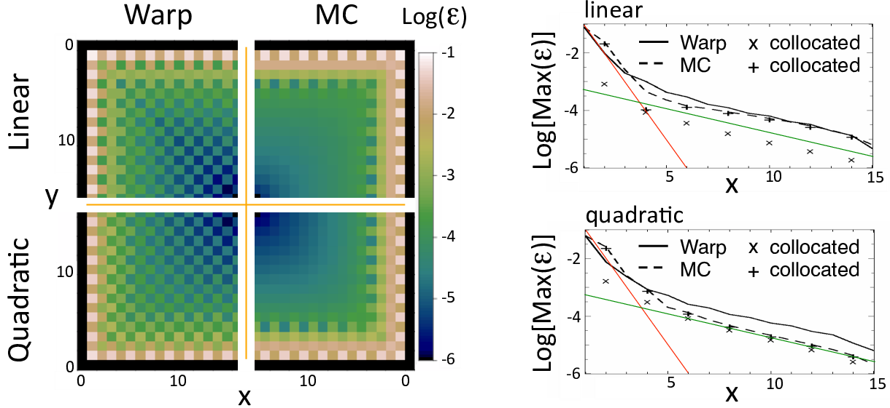

Mesh refinement
===============

.. raw:: latex

   \centering

.. figure:: ICNSP_2011_Vay_fig1.png
   :alt: Sketches of the implementation of mesh refinement in WarpX with the electrostatic (left) and electromagnetic (right) solvers. In both cases, the charge/current from particles are deposited at the finest levels first, then interpolated recursively to coarser levels. In the electrostatic case, the potential is calculated first at the coarsest level :math:`L_0`, the solution interpolated to the boundaries of the refined patch :math:`r` at the next level :math:`L_{1}` and the potential calculated at :math:`L_1`. The procedure is repeated iteratively up to the highest level. In the electromagnetic case, the fields are computed independently on each grid and patch without interpolation at boundaries. Patches are terminated by absorbing layers (PML) to prevent the reflection of electromagnetic waves. Additional coarse patch :math:`c` and fine grid :math:`a` are needed so that the full solution is obtained by substitution on :math:`a` as :math:`F_{n+1}(a)=F_{n+1}(r)+I[F_n( s )-F_{n+1}( c )]` where :math:`F` is the field, and :math:`I` is a coarse-to-fine interpolation operator. In both cases, the field solution at a given level :math:`L_n` is unaffected by the solution at higher levels :math:`L_{n+1}` and up, allowing for mitigation of some spurious effects (see text) by providing a transition zone via extension of the patches by a few cells beyond the desired refined area (red & orange rectangles) in which the field is interpolated onto particles from the coarser parent level only.
   :name: fig:ESAMR
   :width: 15cm

   Sketches of the implementation of mesh refinement in WarpX with the electrostatic (left) and electromagnetic (right) solvers. In both cases, the charge/current from particles are deposited at the finest levels first, then interpolated recursively to coarser levels. In the electrostatic case, the potential is calculated first at the coarsest level :math:`L_0`, the solution interpolated to the boundaries of the refined patch :math:`r` at the next level :math:`L_{1}` and the potential calculated at :math:`L_1`. The procedure is repeated iteratively up to the highest level. In the electromagnetic case, the fields are computed independently on each grid and patch without interpolation at boundaries. Patches are terminated by absorbing layers (PML) to prevent the reflection of electromagnetic waves. Additional coarse patch :math:`c` and fine grid :math:`a` are needed so that the full solution is obtained by substitution on :math:`a` as :math:`F_{n+1}(a)=F_{n+1}(r)+I[F_n( s )-F_{n+1}( c )]` where :math:`F` is the field, and :math:`I` is a coarse-to-fine interpolation operator. In both cases, the field solution at a given level :math:`L_n` is unaffected by the solution at higher levels :math:`L_{n+1}` and up, allowing for mitigation of some spurious effects (see text) by providing a transition zone via extension of the patches by a few cells beyond the desired refined area (red & orange rectangles) in which the field is interpolated onto particles from the coarser parent level only.

The mesh refinement methods that have been implemented in WarpX were developed following the following principles: i) avoidance of spurious effects from mesh refinement, or minimization of such effects; ii) user controllability of the spurious effects’ relative magnitude; iii) simplicity of implementation. The two main generic issues that were identified are: a) spurious self-force on macroparticles close to the mesh refinement interface (J. Vay et al. 2002; Colella and Norgaard 2010); b) reflection (and possible amplification) of short wavelength electromagnetic waves at the mesh refinement interface (Vay 2001). The two effects are due to the loss of translation invariance introduced by the asymmetry of the grid on each side of the mesh refinement interface.

In addition, for some implementations where the field that is computed at a given level is affected by the solution at finer levels, there are cases where the procedure violates the integral of Gauss’ Law around the refined patch, leading to long range errors (J. Vay et al. 2002; Colella and Norgaard 2010). As will be shown below, in the procedure that has been developed in WarpX, the field at a given refinement level is not affected by the solution at finer levels, and is thus not affected by this type of error.

Electrostatic
-------------

A cornerstone of the Particle-In-Cell method is that assuming a particle lying in a hypothetical infinite grid, then if the grid is regular and symmetrical, and if the order of field gathering matches the order of charge (or current) deposition, then there is no self-force of the particle acting on itself: a) anywhere if using the so-called “momentum conserving” gathering scheme; b) on average within one cell if using the “energy conserving” gathering scheme (Birdsall and Langdon 1991). A breaking of the regularity and/or symmetry in the grid, whether it is from the use of irregular meshes or mesh refinement, and whether one uses finite difference, finite volume or finite elements, results in a net spurious self-force (which does not average to zero over one cell) for a macroparticle close to the point of irregularity (mesh refinement interface for the current purpose) (J. Vay et al. 2002; Colella and Norgaard 2010).

A sketch of the implementation of mesh refinement in WarpX is given in Figure \ `[fig:ESAMR] <#fig:ESAMR>`__ (left). Given the solution of the electric potential at a refinement level :math:`L_n`, it is interpolated onto the boundaries of the grid patch(es) at the next refined level :math:`L_{n+1}`. The electric potential is then computed at level :math:`L_{n+1}` by solving the Poisson equation. This procedure necessitates the knowledge of the charge density at every level of refinement. For efficiency, the macroparticle charge is deposited on the highest level patch that contains them, and the charge density of each patch is added recursively to lower levels, down to the lowest.

.. raw:: latex

   \centering

.. figure:: ICNSP_2011_Vay_fig2.png
   :alt: Position history of one charged particle attracted by its image induced by a nearby metallic (dirichlet) boundary. The particle is initialized at rest. Without refinement patch (reference case), the particle is accelerated by its image, is reflected specularly at the wall, then decelerates until it reaches its initial position at rest. If the particle is initialized inside a refinement patch, the particle is initially accelerated toward the wall but is spuriously reflected before it reaches the boundary of the patch whether using the method implemented in WarpX or the MC method. Providing a surrounding transition region 2 or 4 cells wide in which the potential is interpolated from the parent coarse solution reduces significantly the effect of the spurious self-force.
   :name: fig:ESselfforce
   :width: 15cm

   Position history of one charged particle attracted by its image induced by a nearby metallic (dirichlet) boundary. The particle is initialized at rest. Without refinement patch (reference case), the particle is accelerated by its image, is reflected specularly at the wall, then decelerates until it reaches its initial position at rest. If the particle is initialized inside a refinement patch, the particle is initially accelerated toward the wall but is spuriously reflected before it reaches the boundary of the patch whether using the method implemented in WarpX or the MC method. Providing a surrounding transition region 2 or 4 cells wide in which the potential is interpolated from the parent coarse solution reduces significantly the effect of the spurious self-force. 

The presence of the self-force is illustrated on a simple test case that was introduced in (J. Vay et al. 2002) and also used in (Colella and Norgaard 2010): a single macroparticle is initialized at rest within a single refinement patch four cells away from the patch refinement boundary. The patch at level :math:`L_1` has :math:`32\times32` cells and is centered relative to the lowest :math:`64\times64` grid at level :math:`L_0` (“main grid”), while the macroparticle is centered in one direction but not in the other. The boundaries of the main grid are perfectly conducting, so that the macroparticle is attracted to the closest wall by its image. Specular reflection is applied when the particle reaches the boundary so that the motion is cyclic. The test was performed with WarpX using either linear or quadratic interpolation when gathering the main grid solution onto the refined patch boundary. It was also performed using another method from P. McCorquodale et al (labeled “MC” in this paper) based on the algorithm given in (Mccorquodale et al. 2004), which employs a more elaborate procedure involving two-ways interpolations between the main grid and the refined patch. A reference case was also run using a single :math:`128\times128` grid with no refined patch, in which it is observed that the particle propagates toward the closest boundary at an accelerated pace, is reflected specularly at the boundary, then slows down until it reaches its initial position at zero velocity. The particle position histories are shown for the various cases in Fig. `[fig:ESselfforce] <#fig:ESselfforce>`__. In all the cases using the refinement patch, the particle was spuriously reflected near the patch boundary and was effectively trapped in the patch. We notice that linear interpolation performs better than quadratic, and that the simple method implemented in WarpX performs better than the other proposed method for this test (see discussion below).

.. raw:: latex

   \centering

 algorithms and for linear and quadratic interpolation at the patch refinement boundary. (right) Lineouts of the maximum (taken over neighboring cells) of the spurious self-force. Close to the interface boundary (x=0), the spurious self-force decreases at a rate close to one order of magnitude per cell (red line), then at about one order of magnitude per six cells (green line).
   :name: fig:ESselfforcemap
   :width: 15cm

   (left) Maps of the magnitude of the spurious self-force :math:`\epsilon` in arbitrary units within one quarter of the refined patch, defined as :math:`\epsilon=\sqrt{(E_x-E_x^{ref})^2+(E_y-E_y^{ref})^2}`, where :math:`E_x` and :math:`E_y` are the electric field components within the patch experienced by one particle at a given location and :math:`E_x^{ref}` and :math:`E_y^{ref}` are the electric field from a reference solution. The map is given for the WarpX and the MC mesh refinement algorithms and for linear and quadratic interpolation at the patch refinement boundary. (right) Lineouts of the maximum (taken over neighboring cells) of the spurious self-force. Close to the interface boundary (x=0), the spurious self-force decreases at a rate close to one order of magnitude per cell (red line), then at about one order of magnitude per six cells (green line).

The magnitude of the spurious self-force as a function of the macroparticle position was mapped and is shown in Fig. `[fig:ESselfforcemap] <#fig:ESselfforcemap>`__ for the WarpX and MC algorithms using linear or quadratic interpolations between grid levels. It is observed that the magnitude of the spurious self-force decreases rapidly with the distance between the particle and the refined patch boundary, at a rate approaching one order of magnitude per cell for the four cells closest to the boundary and about one order of magnitude per six cells beyond. The method implemented in WarpX offers a weaker spurious force on average and especially at the cells that are the closest to the coarse-fine interface where it is the largest and thus matters most.
We notice that the magnitude of the spurious self-force depends strongly on the distance to the edge of the patch and to the nodes of the underlying coarse grid, but weakly on the order of deposition and size of the patch.

A method was devised and implemented in WarpX for reducing the magnitude of spurious self-forces near the coarse-fine boundaries as follows. Noting that the coarse grid solution is unaffected by the presence of the patch and is thus free of self-force, extra “transition” cells are added around the “effective” refined area.
Within the effective area, the particles gather the potential in the fine grid. In the extra transition cells surrounding the refinement patch, the force is gathered directly from the coarse grid (an option, which has not yet been implemented, would be to interpolate between the coarse and fine grid field solutions within the transition zone so as to provide continuity of the force experienced by the particles at the interface). The number of cells allocated in the transition zones is controllable by the user in WarpX, giving the opportunity to check whether the spurious self-force is affecting the calculation by repeating it using different thicknesses of the transition zones. The control of the spurious force using the transition zone is illustrated in Fig. \ `[fig:ESselfforce] <#fig:ESselfforce>`__, where the calculation with WarpX using linear interpolation at the patch interface was repeated using either two or four cells transition regions (measured in refined patch cell units). Using two extra cells allowed for the particle to be free of spurious trapping within the refined area and follow a trajectory that is close to the reference one, and using four extra cells improved further to the point where the resulting trajectory becomes undistinguishable from the reference one.
We note that an alternative method was devised for reducing the magnitude of self-force near the coarse-fine boundaries for the MC method, by using a special deposition procedure near the interface (Colella and Norgaard 2010).

Electromagnetic
---------------

The method that is used for electrostatic mesh refinement is not directly applicable to electromagnetic calculations. As was shown in section 3.4 of (Vay 2001), refinement schemes relying solely on interpolation between coarse and fine patches lead to the reflection with amplification of the short wavelength modes that fall below the cutoff of the Nyquist frequency of the coarse grid. Unless these modes are damped heavily or prevented from occurring at their source, they may affect particle motion and their effect can escalate if trapped within a patch, via multiple successive reflections with amplification.

To circumvent this issue, an additional coarse patch (with the same resolution as the parent grid) is added, as shown in Fig. \ `[fig:ESAMR] <#fig:ESAMR>`__-right and described in (Vay, Adam, and Heron 2004). Both the fine and the coarse grid patches are terminated by Perfectly Matched Layers, reducing wave reflection by orders of magnitude, controllable by the user (Berenger 1996; J.-L. Vay 2002). The source current resulting from the motion of charged macroparticles within the refined region is accumulated on the fine patch and is then interpolated onto the coarse patch and added onto the parent grid. The process is repeated recursively from the finest level down to the coarsest. The Maxwell equations are then solved for one time interval on the entire set of grids, by default for one time step using the time step of the finest grid. The field on the coarse and fine patches only contain the contributions from the particles that have evolved within the refined area but not from the current sources outside the area. The total contribution of the field from sources within and outside the refined area is obtained by adding the field from the refined grid :math:`F(r)`, and adding an interpolation :math:`I` of the difference between the relevant subset :math:`s` of the field in the parent grid :math:`F(s)` and the field of the coarse grid :math:`F( c )`, on an auxiliary grid :math:`a`, i.e. :math:`F(a)=F(r)+I[F(s)-F( c )]`. The field on the parent grid subset :math:`F(s)` contains contributions from sources from both within and outside of the refined area. Thus, in effect, there is substitution of the coarse field resulting from sources within the patch area by its fine resolution counterpart. The operation is carried out recursively starting at the coarsest level up to the finest.
An option has been implemented in which various grid levels are pushed with different time steps, given as a fixed fraction of the individual grid Courant conditions (assuming same cell aspect ratio for all grids and refinement by integer factors). In this case, the fields from the coarse levels, which are advanced less often, are interpolated in time.

The substitution method has two potential drawbacks due to the inexact cancellation between the coarse and fine patches of : (i) the remnants of ghost fixed charges created by the particles entering and leaving the patches (this effect is due to the use of the electromagnetic solver and is different from the spurious self-force that was described for the electrostatic case); (ii) if using a Maxwell solver with a low-order stencil, the electromagnetic waves traveling on each patch at slightly different velocity due to numerical dispersion.
The first issue results in an effective spurious multipole field whose magnitude decreases very rapidly with the distance to the patch boundary, similarly to the spurious self-force in the electrostatic case. Hence, adding a few extra transition cells surrounding the patches mitigates this effect very effectively.
The tunability of WarpX’s electromagnetic finite-difference and pseudo-spectral solvers provides the means to optimize the numerical dispersion so as to minimize the second effect for a given application, which has been demonstrated on the laser-plasma interaction test case presented in (Vay, Adam, and Heron 2004).
Both effects and their mitigation are described in more detail in (Vay, Adam, and Heron 2004).

Caustics are supported anywhere on the grid with an accuracy that is set by the local resolution, and will be adequately resolved if the grid resolution supports the necessary modes from their sources to the points of wavefront crossing. The mesh refinement method that is implemented in WarpX has the potential to provide higher efficiency than the standard use of fixed gridding, by offering a path toward adaptive gridding following wavefronts.

.. raw:: html

   

.. raw:: html

   

Berenger, Jp. 1996. “Three-Dimensional Perfectly Matched Layer for the Absorption of Electromagnetic Waves.” *Journal of Computational Physics* 127 (2): 363–79.

.. raw:: html

   

.. raw:: html

   

Birdsall, C K, and A B Langdon. 1991. *Plasma Physics via Computer Simulation*. Adam-Hilger.

.. raw:: html

   

.. raw:: html

   

Colella, Phillip, and Peter C Norgaard. 2010. “Controlling Self-Force Errors at Refinement Boundaries for Amr-Pic.” *Journal of Computational Physics* 229 (4): 947–57. https://doi.org/10.1016/J.Jcp.2009.07.004.

.. raw:: html

   

.. raw:: html

   

Mccorquodale, P, P Colella, Dp Grote, and Jl Vay. 2004. “A Node-Centered Local Refinement Algorithm For Poisson’s Equation In Complex Geometries.” *Journal of Computational Physics* 201 (1): 34–60. https://doi.org/10.1016/J.Jcp.2004.04.022.

.. raw:: html

   

.. raw:: html

   

Vay, J.-L. 2001. “An Extended Fdtd Scheme for the Wave Equation: Application to Multiscale Electromagnetic Simulation.” *Journal of Computational Physics* 167 (1): 72–98.

.. raw:: html

   

.. raw:: html

   

———. 2002. “Asymmetric Perfectly Matched Layer for the Absorption of Waves.” *Journal of Computational Physics* 183 (2): 367–99. https://doi.org/10.1006/Jcph.2002.7175.

.. raw:: html

   

.. raw:: html

   

Vay, J.-L., J.-C. Adam, and A Heron. 2004. “Asymmetric Pml for the Absorption of Waves. Application to Mesh Refinement in Electromagnetic Particle-in-Cell Plasma Simulations.” *Computer Physics Communications* 164 (1-3): 171–77. https://doi.org/10.1016/J.Cpc.2004.06.026.

.. raw:: html

   

.. raw:: html

   

Vay, Jl, P Colella, P Mccorquodale, B Van Straalen, A Friedman, and Dp Grote. 2002. “Mesh Refinement for Particle-in-Cell Plasma Simulations: Applications to and Benefits for Heavy Ion Fusion.” *Laser and Particle Beams* 20 (4): 569–75. https://doi.org/10.1017/S0263034602204139.

.. raw:: html

   

.. raw:: html

   

