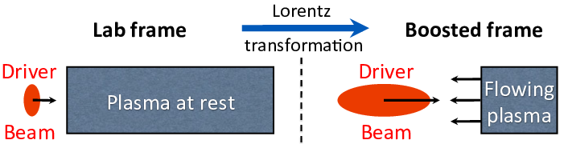

Moving window and optimal Lorentz boosted frame
===============================================

The simulations of plasma accelerators from first principles are extremely computationally intensive, due to the need to resolve the evolution of a driver (laser or particle beam) and an accelerated particle beam into a plasma structure that is orders of magnitude longer and wider than the accelerated beam. As is customary in the modeling of particle beam dynamics in standard particle accelerators, a moving window is commonly used to follow the driver, the wake and the accelerated beam. This results in huge savings, by avoiding the meshing of the entire plasma that is orders of magnitude longer than the other length scales of interest.

oving close to the speed of light in the direction of the driver beam leads to simulating a driver beam that appears longer propagating through a plasma that appears shorter than in the laboratory. Thus, this relativistic transformation of space and time reduces the disparity of scales, and thereby the number of time steps to complete the simulation, by orders of magnitude.

   [fig:PIC] A first principle simulation of a short driver beam (laser or charged particles) propagating through a plasma that is orders of magnitude longer necessitates a very large number of time steps. Recasting the simulation in a frame of reference that is moving close to the speed of light in the direction of the driver beam leads to simulating a driver beam that appears longer propagating through a plasma that appears shorter than in the laboratory. Thus, this relativistic transformation of space and time reduces the disparity of scales, and thereby the number of time steps to complete the simulation, by orders of magnitude.

Even using a moving window, however, a full PIC simulation of a plasma accelerator can be extraordinarily demanding computationally, as many time steps are needed to resolve the crossing of the short driver beam with the plasma column. As it turns out, choosing an optimal frame of reference that travels close to the speed of light in the direction of the laser or particle beam (as opposed to the usual choice of the laboratory frame) enables speedups by orders of magnitude (Vay 2007; J -L. Vay et al. 2011). This is a result of the properties of Lorentz contraction and dilation of space and time. In the frame of the laboratory, a very short driver (laser or particle) beam propagates through a much longer plasma column, necessitating millions to tens of millions of time steps for parameters in the range of the BELLA or FACET-II experiments. As sketched in Fig. `[fig:PIC] <#fig:PIC>`__, in a frame moving with the driver beam in the plasma at velocity :math:`v=\beta c` (where :math:`c` is the speed of light in vacuum), the beam length is now elongated by :math:`\approx(1+\beta)\gamma` while the plasma contracts by :math:`\gamma` (where :math:`\gamma=1/\sqrt{1-\beta^2}` is the relativistic factor associated with the frame velocity). The number of time steps that is needed to simulate a “longer” beam through a “shorter” plasma is now reduced by up to :math:`\approx(1+\beta) \gamma^2` (a detailed derivation of the speedup is given below).

The modeling of a plasma acceleration stage in a boosted frame
involves the fully electromagnetic modeling of a plasma propagating at near the speed of light, for which Numerical Cerenkov
(Boris and Lee 1973; Haber et al. 1973) is a potential issue, as explained in more details below.
In addition, for a frame of reference moving in the direction of the accelerated beam (or equivalently the wake of the laser),
waves emitted by the plasma in the forward direction expand
while the ones emitted in the backward direction contract, following the properties of the Lorentz transformation.
If one had to resolve both forward and backward propagating
waves emitted from the plasma, there would be no gain in selecting a frame different from the laboratory frame. However,
the physics of interest for a laser wakefield is the laser driving the wake, the wake, and the accelerated beam.
Backscatter is weak in the short-pulse regime, and does not
interact as strongly with the beam as do the forward propagating waves
which stay in phase for a long period. It is thus often assumed that the backward propagating waves
can be neglected in the modeling of plasma accelerator stages. The accuracy of this assumption has been demonstrated by
comparison between explicit codes which include both forward and backward waves and envelope or quasistatic codes which neglect backward waves
(Geddes et al. 2008; Geddes et al. 2009; Cowan et al. 2009).

Theoretical speedup dependency with the frame boost
---------------------------------------------------

The derivation that is given here reproduces the one given in (J -L. Vay et al. 2011), where the obtainable speedup is derived as an extension of the formula that was derived earlier(Vay 2007), taking in addition into account the group velocity of the laser as it traverses the plasma.

Assuming that the simulation box is a fixed number of plasma periods long, which implies the use (which is standard) of a moving window following
the wake and accelerated beam, the speedup is given by the ratio of the time taken by the laser pulse and the plasma to cross each other, divided by the shortest time scale of interest, that is the laser period. To first order, the wake velocity :math:`v_w` is set by the 1D group velocity of the laser driver, which in the linear (low intensity) limit, is given by (Esarey, Schroeder, and Leemans 2009):

.. math:: v_w/c=\beta_w=\left(1-\frac{\omega_p^2}{\omega^2}\right)^{1/2}

where :math:`\omega_p=\sqrt{(n_e e^2)/(\epsilon_0 m_e)}` is the plasma frequency, :math:`\omega=2\pi c/\lambda` is the laser frequency, :math:`n_e` is the plasma density, :math:`\lambda` is the laser wavelength in vacuum, :math:`\epsilon_0` is the permittivity of vacuum, :math:`c` is the speed of light in vacuum, and :math:`e` and :math:`m_e` are respectively the charge and mass of the electron.

In practice, the runs are typically stopped when the last electron beam macro-particle exits the plasma, and a measure of the total time of the simulation is then given by

.. math:: T=\frac{L+\eta \lambda_p}{v_w-v_p}

where :math:`\lambda_p\approx 2\pi c/\omega_p` is the wake wavelength, :math:`L` is the plasma length, :math:`v_w` and :math:`v_p=\beta_p c` are respectively the velocity of the wake and of the plasma relative to the frame of reference, and :math:`\eta` is an adjustable parameter for taking into account the fraction of the wake which exited the plasma at the end of the simulation.
For a beam injected into the :math:`n^{th}` bucket, :math:`\eta` would be set to :math:`n-1/2`. If positrons were considered, they would be injected half a wake period ahead of the location of the electrons injection position for a given period, and one would have :math:`\eta=n-1`. The numerical cost :math:`R_t` scales as the ratio of the total time to the shortest timescale of interest, which is the inverse of the laser frequency, and is thus given by

.. math:: R_t=\frac{T c}{\lambda}=\frac{\left(L+\eta \lambda_p\right)}{\left(\beta_w-\beta_p\right) \lambda}

In the laboratory, :math:`v_p=0` and the expression simplifies to

.. math:: R_{lab}=\frac{T c}{\lambda}=\frac{\left(L+\eta \lambda_p\right)}{\beta_w \lambda}

In a frame moving at :math:`\beta c`, the quantities become

.. math::

   \begin{aligned}
   \lambda_p^*&=&\lambda_p/\left[\gamma \left(1-\beta_w \beta\right)\right] \\
   L^*&=&L/\gamma \\
   \lambda^*&=& \gamma\left(1+\beta\right) \lambda\\
   \beta_w^*&=&\left(\beta_w-\beta\right)/\left(1-\beta_w\beta\right) \\
   v_p^*&=&-\beta c \\
   T^*&=&\frac{L^*+\eta \lambda_p^*}{v_w^*-v_p^*} \\
   R_t^*&=&\frac{T^* c}{\lambda^*} = \frac{\left(L^*+\eta \lambda_p^*\right)}{\left(\beta_w^*+\beta\right) \lambda^*}\end{aligned}

where :math:`\gamma=1/\sqrt{1-\beta^2}`.

The expected speedup from performing the simulation in a boosted frame is given by the ratio of :math:`R_{lab}` and :math:`R_t^*`

.. math::

   S=\frac{R_{lab}}{R_t^*}=\frac{\left(1+\beta\right)\left(L+\eta \lambda_p\right)}{\left(1-\beta\beta_w\right)L+\eta \lambda_p}
   \label{Eq_scaling1d0}

We note that assuming that :math:`\beta_w\approx1` (which is a valid approximation for most practical cases of interest) and that :math:`\gamma<<\gamma_w`, this expression is consistent with the expression derived earlier (Vay 2007) for the laser-plasma acceleration case, which states that :math:`R_t^*=\alpha R_t/\left(1+\beta\right)` with :math:`\alpha=\left(1-\beta+l/L\right)/\left(1+l/L\right)`, where :math:`l` is the laser length which is generally proportional to :math:`\eta \lambda_p`, and :math:`S=R_t/R_T^*`. However, higher values of :math:`\gamma` are of interest for maximum speedup, as shown below.

For intense lasers (:math:`a\sim 1`) typically used for acceleration, the energy gain is limited by dephasing (Schroeder et al. 2011), which occurs over a scale length :math:`L_d \sim \lambda_p^3/2\lambda^2`.
Acceleration is compromised beyond :math:`L_d` and in practice, the plasma length is proportional to the dephasing length, i.e. :math:`L= \xi L_d`. In most cases, :math:`\gamma_w^2>>1`, which allows the approximations :math:`\beta_w\approx1-\lambda^2/2\lambda_p^2`, and :math:`L=\xi \lambda_p^3/2\lambda^2\approx \xi \gamma_w^2 \lambda_p/2>>\eta \lambda_p`, so that Eq.(\ `[Eq_scaling1d0] <#Eq_scaling1d0>`__) becomes

.. math::

   S=\left(1+\beta\right)^2\gamma^2\frac{\xi\gamma_w^2}{\xi\gamma_w^2+\left(1+\beta\right)\gamma^2\left(\xi\beta/2+2\eta\right)}
   \label{Eq_scaling1d}

For low values of :math:`\gamma`, i.e. when :math:`\gamma<<\gamma_w`, Eq.(\ `[Eq_scaling1d] <#Eq_scaling1d>`__) reduces to

.. math::

   S_{\gamma<<\gamma_w}=\left(1+\beta\right)^2\gamma^2
   \label{Eq_scaling1d_simpl2}

Conversely, if :math:`\gamma\rightarrow\infty`, Eq.(\ `[Eq_scaling1d] <#Eq_scaling1d>`__) becomes

.. math::

   S_{\gamma\rightarrow\infty}=\frac{4}{1+4\eta/\xi}\gamma_w^2
   \label{Eq_scaling_gamma_inf}

Finally, in the frame of the wake, i.e. when :math:`\gamma=\gamma_w`, assuming that :math:`\beta_w\approx1`, Eq.(\ `[Eq_scaling1d] <#Eq_scaling1d>`__) gives

.. math::

   S_{\gamma=\gamma_w}\approx\frac{2}{1+2\eta/\xi}\gamma_w^2
   \label{Eq_scaling_gamma_wake}

Since :math:`\eta` and :math:`\xi` are of order unity, and the practical regimes of most interest satisfy :math:`\gamma_w^2>>1`, the speedup that is obtained by using the frame of the wake will be near the maximum obtainable value given by Eq.(\ `[Eq_scaling_gamma_inf] <#Eq_scaling_gamma_inf>`__).

Note that without the use of a moving window, the relativistic effects that are at play in the time domain would also be at play in the spatial domain (Vay 2007), and the :math:`\gamma^2` scaling would transform to :math:`\gamma^4`. Hence, it is important to use a moving window even in simulations in a Lorentz boosted frame. For very high values of the boosted frame, the optimal velocity of the moving window may vanish (i.e. no moving window) or even reverse.

Numerical Stability and alternate formulation in a Galilean frame
-----------------------------------------------------------------

The numerical Cherenkov instability (NCI) (Godfrey 1974)
is the most serious numerical instability affecting multidimensional
PIC simulations of relativistic particle beams and streaming plasmas
(Martins et al. 2010; Vay et al. 2010; J L Vay et al. 2011; Sironi and Spitkovsky 2011; Godfrey and Vay 2013; Xu et al. 2013).
It arises from coupling between possibly numerically distorted electromagnetic modes and spurious
beam modes, the latter due to the mismatch between the Lagrangian
treatment of particles and the Eulerian treatment of fields (Godfrey 1975).

In recent papers the electromagnetic dispersion
relations for the numerical Cherenkov instability were derived and solved for both FDTD (Godfrey and Vay 2013; Brendan B. Godfrey and Vay 2014)
and PSATD (Brendan B. Godfrey, Vay, and Haber 2014a, 2014b) algorithms.

Several solutions have been proposed to mitigate the NCI (Brendan B Godfrey, Vay, and Haber 2014; Brendan B. Godfrey, Vay, and Haber 2014b, 2014a; Godfrey and Vay 2015; Yu, Xu, Decyk, et al. 2015; Yu, Xu, Tableman, et al. 2015). Although
these solutions efficiently reduce the numerical instability,
they typically introduce either strong smoothing of the currents and
fields, or arbitrary numerical corrections, which are
tuned specifically against the NCI and go beyond the
natural discretization of the underlying physical equation. Therefore,
it is sometimes unclear to what extent these added corrections could impact the
physics at stake for a given resolution.

For instance, NCI-specific corrections include periodically smoothing
the electromagnetic field components (Martins et al. 2010),
using a special time step (Vay et al. 2010; J L Vay et al. 2011) or
applying a wide-band smoothing of the current components (Vay et al. 2010; J L Vay et al. 2011; J. Vay et al. 2011). Another set of mitigation methods
involve scaling the deposited
currents by a carefully-designed wavenumber-dependent factor
(Brendan B. Godfrey and Vay 2014; Brendan B. Godfrey, Vay, and Haber 2014b) or slightly modifying the
ratio of electric and magnetic fields (:math:`E/B`) before gathering their
value onto the macroparticles
(Brendan B. Godfrey, Vay, and Haber 2014a; Godfrey and Vay 2015).
Yet another set of NCI-specific corrections
(Yu, Xu, Decyk, et al. 2015; Yu, Xu, Tableman, et al. 2015) consists
in combining a small timestep :math:`\Delta t`, a sharp low-pass spatial filter,
and a spectral or high-order scheme that is tuned so as to
create a small, artificial “bump” in the dispersion relation
(Yu, Xu, Decyk, et al. 2015). While most mitigation methods have only been applied
to Cartesian geometry, this last
set of methods ((Yu, Xu, Decyk, et al. 2015; Yu, Xu, Tableman, et al. 2015))
has the remarkable property that it can be applied
(Yu, Xu, Tableman, et al. 2015) to both Cartesian geometry and
quasi-cylindrical geometry (i.e. cylindrical geometry with
azimuthal Fourier decomposition (Lifschitz et al. 2009; Davidson et al. 2015; R. Lehe et al. 2016)). However,
the use of a small timestep proportionally slows down the progress of
the simulation, and the artificial “bump” is again an arbitrary correction
that departs from the underlying physics.

A new scheme was recently proposed, in (Kirchen et al. 2016; Lehe et al. 2016), which
completely eliminates the NCI for a plasma drifting at a uniform relativistic velocity
– with no arbitrary correction – by simply integrating
the PIC equations in *Galilean coordinates* (also known as
*comoving coordinates*). More precisely, in the new
method, the Maxwell equations *in Galilean coordinates* are integrated
analytically, using only natural hypotheses, within the PSATD
framework (Pseudo-Spectral-Analytical-Time-Domain (Haber et al. 1973; Vay, Haber, and Godfrey 2013)).

The idea of the proposed scheme is to perform a Galilean change of
coordinates, and to carry out the simulation in the new coordinates:

.. math::

   \label{eq:change-var}
   \boldsymbol{x}' = \boldsymbol{x} - \boldsymbol{v}_{gal}t

where :math:`\boldsymbol{x} = x\,\boldsymbol{u}_x + y\,\boldsymbol{u}_y + z\,\boldsymbol{u}_z` and
:math:`\boldsymbol{x}' = x'\,\boldsymbol{u}_x + y'\,\boldsymbol{u}_y + z'\,\boldsymbol{u}_z` are the
position vectors in the standard and Galilean coordinates
respectively.

When choosing :math:`\boldsymbol{v}_{gal}= \boldsymbol{v}_0`, where
:math:`\boldsymbol{v}_0` is the speed of the bulk of the relativistic
plasma, the plasma does not move with respect to the grid in the Galilean
coordinates :math:`\boldsymbol{x}'` – or, equivalently, in the standard
coordinates :math:`\boldsymbol{x}`, the grid moves along with the plasma. The heuristic intuition behind this scheme
is that these coordinates should prevent the discrepancy between the Lagrangian and
Eulerian point of view, which gives rise to the NCI (Godfrey 1975).

An important remark is that the Galilean change of
coordinates (`[eq:change-var] <#eq:change-var>`__) is a simple translation. Thus, when used in
the context of Lorentz-boosted simulations, it does
of course preserve the relativistic dilatation of space and time which gives rise to the
characteristic computational speedup of the boosted-frame technique.

Another important remark is that the Galilean scheme is *not*
equivalent to a moving window (and in fact the Galilean scheme can be
independently *combined* with a moving window). Whereas in a
moving window, gridpoints are added and removed so as to effectively
translate the boundaries, in the Galilean scheme the gridpoints
*themselves* are not only translated but in this case, the physical equations
are modified accordingly. Most importantly, the assumed time evolution of
the current :math:`\boldsymbol{J}` within one timestep is different in a standard PSATD scheme with moving
window and in a Galilean PSATD scheme (Lehe et al. 2016).

In the Galilean coordinates :math:`\boldsymbol{x}'`, the equations of particle
motion and the Maxwell equations take the form

.. math::

   \begin{aligned}
   \frac{d\boldsymbol{x}'}{dt} &= \frac{\boldsymbol{p}}{\gamma m} - \boldsymbol{v}_{gal}\label{eq:motion1} \\
   \frac{d\boldsymbol{p}}{dt} &= q \left( \boldsymbol{E} +
   \frac{\boldsymbol{p}}{\gamma m} \times \boldsymbol{B} \right) \label{eq:motion2}\\
   \left(  \frac{\partial \;}{\partial t} - \boldsymbol{v}_{gal}\cdot\boldsymbol{\nabla'}\right)\boldsymbol{B} &= -\boldsymbol{\nabla'}\times\boldsymbol{E} \label{eq:maxwell1}\\
   \frac{1}{c^2}\left(  \frac{\partial \;}{\partial t} - \boldsymbol{v}_{gal}\cdot\boldsymbol{\nabla'}\right)\boldsymbol{E} &= \boldsymbol{\nabla'}\times\boldsymbol{B} - \mu_0\boldsymbol{J} \label{eq:maxwell2}\end{aligned}

where :math:`\boldsymbol{\nabla'}` denotes a spatial derivative with respect to the
Galilean coordinates :math:`\boldsymbol{x}'`.

Integrating these equations from :math:`t=n\Delta
t` to :math:`t=(n+1)\Delta t` results in the following update equations (see
(Lehe et al. 2016) for the details of the derivation):

.. math::

   \begin{aligned}
   \mathbf{\tilde{B}}^{n+1} &= \theta^2 C \mathbf{\tilde{B}}^n
    -\frac{\theta^2 S}{ck}i\boldsymbol{k}\times \mathbf{\tilde{E}}^n \nonumber \\
   & + \;\frac{\theta \chi_1}{\epsilon_0c^2k^2}\;i\boldsymbol{k} \times
                        \mathbf{\tilde{J}}^{n+1/2} \label{eq:disc-maxwell1}\\
   \mathbf{\tilde{E}}^{n+1} &=  \theta^2 C  \mathbf{\tilde{E}}^n
    +\frac{\theta^2 S}{k} \,c i\boldsymbol{k}\times \mathbf{\tilde{B}}^n \nonumber \\
   & +\frac{i\nu \theta \chi_1 - \theta^2S}{\epsilon_0 ck} \; \mathbf{\tilde{J}}^{n+1/2}\nonumber \\
   & - \frac{1}{\epsilon_0k^2}\left(\; \chi_2\;\hat{\mathcal{\rho}}^{n+1} -
     \theta^2\chi_3\;\hat{\mathcal{\rho}}^{n} \;\right) i\boldsymbol{k} \label{eq:disc-maxwell2}\end{aligned}

where we used the short-hand notations :math:`\mathbf{\tilde{E}}^n \equiv
%
\mathbf{\tilde{E}}(\boldsymbol{k}, n\Delta t)`, :math:`\mathbf{\tilde{B}}^n \equiv
\mathbf{\tilde{B}}(\boldsymbol{k}, n\Delta t)` as well as:

.. math::

   \begin{aligned}
   &C = \cos(ck\Delta t) \quad S = \sin(ck\Delta t) \quad k
   = |\boldsymbol{k}| \label{eq:def-C-S}\\&
   \nu = \frac{\boldsymbol{k}\cdot\boldsymbol{v}_{gal}}{ck} \quad \theta =
     e^{i\boldsymbol{k}\cdot\boldsymbol{v}_{gal}\Delta t/2} \quad \theta^* =
     e^{-i\boldsymbol{k}\cdot\boldsymbol{v}_{gal}\Delta t/2} \label{eq:def-nu-theta}\\&
   \chi_1 =  \frac{1}{1 -\nu^2} \left( \theta^* -  C \theta + i
     \nu \theta S \right) \label{eq:def-chi1}\\&
   \chi_2 = \frac{\chi_1 - \theta(1-C)}{\theta^*-\theta} \quad
   \chi_3 = \frac{\chi_1-\theta^*(1-C)}{\theta^*-\theta} \label{eq:def-chi23}\end{aligned}

Note that, in the limit :math:`\boldsymbol{v}_{gal}=\boldsymbol{0}`,
(`[eq:disc-maxwell1] <#eq:disc-maxwell1>`__) and (`[eq:disc-maxwell2] <#eq:disc-maxwell2>`__) reduce to the standard PSATD
equations (Haber et al. 1973), as expected.
As shown in (Kirchen et al. 2016; Lehe et al. 2016),
the elimination of the NCI with the new Galilean integration is verified empirically via PIC simulations of uniform drifting plasmas and laser-driven plasma acceleration stages, and confirmed by a theoretical analysis of the instability.

.. raw:: html

   

.. raw:: html

   

Boris, Jp, and R Lee. 1973. “Nonphysical Self Forces in Some Electromagnetic Plasma-Simulation Algorithms.” Note. *Journal of Computational Physics* 12 (1). 525 B St, Ste 1900, San Diego, Ca 92101-4495: Academic Press Inc Jnl-Comp Subscriptions: 131–36.

.. raw:: html

   

.. raw:: html

   

Cowan, B, D Bruhwiler, E Cormier-Michel, E Esarey, C G R Geddes, P Messmer, and K Paul. 2009. “Laser Wakefield Simulation Using A Speed-of-Light Frame Envelope Model.” In *Aip Conference Proceedings*, 1086:309–14.

.. raw:: html

   

.. raw:: html

   

Davidson, A., A. Tableman, W. An, F.S. Tsung, W. Lu, J. Vieira, R.A. Fonseca, L.O. Silva, and W.B. Mori. 2015. “Implementation of a hybrid particle code with a PIC description in r–z and a gridless description in ϕ into OSIRIS.” *Journal of Computational Physics* 281: 1063–77. https://doi.org/10.1016/j.jcp.2014.10.064.

.. raw:: html

   

.. raw:: html

   

Esarey, E, C B Schroeder, and W P Leemans. 2009. “Physics of Laser-Driven Plasma-Based Electron Accelerators.” *Rev. Mod. Phys.* 81 (3): 1229–85. https://doi.org/10.1103/Revmodphys.81.1229.

.. raw:: html

   

.. raw:: html

   

Geddes, C G R, D L Bruhwiler, J R Cary, W B Mori, J.-L. Vay, S F Martins, T Katsouleas, et al. 2008. “Computational Studies and Optimization of Wakefield Accelerators.” In *Journal of Physics: Conference Series*, 125:012002 (11 Pp.).

.. raw:: html

   

.. raw:: html

   

Geddes et al., C G R. 2009. “Scaled Simulation Design of High Quality Laser Wakefield Accelerator Stages.” In *Proc. Particle Accelerator Conference*. Vancouver, Canada.

.. raw:: html

   

.. raw:: html

   

Godfrey, Bb. 1974. “Numerical Cherenkov Instabilities in Electromagnetic Particle Codes.” *Journal of Computational Physics* 15 (4): 504–21.

.. raw:: html

   

.. raw:: html

   

———. 1975. “Canonical Momenta and Numerical Instabilities in Particle Codes.” *Journal of Computational Physics* 19 (1): 58–76.

.. raw:: html

   

.. raw:: html

   

Godfrey, Brendan B, and Jean-Luc Vay. 2013. “Numerical stability of relativistic beam multidimensional {PIC} simulations employing the Esirkepov algorithm.” *Journal of Computational Physics* 248 (0): 33–46. https://doi.org/http://dx.doi.org/10.1016/j.jcp.2013.04.006.

.. raw:: html

   

.. raw:: html

   

Godfrey, Brendan B., and Jean Luc Vay. 2014. “Suppressing the numerical Cherenkov instability in FDTD PIC codes.” *Journal of Computational Physics* 267: 1–6.

.. raw:: html

   

.. raw:: html

   

———. 2015. “Improved numerical Cherenkov instability suppression in the generalized PSTD PIC algorithm.” *Computer Physics Communications* 196. Elsevier: 221–25.

.. raw:: html

   

.. raw:: html

   

Godfrey, Brendan B., Jean Luc Vay, and Irving Haber. 2014a. “Numerical stability analysis of the pseudo-spectral analytical time-domain PIC algorithm.” *Journal of Computational Physics* 258: 689–704.

.. raw:: html

   

.. raw:: html

   

———. 2014b. “Numerical stability improvements for the pseudospectral EM PIC algorithm.” *IEEE Transactions on Plasma Science* 42 (5). Institute of Electrical; Electronics Engineers Inc.: 1339–44.

.. raw:: html

   

.. raw:: html

   

Godfrey, Brendan B, Jean-Luc Vay, and Irving Haber. 2014. “Numerical stability analysis of the pseudo-spectral analytical time-domain {PIC} algorithm.” *Journal of Computational Physics* 258 (0): 689–704. https://doi.org/http://dx.doi.org/10.1016/j.jcp.2013.10.053.

.. raw:: html

   

.. raw:: html

   

Haber, I, R Lee, Hh Klein, and Jp Boris. 1973. “Advances in Electromagnetic Simulation Techniques.” In *Proc. Sixth Conf. Num. Sim. Plasmas*, 46–48. Berkeley, Ca.

.. raw:: html

   

.. raw:: html

   

Kirchen, M., R. Lehe, B. B. Godfrey, I. Dornmair, S. Jalas, K. Peters, J.-L. Vay, and A. R. Maier. 2016. “Stable discrete representation of relativistically drifting plasmas.” *arXiv:1608.00215*.

.. raw:: html

   

.. raw:: html

   

Lehe, Rémi, Manuel Kirchen, Igor A. Andriyash, Brendan B. Godfrey, and Jean-Luc Vay. 2016. “A spectral, quasi-cylindrical and dispersion-free Particle-In-Cell algorithm.” *Computer Physics Communications* 203: 66–82. https://doi.org/10.1016/j.cpc.2016.02.007.

.. raw:: html

   

.. raw:: html

   

Lehe, R., M. Kirchen, B. B. Godfrey, A. R. Maier, and J.-L. Vay. 2016. “Elimination of Numerical Cherenkov Instability in flowing-plasma Particle-In-Cell simulations by using Galilean coordinates.” *arXiv:1608.00227*.

.. raw:: html

   

.. raw:: html

   

Lifschitz, A F, X Davoine, E Lefebvre, J Faure, C Rechatin, and V Malka. 2009. “Particle-in-Cell modelling of laser{â}€“plasma interaction using Fourier decomposition.” *Journal of Computational Physics* 228 (5): 1803–14. https://doi.org/http://dx.doi.org/10.1016/j.jcp.2008.11.017.

.. raw:: html

   

.. raw:: html

   

Martins, Samuel F, Ricardo A Fonseca, Luis O Silva, Wei Lu, and Warren B Mori. 2010. “Numerical Simulations of Laser Wakefield Accelerators in Optimal Lorentz Frames.” *Computer Physics Communications* 181 (5): 869–75. https://doi.org/10.1016/J.Cpc.2009.12.023.

.. raw:: html

   

.. raw:: html

   

Schroeder, C B, C Benedetti, E Esarey, and W P Leemans. 2011. “Nonlinear Pulse Propagation and Phase Velocity of Laser-Driven Plasma Waves.” *Physical Review Letters* 106 (13): 135002. https://doi.org/10.1103/Physrevlett.106.135002.

.. raw:: html

   

.. raw:: html

   

Sironi, L, and A Spitkovsky. 2011. “No Title.”

.. raw:: html

   

.. raw:: html

   

Vay, Jean Luc, Irving Haber, and Brendan B. Godfrey. 2013. “A domain decomposition method for pseudo-spectral electromagnetic simulations of plasmas.” *Journal of Computational Physics* 243: 260–68.

.. raw:: html

   

.. raw:: html

   

Vay, J.-L. 2007. “Noninvariance of Space- and Time-Scale Ranges Under A Lorentz Transformation and the Implications for the Study of Relativistic Interactions.” *Physical Review Letters* 98 (13): 130405/1–4.

.. raw:: html

   

.. raw:: html

   

Vay, J -. L, C G R Geddes, C Benedetti, D L Bruhwiler, E Cormier-Michel, B M Cowan, J R Cary, and D P Grote. 2010. “Modeling Laser Wakefield Accelerators in A Lorentz Boosted Frame.” *Aip Conference Proceedings* 1299: 244–49. https://doi.org/10.1063/1.3520322.

.. raw:: html

   

.. raw:: html

   

Vay, J L, C G R Geddes, E Cormier-Michel, and D P Grote. 2011. “Numerical Methods for Instability Mitigation in the Modeling of Laser Wakefield Accelerators in A Lorentz-Boosted Frame.” *Journal of Computational Physics* 230 (15): 5908–29. https://doi.org/10.1016/J.Jcp.2011.04.003.

.. raw:: html

   

.. raw:: html

   

Vay, Jl, C G R Geddes, E Cormier-Michel, and D P Grote. 2011. “Effects of Hyperbolic Rotation in Minkowski Space on the Modeling of Plasma Accelerators in A Lorentz Boosted Frame.” *Physics of Plasmas* 18 (3): 30701. https://doi.org/10.1063/1.3559483.

.. raw:: html

   

.. raw:: html

   

Vay, J -L., C G R Geddes, E Esarey, C B Schroeder, W P Leemans, E Cormier-Michel, and D P Grote. 2011. “Modeling of 10 Gev-1 Tev Laser-Plasma Accelerators Using Lorentz Boosted Simulations.” *Physics of Plasmas* 18 (12). https://doi.org/10.1063/1.3663841.

.. raw:: html

   

.. raw:: html

   

Xu, Xinlu, Peicheng Yu, Samual F Martins, Frank S Tsung, Viktor K Decyk, Jorge Vieira, Ricardo A Fonseca, Wei Lu, Luis O Silva, and Warren B Mori. 2013. “Numerical instability due to relativistic plasma drift in EM-PIC simulations.” *Computer Physics Communications* 184 (11): 2503–14. https://doi.org/http://dx.doi.org/10.1016/j.cpc.2013.07.003.

.. raw:: html

   

.. raw:: html

   

Yu, Peicheng, Xinlu Xu, Viktor K. Decyk, Frederico Fiuza, Jorge Vieira, Frank S. Tsung, Ricardo A. Fonseca, Wei Lu, Luis O. Silva, and Warren B. Mori. 2015. “Elimination of the numerical Cerenkov instability for spectral EM-PIC codes.” *Computer Physics Communications* 192 (July). ELSEVIER SCIENCE BV, PO BOX 211, 1000 AE AMSTERDAM, NETHERLANDS: 32–47. https://doi.org/10.1016/j.cpc.2015.02.018.

.. raw:: html

   

.. raw:: html

   

Yu, Peicheng, Xinlu Xu, Adam Tableman, Viktor K. Decyk, Frank S. Tsung, Frederico Fiuza, Asher Davidson, et al. 2015. “Mitigation of numerical Cerenkov radiation and instability using a hybrid finite difference-FFT Maxwell solver and a local charge conserving current deposit.” *Computer Physics Communications* 197 (December). ELSEVIER SCIENCE BV, PO BOX 211, 1000 AE AMSTERDAM, NETHERLANDS: 144–52. https://doi.org/10.1016/j.cpc.2015.08.026.

.. raw:: html

   

.. raw:: html

   

