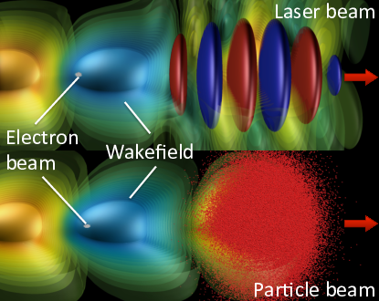

Introduction
============

) propagating (from left to right) through an under-dense plasma (not represented) displaces electrons, creating a plasma wakefield that supports very high electric fields (pale blue and yellow). These electric fields, which can be orders of magnitude larger than with conventional techniques, can be used to accelerate a short charged particle beam (white) to high-energy over a very short distance.

   [fig:Plasma_acceleration_sim] Plasma laser-driven (top) and charged-particles-driven (bottom) acceleration (rendering from 3-D Particle-In-Cell simulations). A laser beam (red and blue disks in top picture) or a charged particle beam (red dots in bottom picture) propagating (from left to right) through an under-dense plasma (not represented) displaces electrons, creating a plasma wakefield that supports very high electric fields (pale blue and yellow). These electric fields, which can be orders of magnitude larger than with conventional techniques, can be used to accelerate a short charged particle beam (white) to high-energy over a very short distance.

Computer simulations have had a profound impact on the design and understanding of past and present plasma acceleration experiments (Tsung et al. 2006; Geddes et al. 2008; C. Geddes et al. 2009; Huang et al. 2009), with
accurate modeling of wake formation, electron self-trapping and acceleration requiring fully kinetic methods (usually Particle-In-Cell) using large computational resources due to the wide range of space and time scales involved. Numerical modeling complements and guides the design and analysis of advanced accelerators, and can reduce development costs significantly. Despite the major recent experimental successes(Leemans et al. 2014; Blumenfeld et al. 2007; Bulanov S V and Wilkens J J and Esirkepov T Zh and Korn G and Kraft G and Kraft S D and Molls M and Khoroshkov V S 2014; Steinke et al. 2016), the various advanced acceleration concepts need significant progress to fulfill their potential. To this end, large-scale simulations will continue to be a key component toward reaching a detailed understanding of the complex interrelated physics phenomena at play.

For such simulations,
the most popular algorithm is the Particle-In-Cell (or PIC) technique,
which represents electromagnetic fields on a grid and particles by
a sample of macroparticles.
However, these simulations are extremely computationally intensive, due to the need to resolve the evolution of a driver (laser or particle beam) and an accelerated beam into a structure that is orders of magnitude longer and wider than the accelerated beam.
Various techniques or reduced models have been developed to allow multidimensional simulations at manageable computational costs: quasistatic approximation (Sprangle, Esarey, and Ting 1990; Antonsen and Mora 1992; Krall et al. 1993; Mora and Antonsen 1997; Huang et al. 2006),
ponderomotive guiding center (PGC) models (Antonsen and Mora 1992; Krall et al. 1993; Huang et al. 2006; Benedetti et al. 2010; Cowan et al. 2011), simulation in an optimal Lorentz boosted frame (Vay 2007; Bruhwiler et al. 2009; Vay et al. 2009, 2010; Vay et al. 2009; Martins et al. 2009; Martins, Fonseca, Lu, et al. 2010; Martins, Fonseca, Vieira, et al. 2010; S. F. Martins et al. 2010; J L Vay et al. 2011; J. Vay et al. 2011; J -L. Vay et al. 2011; Yu et al. 2016),
expanding the fields into a truncated series of azimuthal modes
(Godfrey 1985; Lifschitz et al. 2009; Davidson et al. 2015; Lehe et al. 2016; Andriyash, Lehe, and Lifschitz 2016), fluid approximation (Krall et al. 1993; Shadwick, Schroeder, and Esarey 2009; Benedetti et al. 2010) and scaled parameters (Cormier-Michel et al. 2009; C. G. R. Geddes et al. 2009).

.. raw:: html

   

.. raw:: html

   

Andriyash, Igor A., Remi Lehe, and Agustin Lifschitz. 2016. “Laser-Plasma Interactions with a Fourier-Bessel Particle-in-Cell Method.” *Physics of Plasmas* 23 (3). https://doi.org/http://dx.doi.org/10.1063/1.4943281.

.. raw:: html

   

.. raw:: html

   

Antonsen, T M, and P Mora. 1992. “Self-Focusing and Raman-Scattering of Laser-Pulses in Tenuous Plasmas.” *Physical Review Letters* 69 (15): 2204–7. https://doi.org/10.1103/Physrevlett.69.2204.

.. raw:: html

   

.. raw:: html

   

Benedetti, C, C B Schroeder, E Esarey, C G R Geddes, and W P Leemans. 2010. “Efficient Modeling of Laser-Plasma Accelerators with Inf&Rno.” *Aip Conference Proceedings* 1299: 250–55. https://doi.org/10.1063/1.3520323.

.. raw:: html

   

.. raw:: html

   

Blumenfeld, Ian, Christopher E Clayton, Franz-Josef Decker, Mark J Hogan, Chengkun Huang, Rasmus Ischebeck, Richard Iverson, et al. 2007. “Energy doubling of 42[thinsp]GeV electrons in a metre-scale plasma wakefield accelerator.” *Nature* 445 (7129): 741–44. http://dx.doi.org/10.1038/nature05538.

.. raw:: html

   

.. raw:: html

   

Bruhwiler, D L, J R Cary, B M Cowan, K Paul, C G R Geddes, P J Mullowney, P Messmer, et al. 2009. “New Developments in the Simulation of Advanced Accelerator Concepts.” In *Aip Conference Proceedings*, 1086:29–37.

.. raw:: html

   

.. raw:: html

   

Bulanov S V and Wilkens J J and Esirkepov T Zh and Korn G and Kraft G and Kraft S D and Molls M and Khoroshkov V S. 2014. “Laser ion acceleration for hadron therapy.” *Physics-Uspekhi* 57 (12): 1149. http://stacks.iop.org/1063-7869/57/i=12/a=1149.

.. raw:: html

   

.. raw:: html

   

Cormier-Michel, E, C G R Geddes, E Esarey, C B Schroeder, D L Bruhwiler, K Paul, B Cowan, and W P Leemans. 2009. “Scaled Simulations of A 10 Gev Accelerator.” In *Aip Conference Proceedings*, 1086:297–302.

.. raw:: html

   

.. raw:: html

   

Cowan, Benjamin M, David L Bruhwiler, Estelle Cormier-Michel, Eric Esarey, Cameron G R Geddes, Peter Messmer, and Kevin M Paul. 2011. “Characteristics of an Envelope Model for Laser-Plasma Accelerator Simulation.” *Journal of Computational Physics* 230 (1): 61–86. `https://doi.org/Doi: 10.1016/J.Jcp.2010.09.009 <https://doi.org/Doi: 10.1016/J.Jcp.2010.09.009>`__.

.. raw:: html

   

.. raw:: html

   

Davidson, A., A. Tableman, W. An, F.S. Tsung, W. Lu, J. Vieira, R.A. Fonseca, L.O. Silva, and W.B. Mori. 2015. “Implementation of a hybrid particle code with a PIC description in r–z and a gridless description in ϕ into OSIRIS.” *Journal of Computational Physics* 281: 1063–77. https://doi.org/10.1016/j.jcp.2014.10.064.

.. raw:: html

   

.. raw:: html

   

Geddes, C G R, D L Bruhwiler, J R Cary, W B Mori, J.-L. Vay, S F Martins, T Katsouleas, et al. 2008. “Computational Studies and Optimization of Wakefield Accelerators.” In *Journal of Physics: Conference Series*, 125:012002 (11 Pp.).

.. raw:: html

   

.. raw:: html

   

Geddes et al., Cgr. 2009. “Laser Plasma Particle Accelerators: Large Fields for Smaller Facility Sources.” In *Scidac Review 13*, 13.

.. raw:: html

   

.. raw:: html

   

Geddes et al., C G R. 2009. “Scaled Simulation Design of High Quality Laser Wakefield Accelerator Stages.” In *Proc. Particle Accelerator Conference*. Vancouver, Canada.

.. raw:: html

   

.. raw:: html

   

Godfrey, B.B. 1985. *The Iprop Three-Dimensional Beam Propagation Code*. Defense Technical Information Center. `https://books.google.com/books?id=hos\_OAAACAAJ <https://books.google.com/books?id=hos\_OAAACAAJ>`__.

.. raw:: html

   

.. raw:: html

   

Huang, C, W An, V K Decyk, W Lu, W B Mori, F S Tsung, M Tzoufras, et al. 2009. “Recent Results and Future Challenges for Large Scale Particle-in-Cell Simulations of Plasma-Based Accelerator Concepts.” *Journal of Physics: Conference Series* 180 (1): 012005 (11 Pp.).

.. raw:: html

   

.. raw:: html

   

Huang, C, V K Decyk, C Ren, M Zhou, W Lu, W B Mori, J H Cooley, T M Antonsen Jr., and T Katsouleas. 2006. “Quickpic: A Highly Efficient Particle-in-Cell Code for Modeling Wakefield Acceleration in Plasmas.” *Journal of Computational Physics* 217 (2): 658–79. https://doi.org/10.1016/J.Jcp.2006.01.039.

.. raw:: html

   

.. raw:: html

   

Krall, J, A Ting, E Esarey, and P Sprangle. 1993. “Enhanced Acceleration in A Self-Modulated-Laser Wake-Field Accelerator.” *Physical Review E* 48 (3): 2157–61. https://doi.org/10.1103/Physreve.48.2157.

.. raw:: html

   

.. raw:: html

   

Leemans, W P, A J Gonsalves, H.-S. Mao, K Nakamura, C Benedetti, C B Schroeder, Cs. Tóth, et al. 2014. “Multi-GeV Electron Beams from Capillary-Discharge-Guided Subpetawatt Laser Pulses in the Self-Trapping Regime.” *Phys. Rev. Lett.* 113 (24). American Physical Society: 245002. https://doi.org/10.1103/PhysRevLett.113.245002.

.. raw:: html

   

.. raw:: html

   

Lehe, Rémi, Manuel Kirchen, Igor A. Andriyash, Brendan B. Godfrey, and Jean-Luc Vay. 2016. “A spectral, quasi-cylindrical and dispersion-free Particle-In-Cell algorithm.” *Computer Physics Communications* 203: 66–82. https://doi.org/10.1016/j.cpc.2016.02.007.

.. raw:: html

   

.. raw:: html

   

Lifschitz, A F, X Davoine, E Lefebvre, J Faure, C Rechatin, and V Malka. 2009. “Particle-in-Cell modelling of laser{â}€“plasma interaction using Fourier decomposition.” *Journal of Computational Physics* 228 (5): 1803–14. https://doi.org/http://dx.doi.org/10.1016/j.jcp.2008.11.017.

.. raw:: html

   

.. raw:: html

   

Martins, Samuel F, Ricardo A Fonseca, Luis O Silva, Wei Lu, and Warren B Mori. 2010. “Numerical Simulations of Laser Wakefield Accelerators in Optimal Lorentz Frames.” *Computer Physics Communications* 181 (5): 869–75. https://doi.org/10.1016/J.Cpc.2009.12.023.

.. raw:: html

   

.. raw:: html

   

Martins, S F, R A Fonseca, W Lu, W B Mori, and L O Silva. 2010. “Exploring Laser-Wakefield-Accelerator Regimes for Near-Term Lasers Using Particle-in-Cell Simulation in Lorentz-Boosted Frames.” *Nature Physics* 6 (4): 311–16. https://doi.org/10.1038/Nphys1538.

.. raw:: html

   

.. raw:: html

   

Martins, S F, R A Fonseca, J Vieira, L O Silva, W Lu, and W B Mori. 2010. “Modeling Laser Wakefield Accelerator Experiments with Ultrafast Particle-in-Cell Simulations in Boosted Frames.” *Physics of Plasmas* 17 (5): 56705. https://doi.org/10.1063/1.3358139.

.. raw:: html

   

.. raw:: html

   

Martins et al., S F. 2009. “Boosted Frame Pic Simulations of Lwfa: Towards the Energy Frontier.” In *Proc. Particle Accelerator Conference*. Vancouver, Canada.

.. raw:: html

   

.. raw:: html

   

Mora, P, and Tm Antonsen. 1997. “Kinetic Modeling of Intense, Short Laser Pulses Propagating in Tenuous Plasmas.” *Phys. Plasmas* 4 (1): 217–29. https://doi.org/10.1063/1.872134.

.. raw:: html

   

.. raw:: html

   

Shadwick, B A, C B Schroeder, and E Esarey. 2009. “Nonlinear Laser Energy Depletion in Laser-Plasma Accelerators.” *Physics of Plasmas* 16 (5): 56704. https://doi.org/10.1063/1.3124185.

.. raw:: html

   

.. raw:: html

   

Sprangle, P, E Esarey, and A Ting. 1990. “Nonlinear-Theory of Intense Laser-Plasma Interactions.” *Physical Review Letters* 64 (17): 2011–4.

.. raw:: html

   

.. raw:: html

   

Steinke, S, J van Tilborg, C Benedetti, C G R Geddes, C B Schroeder, J Daniels, K K Swanson, et al. 2016. “Multistage coupling of independent laser-plasma accelerators.” *Nature* 530 (7589). Nature Publishing Group, a division of Macmillan Publishers Limited. All Rights Reserved.: 190–93. `http://dx.doi.org/10.1038/nature16525 http://10.1038/nature16525 <http://dx.doi.org/10.1038/nature16525 http://10.1038/nature16525>`__.

.. raw:: html

   

.. raw:: html

   

Tsung, Fs, W Lu, M Tzoufras, Wb Mori, C Joshi, Jm Vieira, Lo Silva, and Ra Fonseca. 2006. “Simulation of Monoenergetic Electron Generation via Laser Wakefield Accelerators for 5-25 Tw Lasers.” *Physics of Plasmas* 13 (5): 56708. https://doi.org/10.1063/1.2198535.

.. raw:: html

   

.. raw:: html

   

Vay, J.-L. 2007. “Noninvariance of Space- and Time-Scale Ranges Under A Lorentz Transformation and the Implications for the Study of Relativistic Interactions.” *Physical Review Letters* 98 (13): 130405/1–4.

.. raw:: html

   

.. raw:: html

   

Vay, J.-L., D L Bruhwiler, C G R Geddes, W M Fawley, S F Martins, J R Cary, E Cormier-Michel, et al. 2009. “Simulating Relativistic Beam and Plasma Systems Using an Optimal Boosted Frame.” *Journal of Physics: Conference Series* 180 (1): 012006 (5 Pp.).

.. raw:: html

   

.. raw:: html

   

Vay, J -. L, C G R Geddes, C Benedetti, D L Bruhwiler, E Cormier-Michel, B M Cowan, J R Cary, and D P Grote. 2010. “Modeling Laser Wakefield Accelerators in A Lorentz Boosted Frame.” *Aip Conference Proceedings* 1299: 244–49. https://doi.org/10.1063/1.3520322.

.. raw:: html

   

.. raw:: html

   

Vay, J L, C G R Geddes, E Cormier-Michel, and D P Grote. 2011. “Numerical Methods for Instability Mitigation in the Modeling of Laser Wakefield Accelerators in A Lorentz-Boosted Frame.” *Journal of Computational Physics* 230 (15): 5908–29. https://doi.org/10.1016/J.Jcp.2011.04.003.

.. raw:: html

   

.. raw:: html

   

Vay, Jl, C G R Geddes, E Cormier-Michel, and D P Grote. 2011. “Effects of Hyperbolic Rotation in Minkowski Space on the Modeling of Plasma Accelerators in A Lorentz Boosted Frame.” *Physics of Plasmas* 18 (3): 30701. https://doi.org/10.1063/1.3559483.

.. raw:: html

   

.. raw:: html

   

Vay, J -L., C G R Geddes, E Esarey, C B Schroeder, W P Leemans, E Cormier-Michel, and D P Grote. 2011. “Modeling of 10 Gev-1 Tev Laser-Plasma Accelerators Using Lorentz Boosted Simulations.” *Physics of Plasmas* 18 (12). https://doi.org/10.1063/1.3663841.

.. raw:: html

   

.. raw:: html

   

Vay et al., J.-L. 2009. “Application of the Reduction of Scale Range in A Lorentz Boosted Frame to the Numerical Simulation of Particle Acceleration Devices.” In *Proc. Particle Accelerator Conference*. Vancouver, Canada.

.. raw:: html

   

.. raw:: html

   

Yu, Peicheng, Xinlu Xu, Asher Davidson, Adam Tableman, Thamine Dalichaouch, Fei Li, Michael D. Meyers, et al. 2016. “Enabling Lorentz boosted frame particle-in-cell simulations of laser wakefield acceleration in quasi-3D geometry.” *Journal of Computational Physics*. https://doi.org/10.1016/j.jcp.2016.04.014.

.. raw:: html

   

.. raw:: html

   

