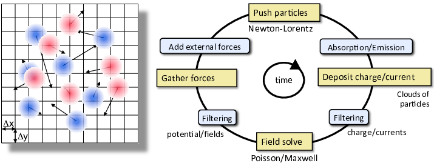
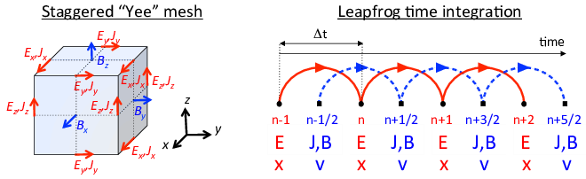

.. raw:: latex

   \markboth{J.-L. Vay, R. Lehe}{Simulations for plasma and laser acceleration.}

.. raw:: latex

   \maketitle

.. raw:: latex

   \linenumbers

The electromagnetic Particle-In-Cell method
===========================================

lds. The core PIC algorithm involves four operations at each time step: 1) evolve the velocity and position of the particles using the Newton-Lorentz equations, 2) deposit the charge and/or current densities through interpolation from the particles distributions onto the grid, 3) evolve Maxwell’s wave equations (for electromagnetic) or solve Poisson’s equation (for electrostatic) on the grid, 4) interpolate the fields from the grid onto the particles for the next particle push. Additional “add-ons” operations are inserted between these core operations to account for additional physics (e.g. absorption/emission of particles, addition of external forces to account for accelerator focusing or accelerating component) or numerical effects (e.g. smoothing/filtering of the charge/current densities and/or fields on the grid).

   [fig:PIC] The Particle-In-Cell (PIC) method follows the evolution of a collection of charged macro-particles (positively charged in blue on the left plot, negatively charged in red) that evolve self-consistently with their electromagnetic (or electrostatic) fields. The core PIC algorithm involves four operations at each time step: 1) evolve the velocity and position of the particles using the Newton-Lorentz equations, 2) deposit the charge and/or current densities through interpolation from the particles distributions onto the grid, 3) evolve Maxwell’s wave equations (for electromagnetic) or solve Poisson’s equation (for electrostatic) on the grid, 4) interpolate the fields from the grid onto the particles for the next particle push. Additional “add-ons” operations are inserted between these core operations to account for additional physics (e.g. absorption/emission of particles, addition of external forces to account for accelerator focusing or accelerating component) or numerical effects (e.g. smoothing/filtering of the charge/current densities and/or fields on the grid).

In the electromagnetic Particle-In-Cell method (Birdsall and Langdon 1991),
the electromagnetic fields are solved on a grid, usually using Maxwell’s
equations

.. math::

   \begin{aligned}
   \frac{\mathbf{\partial B}}{\partial t} & = & -\nabla\times\mathbf{E}\label{Eq:Faraday-1}\\
   \frac{\mathbf{\partial E}}{\partial t} & = & \nabla\times\mathbf{B}-\mathbf{J}\label{Eq:Ampere-1}\\
   \nabla\cdot\mathbf{E} & = & \rho\label{Eq:Gauss-1}\\
   \nabla\cdot\mathbf{B} & = & 0\label{Eq:divb-1}\end{aligned}

given here in natural units (:math:`\epsilon_0=\mu_0=c=1`), where :math:`t` is time, :math:`\mathbf{E}` and
:math:`\mathbf{B}` are the electric and magnetic field components, and
:math:`\rho` and :math:`\mathbf{J}` are the charge and current densities. The
charged particles are advanced in time using the Newton-Lorentz equations
of motion

.. math::

   \begin{aligned}
   \frac{d\mathbf{x}}{dt}= & \mathbf{v},\label{Eq:Lorentz_x-1}\\
   \frac{d\left(\gamma\mathbf{v}\right)}{dt}= & \frac{q}{m}\left(\mathbf{E}+\mathbf{v}\times\mathbf{B}\right),\label{Eq:Lorentz_v-1}\end{aligned}

where :math:`m`, :math:`q`, :math:`\mathbf{x}`, :math:`\mathbf{v}` and :math:`\gamma=1/\sqrt{1-v^{2}}`
are respectively the mass, charge, position, velocity and relativistic
factor of the particle given in natural units (:math:`c=1`). The charge and current densities are interpolated
on the grid from the particles’ positions and velocities, while the
electric and magnetic field components are interpolated from the grid
to the particles’ positions for the velocity update.

Particle push
-------------

A centered finite-difference discretization of the Newton-Lorentz
equations of motion is given by

.. math::

   \begin{aligned}
   \frac{\mathbf{x}^{i+1}-\mathbf{x}^{i}}{\Delta t}= & \mathbf{v}^{i+1/2},\label{Eq:leapfrog_x}\\
   \frac{\gamma^{i+1/2}\mathbf{v}^{i+1/2}-\gamma^{i-1/2}\mathbf{v}^{i-1/2}}{\Delta t}= & \frac{q}{m}\left(\mathbf{E}^{i}+\mathbf{\bar{v}}^{i}\times\mathbf{B}^{i}\right).\label{Eq:leapfrog_v}\end{aligned}

In order to close the system, :math:`\bar{\mathbf{v}}^{i}` must be
expressed as a function of the other quantities. The two implementations that have become the most popular are presented below.

Boris relativistic velocity rotation
~~~~~~~~~~~~~~~~~~~~~~~~~~~~~~~~~~~~

The solution proposed by Boris (Boris 1970) is given by

.. math::

   \begin{aligned}
   \mathbf{\bar{v}}^{i}= & \frac{\gamma^{i+1/2}\mathbf{v}^{i+1/2}+\gamma^{i-1/2}\mathbf{v}^{i-1/2}}{2\bar{\gamma}^{i}}.\label{Eq:boris_v}\end{aligned}

where :math:`\bar{\gamma}^{i}` is defined by :math:`\bar{\gamma}^{i} \equiv (\gamma^{i+1/2}+\gamma^{i-1/2} )/2`.

The system (`[Eq:leapfrog_v] <#Eq:leapfrog_v>`__,\ `[Eq:boris_v] <#Eq:boris_v>`__) is solved very
efficiently following Boris’ method, where the electric field push
is decoupled from the magnetic push. Setting :math:`\mathbf{u}=\gamma\mathbf{v}`, the
velocity is updated using the following sequence:

.. math::

   \begin{aligned}
   \mathbf{u^{-}}= & \mathbf{u}^{i-1/2}+\left(q\Delta t/2m\right)\mathbf{E}^{i}\\
   \mathbf{u'}= & \mathbf{u}^{-}+\mathbf{u}^{-}\times\mathbf{t}\\
   \mathbf{u}^{+}= & \mathbf{u}^{-}+\mathbf{u'}\times2\mathbf{t}/(1+t^{2})\\
   \mathbf{u}^{i+1/2}= & \mathbf{u}^{+}+\left(q\Delta t/2m\right)\mathbf{E}^{i}\end{aligned}

where :math:`\mathbf{t}=\left(q\Delta t/2m\right)\mathbf{B}^{i}/\bar{\gamma}^{i}` and where
:math:`\bar{\gamma}^{i}` can be calculated as :math:`\bar{\gamma}^{i}=\sqrt{1+(\mathbf{u}^-/c)^2}`.

The Boris implementation is second-order accurate, time-reversible and fast. Its implementation is very widespread and used in the vast majority of PIC codes.

Vay Lorentz-invariant formulation
~~~~~~~~~~~~~~~~~~~~~~~~~~~~~~~~~

It was shown in (Vay 2008) that the Boris formulation is
not Lorentz invariant and can lead to significant errors in the treatment
of relativistic dynamics. A Lorentz invariant formulation is obtained
by considering the following velocity average

.. math::

   \begin{aligned}
   \mathbf{\bar{v}}^{i}= & \frac{\mathbf{v}^{i+1/2}+\mathbf{v}^{i-1/2}}{2},\label{Eq:new_v}\end{aligned}

This gives a system that is solvable analytically (see (Vay 2008)
for a detailed derivation), giving the following velocity update:

.. math::

   \begin{aligned}
   \mathbf{u^{*}}= & \mathbf{u}^{i-1/2}+\frac{q\Delta t}{m}\left(\mathbf{E}^{i}+\frac{\mathbf{v}^{i-1/2}}{2}\times\mathbf{B}^{i}\right),\label{pusher_gamma}\\
   \mathbf{u}^{i+1/2}= & \left[\mathbf{u^{*}}+\left(\mathbf{u^{*}}\cdot\mathbf{t}\right)\mathbf{t}+\mathbf{u^{*}}\times\mathbf{t}\right]/\left(1+t^{2}\right),\label{pusher_upr}\end{aligned}

where :math:`\mathbf{t}=\boldsymbol{\tau}/\gamma^{i+1/2}`, :math:`\boldsymbol{\tau}=\left(q\Delta t/2m\right)\mathbf{B}^{i}`,
:math:`\gamma^{i+1/2}=\sqrt{\sigma+\sqrt{\sigma^{2}+\left(\tau^{2}+w^{2}\right)}}`,
:math:`w=\mathbf{u^{*}}\cdot\boldsymbol{\tau}`, :math:`\sigma=\left(\gamma'^{2}-\tau^{2}\right)/2`
and :math:`\gamma'=\sqrt{1+(\mathbf{u}^{*}/c)^{2}}`. This Lorentz invariant formulation
is particularly well suited for the modeling of ultra-relativistic
charged particle beams, where the accurate account of the cancellation
of the self-generated electric and magnetic fields is essential, as
shown in (Vay 2008).

Field solve
-----------

Various methods are available for solving Maxwell’s equations on a
grid, based on finite-differences, finite-volume, finite-element,
spectral, or other discretization techniques that apply most commonly
on single structured or unstructured meshes and less commonly on multiblock
multiresolution grid structures. In this chapter, we summarize the widespread
second order finite-difference time-domain (FDTD) algorithm, its extension
to non-standard finite-differences as well as the pseudo-spectral
analytical time-domain (PSATD) and pseudo-spectral time-domain (PSTD)
algorithms. Extension to multiresolution (or mesh refinement) PIC
is described in, e.g. (Vay et al. 2012; Vay, Adam, and Heron 2004).

Finite-Difference Time-Domain (FDTD)
~~~~~~~~~~~~~~~~~~~~~~~~~~~~~~~~~~~~

The most popular algorithm for electromagnetic PIC codes is the Finite-Difference
Time-Domain (or FDTD) solver

.. math::

   \begin{aligned}
   D_{t}\mathbf{B} & = & -\nabla\times\mathbf{E}\label{Eq:Faraday-2}\\
   D_{t}\mathbf{E} & = & \nabla\times\mathbf{B}-\mathbf{J}\label{Eq:Ampere-2}\\
   \left[\nabla\cdot\mathbf{E}\right. & = & \left.\rho\right]\label{Eq:Gauss-2}\\
   \left[\nabla\cdot\mathbf{B}\right. & = & \left.0\right].\label{Eq:divb-2}\end{aligned}

 integrator.

   [fig:yee_grid](left) Layout of field components on the staggered “Yee” grid. Current densities and electric fields are defined on the edges of the cells and magnetic fields on the faces. (right) Time integration using a second-order finite-difference "leapfrog" integrator.

The differential operator is defined as :math:`\nabla=D_{x}\mathbf{\hat{x}}+D_{y}\mathbf{\hat{y}}+D_{z}\mathbf{\hat{z}}`
and the finite-difference operators in time and space are defined
respectively as

.. math:: D_{t}G|_{i,j,k}^{n}=\left(G|_{i,j,k}^{n+1/2}-G|_{i,j,k}^{n-1/2}\right)/\Delta t

and :math:`D_{x}G|_{i,j,k}^{n}=\left(G|_{i+1/2,j,k}^{n}-G|_{i-1/2,j,k}^{n}\right)/\Delta x`,
where :math:`\Delta t` and :math:`\Delta x` are respectively the time step and
the grid cell size along :math:`x`, :math:`n` is the time index and :math:`i`, :math:`j`
and :math:`k` are the spatial indices along :math:`x`, :math:`y` and :math:`z` respectively.
The difference operators along :math:`y` and :math:`z` are obtained by circular
permutation. The equations in brackets are given for completeness,
as they are often not actually solved, thanks to the usage of a so-called
charge conserving algorithm, as explained below. As shown in Figure
`[fig:yee_grid] <#fig:yee_grid>`__, the quantities are given on a staggered (or “Yee”)
grid (Yee 1966), where the electric field components are located
between nodes and the magnetic field components are located in the
center of the cell faces. Knowing the current densities at half-integer steps,
the electric field components are updated alternately with the magnetic
field components at integer and half-integer steps respectively.

Non-Standard Finite-Difference Time-Domain (NSFDTD)
~~~~~~~~~~~~~~~~~~~~~~~~~~~~~~~~~~~~~~~~~~~~~~~~~~~

In (Cole 1997, 2002), Cole introduced an implementation
of the source-free Maxwell’s wave equations for narrow-band applications
based on non-standard finite-differences (NSFD). In (Karkkainen et al. 2006),
Karkkainen *et al.* adapted it for wideband applications. At
the Courant limit for the time step and for a given set of parameters,
the stencil proposed in (Karkkainen et al. 2006) has no numerical dispersion
along the principal axes, provided that the cell size is the same
along each dimension (i.e. cubic cells in 3D). The “Cole-Karkkainnen”
(or CK) solver uses the non-standard finite difference formulation
(based on extended stencils) of the Maxwell-Ampere equation and can be
implemented as follows (Vay et al. 2011):

.. math::

   \begin{aligned}
   D_{t}\mathbf{B} & = & -\nabla^{*}\times\mathbf{E}\label{Eq:Faraday}\\
   D_{t}\mathbf{E} & = & \nabla\times\mathbf{B}-\mathbf{J}\label{Eq:Ampere}\\
   \left[\nabla\cdot\mathbf{E}\right. & = & \left.\rho\right]\label{Eq:Gauss}\\
   \left[\nabla^{*}\cdot\mathbf{B}\right. & = & \left.0\right]\label{Eq:divb}\end{aligned}

Eq. `[Eq:Gauss] <#Eq:Gauss>`__ and `[Eq:divb] <#Eq:divb>`__ are not being solved explicitly
but verified via appropriate initial conditions and current deposition
procedure. The NSFD differential operators is given by :math:`\nabla^{*}=D_{x}^{*}\mathbf{\hat{x}}+D_{y}^{*}\mathbf{\hat{y}}+D_{z}^{*}\mathbf{\hat{z}}`
where :math:`D_{x}^{*}=\left(\alpha+\beta S_{x}^{1}+\xi S_{x}^{2}\right)D_{x}`
with :math:`S_{x}^{1}G|_{i,j,k}^{n}=G|_{i,j+1,k}^{n}+G|_{i,j-1,k}^{n}+G|_{i,j,k+1}^{n}+G|_{i,j,k-1}^{n}`,
:math:`S_{x}^{2}G|_{i,j,k}^{n}=G|_{i,j+1,k+1}^{n}+G|_{i,j-1,k+1}^{n}+G|_{i,j+1,k-1}^{n}+G|_{i,j-1,k-1}^{n}`.
:math:`G` is a sample vector component, while :math:`\alpha`, :math:`\beta` and :math:`\xi`
are constant scalars satisfying :math:`\alpha+4\beta+4\xi=1`. As with
the FDTD algorithm, the quantities with half-integer are located between
the nodes (electric field components) or in the center of the cell
faces (magnetic field components). The operators along :math:`y` and :math:`z`,
i.e. :math:`D_{y}`, :math:`D_{z}`, :math:`D_{y}^{*}`, :math:`D_{z}^{*}`, :math:`S_{y}^{1}`,
:math:`S_{z}^{1}`, :math:`S_{y}^{2}`, and :math:`S_{z}^{2}`, are obtained by circular
permutation of the indices.

Assuming cubic cells (:math:`\Delta x=\Delta y=\Delta z`), the coefficients
given in (Karkkainen et al. 2006) (:math:`\alpha=7/12`, :math:`\beta=1/12` and :math:`\xi=1/48`)
allow for the Courant condition to be at :math:`\Delta t=\Delta x`, which
equates to having no numerical dispersion along the principal axes.
The algorithm reduces to the FDTD algorithm with :math:`\alpha=1` and :math:`\beta=\xi=0`.
An extension to non-cubic cells is provided by Cowan, *et al.*
in 3-D in (Cowan et al. 2013) and was given by Pukhov in 2-D in
(Pukhov 1999). An alternative NSFDTD implementation that enables superluminous waves is also
given by Lehe et al. in (Lehe et al. 2013).

As mentioned above, a key feature of the algorithms based on NSFDTD
is that some implementations (Karkkainen et al. 2006; Cowan et al. 2013) enable the time step :math:`\Delta t=\Delta x` along one or
more axes and no numerical dispersion along those axes. However, as
shown in (Vay et al. 2011), an instability develops at the Nyquist
wavelength at (or very near) such a timestep. It is also shown in
the same paper that removing the Nyquist component in all the source
terms using a bilinear filter (see description of the filter below)
suppresses this instability.

Pseudo Spectral Analytical Time Domain (PSATD)
~~~~~~~~~~~~~~~~~~~~~~~~~~~~~~~~~~~~~~~~~~~~~~

Maxwell’s equations in Fourier space are given by

.. math::

   \begin{aligned}
   \frac{\partial\mathbf{\tilde{E}}}{\partial t} & = & c^2i\mathbf{k}\times\mathbf{\tilde{B}}-\frac{1}{\epsilon_0} \mathbf{\tilde{J}}\\
   \frac{\partial\mathbf{\tilde{B}}}{\partial t} & = & -i\mathbf{k}\times\mathbf{\tilde{E}}\\
   {}[i\mathbf{k}\cdot\mathbf{\tilde{E}}& = & \frac{\tilde{\rho}}{\epsilon_0}]\\
   {}[i\mathbf{k}\cdot\mathbf{\tilde{B}}& = & 0]\end{aligned}

where :math:`\tilde{a}` is the Fourier Transform of the quantity :math:`a`.
As with the real space formulation, provided that the continuity equation
:math:`\partial\tilde{\rho}/\partial t+i\mathbf{k}\cdot\mathbf{\tilde{J}}=0` is satisfied, then
the last two equations will automatically be satisfied at any time
if satisfied initially and do not need to be explicitly integrated.

These equations can be integrated analytically over one timestep,
assuming that the current density :math:`\mathbf{\tilde{J}}` is constant over this timestep, and that
the charge density is linear in time (:math:`\tilde{\rho}(t) = \tilde{\rho}^n +
\frac{\tilde{\rho}^{n+1}-\tilde{\rho}^n}{\Delta t}(t-n\Delta t)`). This gives:

.. math::

   \begin{aligned}
   \mathbf{\tilde{E}}^{n+1} & = & C\mathbf{\tilde{E}}^{n}+\frac{S}{ck}\left(c^2i\mathbf{k}\times\mathbf{\tilde{B}}^{n}-\frac{1}{\epsilon_0}\mathbf{\tilde{J}}^{n+1/2}\right) \\
    & - & i\mathbf{k}\left[ \frac{1}{\epsilon_0 k^2}\left( 1 - \frac{S}{ck\Delta t} \right)\tilde{\rho}^{n+1}
    - \frac{1}{\epsilon_0 k^2}\left( C - \frac{S}{ck\Delta t} \right)\tilde{\rho}^{n}\right]\nonumber \\
   \mathbf{\tilde{B}}^{n+1} & = & C\mathbf{\tilde{B}}^{n}-\frac{S}{ck}i\mathbf{k}\times\mathbf{\tilde{E}}^{n}\\
   &+&\frac{1}{\epsilon_0}\frac{1-C}{c^2k^2}i\mathbf{k}\times\mathbf{\tilde{J}}^{n+1/2}.\label{Eq_PSATD_2}\end{aligned}

with :math:`C=\cos\left(c k\Delta t\right)` and :math:`S=\sin\left(c k\Delta t\right)`.

For fields generated by the source terms without the self-consistent
dynamics of the charged particles, this algorithm is free of numerical
dispersion and is not subject to a Courant condition. Furthermore,
this solution is exact for any time step size subject to the assumption
that the current source is constant over that time step.

As shown in (Jean-Luc Vay, Haber, and Godfrey 2013), by expanding the coefficients :math:`S_{h}`
and :math:`C_{h}` in Taylor series and keeping the leading terms, the PSATD
formulation reduces to the perhaps better known pseudo-spectral time-domain
(PSTD) formulation (Dawson 1983; Liu 1997):

.. math::

   \begin{aligned}
   \mathbf{\tilde{E}}^{n+1} & = & \mathbf{\tilde{E}}^{n}+ic^2\Delta t\mathbf{k}\times\mathbf{\tilde{B}}^{n+1/2}-\frac{\Delta t}{\epsilon_0}\mathbf{\tilde{J}}^{n+1/2},\\
   \mathbf{\tilde{B}}^{n+3/2} & = & \mathbf{\tilde{B}}^{n+1/2}-i\Delta t\mathbf{k}\times\mathbf{\tilde{E}}^{n+1}.\end{aligned}

The dispersion relation of the PSTD solver is given by :math:`\sin(\frac{\omega\Delta t}{2})=\frac{k\Delta t}{2}.`
In contrast to the PSATD solver, the PSTD solver is subject to numerical
dispersion for a finite time step and to a Courant condition that
is given by :math:`\Delta t\leq \frac{2}{\pi}\left(\frac{1}{\Delta x^{2}}+\frac{1}{\Delta y^{2}}+\frac{1}{\Delta x^{2}}\right)^{-1/2}.`

The PSATD and PSTD formulations that were just given apply to the
field components located at the nodes of the grid. As noted in (Ohmura and Okamura 2010),
they can also be easily recast on a staggered Yee grid by multiplication
of the field components by the appropriate phase factors to shift
them from the collocated to the staggered locations. The choice between
a collocated and a staggered formulation is application-dependent.

Spectral solvers used to be very popular in the years 1970s to early 1990s, before being replaced by finite-difference methods with the advent of parallel supercomputers that favored local methods. However, it was shown recently that standard domain decomposition with Fast Fourier Transforms that are local to each subdomain could be used effectively with PIC spectral methods (Jean-Luc Vay, Haber, and Godfrey 2013), at the cost of truncation errors in the guard cells that could be neglected. A detailed analysis of the effectiveness of the method with exact evaluation of the magnitude of the effect of the truncation error is given in (Vincenti and Vay 2016) for stencils of arbitrary order (up-to the infinite “spectral” order).

Current deposition
------------------

The current densities are deposited on the computational grid from
the particle position and velocities, employing splines of various
orders (Abe et al. 1986).

.. math::

   \begin{aligned}
   \rho & = & \frac{1}{\Delta x \Delta y \Delta z}\sum_nq_nS_n\\
   \mathbf{J} & = & \frac{1}{\Delta x \Delta y \Delta z}\sum_nq_n\mathbf{v_n}S_n\end{aligned}

In most applications, it is essential to prevent the accumulation
of errors resulting from the violation of the discretized Gauss’ Law.
This is accomplished by providing a method for depositing the current
from the particles to the grid that preserves the discretized Gauss’
Law, or by providing a mechanism for “divergence cleaning” (Birdsall and Langdon 1991; Langdon 1992; Marder 1987; Vay and Deutsch 1998; Munz et al. 2000).
For the former, schemes that allow a deposition of the current that
is exact when combined with the Yee solver is given in (Villasenor and Buneman 1992)
for linear splines and in (Esirkepov 2001) for splines of arbitrary order.

The NSFDTD formulations given above and in (Pukhov 1999; Vay et al. 2011; Cowan et al. 2013; Lehe et al. 2013)
apply to the Maxwell-Faraday
equation, while the discretized Maxwell-Ampere equation uses the FDTD
formulation. Consequently, the charge conserving algorithms developed
for current deposition (Villasenor and Buneman 1992; Esirkepov 2001) apply
readily to those NSFDTD-based formulations. More details concerning
those implementations, including the expressions for the numerical
dispersion and Courant condition are given
in (Pukhov 1999; Vay et al. 2011; Cowan et al. 2013; Lehe et al. 2013).

In the case of the pseudospectral solvers, the current deposition
algorithm generally does not satisfy the discretized continuity equation
in Fourier space :math:`\tilde{\rho}^{n+1}=\tilde{\rho}^{n}-i\Delta t\mathbf{k}\cdot\mathbf{\tilde{J}}^{n+1/2}`.
In this case, a Boris correction (Birdsall and Langdon 1991) can be applied
in :math:`k` space in the form :math:`\mathbf{\tilde{E}}_{c}^{n+1}=\mathbf{\tilde{E}}^{n+1}-\left(\mathbf{k}\cdot\mathbf{\tilde{E}}^{n+1}+i\tilde{\rho}^{n+1}\right)\mathbf{\hat{k}}/k`,
where :math:`\mathbf{\tilde{E}}_{c}` is the corrected field. Alternatively, a correction
to the current can be applied (with some similarity to the current
deposition presented by Morse and Nielson in their potential-based
model in (Morse and Nielson 1971)) using :math:`\mathbf{\tilde{J}}_{c}^{n+1/2}=\mathbf{\tilde{J}}^{n+1/2}-\left[\mathbf{k}\cdot\mathbf{\tilde{J}}^{n+1/2}-i\left(\tilde{\rho}^{n+1}-\tilde{\rho}^{n}\right)/\Delta t\right]\mathbf{\hat{k}}/k`,
where :math:`\mathbf{\tilde{J}}_{c}` is the corrected current. In this case, the transverse
component of the current is left untouched while the longitudinal
component is effectively replaced by the one obtained from integration
of the continuity equation, ensuring that the corrected current satisfies
the continuity equation. The advantage of correcting the current rather than
the electric field is that it is more local and thus more compatible with
domain decomposition of the fields for parallel computation (Jean Luc Vay, Haber, and Godfrey 2013).

Alternatively, an exact current deposition can be written for the pseudospectral solvers, following the geometrical interpretation of existing methods in real space (Morse and Nielson 1971; Villasenor and Buneman 1992; Esirkepov 2001), thereby averaging the currents of the paths following grid lines between positions :math:`(x^n,y^n)` and :math:`(x^{n+1},y^{n+1})`, which is given in 2D (extension to 3D follows readily) for :math:`k\neq0` by (Jean Luc Vay, Haber, and Godfrey 2013):

.. math::

   \begin{aligned}
   \mathbf{\tilde{J}}^{k\neq0}=\frac{i\mathbf{\tilde{D}}}{\mathbf{k}}\end{aligned}

with

.. math::

   \begin{aligned}
   D_x   =  \frac{1}{2\Delta t}\sum_i q_i
     [\Gamma(x_i^{n+1},y_i^{n+1})-\Gamma(x_i^{n},y_i^{n+1}) \nonumber\\ 
   +\Gamma(x_i^{n+1},y_i^{n})-\Gamma(x_i^{n},y_i^{n})],\\
   D_y   =  \frac{1}{2\Delta t}\sum_i q_i
     [\Gamma(x_i^{n+1},y_i^{n+1})-\Gamma(x_i^{n+1},y_i^{n}) \nonumber \\
   +\Gamma(x_i^{n},y_i^{n+1})-\Gamma(x_i^{n},y_i^{n})],\end{aligned}

where :math:`\Gamma` is the macro-particle form factor.
The contributions for :math:`k=0` are integrated directly in real space (Jean Luc Vay, Haber, and Godfrey 2013).

Field gather
------------

The current densities are deposited on the computational grid from
the particle position and velocities, employing splines of various
orders (Abe et al. 1986).

.. math::

   \begin{aligned}
   \rho & = & \frac{1}{\Delta x \Delta y \Delta z}\sum_nq_nS_n\\
   \mathbf{J} & = & \frac{1}{\Delta x \Delta y \Delta z}\sum_nq_n\mathbf{v_n}S_n\end{aligned}

In most applications, it is essential to prevent the accumulation
of errors resulting from the violation of the discretized Gauss’ Law.
This is accomplished by providing a method for depositing the current
from the particles to the grid that preserves the discretized Gauss’
Law, or by providing a mechanism for “divergence cleaning” (Birdsall and Langdon 1991; Langdon 1992; Marder 1987; Vay and Deutsch 1998; Munz et al. 2000).
For the former, schemes that allow a deposition of the current that
is exact when combined with the Yee solver is given in (Villasenor and Buneman 1992)
for linear splines and in (Esirkepov 2001) for splines of arbitrary order.

The NSFDTD formulations given above and in (Pukhov 1999; Vay et al. 2011; Cowan et al. 2013; Lehe et al. 2013)
apply to the Maxwell-Faraday
equation, while the discretized Maxwell-Ampere equation uses the FDTD
formulation. Consequently, the charge conserving algorithms developed
for current deposition (Villasenor and Buneman 1992; Esirkepov 2001) apply
readily to those NSFDTD-based formulations. More details concerning
those implementations, including the expressions for the numerical
dispersion and Courant condition are given
in (Pukhov 1999; Vay et al. 2011; Cowan et al. 2013; Lehe et al. 2013).

In the case of the pseudospectral solvers, the current deposition
algorithm generally does not satisfy the discretized continuity equation
in Fourier space :math:`\tilde{\rho}^{n+1}=\tilde{\rho}^{n}-i\Delta t\mathbf{k}\cdot\mathbf{\tilde{J}}^{n+1/2}`.
In this case, a Boris correction (Birdsall and Langdon 1991) can be applied
in :math:`k` space in the form :math:`\mathbf{\tilde{E}}_{c}^{n+1}=\mathbf{\tilde{E}}^{n+1}-\left(\mathbf{k}\cdot\mathbf{\tilde{E}}^{n+1}+i\tilde{\rho}^{n+1}\right)\mathbf{\hat{k}}/k`,
where :math:`\mathbf{\tilde{E}}_{c}` is the corrected field. Alternatively, a correction
to the current can be applied (with some similarity to the current
deposition presented by Morse and Nielson in their potential-based
model in (Morse and Nielson 1971)) using :math:`\mathbf{\tilde{J}}_{c}^{n+1/2}=\mathbf{\tilde{J}}^{n+1/2}-\left[\mathbf{k}\cdot\mathbf{\tilde{J}}^{n+1/2}-i\left(\tilde{\rho}^{n+1}-\tilde{\rho}^{n}\right)/\Delta t\right]\mathbf{\hat{k}}/k`,
where :math:`\mathbf{\tilde{J}}_{c}` is the corrected current. In this case, the transverse
component of the current is left untouched while the longitudinal
component is effectively replaced by the one obtained from integration
of the continuity equation, ensuring that the corrected current satisfies
the continuity equation. The advantage of correcting the current rather than
the electric field is that it is more local and thus more compatible with
domain decomposition of the fields for parallel computation (Jean Luc Vay, Haber, and Godfrey 2013).

Alternatively, an exact current deposition can be written for the pseudospectral solvers, following the geometrical interpretation of existing methods in real space (Morse and Nielson 1971; Villasenor and Buneman 1992; Esirkepov 2001), thereby averaging the currents of the paths following grid lines between positions :math:`(x^n,y^n)` and :math:`(x^{n+1},y^{n+1})`, which is given in 2D (extension to 3D follows readily) for :math:`k\neq0` by (Jean Luc Vay, Haber, and Godfrey 2013):

.. math::

   \begin{aligned}
   \mathbf{\tilde{J}}^{k\neq0}=\frac{i\mathbf{\tilde{D}}}{\mathbf{k}}
   \label{Eq_Jdep_1}\end{aligned}

with

.. math::

   \begin{aligned}
   D_x   =  \frac{1}{2\Delta t}\sum_i q_i
     [\Gamma(x_i^{n+1},y_i^{n+1})-\Gamma(x_i^{n},y_i^{n+1}) \nonumber\\ 
   +\Gamma(x_i^{n+1},y_i^{n})-\Gamma(x_i^{n},y_i^{n})],\\
   D_y   =  \frac{1}{2\Delta t}\sum_i q_i
     [\Gamma(x_i^{n+1},y_i^{n+1})-\Gamma(x_i^{n+1},y_i^{n}) \nonumber \\
   +\Gamma(x_i^{n},y_i^{n+1})-\Gamma(x_i^{n},y_i^{n})],\end{aligned}

where :math:`\Gamma` is the macro-particle form factor.
The contributions for :math:`k=0` are integrated directly in real space (Jean Luc Vay, Haber, and Godfrey 2013).

Filtering
=========

It is common practice to apply digital filtering to the charge or
current density in Particle-In-Cell simulations as a complement or
an alternative to using higher order splines (Birdsall and Langdon 1991).
A commonly used filter in PIC simulations is the three points filter
:math:`\phi_{j}^{f}=\alpha\phi_{j}+\left(1-\alpha\right)\left(\phi_{j-1}+\phi_{j+1}\right)/2`
where :math:`\phi^{f}` is the filtered quantity. This filter is called
a bilinear filter when :math:`\alpha=0.5`. Assuming :math:`\phi=e^{jkx}` and
:math:`\phi^{f}=g\left(\alpha,k\right)e^{jkx}`, the filter gain :math:`g` is
given as a function of the filtering coefficient :math:`\alpha` and
the wavenumber :math:`k` by :math:`g\left(\alpha,k\right)=\alpha+\left(1-\alpha\right)\cos\left(k\Delta x\right)\approx1-\left(1-\alpha\right)\frac{\left(k\Delta x\right)^{2}}{2}+O\left(k^{4}\right)`.
The total attenuation :math:`G` for :math:`n` successive applications of filters
of coefficients :math:`\alpha_{1}`...\ :math:`\alpha_{n}` is given by :math:`G=\prod_{i=1}^{n}g\left(\alpha_{i},k\right)\approx1-\left(n-\sum_{i=1}^{n}\alpha_{i}\right)\frac{\left(k\Delta x\right)^{2}}{2}+O\left(k^{4}\right)`.
A sharper cutoff in :math:`k` space is provided by using :math:`\alpha_{n}=n-\sum_{i=1}^{n-1}\alpha_{i}`,
so that :math:`G\approx1+O\left(k^{4}\right)`. Such step is called a “compensation”
step (Birdsall and Langdon 1991). For the bilinear filter (:math:`\alpha=1/2`),
the compensation factor is :math:`\alpha_{c}=2-1/2=3/2`. For a succession
of :math:`n` applications of the bilinear factor, it is :math:`\alpha_{c}=n/2+1`.

It is sometimes necessary to filter on a relatively wide band of wavelength,
necessitating the application of a large number of passes of the bilinear
filter or on the use of filters acting on many points. The former
can become very intensive computationally while the latter is problematic
for parallel computations using domain decomposition, as the footprint
of the filter may eventually surpass the size of subdomains. A workaround
is to use a combination of filters of limited footprint. A solution
based on the combination of three point filters with various strides
was proposed in (Vay et al. 2011) and operates as follows.

The bilinear filter provides complete suppression of the signal at
the grid Nyquist wavelength (twice the grid cell size). Suppression
of the signal at integer multiples of the Nyquist wavelength can be
obtained by using a stride :math:`s` in the filter :math:`\phi_{j}^{f}=\alpha\phi_{j}+\left(1-\alpha\right)\left(\phi_{j-s}+\phi_{j+s}\right)/2`
for which the gain is given by :math:`g\left(\alpha,k\right)=\alpha+\left(1-\alpha\right)\cos\left(sk\Delta x\right)\approx1-\left(1-\alpha\right)\frac{\left(sk\Delta x\right)^{2}}{2}+O\left(k^{4}\right)`.
For a given stride, the gain is given by the gain of the bilinear
filter shifted in k space, with the pole :math:`g=0` shifted from the wavelength
:math:`\lambda=2/\Delta x` to :math:`\lambda=2s/\Delta x`, with additional poles,
as given by :math:`sk\Delta x=\arccos\left(\frac{\alpha}{\alpha-1}\right)\pmod{2\pi}`.
The resulting filter is pass band between the poles, but since the
poles are spread at different integer values in k space, a wide band
low pass filter can be constructed by combining filters using different
strides. As shown in (Vay et al. 2011), the successive application
of 4-passes + compensation of filters with strides 1, 2 and 4 has
a nearly equivalent fall-off in gain as 80 passes + compensation of
a bilinear filter. Yet, the strided filter solution needs only 15
passes of a three-point filter, compared to 81 passes for an equivalent
n-pass bilinear filter, yielding a gain of 5.4 in number of operations
in favor of the combination of filters with stride. The width of the
filter with stride 4 extends only on 9 points, compared to 81 points
for a single pass equivalent filter, hence giving a gain of 9 in compactness
for the stride filters combination in comparison to the single-pass
filter with large stencil, resulting in more favorable scaling with the number
of computational cores for parallel calculations.

.. raw:: latex

   \IfFileExists{\jobname.bbl}{} {\typeout{} \typeout{{*}{*}{*}{*}{*}{*}{*}{*}{*}{*}{*}{*}{*}{*}{*}{*}{*}{*}{*}{*}{*}{*}{*}{*}{*}{*}{*}{*}{*}{*}{*}{*}{*}{*}{*}{*}{*}{*}{*}{*}{*}{*}}
   \typeout{{*}{*} Please run \textquotedbl{}bibtex \jobname\textquotedbl{}
   to optain} \typeout{{*}{*} the bibliography and then re-run LaTeX}
   \typeout{{*}{*} twice to fix the references!} \typeout{{*}{*}{*}{*}{*}{*}{*}{*}{*}{*}{*}{*}{*}{*}{*}{*}{*}{*}{*}{*}{*}{*}{*}{*}{*}{*}{*}{*}{*}{*}{*}{*}{*}{*}{*}{*}{*}{*}{*}{*}{*}{*}}
   \typeout{} }

.. raw:: html

   

.. raw:: html

   

Abe, H, N Sakairi, R Itatani, and H Okuda. 1986. “High-Order Spline Interpolations in the Particle Simulation.” *Journal of Computational Physics* 63 (2): 247–67.

.. raw:: html

   

.. raw:: html

   

Birdsall, C K, and A B Langdon. 1991. *Plasma Physics via Computer Simulation*. Adam-Hilger.

.. raw:: html

   

.. raw:: html

   

Boris, Jp. 1970. “Relativistic Plasma Simulation-Optimization of a Hybrid Code.” In *Proc. Fourth Conf. Num. Sim. Plasmas*, 3–67. Naval Res. Lab., Wash., D. C.

.. raw:: html

   

.. raw:: html

   

Cole, J. B. 1997. “A High-Accuracy Realization of the Yee Algorithm Using Non-Standard Finite Differences.” *Ieee Transactions on Microwave Theory and Techniques* 45 (6): 991–96.

.. raw:: html

   

.. raw:: html

   

———. 2002. “High-Accuracy Yee Algorithm Based on Nonstandard Finite Differences: New Developments and Verifications.” *Ieee Transactions on Antennas and Propagation* 50 (9): 1185–91. https://doi.org/10.1109/Tap.2002.801268.

.. raw:: html

   

.. raw:: html

   

Cowan, Benjamin M, David L Bruhwiler, John R Cary, Estelle Cormier-Michel, and Cameron G R Geddes. 2013. “Generalized algorithm for control of numerical dispersion in explicit time-domain electromagnetic simulations.” *Physical Review Special Topics-Accelerators and Beams* 16 (4). https://doi.org/10.1103/PhysRevSTAB.16.041303.

.. raw:: html

   

.. raw:: html

   

Dawson, J M. 1983. “Particle Simulation of Plasmas.” *Reviews of Modern Physics* 55 (2): 403–47. https://doi.org/10.1103/RevModPhys.55.403.

.. raw:: html

   

.. raw:: html

   

Esirkepov, Tz. 2001. “Exact Charge Conservation Scheme for Particle-in-Cell Simulation with an Arbitrary Form-Factor.” *Computer Physics Communications* 135 (2): 144–53.

.. raw:: html

   

.. raw:: html

   

Karkkainen, M, E Gjonaj, T Lau, and T Weiland. 2006. “Low-Dispersionwake Field Calculation Tools.” In *Proc. Of International Computational Accelerator Physics Conference*, 35–40. Chamonix, France.

.. raw:: html

   

.. raw:: html

   

Langdon, A B. 1992. “On Enforcing Gauss Law in Electromagnetic Particle-in-Cell Codes.” *Computer Physics Communications* 70 (3): 447–50.

.. raw:: html

   

.. raw:: html

   

Lehe, R, A Lifschitz, C Thaury, V Malka, and X Davoine. 2013. “Numerical growth of emittance in simulations of laser-wakefield acceleration.” *Physical Review Special Topics-Accelerators and Beams* 16 (2). https://doi.org/10.1103/PhysRevSTAB.16.021301.

.. raw:: html

   

.. raw:: html

   

Liu, Qh. 1997. “The PSTD Algorithm: A Time-Domain Method Requiring Only Two Cells Per Wavelength.” *Microwave and Optical Technology Letters* 15 (3): 158–65. `https://doi.org/10.1002/(Sici)1098-2760(19970620)15:3<158::Aid-Mop11>3.3.Co;2-T <https://doi.org/10.1002/(Sici)1098-2760(19970620)15:3<158::Aid-Mop11>3.3.Co;2-T>`__.

.. raw:: html

   

.. raw:: html

   

Marder, B. 1987. “A Method for Incorporating Gauss Law into Electromagnetic Pic Codes.” *Journal of Computational Physics* 68 (1): 48–55.

.. raw:: html

   

.. raw:: html

   

Morse, Rl, and Cw Nielson. 1971. “Numerical Simulation of Weibel Instability in One and 2 Dimensions.” *Phys. Fluids* 14 (4): 830 –&. https://doi.org/10.1063/1.1693518.

.. raw:: html

   

.. raw:: html

   

Munz, Cd, P Omnes, R Schneider, E Sonnendrucker, and U Voss. 2000. “Divergence Correction Techniques for Maxwell Solvers Based on A Hyperbolic Model.” *Journal of Computational Physics* 161 (2): 484–511. https://doi.org/10.1006/Jcph.2000.6507.

.. raw:: html

   

.. raw:: html

   

Ohmura, Y, and Y Okamura. 2010. “Staggered Grid Pseudo-Spectral Time-Domain Method for Light Scattering Analysis.” *Piers Online* 6 (7): 632–35.

.. raw:: html

   

.. raw:: html

   

Pukhov, A. 1999. “Three-dimensional electromagnetic relativistic particle-in-cell code VLPL (Virtual Laser Plasma Lab).” *Journal of Plasma Physics* 61 (3): 425–33. https://doi.org/10.1017/S0022377899007515.

.. raw:: html

   

.. raw:: html

   

Vay, Jean-Luc, Irving Haber, and Brendan B Godfrey. 2013. “A domain decomposition method for pseudo-spectral electromagnetic simulations of plasmas.” *Journal of Computational Physics* 243 (June): 260–68. https://doi.org/10.1016/j.jcp.2013.03.010.

.. raw:: html

   

.. raw:: html

   

Vay, Jean Luc, Irving Haber, and Brendan B. Godfrey. 2013. “A domain decomposition method for pseudo-spectral electromagnetic simulations of plasmas.” *Journal of Computational Physics* 243: 260–68.

.. raw:: html

   

.. raw:: html

   

Vay, J L. 2008. “Simulation of Beams or Plasmas Crossing at Relativistic Velocity.” *Physics of Plasmas* 15 (5): 56701. https://doi.org/10.1063/1.2837054.

.. raw:: html

   

.. raw:: html

   

Vay, J.-L., J.-C. Adam, and A Heron. 2004. “Asymmetric Pml for the Absorption of Waves. Application to Mesh Refinement in Electromagnetic Particle-in-Cell Plasma Simulations.” *Computer Physics Communications* 164 (1-3): 171–77. https://doi.org/10.1016/J.Cpc.2004.06.026.

.. raw:: html

   

.. raw:: html

   

Vay, J.-L., and C Deutsch. 1998. “Charge Compensated Ion Beam Propagation in A Reactor Sized Chamber.” *Physics of Plasmas* 5 (4): 1190–7.

.. raw:: html

   

.. raw:: html

   

Vay, J L, C G R Geddes, E Cormier-Michel, and D P Grote. 2011. “Numerical Methods for Instability Mitigation in the Modeling of Laser Wakefield Accelerators in A Lorentz-Boosted Frame.” *Journal of Computational Physics* 230 (15): 5908–29. https://doi.org/10.1016/J.Jcp.2011.04.003.

.. raw:: html

   

.. raw:: html

   

Vay, J.-L., D P Grote, R H Cohen, and A Friedman. 2012. “Novel methods in the particle-in-cell accelerator code-framework warp.” Journal Paper. *Computational Science and Discovery* 5 (1): 014019 (20 pp.).

.. raw:: html

   

.. raw:: html

   

Villasenor, J, and O Buneman. 1992. “Rigorous Charge Conservation for Local Electromagnetic-Field Solvers.” *Computer Physics Communications* 69 (2-3): 306–16.

.. raw:: html

   

.. raw:: html

   

Vincenti, H., and J.-L. Vay. 2016. “Detailed analysis of the effects of stencil spatial variations with arbitrary high-order finite-difference Maxwell solver.” *Computer Physics Communications* 200 (March). ELSEVIER SCIENCE BV, PO BOX 211, 1000 AE AMSTERDAM, NETHERLANDS: 147–67. https://doi.org/10.1016/j.cpc.2015.11.009.

.. raw:: html

   

.. raw:: html

   

Yee, Ks. 1966. “Numerical Solution of Initial Boundary Value Problems Involving Maxwells Equations in Isotropic Media.” *Ieee Transactions on Antennas and Propagation* Ap14 (3): 302–7.

.. raw:: html

   

.. raw:: html

   

