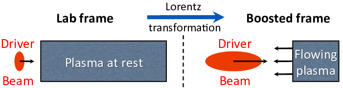

Mesh refinement
===============

.. raw:: latex

   \centering

er levels. In the electrostatic case, the potential is calculated first at the coarsest level :math:`L_0`, the solution interpolated to the boundaries of the refined patch :math:`r` at the next level :math:`L_{1}` and the potential calculated at :math:`L_1`. The procedure is repeated iteratively up to the highest level. In the electromagnetic case, the fields are computed independently on each grid and patch without interpolation at boundaries. Patches are terminated by absorbing layers (PML) to prevent the reflection of electromagnetic waves. Additional coarse patch :math:`c` and fine grid :math:`a` are needed so that the full solution is obtained by substitution on :math:`a` as :math:`F_{n+1}(a)=F_{n+1}(r)+I[F_n( s )-F_{n+1}( c )]` where :math:`F` is the field, and :math:`I` is a coarse-to-fine interpolation operator. In both cases, the field solution at a given level :math:`L_n` is unaffected by the solution at higher levels :math:`L_{n+1}` and up, allowing for mitigation of some spurious effects (see text) by providing a transition zone via extension of the patches by a few cells beyond the desired refined area (red & orange rectangles) in which the field is interpolated onto particles from the coarser parent level only.
   :name: fig:ESAMR
   :width: 15cm

   Sketches of the implementation of mesh refinement in WarpX with the electrostatic (left) and electromagnetic (right) solvers. In both cases, the charge/current from particles are deposited at the finest levels first, then interpolated recursively to coarser levels. In the electrostatic case, the potential is calculated first at the coarsest level :math:`L_0`, the solution interpolated to the boundaries of the refined patch :math:`r` at the next level :math:`L_{1}` and the potential calculated at :math:`L_1`. The procedure is repeated iteratively up to the highest level. In the electromagnetic case, the fields are computed independently on each grid and patch without interpolation at boundaries. Patches are terminated by absorbing layers (PML) to prevent the reflection of electromagnetic waves. Additional coarse patch :math:`c` and fine grid :math:`a` are needed so that the full solution is obtained by substitution on :math:`a` as :math:`F_{n+1}(a)=F_{n+1}(r)+I[F_n( s )-F_{n+1}( c )]` where :math:`F` is the field, and :math:`I` is a coarse-to-fine interpolation operator. In both cases, the field solution at a given level :math:`L_n` is unaffected by the solution at higher levels :math:`L_{n+1}` and up, allowing for mitigation of some spurious effects (see text) by providing a transition zone via extension of the patches by a few cells beyond the desired refined area (red & orange rectangles) in which the field is interpolated onto particles from the coarser parent level only.

The mesh refinement methods that have been implemented in WarpX were developed following the following principles: i) avoidance of spurious effects from mesh refinement, or minimization of such effects; ii) user controllability of the spurious effects’ relative magnitude; iii) simplicity of implementation. The two main generic issues that were identified are: a) spurious self-force on macroparticles close to the mesh refinement interface (J. Vay, Colella, et al. 2002; Colella and Norgaard 2010); b) reflection (and possible amplification) of short wavelength electromagnetic waves at the mesh refinement interface (Vay 2001). The two effects are due to the loss of translation invariance introduced by the asymmetry of the grid on each side of the mesh refinement interface.

In addition, for some implementations where the field that is computed at a given level is affected by the solution at finer levels, there are cases where the procedure violates the integral of Gauss’ Law around the refined patch, leading to long range errors (J. Vay, Colella, et al. 2002; Colella and Norgaard 2010). As will be shown below, in the procedure that has been developed in WarpX, the field at a given refinement level is not affected by the solution at finer levels, and is thus not affected by this type of error.

Electrostatic
-------------

A cornerstone of the Particle-In-Cell method is that assuming a particle lying in a hypothetical infinite grid, then if the grid is regular and symmetrical, and if the order of field gathering matches the order of charge (or current) deposition, then there is no self-force of the particle acting on itself: a) anywhere if using the so-called “momentum conserving” gathering scheme; b) on average within one cell if using the “energy conserving” gathering scheme (Birdsall and Langdon 1991). A breaking of the regularity and/or symmetry in the grid, whether it is from the use of irregular meshes or mesh refinement, and whether one uses finite difference, finite volume or finite elements, results in a net spurious self-force (which does not average to zero over one cell) for a macroparticle close to the point of irregularity (mesh refinement interface for the current purpose) (J. Vay, Colella, et al. 2002; Colella and Norgaard 2010).

A sketch of the implementation of mesh refinement in WarpX is given in Figure \ `[fig:ESAMR] <#fig:ESAMR>`__ (left). Given the solution of the electric potential at a refinement level :math:`L_n`, it is interpolated onto the boundaries of the grid patch(es) at the next refined level :math:`L_{n+1}`. The electric potential is then computed at level :math:`L_{n+1}` by solving the Poisson equation. This procedure necessitates the knowledge of the charge density at every level of refinement. For efficiency, the macroparticle charge is deposited on the highest level patch that contains them, and the charge density of each patch is added recursively to lower levels, down to the lowest.

.. raw:: latex

   \centering

larly at the wall, then decelerates until it reaches its initial position at rest. If the particle is initialized inside a refinement patch, the particle is initially accelerated toward the wall but is spuriously reflected before it reaches the boundary of the patch whether using the method implemented in WarpX or the MC method. Providing a surrounding transition region 2 or 4 cells wide in which the potential is interpolated from the parent coarse solution reduces significantly the effect of the spurious self-force.
   :name: fig:ESselfforce
   :width: 15cm

   Position history of one charged particle attracted by its image induced by a nearby metallic (dirichlet) boundary. The particle is initialized at rest. Without refinement patch (reference case), the particle is accelerated by its image, is reflected specularly at the wall, then decelerates until it reaches its initial position at rest. If the particle is initialized inside a refinement patch, the particle is initially accelerated toward the wall but is spuriously reflected before it reaches the boundary of the patch whether using the method implemented in WarpX or the MC method. Providing a surrounding transition region 2 or 4 cells wide in which the potential is interpolated from the parent coarse solution reduces significantly the effect of the spurious self-force. 

The presence of the self-force is illustrated on a simple test case that was introduced in (J. Vay, Colella, et al. 2002) and also used in (Colella and Norgaard 2010): a single macroparticle is initialized at rest within a single refinement patch four cells away from the patch refinement boundary. The patch at level :math:`L_1` has :math:`32\times32` cells and is centered relative to the lowest :math:`64\times64` grid at level :math:`L_0` (“main grid”), while the macroparticle is centered in one direction but not in the other. The boundaries of the main grid are perfectly conducting, so that the macroparticle is attracted to the closest wall by its image. Specular reflection is applied when the particle reaches the boundary so that the motion is cyclic. The test was performed with WarpX using either linear or quadratic interpolation when gathering the main grid solution onto the refined patch boundary. It was also performed using another method from P. McCorquodale et al (labeled “MC” in this paper) based on the algorithm given in (Mccorquodale et al. 2004), which employs a more elaborate procedure involving two-ways interpolations between the main grid and the refined patch. A reference case was also run using a single :math:`128\times128` grid with no refined patch, in which it is observed that the particle propagates toward the closest boundary at an accelerated pace, is reflected specularly at the boundary, then slows down until it reaches its initial position at zero velocity. The particle position histories are shown for the various cases in Fig. `[fig:ESselfforce] <#fig:ESselfforce>`__. In all the cases using the refinement patch, the particle was spuriously reflected near the patch boundary and was effectively trapped in the patch. We notice that linear interpolation performs better than quadratic, and that the simple method implemented in WarpX performs better than the other proposed method for this test (see discussion below).

.. raw:: latex

   \centering

.. figure:: ICNSP_2011_Vay_fig3.png
   :alt: (left) Maps of the magnitude of the spurious self-force :math:`\epsilon` in arbitrary units within one quarter of the refined patch, defined as :math:`\epsilon=\sqrt{(E_x-E_x^{ref})^2+(E_y-E_y^{ref})^2}`, where :math:`E_x` and :math:`E_y` are the electric field components within the patch experienced by one particle at a given location and :math:`E_x^{ref}` and :math:`E_y^{ref}` are the electric field from a reference solution. The map is given for the WarpX and the MC mesh refinement algorithms and for linear and quadratic interpolation at the patch refinement boundary. (right) Lineouts of the maximum (taken over neighboring cells) of the spurious self-force. Close to the interface boundary (x=0), the spurious self-force decreases at a rate close to one order of magnitude per cell (red line), then at about one order of magnitude per six cells (green line).
   :name: fig:ESselfforcemap
   :width: 15cm

   (left) Maps of the magnitude of the spurious self-force :math:`\epsilon` in arbitrary units within one quarter of the refined patch, defined as :math:`\epsilon=\sqrt{(E_x-E_x^{ref})^2+(E_y-E_y^{ref})^2}`, where :math:`E_x` and :math:`E_y` are the electric field components within the patch experienced by one particle at a given location and :math:`E_x^{ref}` and :math:`E_y^{ref}` are the electric field from a reference solution. The map is given for the WarpX and the MC mesh refinement algorithms and for linear and quadratic interpolation at the patch refinement boundary. (right) Lineouts of the maximum (taken over neighboring cells) of the spurious self-force. Close to the interface boundary (x=0), the spurious self-force decreases at a rate close to one order of magnitude per cell (red line), then at about one order of magnitude per six cells (green line).

The magnitude of the spurious self-force as a function of the macroparticle position was mapped and is shown in Fig. `[fig:ESselfforcemap] <#fig:ESselfforcemap>`__ for the WarpX and MC algorithms using linear or quadratic interpolations between grid levels. It is observed that the magnitude of the spurious self-force decreases rapidly with the distance between the particle and the refined patch boundary, at a rate approaching one order of magnitude per cell for the four cells closest to the boundary and about one order of magnitude per six cells beyond. The method implemented in WarpX offers a weaker spurious force on average and especially at the cells that are the closest to the coarse-fine interface where it is the largest and thus matters most.
We notice that the magnitude of the spurious self-force depends strongly on the distance to the edge of the patch and to the nodes of the underlying coarse grid, but weakly on the order of deposition and size of the patch.

A method was devised and implemented in WarpX for reducing the magnitude of spurious self-forces near the coarse-fine boundaries as follows. Noting that the coarse grid solution is unaffected by the presence of the patch and is thus free of self-force, extra “transition” cells are added around the “effective” refined area.
Within the effective area, the particles gather the potential in the fine grid. In the extra transition cells surrounding the refinement patch, the force is gathered directly from the coarse grid (an option, which has not yet been implemented, would be to interpolate between the coarse and fine grid field solutions within the transition zone so as to provide continuity of the force experienced by the particles at the interface). The number of cells allocated in the transition zones is controllable by the user in WarpX, giving the opportunity to check whether the spurious self-force is affecting the calculation by repeating it using different thicknesses of the transition zones. The control of the spurious force using the transition zone is illustrated in Fig. \ `[fig:ESselfforce] <#fig:ESselfforce>`__, where the calculation with WarpX using linear interpolation at the patch interface was repeated using either two or four cells transition regions (measured in refined patch cell units). Using two extra cells allowed for the particle to be free of spurious trapping within the refined area and follow a trajectory that is close to the reference one, and using four extra cells improved further to the point where the resulting trajectory becomes undistinguishable from the reference one.
We note that an alternative method was devised for reducing the magnitude of self-force near the coarse-fine boundaries for the MC method, by using a special deposition procedure near the interface (Colella and Norgaard 2010).

Electromagnetic
---------------

The method that is used for electrostatic mesh refinement is not directly applicable to electromagnetic calculations. As was shown in section 3.4 of (Vay 2001), refinement schemes relying solely on interpolation between coarse and fine patches lead to the reflection with amplification of the short wavelength modes that fall below the cutoff of the Nyquist frequency of the coarse grid. Unless these modes are damped heavily or prevented from occurring at their source, they may affect particle motion and their effect can escalate if trapped within a patch, via multiple successive reflections with amplification.

To circumvent this issue, an additional coarse patch (with the same resolution as the parent grid) is added, as shown in Fig. \ `[fig:ESAMR] <#fig:ESAMR>`__-right and described in (Vay, Adam, and Heron 2004). Both the fine and the coarse grid patches are terminated by Perfectly Matched Layers, reducing wave reflection by orders of magnitude, controllable by the user (Berenger 1996; J.-L. Vay 2002). The source current resulting from the motion of charged macroparticles within the refined region is accumulated on the fine patch and is then interpolated onto the coarse patch and added onto the parent grid. The process is repeated recursively from the finest level down to the coarsest. The Maxwell equations are then solved for one time interval on the entire set of grids, by default for one time step using the time step of the finest grid. The field on the coarse and fine patches only contain the contributions from the particles that have evolved within the refined area but not from the current sources outside the area. The total contribution of the field from sources within and outside the refined area is obtained by adding the field from the refined grid :math:`F(r)`, and adding an interpolation :math:`I` of the difference between the relevant subset :math:`s` of the field in the parent grid :math:`F(s)` and the field of the coarse grid :math:`F( c )`, on an auxiliary grid :math:`a`, i.e. :math:`F(a)=F(r)+I[F(s)-F( c )]`. The field on the parent grid subset :math:`F(s)` contains contributions from sources from both within and outside of the refined area. Thus, in effect, there is substitution of the coarse field resulting from sources within the patch area by its fine resolution counterpart. The operation is carried out recursively starting at the coarsest level up to the finest.
An option has been implemented in which various grid levels are pushed with different time steps, given as a fixed fraction of the individual grid Courant conditions (assuming same cell aspect ratio for all grids and refinement by integer factors). In this case, the fields from the coarse levels, which are advanced less often, are interpolated in time.

The substitution method has two potential drawbacks due to the inexact cancellation between the coarse and fine patches of : (i) the remnants of ghost fixed charges created by the particles entering and leaving the patches (this effect is due to the use of the electromagnetic solver and is different from the spurious self-force that was described for the electrostatic case); (ii) if using a Maxwell solver with a low-order stencil, the electromagnetic waves traveling on each patch at slightly different velocity due to numerical dispersion.
The first issue results in an effective spurious multipole field whose magnitude decreases very rapidly with the distance to the patch boundary, similarly to the spurious self-force in the electrostatic case. Hence, adding a few extra transition cells surrounding the patches mitigates this effect very effectively.
The tunability of WarpX’s electromagnetic finite-difference and pseudo-spectral solvers provides the means to optimize the numerical dispersion so as to minimize the second effect for a given application, which has been demonstrated on the laser-plasma interaction test case presented in (Vay, Adam, and Heron 2004).
Both effects and their mitigation are described in more detail in (Vay, Adam, and Heron 2004).

Caustics are supported anywhere on the grid with an accuracy that is set by the local resolution, and will be adequately resolved if the grid resolution supports the necessary modes from their sources to the points of wavefront crossing. The mesh refinement method that is implemented in WarpX has the potential to provide higher efficiency than the standard use of fixed gridding, by offering a path toward adaptive gridding following wavefronts.

Boundary conditions
===================

Open boundary condition for electromagnetic waves
-------------------------------------------------

For the TE case, the original Berenger’s Perfectly Matched Layer (PML) writes

.. math::

   \begin{aligned}
   \varepsilon _{0}\frac{\partial E_{x}}{\partial t}+\sigma _{y}E_{x} = & \frac{\partial H_{z}}{\partial y}\label{PML_def_1} \\
   \varepsilon _{0}\frac{\partial E_{y}}{\partial t}+\sigma _{x}E_{y} = & -\frac{\partial H_{z}}{\partial x}\label{PML_def_2} \\
   \mu _{0}\frac{\partial H_{zx}}{\partial t}+\sigma ^{*}_{x}H_{zx} = & -\frac{\partial E_{y}}{\partial x}\label{PML_def_3} \\
   \mu _{0}\frac{\partial H_{zy}}{\partial t}+\sigma ^{*}_{y}H_{zy} = & \frac{\partial E_{x}}{\partial y}\label{PML_def_4} \\
   H_{z}  = & H_{zx}+H_{zy}\label{PML_def_5} \end{aligned}

This can be generalized to

.. math::

   \begin{aligned}
   \varepsilon _{0}\frac{\partial E_{x}}{\partial t}+\sigma _{y}E_{x} = & \frac{c_{y}}{c}\frac{\partial H_{z}}{\partial y}+\overline{\sigma }_{y}H_{z}\label{APML_def_1} \\
   \varepsilon _{0}\frac{\partial E_{y}}{\partial t}+\sigma _{x}E_{y} = & -\frac{c_{x}}{c}\frac{\partial H_{z}}{\partial x}+\overline{\sigma }_{x}H_{z}\label{APML_def_2} \\
   \mu _{0}\frac{\partial H_{zx}}{\partial t}+\sigma ^{*}_{x}H_{zx} = & -\frac{c^{*}_{x}}{c}\frac{\partial E_{y}}{\partial x}+\overline{\sigma }_{x}^{*}E_{y}\label{APML_def_3} \\
   \mu _{0}\frac{\partial H_{zy}}{\partial t}+\sigma ^{*}_{y}H_{zy} = & \frac{c^{*}_{y}}{c}\frac{\partial E_{x}}{\partial y}+\overline{\sigma }_{y}^{*}E_{x}\label{APML_def_4} \\
   H_{z} = & H_{zx}+H_{zy}\label{APML_def_5} \end{aligned}

For :math:`c_{x}=c_{y}=c^{*}_{x}=c^{*}_{y}=c` and :math:`\overline{\sigma }_{x}=\overline{\sigma }_{y}=\overline{\sigma }_{x}^{*}=\overline{\sigma }_{y}^{*}=0`,
this system reduces to the Berenger PML medium, while adding the additional
constraint :math:`\sigma _{x}=\sigma _{y}=\sigma _{x}^{*}=\sigma _{y}^{*}=0`
leads to the system of Maxwell equations in vacuum.

[Sec:analytic theory, propa plane wave]Propagation of a Plane Wave in an APML Medium
~~~~~~~~~~~~~~~~~~~~~~~~~~~~~~~~~~~~~~~~~~~~~~~~~~~~~~~~~~~~~~~~~~~~~~~~~~~~~~~~~~~~

We consider a plane wave of magnitude (:math:`E_{0},H_{zx0},H_{zy0}`)
and pulsation :math:`\omega` propagating in the APML medium with an
angle :math:`\varphi` relative to the x axis

.. math::

   \begin{aligned}
   E_{x} = & -E_{0}\sin \varphi e^{i\omega \left( t-\alpha x-\beta y\right) }\label{Plane_wave_APML_def_1} \\
   E_{y} = & E_{0}\cos \varphi e^{i\omega \left( t-\alpha x-\beta y\right) }\label{Plane_wave_APML_def_2} \\
   H_{zx} = & H_{zx0}e^{i\omega \left( t-\alpha x-\beta y\right) }\label{Plane_wave_AMPL_def_3} \\
   H_{zy} = & H_{zy0}e^{i\omega \left( t-\alpha x-\beta y\right) }\label{Plane_wave_APML_def_4} \end{aligned}

where :math:`\alpha` and\ :math:`\beta` are two complex constants to
be determined.

Introducing (`[Plane_wave_APML_def_1] <#Plane_wave_APML_def_1>`__), (`[Plane_wave_APML_def_2] <#Plane_wave_APML_def_2>`__),
(`[Plane_wave_AMPL_def_3] <#Plane_wave_AMPL_def_3>`__) and (`[Plane_wave_APML_def_4] <#Plane_wave_APML_def_4>`__)
into (`[APML_def_1] <#APML_def_1>`__), (`[APML_def_2] <#APML_def_2>`__), (`[APML_def_3] <#APML_def_3>`__)
and (`[APML_def_4] <#APML_def_4>`__) gives

.. math::

   \begin{aligned}
   \varepsilon _{0}E_{0}\sin \varphi -i\frac{\sigma _{y}}{\omega }E_{0}\sin \varphi  = & \beta \frac{c_{y}}{c}\left( H_{zx0}+H_{zy0}\right) +i\frac{\overline{\sigma }_{y}}{\omega }\left( H_{zx0}+H_{zy0}\right) \label{Plane_wave_APML_1_1} \\
   \varepsilon _{0}E_{0}\cos \varphi -i\frac{\sigma _{x}}{\omega }E_{0}\cos \varphi  = & \alpha \frac{c_{x}}{c}\left( H_{zx0}+H_{zy0}\right) -i\frac{\overline{\sigma }_{x}}{\omega }\left( H_{zx0}+H_{zy0}\right) \label{Plane_wave_APML_1_2} \\
   \mu _{0}H_{zx0}-i\frac{\sigma ^{*}_{x}}{\omega }H_{zx0} = & \alpha \frac{c^{*}_{x}}{c}E_{0}\cos \varphi -i\frac{\overline{\sigma }^{*}_{x}}{\omega }E_{0}\cos \varphi \label{Plane_wave_APML_1_3} \\
   \mu _{0}H_{zy0}-i\frac{\sigma ^{*}_{y}}{\omega }H_{zy0} = & \beta \frac{c^{*}_{y}}{c}E_{0}\sin \varphi +i\frac{\overline{\sigma }^{*}_{y}}{\omega }E_{0}\sin \varphi \label{Plane_wave_APML_1_4} \end{aligned}

Defining :math:`Z=E_{0}/\left( H_{zx0}+H_{zy0}\right)` and using (`[Plane_wave_APML_1_1] <#Plane_wave_APML_1_1>`__)
and (`[Plane_wave_APML_1_2] <#Plane_wave_APML_1_2>`__), we get

.. math::

   \begin{aligned}
   \beta  = & \left[ Z\left( \varepsilon _{0}-i\frac{\sigma _{y}}{\omega }\right) \sin \varphi -i\frac{\overline{\sigma }_{y}}{\omega }\right] \frac{c}{c_{y}}\label{Plane_wave_APML_beta_of_g} \\
   \alpha  = & \left[ Z\left( \varepsilon _{0}-i\frac{\sigma _{x}}{\omega }\right) \cos \varphi +i\frac{\overline{\sigma }_{x}}{\omega }\right] \frac{c}{c_{x}}\label{Plane_wave_APML_alpha_of_g} \end{aligned}

Adding :math:`H_{zx0}` and :math:`H_{zy0}` from (`[Plane_wave_APML_1_3] <#Plane_wave_APML_1_3>`__)
and (`[Plane_wave_APML_1_4] <#Plane_wave_APML_1_4>`__) and substituting the expressions
for :math:`\alpha` and :math:`\beta` from (`[Plane_wave_APML_beta_of_g] <#Plane_wave_APML_beta_of_g>`__)
and (`[Plane_wave_APML_alpha_of_g] <#Plane_wave_APML_alpha_of_g>`__) yields

.. math::

   \begin{aligned}
   \frac{1}{Z} = & \frac{Z\left( \varepsilon _{0}-i\frac{\sigma _{x}}{\omega }\right) \cos \varphi \frac{c^{*}_{x}}{c_{x}}+i\frac{\overline{\sigma }_{x}}{\omega }\frac{c^{*}_{x}}{c_{x}}-i\frac{\overline{\sigma }^{*}_{x}}{\omega }}{\mu _{0}-i\frac{\sigma ^{*}_{x}}{\omega }}\cos \varphi \nonumber \\
    + & \frac{Z\left( \varepsilon _{0}-i\frac{\sigma _{y}}{\omega }\right) \sin \varphi \frac{c^{*}_{y}}{c_{y}}-i\frac{\overline{\sigma }_{y}}{\omega }\frac{c^{*}_{y}}{c_{y}}+i\frac{\overline{\sigma }^{*}_{y}}{\omega }}{\mu _{0}-i\frac{\sigma ^{*}_{y}}{\omega }}\sin \varphi \end{aligned}

If :math:`c_{x}=c^{*}_{x}`, :math:`c_{y}=c^{*}_{y}`, :math:`\overline{\sigma }_{x}=\overline{\sigma }^{*}_{x}`, :math:`\overline{\sigma }_{y}=\overline{\sigma }^{*}_{y}`, :math:`\frac{\sigma _{x}}{\varepsilon _{0}}=\frac{\sigma ^{*}_{x}}{\mu _{0}}` and :math:`\frac{\sigma _{y}}{\varepsilon _{0}}=\frac{\sigma ^{*}_{y}}{\mu _{0}}` then

.. math::

   \begin{aligned}
   Z = & \pm \sqrt{\frac{\mu _{0}}{\varepsilon _{0}}}\label{APML_impedance} \end{aligned}

which is the impedance of vacuum. Hence, like the PML, given some
restrictions on the parameters, the APML does not generate any reflection
at any angle and any frequency. As for the PML, this property is not
retained after discretization, as shown subsequently in this paper.

Calling :math:`\psi` any component of the field and :math:`\psi _{0}`
its magnitude, we get from (`[Plane_wave_APML_def_1] <#Plane_wave_APML_def_1>`__), (`[Plane_wave_APML_beta_of_g] <#Plane_wave_APML_beta_of_g>`__),
(`[Plane_wave_APML_alpha_of_g] <#Plane_wave_APML_alpha_of_g>`__) and (`[APML_impedance] <#APML_impedance>`__) that

.. math::

   \label{Plane_wave_absorption}
   \psi =\psi _{0}e^{i\omega \left( t\mp x\cos \varphi /c_{x}\mp y\sin \varphi /c_{y}\right) }e^{-\left( \pm \frac{\sigma _{x}\cos \varphi }{\varepsilon _{0}c_{x}}+\overline{\sigma }_{x}\frac{c}{c_{x}}\right) x}e^{-\left( \pm \frac{\sigma _{y}\sin \varphi }{\varepsilon _{0}c_{y}}+\overline{\sigma }_{y}\frac{c}{c_{y}}\right) y}

We assume that we have an APML layer of thickness :math:`\delta` (measured
along :math:`x`) and that :math:`\sigma _{y}=\overline{\sigma }_{y}=0`
and :math:`c_{y}=c.` Using (`[Plane_wave_absorption] <#Plane_wave_absorption>`__), we determine
that the coefficient of reflection given by this layer is

.. math::

   \begin{aligned}
   R_{APML}\left( \theta \right)  = & e^{-\left( \sigma _{x}\cos \varphi /\varepsilon _{0}c_{x}+\overline{\sigma }_{x}c/c_{x}\right) \delta }e^{-\left( \sigma _{x}\cos \varphi /\varepsilon _{0}c_{x}-\overline{\sigma }_{x}c/c_{x}\right) \delta }\nonumber \\
    = & e^{-2\left( \sigma _{x}\cos \varphi /\varepsilon _{0}c_{x}\right) \delta }\end{aligned}

which happens to be the same as the PML theoretical coefficient of
reflection if we assume :math:`c_{x}=c`. Hence, it follows that for
the purpose of wave absorption, the term :math:`\overline{\sigma }_{x}`
seems to be of no interest. However, although this conclusion is true
at the infinitesimal limit, it does not hold for the discretized counterpart.

Discretization
~~~~~~~~~~~~~~

.. math::

   \begin{aligned}
   \frac{E_x|^{n+1}_{j+1/2,k,l}-E_x|^{n}_{j+1/2,k,l}}{\Delta t} + \sigma_y \frac{E_x|^{n+1}_{j+1/2,k,l}+E_x|^{n}_{j+1/2,k,l}}{2} = & \frac{H_z|^{n+1/2}_{j+1/2,k+1/2,l}-H_z|^{n+1/2}_{j+1/2,k-1/2,l}}{\Delta y} \\
   %
   \frac{E_y|^{n+1}_{j,k+1/2,l}-E_y|^{n}_{j,k+1/2,l}}{\Delta t} + \sigma_x \frac{E_y|^{n+1}_{j,k+1/2,l}+E_y|^{n}_{j,k+1/2,l}}{2} = & - \frac{H_z|^{n+1/2}_{j+1/2,k+1/2,l}-H_z|^{n+1/2}_{j-1/2,k+1/2,l}}{\Delta x} \\
   %
   \frac{H_{zx}|^{n+3/2}_{j+1/2,k+1/2,l}-H_{zx}|^{n}_{j+1/2,k+1/2,l}}{\Delta t} + \sigma^*_x \frac{H_{zx}|^{n+3/2}_{j+1/2,k+1/2,l}+H_{zx}|^{n}_{j+1/2,k+1/2,l}}{2} = & - \frac{E_y|^{n+1}_{j+1,k+1/2,l}-E_y|^{n+1}_{j,k+1/2,l}}{\Delta x} \\
   %
   \frac{H_{zy}|^{n+3/2}_{j+1/2,k+1/2,l}-H_{zy}|^{n}_{j+1/2,k+1/2,l}}{\Delta t} + \sigma^*_y \frac{H_{zy}|^{n+3/2}_{j+1/2,k+1/2,l}+H_{zy}|^{n}_{j+1/2,k+1/2,l}}{2} = & \frac{E_x|^{n+1}_{j+1/2,k+1,l}-E_x|^{n+1}_{j+1/2,k,l}}{\Delta y} \\
   %
   H_z = & H_{zx}+H_{zy}\end{aligned}

.. math::

   \begin{aligned}
   E_x|^{n+1}_{j+1/2,k,l} = & \left(\frac{1-\sigma_y \Delta t/2}{1+\sigma_y \Delta t/2}\right) E_x|^{n}_{j+1/2,k,l} + \frac{\Delta t/\Delta y}{1+\sigma_y \Delta t/2} \left(H_z|^{n+1/2}_{j+1/2,k+1/2,l}-H_z|^{n+1/2}_{j+1/2,k-1/2,l}\right) \\
   %
   E_y|^{n+1}_{j,k+1/2,l} = & \left(\frac{1-\sigma_x \Delta t/2}{1+\sigma_x \Delta t/2}\right) E_y|^{n}_{j,k+1/2,l} - \frac{\Delta t/\Delta x}{1+\sigma_x \Delta t/2} \left(H_z|^{n+1/2}_{j+1/2,k+1/2,l}-H_z|^{n+1/2}_{j-1/2,k+1/2,l}\right) \\
   %
   H_{zx}|^{n+3/2}_{j+1/2,k+1/2,l} = & \left(\frac{1-\sigma^*_x \Delta t/2}{1+\sigma^*_x \Delta t/2}\right) H_{zx}|^{n}_{j+1/2,k+1/2,l} - \frac{\Delta t/\Delta x}{1+\sigma^*_x \Delta t/2} \left(E_y|^{n+1}_{j+1,k+1/2,l}-E_y|^{n+1}_{j,k+1/2,l}\right) \\
   %
   H_{zy}|^{n+3/2}_{j+1/2,k+1/2,l} = & \left(\frac{1-\sigma^*_y \Delta t/2}{1+\sigma^*_y \Delta t/2}\right) H_{zy}|^{n}_{j+1/2,k+1/2,l} + \frac{\Delta t/\Delta y}{1+\sigma^*_y \Delta t/2} \left(E_x|^{n+1}_{j+1/2,k+1,l}-E_x|^{n+1}_{j+1/2,k,l}\right) \\
   %
   H_z = & H_{zx}+H_{zy}\end{aligned}

.. math::

   \begin{aligned}
   E_x|^{n+1}_{j+1/2,k,l} = & e^{-\sigma_y\Delta t} E_x|^{n}_{j+1/2,k,l} + \frac{1-e^{-\sigma_y\Delta t}}{\sigma_y \Delta y} \left(H_z|^{n+1/2}_{j+1/2,k+1/2,l}-H_z|^{n+1/2}_{j+1/2,k-1/2,l}\right) \\
   %
   E_y|^{n+1}_{j,k+1/2,l} = & e^{-\sigma_x\Delta t} E_y|^{n}_{j,k+1/2,l} - \frac{1-e^{-\sigma_x\Delta t}}{\sigma_x \Delta x} \left(H_z|^{n+1/2}_{j+1/2,k+1/2,l}-H_z|^{n+1/2}_{j-1/2,k+1/2,l}\right) \\
   %
   H_{zx}|^{n+3/2}_{j+1/2,k+1/2,l} = & e^{-\sigma^*_x\Delta t} H_{zx}|^{n}_{j+1/2,k+1/2,l} - \frac{1-e^{-\sigma^*_x\Delta t}}{\sigma^*_x \Delta x} \left(E_y|^{n+1}_{j+1,k+1/2,l}-E_y|^{n+1}_{j,k+1/2,l}\right) \\
   %
   H_{zy}|^{n+3/2}_{j+1/2,k+1/2,l} = & e^{-\sigma^*_y\Delta t} H_{zy}|^{n}_{j+1/2,k+1/2,l} + \frac{1-e^{-\sigma^*_y\Delta t}}{\sigma^*_y \Delta y} \left(E_x|^{n+1}_{j+1/2,k+1,l}-E_x|^{n+1}_{j+1/2,k,l}\right) \\
   %
   H_z = & H_{zx}+H_{zy}\end{aligned}

.. math::

   \begin{aligned}
   E_x|^{n+1}_{j+1/2,k,l} = & e^{-\sigma_y\Delta t} E_x|^{n}_{j+1/2,k,l} + \frac{1-e^{-\sigma_y\Delta t}}{\sigma_y \Delta y}\frac{c_y}{c} \left(H_z|^{n+1/2}_{j+1/2,k+1/2,l}-H_z|^{n+1/2}_{j+1/2,k-1/2,l}\right) \\
   %
   E_y|^{n+1}_{j,k+1/2,l} = & e^{-\sigma_x\Delta t} E_y|^{n}_{j,k+1/2,l} - \frac{1-e^{-\sigma_x\Delta t}}{\sigma_x \Delta x}\frac{c_x}{c} \left(H_z|^{n+1/2}_{j+1/2,k+1/2,l}-H_z|^{n+1/2}_{j-1/2,k+1/2,l}\right) \\
   %
   H_{zx}|^{n+3/2}_{j+1/2,k+1/2,l} = & e^{-\sigma^*_x\Delta t} H_{zx}|^{n}_{j+1/2,k+1/2,l} - \frac{1-e^{-\sigma^*_x\Delta t}}{\sigma^*_x \Delta x}\frac{c^*_x}{c} \left(E_y|^{n+1}_{j+1,k+1/2,l}-E_y|^{n+1}_{j,k+1/2,l}\right) \\
   %
   H_{zy}|^{n+3/2}_{j+1/2,k+1/2,l} = & e^{-\sigma^*_y\Delta t} H_{zy}|^{n}_{j+1/2,k+1/2,l} + \frac{1-e^{-\sigma^*_y\Delta t}}{\sigma^*_y \Delta y}\frac{c^*_y}{c} \left(E_x|^{n+1}_{j+1/2,k+1,l}-E_x|^{n+1}_{j+1/2,k,l}\right) \\
   %
   H_z = & H_{zx}+H_{zy}\end{aligned}

.. math::

   \begin{aligned}
   c_x = & c e^{-\sigma_x\Delta t} \frac{\sigma_x \Delta x}{1-e^{-\sigma_x\Delta t}} \\
   c_y = & c e^{-\sigma_y\Delta t} \frac{\sigma_y \Delta y}{1-e^{-\sigma_y\Delta t}} \\
   c^*_x = & c e^{-\sigma^*_x\Delta t} \frac{\sigma^*_x \Delta x}{1-e^{-\sigma^*_x\Delta t}} \\
   c^*_y = & c e^{-\sigma^*_y\Delta t} \frac{\sigma^*_y \Delta y}{1-e^{-\sigma^*_y\Delta t}} \end{aligned}

.. math::

   \begin{aligned}
   E_x|^{n+1}_{j+1/2,k,l} = & e^{-\sigma_y\Delta t} \left[ E_x|^{n}_{j+1/2,k,l} + \frac{\Delta t}{\Delta y} \left(H_z|^{n+1/2}_{j+1/2,k+1/2,l}-H_z|^{n+1/2}_{j+1/2,k-1/2,l}\right) \right] \\
   %
   E_y|^{n+1}_{j,k+1/2,l} = & e^{-\sigma_x\Delta t} \left[ E_y|^{n}_{j,k+1/2,l} - \frac{\Delta t}{\Delta x}  \left(H_z|^{n+1/2}_{j+1/2,k+1/2,l}-H_z|^{n+1/2}_{j-1/2,k+1/2,l}\right) \right] \\
   %
   H_{zx}|^{n+3/2}_{j+1/2,k+1/2,l} = & e^{-\sigma^*_x\Delta t} \left[ H_{zx}|^{n}_{j+1/2,k+1/2,l} - \frac{\Delta t}{\Delta x}  \left(E_y|^{n+1}_{j+1,k+1/2,l}-E_y|^{n+1}_{j,k+1/2,l}\right) \right] \\
   %
   H_{zy}|^{n+3/2}_{j+1/2,k+1/2,l} = & e^{-\sigma^*_y\Delta t} \left[ H_{zy}|^{n}_{j+1/2,k+1/2,l} + \frac{\Delta t}{\Delta y}  \left(E_x|^{n+1}_{j+1/2,k+1,l}-E_x|^{n+1}_{j+1/2,k,l}\right) \right] \\
   %
   H_z = & H_{zx}+H_{zy}\end{aligned}

.. math::

   \begin{aligned}
   E_x|^{n+1}_{j+1/2,k,l} = & E_x|^{n}_{j+1/2,k,l} + \frac{\Delta t}{\Delta y} \left(H_z|^{n+1/2}_{j+1/2,k+1/2,l}-H_z|^{n+1/2}_{j+1/2,k-1/2,l}\right) \\
   %
   E_y|^{n+1}_{j,k+1/2,l} = & E_y|^{n}_{j,k+1/2,l} - \frac{\Delta t}{\Delta x} \left(H_z|^{n+1/2}_{j+1/2,k+1/2,l}-H_z|^{n+1/2}_{j-1/2,k+1/2,l}\right) \\
   %
   H_{zx}|^{n+3/2}_{j+1/2,k+1/2,l} = & H_{zx}|^{n}_{j+1/2,k+1/2,l} - \frac{\Delta t}{\Delta x} \left(E_y|^{n+1}_{j+1,k+1/2,l}-E_y|^{n+1}_{j,k+1/2,l}\right) \\
   %
   H_{zy}|^{n+3/2}_{j+1/2,k+1/2,l} = & H_{zy}|^{n}_{j+1/2,k+1/2,l} + \frac{\Delta t}{\Delta y} \left(E_x|^{n+1}_{j+1/2,k+1,l}-E_x|^{n+1}_{j+1/2,k,l}\right) \\
   %
   H_z = & H_{zx}+H_{zy}\end{aligned}

Moving window and optimal Lorentz boosted frame
===============================================

The simulations of plasma accelerators from first principles are extremely computationally intensive, due to the need to resolve the evolution of a driver (laser or particle beam) and an accelerated particle beam into a plasma structure that is orders of magnitude longer and wider than the accelerated beam. As is customary in the modeling of particle beam dynamics in standard particle accelerators, a moving window is commonly used to follow the driver, the wake and the accelerated beam. This results in huge savings, by avoiding the meshing of the entire plasma that is orders of magnitude longer than the other length scales of interest.

oving close to the speed of light in the direction of the driver beam leads to simulating a driver beam that appears longer propagating through a plasma that appears shorter than in the laboratory. Thus, this relativistic transformation of space and time reduces the disparity of scales, and thereby the number of time steps to complete the simulation, by orders of magnitude.

   [fig:PIC] A first principle simulation of a short driver beam (laser or charged particles) propagating through a plasma that is orders of magnitude longer necessitates a very large number of time steps. Recasting the simulation in a frame of reference that is moving close to the speed of light in the direction of the driver beam leads to simulating a driver beam that appears longer propagating through a plasma that appears shorter than in the laboratory. Thus, this relativistic transformation of space and time reduces the disparity of scales, and thereby the number of time steps to complete the simulation, by orders of magnitude.

Even using a moving window, however, a full PIC simulation of a plasma accelerator can be extraordinarily demanding computationally, as many time steps are needed to resolve the crossing of the short driver beam with the plasma column. As it turns out, choosing an optimal frame of reference that travels close to the speed of light in the direction of the laser or particle beam (as opposed to the usual choice of the laboratory frame) enables speedups by orders of magnitude (Vay 2007; J -L. Vay et al. 2011). This is a result of the properties of Lorentz contraction and dilation of space and time. In the frame of the laboratory, a very short driver (laser or particle) beam propagates through a much longer plasma column, necessitating millions to tens of millions of time steps for parameters in the range of the BELLA or FACET-II experiments. As sketched in Fig. `[fig:PIC] <#fig:PIC>`__, in a frame moving with the driver beam in the plasma at velocity :math:`v=\beta c` (where :math:`c` is the speed of light in vacuum), the beam length is now elongated by :math:`\approx(1+\beta)\gamma` while the plasma contracts by :math:`\gamma` (where :math:`\gamma=1/\sqrt{1-\beta^2}` is the relativistic factor associated with the frame velocity). The number of time steps that is needed to simulate a “longer” beam through a “shorter” plasma is now reduced by up to :math:`\approx(1+\beta) \gamma^2` (a detailed derivation of the speedup is given below).

The modeling of a plasma acceleration stage in a boosted frame
involves the fully electromagnetic modeling of a plasma propagating at near the speed of light, for which Numerical Cerenkov
(Boris and Lee 1973; Haber et al. 1973) is a potential issue, as explained in more details below.
In addition, for a frame of reference moving in the direction of the accelerated beam (or equivalently the wake of the laser),
waves emitted by the plasma in the forward direction expand
while the ones emitted in the backward direction contract, following the properties of the Lorentz transformation.
If one had to resolve both forward and backward propagating
waves emitted from the plasma, there would be no gain in selecting a frame different from the laboratory frame. However,
the physics of interest for a laser wakefield is the laser driving the wake, the wake, and the accelerated beam.
Backscatter is weak in the short-pulse regime, and does not
interact as strongly with the beam as do the forward propagating waves
which stay in phase for a long period. It is thus often assumed that the backward propagating waves
can be neglected in the modeling of plasma accelerator stages. The accuracy of this assumption has been demonstrated by
comparison between explicit codes which include both forward and backward waves and envelope or quasistatic codes which neglect backward waves
(Geddes et al. 2008; Geddes et al. 2009; Cowan et al. 2009).

Theoretical speedup dependency with the frame boost
---------------------------------------------------

The derivation that is given here reproduces the one given in (J -L. Vay et al. 2011), where the obtainable speedup is derived as an extension of the formula that was derived earlier(Vay 2007), taking in addition into account the group velocity of the laser as it traverses the plasma.

Assuming that the simulation box is a fixed number of plasma periods long, which implies the use (which is standard) of a moving window following
the wake and accelerated beam, the speedup is given by the ratio of the time taken by the laser pulse and the plasma to cross each other, divided by the shortest time scale of interest, that is the laser period. To first order, the wake velocity :math:`v_w` is set by the 1D group velocity of the laser driver, which in the linear (low intensity) limit, is given by (Esarey, Schroeder, and Leemans 2009):

.. math:: v_w/c=\beta_w=\left(1-\frac{\omega_p^2}{\omega^2}\right)^{1/2}

where :math:`\omega_p=\sqrt{(n_e e^2)/(\epsilon_0 m_e)}` is the plasma frequency, :math:`\omega=2\pi c/\lambda` is the laser frequency, :math:`n_e` is the plasma density, :math:`\lambda` is the laser wavelength in vacuum, :math:`\epsilon_0` is the permittivity of vacuum, :math:`c` is the speed of light in vacuum, and :math:`e` and :math:`m_e` are respectively the charge and mass of the electron.

In practice, the runs are typically stopped when the last electron beam macro-particle exits the plasma, and a measure of the total time of the simulation is then given by

.. math:: T=\frac{L+\eta \lambda_p}{v_w-v_p}

where :math:`\lambda_p\approx 2\pi c/\omega_p` is the wake wavelength, :math:`L` is the plasma length, :math:`v_w` and :math:`v_p=\beta_p c` are respectively the velocity of the wake and of the plasma relative to the frame of reference, and :math:`\eta` is an adjustable parameter for taking into account the fraction of the wake which exited the plasma at the end of the simulation.
For a beam injected into the :math:`n^{th}` bucket, :math:`\eta` would be set to :math:`n-1/2`. If positrons were considered, they would be injected half a wake period ahead of the location of the electrons injection position for a given period, and one would have :math:`\eta=n-1`. The numerical cost :math:`R_t` scales as the ratio of the total time to the shortest timescale of interest, which is the inverse of the laser frequency, and is thus given by

.. math:: R_t=\frac{T c}{\lambda}=\frac{\left(L+\eta \lambda_p\right)}{\left(\beta_w-\beta_p\right) \lambda}

In the laboratory, :math:`v_p=0` and the expression simplifies to

.. math:: R_{lab}=\frac{T c}{\lambda}=\frac{\left(L+\eta \lambda_p\right)}{\beta_w \lambda}

In a frame moving at :math:`\beta c`, the quantities become

.. math::

   \begin{aligned}
   \lambda_p^*&=&\lambda_p/\left[\gamma \left(1-\beta_w \beta\right)\right] \\
   L^*&=&L/\gamma \\
   \lambda^*&=& \gamma\left(1+\beta\right) \lambda\\
   \beta_w^*&=&\left(\beta_w-\beta\right)/\left(1-\beta_w\beta\right) \\
   v_p^*&=&-\beta c \\
   T^*&=&\frac{L^*+\eta \lambda_p^*}{v_w^*-v_p^*} \\
   R_t^*&=&\frac{T^* c}{\lambda^*} = \frac{\left(L^*+\eta \lambda_p^*\right)}{\left(\beta_w^*+\beta\right) \lambda^*}\end{aligned}

where :math:`\gamma=1/\sqrt{1-\beta^2}`.

The expected speedup from performing the simulation in a boosted frame is given by the ratio of :math:`R_{lab}` and :math:`R_t^*`

.. math::

   S=\frac{R_{lab}}{R_t^*}=\frac{\left(1+\beta\right)\left(L+\eta \lambda_p\right)}{\left(1-\beta\beta_w\right)L+\eta \lambda_p}
   \label{Eq_scaling1d0}

We note that assuming that :math:`\beta_w\approx1` (which is a valid approximation for most practical cases of interest) and that :math:`\gamma<<\gamma_w`, this expression is consistent with the expression derived earlier (Vay 2007) for the laser-plasma acceleration case, which states that :math:`R_t^*=\alpha R_t/\left(1+\beta\right)` with :math:`\alpha=\left(1-\beta+l/L\right)/\left(1+l/L\right)`, where :math:`l` is the laser length which is generally proportional to :math:`\eta \lambda_p`, and :math:`S=R_t/R_T^*`. However, higher values of :math:`\gamma` are of interest for maximum speedup, as shown below.

For intense lasers (:math:`a\sim 1`) typically used for acceleration, the energy gain is limited by dephasing (Schroeder et al. 2011), which occurs over a scale length :math:`L_d \sim \lambda_p^3/2\lambda^2`.
Acceleration is compromised beyond :math:`L_d` and in practice, the plasma length is proportional to the dephasing length, i.e. :math:`L= \xi L_d`. In most cases, :math:`\gamma_w^2>>1`, which allows the approximations :math:`\beta_w\approx1-\lambda^2/2\lambda_p^2`, and :math:`L=\xi \lambda_p^3/2\lambda^2\approx \xi \gamma_w^2 \lambda_p/2>>\eta \lambda_p`, so that Eq.(\ `[Eq_scaling1d0] <#Eq_scaling1d0>`__) becomes

.. math::

   S=\left(1+\beta\right)^2\gamma^2\frac{\xi\gamma_w^2}{\xi\gamma_w^2+\left(1+\beta\right)\gamma^2\left(\xi\beta/2+2\eta\right)}
   \label{Eq_scaling1d}

For low values of :math:`\gamma`, i.e. when :math:`\gamma<<\gamma_w`, Eq.(\ `[Eq_scaling1d] <#Eq_scaling1d>`__) reduces to

.. math::

   S_{\gamma<<\gamma_w}=\left(1+\beta\right)^2\gamma^2
   \label{Eq_scaling1d_simpl2}

Conversely, if :math:`\gamma\rightarrow\infty`, Eq.(\ `[Eq_scaling1d] <#Eq_scaling1d>`__) becomes

.. math::

   S_{\gamma\rightarrow\infty}=\frac{4}{1+4\eta/\xi}\gamma_w^2
   \label{Eq_scaling_gamma_inf}

Finally, in the frame of the wake, i.e. when :math:`\gamma=\gamma_w`, assuming that :math:`\beta_w\approx1`, Eq.(\ `[Eq_scaling1d] <#Eq_scaling1d>`__) gives

.. math::

   S_{\gamma=\gamma_w}\approx\frac{2}{1+2\eta/\xi}\gamma_w^2
   \label{Eq_scaling_gamma_wake}

Since :math:`\eta` and :math:`\xi` are of order unity, and the practical regimes of most interest satisfy :math:`\gamma_w^2>>1`, the speedup that is obtained by using the frame of the wake will be near the maximum obtainable value given by Eq.(\ `[Eq_scaling_gamma_inf] <#Eq_scaling_gamma_inf>`__).

Note that without the use of a moving window, the relativistic effects that are at play in the time domain would also be at play in the spatial domain (Vay 2007), and the :math:`\gamma^2` scaling would transform to :math:`\gamma^4`. Hence, it is important to use a moving window even in simulations in a Lorentz boosted frame. For very high values of the boosted frame, the optimal velocity of the moving window may vanish (i.e. no moving window) or even reverse.

Numerical Stability and alternate formulation in a Galilean frame
-----------------------------------------------------------------

The numerical Cherenkov instability (NCI) (Godfrey 1974)
is the most serious numerical instability affecting multidimensional
PIC simulations of relativistic particle beams and streaming plasmas
(Martins et al. 2010; Vay et al. 2010; J L Vay et al. 2011; Sironi and Spitkovsky 2011; Godfrey and Vay 2013; Xu et al. 2013).
It arises from coupling between possibly numerically distorted electromagnetic modes and spurious
beam modes, the latter due to the mismatch between the Lagrangian
treatment of particles and the Eulerian treatment of fields (Godfrey 1975).

In recent papers the electromagnetic dispersion
relations for the numerical Cherenkov instability were derived and solved for both FDTD (Godfrey and Vay 2013; Brendan B. Godfrey and Vay 2014)
and PSATD (Brendan B. Godfrey, Vay, and Haber 2014a, 2014b) algorithms.

Several solutions have been proposed to mitigate the NCI (Brendan B Godfrey, Vay, and Haber 2014; Brendan B. Godfrey, Vay, and Haber 2014b, 2014a; Godfrey and Vay 2015; Yu, Xu, Decyk, et al. 2015; Yu, Xu, Tableman, et al. 2015). Although
these solutions efficiently reduce the numerical instability,
they typically introduce either strong smoothing of the currents and
fields, or arbitrary numerical corrections, which are
tuned specifically against the NCI and go beyond the
natural discretization of the underlying physical equation. Therefore,
it is sometimes unclear to what extent these added corrections could impact the
physics at stake for a given resolution.

For instance, NCI-specific corrections include periodically smoothing
the electromagnetic field components (Martins et al. 2010),
using a special time step (Vay et al. 2010; J L Vay et al. 2011) or
applying a wide-band smoothing of the current components (Vay et al. 2010; J L Vay et al. 2011; J. Vay, Geddes, et al. 2011). Another set of mitigation methods
involve scaling the deposited
currents by a carefully-designed wavenumber-dependent factor
(Brendan B. Godfrey and Vay 2014; Brendan B. Godfrey, Vay, and Haber 2014b) or slightly modifying the
ratio of electric and magnetic fields (:math:`E/B`) before gathering their
value onto the macroparticles
(Brendan B. Godfrey, Vay, and Haber 2014a; Godfrey and Vay 2015).
Yet another set of NCI-specific corrections
(Yu, Xu, Decyk, et al. 2015; Yu, Xu, Tableman, et al. 2015) consists
in combining a small timestep :math:`\Delta t`, a sharp low-pass spatial filter,
and a spectral or high-order scheme that is tuned so as to
create a small, artificial “bump” in the dispersion relation
(Yu, Xu, Decyk, et al. 2015). While most mitigation methods have only been applied
to Cartesian geometry, this last
set of methods ((Yu, Xu, Decyk, et al. 2015; Yu, Xu, Tableman, et al. 2015))
has the remarkable property that it can be applied
(Yu, Xu, Tableman, et al. 2015) to both Cartesian geometry and
quasi-cylindrical geometry (i.e. cylindrical geometry with
azimuthal Fourier decomposition (Lifschitz et al. 2009; Davidson et al. 2015; R. Lehe et al. 2016)). However,
the use of a small timestep proportionally slows down the progress of
the simulation, and the artificial “bump” is again an arbitrary correction
that departs from the underlying physics.

A new scheme was recently proposed, in (Kirchen et al. 2016; Lehe et al. 2016), which
completely eliminates the NCI for a plasma drifting at a uniform relativistic velocity
– with no arbitrary correction – by simply integrating
the PIC equations in *Galilean coordinates* (also known as
*comoving coordinates*). More precisely, in the new
method, the Maxwell equations *in Galilean coordinates* are integrated
analytically, using only natural hypotheses, within the PSATD
framework (Pseudo-Spectral-Analytical-Time-Domain (Haber et al. 1973; Vay, Haber, and Godfrey 2013)).

The idea of the proposed scheme is to perform a Galilean change of
coordinates, and to carry out the simulation in the new coordinates:

.. math::

   \label{eq:change-var}
   \boldsymbol{x}' = \boldsymbol{x} - \boldsymbol{v}_{gal}t

where :math:`\boldsymbol{x} = x\,\boldsymbol{u}_x + y\,\boldsymbol{u}_y + z\,\boldsymbol{u}_z` and
:math:`\boldsymbol{x}' = x'\,\boldsymbol{u}_x + y'\,\boldsymbol{u}_y + z'\,\boldsymbol{u}_z` are the
position vectors in the standard and Galilean coordinates
respectively.

When choosing :math:`\boldsymbol{v}_{gal}= \boldsymbol{v}_0`, where
:math:`\boldsymbol{v}_0` is the speed of the bulk of the relativistic
plasma, the plasma does not move with respect to the grid in the Galilean
coordinates :math:`\boldsymbol{x}'` – or, equivalently, in the standard
coordinates :math:`\boldsymbol{x}`, the grid moves along with the plasma. The heuristic intuition behind this scheme
is that these coordinates should prevent the discrepancy between the Lagrangian and
Eulerian point of view, which gives rise to the NCI (Godfrey 1975).

An important remark is that the Galilean change of
coordinates (`[eq:change-var] <#eq:change-var>`__) is a simple translation. Thus, when used in
the context of Lorentz-boosted simulations, it does
of course preserve the relativistic dilatation of space and time which gives rise to the
characteristic computational speedup of the boosted-frame technique.

Another important remark is that the Galilean scheme is *not*
equivalent to a moving window (and in fact the Galilean scheme can be
independently *combined* with a moving window). Whereas in a
moving window, gridpoints are added and removed so as to effectively
translate the boundaries, in the Galilean scheme the gridpoints
*themselves* are not only translated but in this case, the physical equations
are modified accordingly. Most importantly, the assumed time evolution of
the current :math:`\boldsymbol{J}` within one timestep is different in a standard PSATD scheme with moving
window and in a Galilean PSATD scheme (Lehe et al. 2016).

In the Galilean coordinates :math:`\boldsymbol{x}'`, the equations of particle
motion and the Maxwell equations take the form

.. math::

   \begin{aligned}
   \frac{d\boldsymbol{x}'}{dt} &= \frac{\boldsymbol{p}}{\gamma m} - \boldsymbol{v}_{gal}\label{eq:motion1} \\
   \frac{d\boldsymbol{p}}{dt} &= q \left( \boldsymbol{E} +
   \frac{\boldsymbol{p}}{\gamma m} \times \boldsymbol{B} \right) \label{eq:motion2}\\
   \left(  \frac{\partial \;}{\partial t} - \boldsymbol{v}_{gal}\cdot\boldsymbol{\nabla'}\right)\boldsymbol{B} &= -\boldsymbol{\nabla'}\times\boldsymbol{E} \label{eq:maxwell1}\\
   \frac{1}{c^2}\left(  \frac{\partial \;}{\partial t} - \boldsymbol{v}_{gal}\cdot\boldsymbol{\nabla'}\right)\boldsymbol{E} &= \boldsymbol{\nabla'}\times\boldsymbol{B} - \mu_0\boldsymbol{J} \label{eq:maxwell2}\end{aligned}

where :math:`\boldsymbol{\nabla'}` denotes a spatial derivative with respect to the
Galilean coordinates :math:`\boldsymbol{x}'`.

Integrating these equations from :math:`t=n\Delta
t` to :math:`t=(n+1)\Delta t` results in the following update equations (see
(Lehe et al. 2016) for the details of the derivation):

.. math::

   \begin{aligned}
   \mathbf{\tilde{B}}^{n+1} &= \theta^2 C \mathbf{\tilde{B}}^n
    -\frac{\theta^2 S}{ck}i\boldsymbol{k}\times \mathbf{\tilde{E}}^n \nonumber \\
   & + \;\frac{\theta \chi_1}{\epsilon_0c^2k^2}\;i\boldsymbol{k} \times
                        \mathbf{\tilde{J}}^{n+1/2} \label{eq:disc-maxwell1}\\
   \mathbf{\tilde{E}}^{n+1} &=  \theta^2 C  \mathbf{\tilde{E}}^n
    +\frac{\theta^2 S}{k} \,c i\boldsymbol{k}\times \mathbf{\tilde{B}}^n \nonumber \\
   & +\frac{i\nu \theta \chi_1 - \theta^2S}{\epsilon_0 ck} \; \mathbf{\tilde{J}}^{n+1/2}\nonumber \\
   & - \frac{1}{\epsilon_0k^2}\left(\; \chi_2\;\hat{\mathcal{\rho}}^{n+1} -
     \theta^2\chi_3\;\hat{\mathcal{\rho}}^{n} \;\right) i\boldsymbol{k} \label{eq:disc-maxwell2}\end{aligned}

where we used the short-hand notations :math:`\mathbf{\tilde{E}}^n \equiv
%
\mathbf{\tilde{E}}(\boldsymbol{k}, n\Delta t)`, :math:`\mathbf{\tilde{B}}^n \equiv
\mathbf{\tilde{B}}(\boldsymbol{k}, n\Delta t)` as well as:

.. math::

   \begin{aligned}
   &C = \cos(ck\Delta t) \quad S = \sin(ck\Delta t) \quad k
   = |\boldsymbol{k}| \label{eq:def-C-S}\\&
   \nu = \frac{\boldsymbol{k}\cdot\boldsymbol{v}_{gal}}{ck} \quad \theta =
     e^{i\boldsymbol{k}\cdot\boldsymbol{v}_{gal}\Delta t/2} \quad \theta^* =
     e^{-i\boldsymbol{k}\cdot\boldsymbol{v}_{gal}\Delta t/2} \label{eq:def-nu-theta}\\&
   \chi_1 =  \frac{1}{1 -\nu^2} \left( \theta^* -  C \theta + i
     \nu \theta S \right) \label{eq:def-chi1}\\&
   \chi_2 = \frac{\chi_1 - \theta(1-C)}{\theta^*-\theta} \quad
   \chi_3 = \frac{\chi_1-\theta^*(1-C)}{\theta^*-\theta} \label{eq:def-chi23}\end{aligned}

Note that, in the limit :math:`\boldsymbol{v}_{gal}=\boldsymbol{0}`,
(`[eq:disc-maxwell1] <#eq:disc-maxwell1>`__) and (`[eq:disc-maxwell2] <#eq:disc-maxwell2>`__) reduce to the standard PSATD
equations (Haber et al. 1973), as expected.
As shown in (Kirchen et al. 2016; Lehe et al. 2016),
the elimination of the NCI with the new Galilean integration is verified empirically via PIC simulations of uniform drifting plasmas and laser-driven plasma acceleration stages, and confirmed by a theoretical analysis of the instability.

Inputs and outputs
==================

Initialization of the plasma columns and drivers (laser or particle beam) is performed via the specification of multidimensional functions that describe the initial state with, if needed, a time dependence, or from reconstruction of distributions based on experimental data. Care is needed when initializing quantities in parallel to avoid double counting and ensure smoothness of the distributions at the interface of computational domains. When the sum of the initial distributions of charged particles is not charge neutral, initial fields are computed using generally a static approximation with Poisson solves accompanied by proper relativistic scalings (Vay 2008; Cowan et al. 2013).

Outputs include dumps of particle and field quantities at regular intervals, histories of particle distributions moments, spectra, etc, and plots of the various quantities. In parallel simulations, the diagnostic subroutines need to handle additional complexity from the domain decomposition, as well as large amount of data that may necessitate data reduction in some form before saving to disk.

Simulations in a Lorentz boosted frame require additional considerations, as described below.

Inputs and outputs in a boosted frame simulation
------------------------------------------------

f electrons (dark brown streamlines) and the diagnostic stations (red rectangles). The electrons, the injection plane and the diagnostic stations are fixed in the laboratory plane, and are thus counter-propagating to the beam in a boosted frame.
   :width: 120mm

   (top) Snapshot of a particle beam showing “frozen" (grey spheres) and “active" (colored spheres) macroparticles traversing the injection plane (red rectangle). (bottom) Snapshot of the beam macroparticles (colored spheres) passing through the background of electrons (dark brown streamlines) and the diagnostic stations (red rectangles). The electrons, the injection plane and the diagnostic stations are fixed in the laboratory plane, and are thus counter-propagating to the beam in a boosted frame. 

[Fig_inputoutput]

The input and output data are often known from, or compared to, experimental data. Thus, calculating in
a frame other than the laboratory entails transformations of the data between the calculation frame and the laboratory
frame. This section describes the procedures that have been implemented in the Particle-In-Cell framework Warp (Grote et al. 2005) to handle the input and output of data between the frame of calculation and the laboratory frame (J -L. Vay et al. 2011). Simultaneity of events between two frames is valid only for a plane that is perpendicular to the relative motion of the frame. As a result, the input/output processes involve the input of data (particles or fields) through a plane, as well as output through a series of planes, all of which are perpendicular to the direction of the relative velocity between the frame of calculation and the other frame of choice.

Input in a boosted frame simulation
~~~~~~~~~~~~~~~~~~~~~~~~~~~~~~~~~~~

Particles - 
^^^^^^^^^^^^

Particles are launched through a plane using a technique that is generic and applies to Lorentz boosted frame simulations in general, including plasma acceleration, and is illustrated using the case of a positively charged particle beam propagating through a background of cold electrons in an assumed continuous transverse focusing system, leading to a well-known growing transverse “electron cloud” instability (Vay 2007). In the laboratory frame, the electron background is initially at rest and a moving window is used to follow the beam progression. Traditionally, the beam macroparticles are initialized all at once in the window, while background electron macroparticles are created continuously in front of the beam on a plane that is perpendicular to the beam velocity. In a frame moving at some fraction of the beam velocity in the laboratory frame, the beam initial conditions at a given time in the calculation frame are generally unknown and one must initialize the beam differently. However, it can be taken advantage of the fact that the beam initial conditions are often known for a given plane in the laboratory, either directly, or via simple calculation or projection from the conditions at a given time in the labortory frame. Given the position and velocity :math:`\{x,y,z,v_x,v_y,v_z\}` for each beam macroparticle at time :math:`t=0` for a beam moving at the average velocity :math:`v_b=\beta_b c` (where :math:`c` is the speed of light) in the laboratory, and using the standard synchronization (:math:`z=z'=0` at :math:`t=t'=0`) between the laboratory and the calculation frames, the procedure for transforming the beam quantities for injection in a boosted frame moving at velocity :math:`\beta c` in the laboratory is as follows (the superscript :math:`'` relates to quantities known in the boosted frame while the superscript :math:`^*` relates to quantities that are know at a given longitudinal position :math:`z^*` but different times of arrival):

#. project positions at :math:`z^*=0` assuming ballistic propagation

   .. math::

      \begin{aligned}
          t^* &=& \left(z-\bar{z}\right)/v_z \label{Eq:t*}\\
          x^* &=& x-v_x t^* \label{Eq:x*}\\
          y^* &=& y-v_y t^* \label{Eq:y*}\\
          z^* &=& 0 \label{Eq:z*}\end{aligned}

   the velocity components being left unchanged,

#. apply Lorentz transformation from laboratory frame to boosted frame

   .. math::

      \begin{aligned}
          t'^* &=& -\gamma t^* \label{Eq:tp*}\\
          x'^* &=& x^* \label{Eq:xp*}\\
          y'^* &=& y^* \label{Eq:yp*}\\
          z'^* &=& \gamma\beta c t^* \label{Eq:zp*}\\
          v'^*_x&=&\frac{v_x^*}{\gamma\left(1-\beta \beta_b\right)} \label{Eq:vxp*}\\
          v'^*_y&=&\frac{v_y^*}{\gamma\left(1-\beta \beta_b\right)} \label{Eq:vyp*}\\
          v'^*_z&=&\frac{v_z^*-\beta c}{1-\beta \beta_b} \label{Eq:vzp*}\end{aligned}

   where :math:`\gamma=1/\sqrt{1-\beta^2}`. With the knowledge of the time at which each beam macroparticle crosses the plane into consideration, one can inject each beam macroparticle in the simulation at the appropriate location and time.

#. synchronize macroparticles in boosted frame, obtaining their positions at a fixed :math:`t'=0` (before any particle is injected)

   .. math::

      \begin{aligned}
          z' &=& z'^*-\bar{v}'^*_z t'^* \label{Eq:zp}\end{aligned}

   This additional step is needed for setting the electrostatic or electromagnetic fields at the plane of injection. In a Particle-In-Cell code, the three-dimensional fields are calculated by solving the Maxwell equations (or static approximation like Poisson, Darwin or other (Vay 2008)) on a grid on which the source term is obtained from the macroparticles distribution. This requires generation of a three-dimensional representation of the beam distribution of macroparticles at a given time before they cross the injection plane at :math:`z'^*`. This is accomplished by expanding the beam distribution longitudinally such that all macroparticles (so far known at different times of arrival at the injection plane) are synchronized to the same time in the boosted frame. To keep the beam shape constant, the particles are “frozen” until they cross that plane: the three velocity components and the two position components perpendicular to the boosted frame velocity are kept constant, while the remaining position component is advanced at the average beam velocity. As particles cross the plane of injection, they become regular “active” particles with full 6-D dynamics.

Figure `[Fig_inputoutput] <#Fig_inputoutput>`__ (top) shows a snapshot of a beam that has passed partly through the injection plane. As the frozen beam macroparticles pass through the injection plane (which moves opposite to the beam in the boosted frame), they are converted to “active" macroparticles. The charge or current density is accumulated from the active and the frozen particles, thus ensuring that the fields at the plane of injection are consistent.

Laser - 
^^^^^^^^

Similarly to the particle beam, the laser is injected through a plane perpendicular to the axis of propagation of the laser (by default :math:`z`).
The electric field :math:`E_\perp` that is to be emitted is given by the formula

.. math:: E_\perp\left(x,y,t\right)=E_0 f\left(x,y,t\right) \sin\left[\omega t+\phi\left(x,y,\omega\right)\right]

where :math:`E_0` is the amplitude of the laser electric field, :math:`f\left(x,y,t\right)` is the laser envelope, :math:`\omega` is the laser frequency, :math:`\phi\left(x,y,\omega\right)` is a phase function to account for focusing, defocusing or injection at an angle, and :math:`t` is time. By default, the laser envelope is a three-dimensional gaussian of the form

.. math:: f\left(x,y,t\right)=e^{-\left(x^2/2 \sigma_x^2+y^2/2 \sigma_y^2+c^2t^2/2 \sigma_z^2\right)}

where :math:`\sigma_x`, :math:`\sigma_y` and :math:`\sigma_z` are the dimensions of the laser pulse; or it can be defined arbitrarily by the user at runtime.
If :math:`\phi\left(x,y,\omega\right)=0`, the laser is injected at a waist and parallel to the axis :math:`z`.

If, for convenience, the injection plane is moving at constant velocity :math:`\beta_s c`, the formula is modified to take the Doppler effect on frequency and amplitude into account and becomes

.. math::

   \begin{aligned}
   E_\perp\left(x,y,t\right)&=&\left(1-\beta_s\right)E_0 f\left(x,y,t\right)\nonumber \\
   &\times& \sin\left[\left(1-\beta_s\right)\omega t+\phi\left(x,y,\omega\right)\right].\end{aligned}

The injection of a laser of frequency :math:`\omega` is considered for a simulation using a boosted frame moving at :math:`\beta c` with respect to the laboratory. Assuming that the laser is injected at a plane that is fixed in the laboratory, and thus moving at :math:`\beta_s=-\beta` in the boosted frame, the injection in the boosted frame is given by

.. math::

   \begin{aligned}
   E_\perp\left(x',y',t'\right)&=&\left(1-\beta_s\right)E'_0 f\left(x',y',t'\right)\nonumber \\
   &\times&\sin\left[\left(1-\beta_s\right)\omega' t'+\phi\left(x',y',\omega'\right)\right]\\
   &=&\left(E_0/\gamma\right) f\left(x',y',t'\right) \nonumber\\
   &\times&\sin\left[\omega t'/\gamma+\phi\left(x',y',\omega'\right)\right]\end{aligned}

since :math:`E'_0/E_0=\omega'/\omega=1/\left(1+\beta\right)\gamma`.

The electric field is then converted into currents that get injected via a 2D array of macro-particles, with one positive and one dual negative macro-particle for each array cell in the plane of injection, whose weights and motion are governed by :math:`E_\perp\left(x',y',t'\right)`. Injecting using this dual array of macroparticles offers the advantage of automatically including the longitudinal component that arises from emitting into a boosted frame, and to automatically verify the discrete Gauss’ law thanks to using charge conserving (e.g. Esirkepov) current deposition scheme (Esirkepov 2001).

Output in a boosted frame simulation
~~~~~~~~~~~~~~~~~~~~~~~~~~~~~~~~~~~~

Some quantities, e.g. charge or dimensions perpendicular to the boost velocity, are Lorentz invariant.
Those quantities are thus readily available from standard diagnostics in the boosted frame calculations. Quantities that do not fall in this category are recorded at a number of regularly spaced “stations", immobile in the laboratory frame, at a succession of time intervals to record data history, or averaged over time. A visual example is given on Fig. `[Fig_inputoutput] <#Fig_inputoutput>`__ (bottom). Since the space-time locations of the diagnostic grids in the laboratory frame generally do not coincide with the space-time positions of the macroparticles and grid nodes used for the calculation in a boosted frame, some interpolation is performed at runtime during the data collection process. As a complement or an alternative, selected particle or field quantities can be dumped at regular intervals and quantities are reconstructed in the laboratory frame during a post-processing phase. The choice of the methods depends on the requirements of the diagnostics and particular implementations.

.. raw:: html

   

.. raw:: html

   

Berenger, Jp. 1996. “Three-Dimensional Perfectly Matched Layer for the Absorption of Electromagnetic Waves.” *Journal of Computational Physics* 127 (2): 363–79.

.. raw:: html

   

.. raw:: html

   

Birdsall, C K, and A B Langdon. 1991. *Plasma Physics via Computer Simulation*. Adam-Hilger.

.. raw:: html

   

.. raw:: html

   

Boris, Jp, and R Lee. 1973. “Nonphysical Self Forces in Some Electromagnetic Plasma-Simulation Algorithms.” Note. *Journal of Computational Physics* 12 (1). 525 B St, Ste 1900, San Diego, Ca 92101-4495: Academic Press Inc Jnl-Comp Subscriptions: 131–36.

.. raw:: html

   

.. raw:: html

   

Colella, Phillip, and Peter C Norgaard. 2010. “Controlling Self-Force Errors at Refinement Boundaries for Amr-Pic.” *Journal of Computational Physics* 229 (4): 947–57. https://doi.org/10.1016/J.Jcp.2009.07.004.

.. raw:: html

   

.. raw:: html

   

Cowan, B, D Bruhwiler, E Cormier-Michel, E Esarey, C G R Geddes, P Messmer, and K Paul. 2009. “Laser Wakefield Simulation Using A Speed-of-Light Frame Envelope Model.” In *Aip Conference Proceedings*, 1086:309–14.

.. raw:: html

   

.. raw:: html

   

Cowan, Benjamin M, David L Bruhwiler, John R Cary, Estelle Cormier-Michel, and Cameron G R Geddes. 2013. “Generalized algorithm for control of numerical dispersion in explicit time-domain electromagnetic simulations.” *Physical Review Special Topics-Accelerators and Beams* 16 (4). https://doi.org/10.1103/PhysRevSTAB.16.041303.

.. raw:: html

   

.. raw:: html

   

Davidson, A., A. Tableman, W. An, F.S. Tsung, W. Lu, J. Vieira, R.A. Fonseca, L.O. Silva, and W.B. Mori. 2015. “Implementation of a hybrid particle code with a PIC description in r–z and a gridless description in ϕ into OSIRIS.” *Journal of Computational Physics* 281: 1063–77. https://doi.org/10.1016/j.jcp.2014.10.064.

.. raw:: html

   

.. raw:: html

   

Esarey, E, C B Schroeder, and W P Leemans. 2009. “Physics of Laser-Driven Plasma-Based Electron Accelerators.” *Rev. Mod. Phys.* 81 (3): 1229–85. https://doi.org/10.1103/Revmodphys.81.1229.

.. raw:: html

   

.. raw:: html

   

Esirkepov, Tz. 2001. “Exact Charge Conservation Scheme for Particle-in-Cell Simulation with an Arbitrary Form-Factor.” *Computer Physics Communications* 135 (2): 144–53.

.. raw:: html

   

.. raw:: html

   

Geddes, C G R, D L Bruhwiler, J R Cary, W B Mori, J.-L. Vay, S F Martins, T Katsouleas, et al. 2008. “Computational Studies and Optimization of Wakefield Accelerators.” In *Journal of Physics: Conference Series*, 125:012002 (11 Pp.).

.. raw:: html

   

.. raw:: html

   

Geddes et al., C G R. 2009. “Scaled Simulation Design of High Quality Laser Wakefield Accelerator Stages.” In *Proc. Particle Accelerator Conference*. Vancouver, Canada.

.. raw:: html

   

.. raw:: html

   

Godfrey, Bb. 1974. “Numerical Cherenkov Instabilities in Electromagnetic Particle Codes.” *Journal of Computational Physics* 15 (4): 504–21.

.. raw:: html

   

.. raw:: html

   

———. 1975. “Canonical Momenta and Numerical Instabilities in Particle Codes.” *Journal of Computational Physics* 19 (1): 58–76.

.. raw:: html

   

.. raw:: html

   

Godfrey, Brendan B, and Jean-Luc Vay. 2013. “Numerical stability of relativistic beam multidimensional {PIC} simulations employing the Esirkepov algorithm.” *Journal of Computational Physics* 248 (0): 33–46. https://doi.org/http://dx.doi.org/10.1016/j.jcp.2013.04.006.

.. raw:: html

   

.. raw:: html

   

Godfrey, Brendan B., and Jean Luc Vay. 2014. “Suppressing the numerical Cherenkov instability in FDTD PIC codes.” *Journal of Computational Physics* 267: 1–6.

.. raw:: html

   

.. raw:: html

   

———. 2015. “Improved numerical Cherenkov instability suppression in the generalized PSTD PIC algorithm.” *Computer Physics Communications* 196. Elsevier: 221–25.

.. raw:: html

   

.. raw:: html

   

Godfrey, Brendan B., Jean Luc Vay, and Irving Haber. 2014a. “Numerical stability analysis of the pseudo-spectral analytical time-domain PIC algorithm.” *Journal of Computational Physics* 258: 689–704.

.. raw:: html

   

.. raw:: html

   

———. 2014b. “Numerical stability improvements for the pseudospectral EM PIC algorithm.” *IEEE Transactions on Plasma Science* 42 (5). Institute of Electrical; Electronics Engineers Inc.: 1339–44.

.. raw:: html

   

.. raw:: html

   

Godfrey, Brendan B, Jean-Luc Vay, and Irving Haber. 2014. “Numerical stability analysis of the pseudo-spectral analytical time-domain {PIC} algorithm.” *Journal of Computational Physics* 258 (0): 689–704. https://doi.org/http://dx.doi.org/10.1016/j.jcp.2013.10.053.

.. raw:: html

   

.. raw:: html

   

Grote, D P, A Friedman, J.-L. Vay, and I Haber. 2005. “The Warp Code: Modeling High Intensity Ion Beams.” In *Aip Conference Proceedings*, 55–58. 749.

.. raw:: html

   

.. raw:: html

   

Haber, I, R Lee, Hh Klein, and Jp Boris. 1973. “Advances in Electromagnetic Simulation Techniques.” In *Proc. Sixth Conf. Num. Sim. Plasmas*, 46–48. Berkeley, Ca.

.. raw:: html

   

.. raw:: html

   

Kirchen, M., R. Lehe, B. B. Godfrey, I. Dornmair, S. Jalas, K. Peters, J.-L. Vay, and A. R. Maier. 2016. “Stable discrete representation of relativistically drifting plasmas.” *arXiv:1608.00215*.

.. raw:: html

   

.. raw:: html

   

Lehe, Rémi, Manuel Kirchen, Igor A. Andriyash, Brendan B. Godfrey, and Jean-Luc Vay. 2016. “A spectral, quasi-cylindrical and dispersion-free Particle-In-Cell algorithm.” *Computer Physics Communications* 203: 66–82. https://doi.org/10.1016/j.cpc.2016.02.007.

.. raw:: html

   

.. raw:: html

   

Lehe, R., M. Kirchen, B. B. Godfrey, A. R. Maier, and J.-L. Vay. 2016. “Elimination of Numerical Cherenkov Instability in flowing-plasma Particle-In-Cell simulations by using Galilean coordinates.” *arXiv:1608.00227*.

.. raw:: html

   

.. raw:: html

   

Lifschitz, A F, X Davoine, E Lefebvre, J Faure, C Rechatin, and V Malka. 2009. “Particle-in-Cell modelling of laser{â}€“plasma interaction using Fourier decomposition.” *Journal of Computational Physics* 228 (5): 1803–14. https://doi.org/http://dx.doi.org/10.1016/j.jcp.2008.11.017.

.. raw:: html

   

.. raw:: html

   

Martins, Samuel F, Ricardo A Fonseca, Luis O Silva, Wei Lu, and Warren B Mori. 2010. “Numerical Simulations of Laser Wakefield Accelerators in Optimal Lorentz Frames.” *Computer Physics Communications* 181 (5): 869–75. https://doi.org/10.1016/J.Cpc.2009.12.023.

.. raw:: html

   

.. raw:: html

   

Mccorquodale, P, P Colella, Dp Grote, and Jl Vay. 2004. “A Node-Centered Local Refinement Algorithm For Poisson’s Equation In Complex Geometries.” *Journal of Computational Physics* 201 (1): 34–60. https://doi.org/10.1016/J.Jcp.2004.04.022.

.. raw:: html

   

.. raw:: html

   

Schroeder, C B, C Benedetti, E Esarey, and W P Leemans. 2011. “Nonlinear Pulse Propagation and Phase Velocity of Laser-Driven Plasma Waves.” *Physical Review Letters* 106 (13): 135002. https://doi.org/10.1103/Physrevlett.106.135002.

.. raw:: html

   

.. raw:: html

   

Sironi, L, and A Spitkovsky. 2011. “No Title.”

.. raw:: html

   

.. raw:: html

   

Vay, Jean Luc, Irving Haber, and Brendan B. Godfrey. 2013. “A domain decomposition method for pseudo-spectral electromagnetic simulations of plasmas.” *Journal of Computational Physics* 243: 260–68.

.. raw:: html

   

.. raw:: html

   

Vay, J.-L. 2001. “An Extended Fdtd Scheme for the Wave Equation: Application to Multiscale Electromagnetic Simulation.” *Journal of Computational Physics* 167 (1): 72–98.

.. raw:: html

   

.. raw:: html

   

———. 2002. “Asymmetric Perfectly Matched Layer for the Absorption of Waves.” *Journal of Computational Physics* 183 (2): 367–99. https://doi.org/10.1006/Jcph.2002.7175.

.. raw:: html

   

.. raw:: html

   

———. 2007. “Noninvariance of Space- and Time-Scale Ranges Under A Lorentz Transformation and the Implications for the Study of Relativistic Interactions.” *Physical Review Letters* 98 (13): 130405/1–4.

.. raw:: html

   

.. raw:: html

   

Vay, J L. 2008. “Simulation of Beams or Plasmas Crossing at Relativistic Velocity.” *Physics of Plasmas* 15 (5): 56701. https://doi.org/10.1063/1.2837054.

.. raw:: html

   

.. raw:: html

   

Vay, J.-L., J.-C. Adam, and A Heron. 2004. “Asymmetric Pml for the Absorption of Waves. Application to Mesh Refinement in Electromagnetic Particle-in-Cell Plasma Simulations.” *Computer Physics Communications* 164 (1-3): 171–77. https://doi.org/10.1016/J.Cpc.2004.06.026.

.. raw:: html

   

.. raw:: html

   

Vay, Jl, P Colella, P Mccorquodale, B Van Straalen, A Friedman, and Dp Grote. 2002. “Mesh Refinement for Particle-in-Cell Plasma Simulations: Applications to and Benefits for Heavy Ion Fusion.” *Laser and Particle Beams* 20 (4): 569–75. https://doi.org/10.1017/S0263034602204139.

.. raw:: html

   

.. raw:: html

   

Vay, J -. L, C G R Geddes, C Benedetti, D L Bruhwiler, E Cormier-Michel, B M Cowan, J R Cary, and D P Grote. 2010. “Modeling Laser Wakefield Accelerators in A Lorentz Boosted Frame.” *Aip Conference Proceedings* 1299: 244–49. https://doi.org/10.1063/1.3520322.

.. raw:: html

   

.. raw:: html

   

Vay, J L, C G R Geddes, E Cormier-Michel, and D P Grote. 2011. “Numerical Methods for Instability Mitigation in the Modeling of Laser Wakefield Accelerators in A Lorentz-Boosted Frame.” *Journal of Computational Physics* 230 (15): 5908–29. https://doi.org/10.1016/J.Jcp.2011.04.003.

.. raw:: html

   

.. raw:: html

   

Vay, Jl, C G R Geddes, E Cormier-Michel, and D P Grote. 2011. “Effects of Hyperbolic Rotation in Minkowski Space on the Modeling of Plasma Accelerators in A Lorentz Boosted Frame.” *Physics of Plasmas* 18 (3): 30701. https://doi.org/10.1063/1.3559483.

.. raw:: html

   

.. raw:: html

   

Vay, J -L., C G R Geddes, E Esarey, C B Schroeder, W P Leemans, E Cormier-Michel, and D P Grote. 2011. “Modeling of 10 Gev-1 Tev Laser-Plasma Accelerators Using Lorentz Boosted Simulations.” *Physics of Plasmas* 18 (12). https://doi.org/10.1063/1.3663841.

.. raw:: html

   

.. raw:: html

   

Xu, Xinlu, Peicheng Yu, Samual F Martins, Frank S Tsung, Viktor K Decyk, Jorge Vieira, Ricardo A Fonseca, Wei Lu, Luis O Silva, and Warren B Mori. 2013. “Numerical instability due to relativistic plasma drift in EM-PIC simulations.” *Computer Physics Communications* 184 (11): 2503–14. https://doi.org/http://dx.doi.org/10.1016/j.cpc.2013.07.003.

.. raw:: html

   

.. raw:: html

   

Yu, Peicheng, Xinlu Xu, Viktor K. Decyk, Frederico Fiuza, Jorge Vieira, Frank S. Tsung, Ricardo A. Fonseca, Wei Lu, Luis O. Silva, and Warren B. Mori. 2015. “Elimination of the numerical Cerenkov instability for spectral EM-PIC codes.” *Computer Physics Communications* 192 (July). ELSEVIER SCIENCE BV, PO BOX 211, 1000 AE AMSTERDAM, NETHERLANDS: 32–47. https://doi.org/10.1016/j.cpc.2015.02.018.

.. raw:: html

   

.. raw:: html

   

Yu, Peicheng, Xinlu Xu, Adam Tableman, Viktor K. Decyk, Frank S. Tsung, Frederico Fiuza, Asher Davidson, et al. 2015. “Mitigation of numerical Cerenkov radiation and instability using a hybrid finite difference-FFT Maxwell solver and a local charge conserving current deposit.” *Computer Physics Communications* 197 (December). ELSEVIER SCIENCE BV, PO BOX 211, 1000 AE AMSTERDAM, NETHERLANDS: 144–52. https://doi.org/10.1016/j.cpc.2015.08.026.

.. raw:: html

   

.. raw:: html

   

