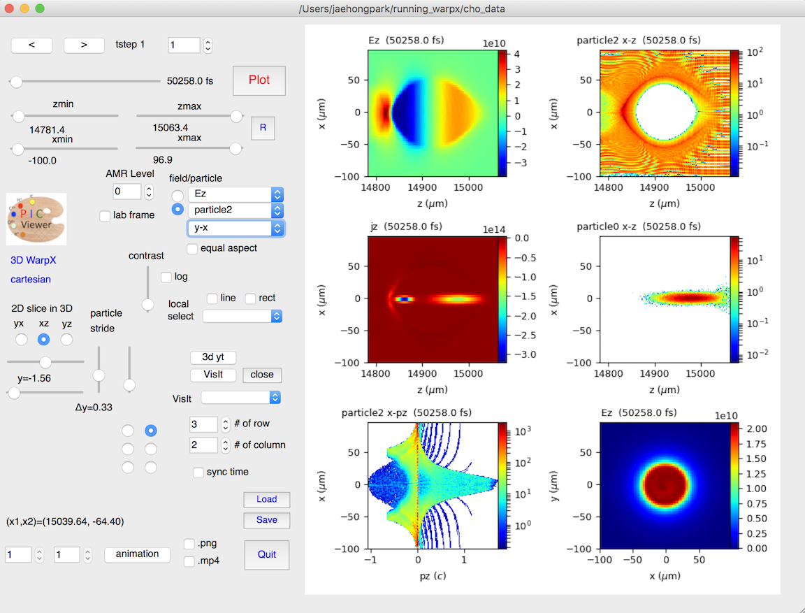

PyQt-based visualization GUI: PICViewer (for both plotfiles and openPMD)
========================================================================

The toolkit provides various easy-to-use functions for data analysis of
Warp/WarpX simulations.

Main features
-------------

* 2D/3D openPMD or WarpX data visualization,
* Multi-plot panels (up to 6 rows x 5 columns) which can be controlled independently or synchronously
* Interactive mouse functions (panel selection, image zoom-in, local data selection, etc)
* Animation from a single or multiple panel(s)
* Saving your job configuration and loading it later
* Interface to use VisIt, yt, or mayavi for 3D volume rendering (currently updating)

Required software
-----------------

* python 2.7 or higher: http://docs.continuum.io/anaconda/install.

* PyQt5

  ::

    conda install pyqt

* h5py

* matplotlib

* numpy

* yt

  ::

    pip install git+https://github.com/yt-project/yt.git --user

* numba

Installation
------------

::

  pip install picviewer

You need to install yt and PySide separately.

You can install from the source for the latest update,

::

  pip install git+https://bitbucket.org/ecp_warpx/picviewer/

To install manually
-------------------

* Clone this repository

  ::

    git clone https://bitbucket.org/ecp_warpx/picviewer/

* Switch to the cloned directory with `cd picviewer` and type `python setup.py install`

To run
------

* You can start PICViewer from any directory. Type `picviewer` in the command line. Select a folder where your data files are located.
* You can directly open your data. Move on to a folder where your data files ae located (`cd [your data folder]`) and type `picviewer` in the command line.
