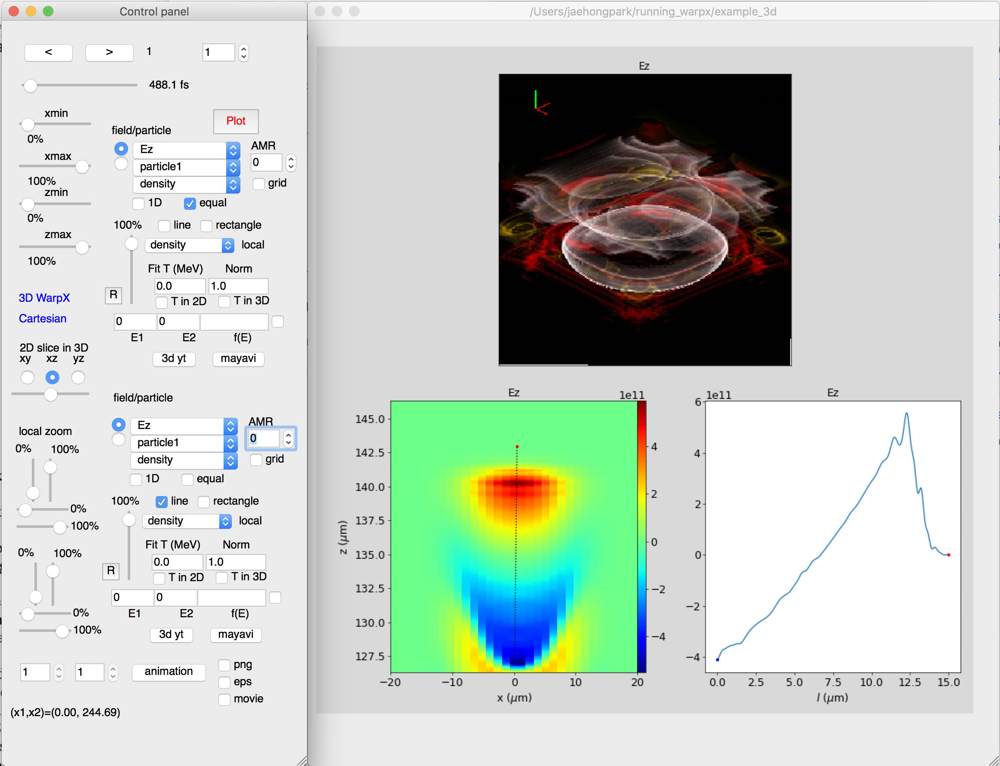

PySide-based GUI
================

The toolkit provides various easy-to-use functions for data analysis of
Warp/WarpX simulations. Figure shows a snapshot of the existing
prototype GUI widget toolkit, which includes several widget tools in the
left side and multi-plot panels in the right side. This GUI is still
under development to include several functionalities.

To run it, go to a folder where your WarpX simulation data files are
located, and type in the terminal window,

::

     ~/warpx_pyside/warpx_analysis.py

Installation
------------

Generic instructions
~~~~~~~~~~~~~~~~~~~~

Before you run it, check if you have installed the following python libraries,

(1) h5py

    ::

        conda install h5py

(2) matplotlib

    ::

        conda install matplotlib

    To open Warp simulation data, the GUI uses openPMD-viewer.

(3) openPMD-viewer

    ::

        conda install -c rlehe openpmd_viewer

    To open WarpX simulation data, the GUI uses yt

(4) yt

    ::

        conda install -c conda-forge yt

(5) PySide

    ::

        conda install -c conda-forge pyside

Instructions for NERSC and ALCF
~~~~~~~~~~~~~~~~~~~~~~~~~~~~~~~

Caution: PySide may not be installed on NERSC or other clusters by
typing the command above in (5). Instead, you can install "pyside" in
the following way:

(1) download miniconda2

    ::

        wget https://repo.continuum.io/miniconda/Miniconda2-latest-Linux-x86_64.sh

(2) install miniconda2

    ::

        bash Miniconda2-latest-Linux-x86_64.sh

(3) activate miniconda2

    ::

        source miniconda2/bin/activate

(4) finally, install "pyside" using conda,

    ::

        conda install -c conda-forge pyside

If you are using ALCF clusters, you can install "pyside" on Cooley,
and you should comment out the path of miniconda2 from .bashrc file,

::

    #export PATH=$HOME/miniconda2/bin:$PATH

due to version collision between python 2.6 and 2.7.

Using the GUI
-------------

If you have installed all the libraries, git clone the GUI source files.

::

    git clone https://jaehong2013@bitbucket.org/jaehong2013/warpx_pyside.git

and go to the folder where your simulation data files are located, and
then

::

     ~/warpx_pyside/warpx_analysis.py

The python package may be located at $HOME/warpx\_pyside/ depending on
your download folder.
