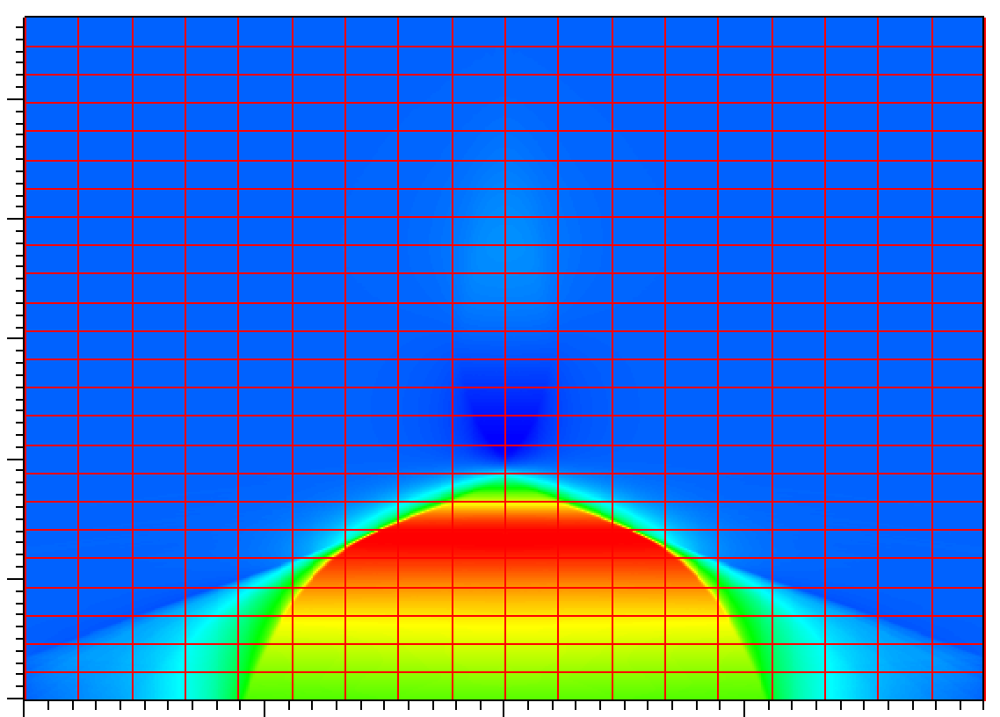

Visualization with Visit (for plotfiles)
========================================

.. note::

    The openPMD format can also be visualized with Visit, but requires the
    installation of a specific plugin: see
    `this link <https://github.com/openPMD/openPMD-visit-plugin>`_.

WarpX results can also be visualized by VisIt, an open source visualization and analysis software. VisIT can be downloaded and installed from https://wci.llnl.gov/simulation/computer-codes/visit.

Assuming that you ran a 2D simulation, here are instructions for making a simple plot from a given plotfile:

- Open the header file: Run VisIt, then select “File” -> “Open file …”, then select the Header file associated with the plotfile of interest (e.g., ``plt10000/Header``).
- View the data: Select “Add” -> “Pseudocolor” -> “Ez” and select “Draw”. You can select other variable to draw, such as ``jx``, ``jy``, ``jz``, ``Ex``, ...

- View the grid structure: Select “Subset”  -> “levels”. Then double clik the text “Subset-levels”, enable the “Wireframe” option, select “Apply”, select “Dismiss”, and then select “Draw”.

- Save the image: Select “File” -> “Set save options”, then customize the image format to your liking, then click "Save".

Your image should look similar to the one below

In 3D, you must apply the “Operators” -> “Slicing”
-> “ThreeSlice”,  You can left-click and drag over the
image to rotate the image to generate image you like.

To make a movie, you must first create a text file named ``movie.visit`` with a
list of the Header files for the individual frames.

The next step is to run VisIt, select “File” -> “Open file
...”, then select ``movie.visit``. Create an image to your liking and press the
“play” button on the VCR-like control panel to preview all the frames. To save
the movie, choose “File” -> “Save movie ...”, and follow the instructions on the screen.
