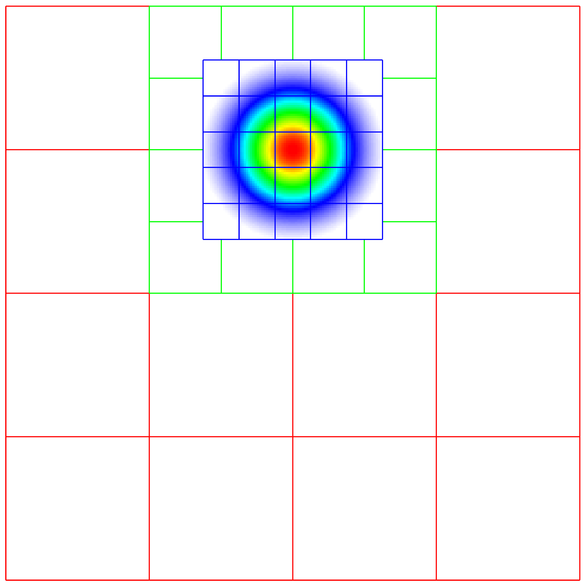
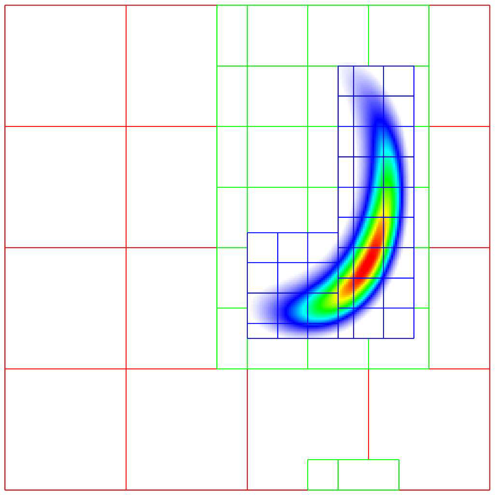
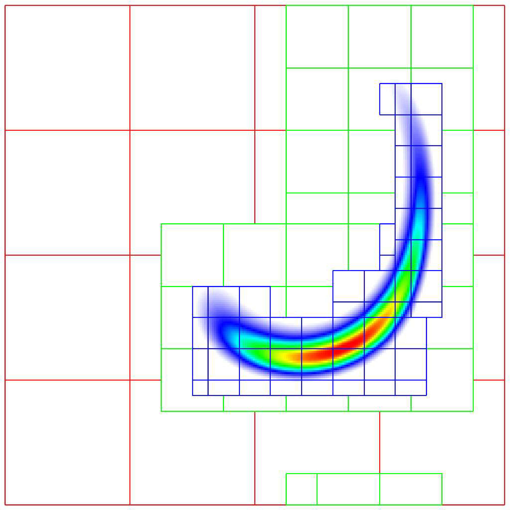
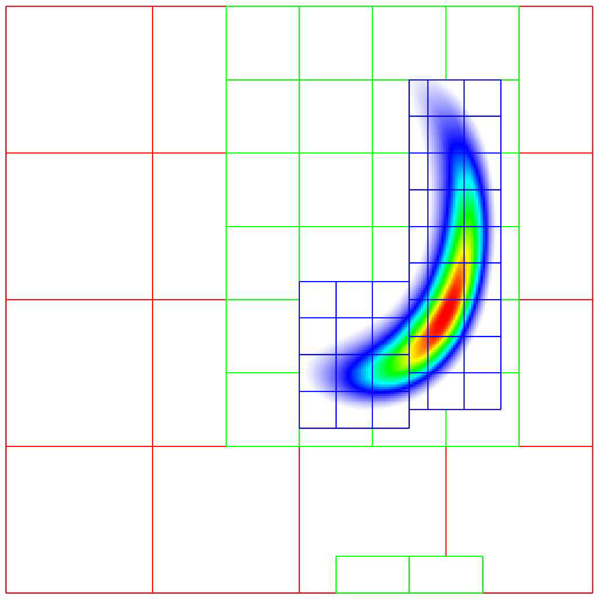
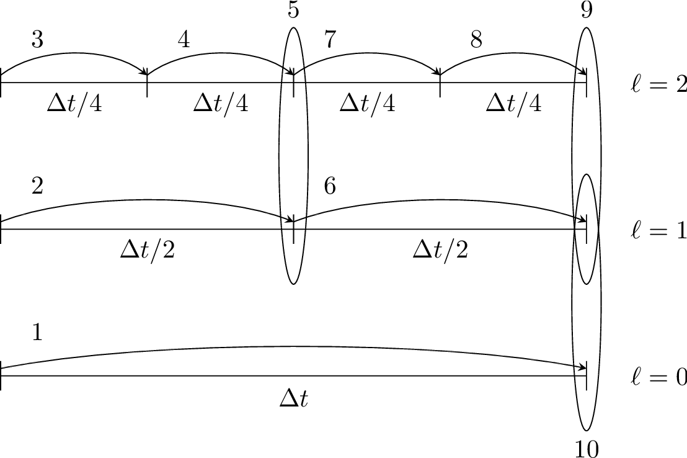
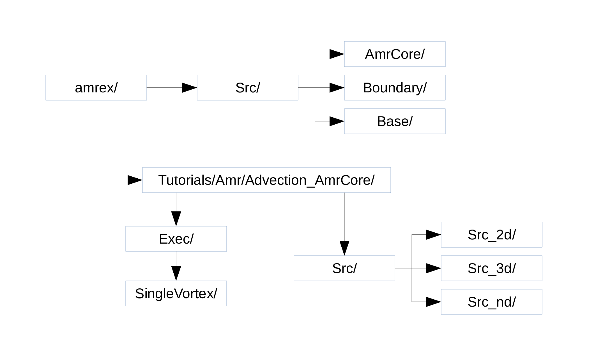

.. role:: cpp(code)
   :language: c++

.. role:: fortran(code)
   :language: fortran

.. raw:: latex

   \begin{center}

.. _fig:Adv:

.. table:: Time sequence (:math:`t=0,0.5,1,1.5,2` s) of advection of a Gaussian profile using the SingleVortex tutorial. The red, green, and blue boxes indicate grids at AMR levels :math:`\ell=0,1`, and :math:`2`.
   :align: center
   
   +-----+-----+-----+-----+
   | |a| | |b| | |c| | |d| |
   +-----+-----+-----+-----+

.. raw:: latex

   \end{center}

.. _ss:amrcore:

AmrCore Source Code: Details
============================

Here we provide more information about the source code in ``amrex/Src/AmrCore.``

AmrMesh and AmrCore
-------------------

For single-level simulations
(see e.g., ``amrex/Tutorials/Basic/HeatEquation_EX1_C/main.cpp``)
the user needs to build :cpp:`Geometry`, :cpp:`DistributionMapping`,
and :cpp:`BoxArray` objects associated with the simulation. For simulations
with multiple levels of refinement, the :cpp:`AmrMesh` class can be thought
of as a container to store arrays of these objects (one for each level), and
information about the current grid structure.

``amrex/Src/AmrCore/AMReX_AmrMesh.cpp/H`` contains the :cpp:`AmrMesh` class.
The protected data members are:

.. highlight:: c++

::

    protected:
        int            verbose;
        int            max_level;       // Maximum allowed level.
        Vector<IntVect> ref_ratio;       // Refinement ratios [0:finest_level-1]

        int            finest_level;    // Current finest level.

        Vector<IntVect> n_error_buf;     // Buffer cells around each tagged cell.
        Vector<IntVect> blocking_factor; // Blocking factor in grid generation 
                                        // (by level).
        Vector<IntVect> max_grid_size;   // Maximum allowable grid size (by level).
        Real           grid_eff;        // Grid efficiency.
        int            n_proper;        // # cells required for proper nesting.

        bool use_fixed_coarse_grids;
        int  use_fixed_upto_level;
        bool refine_grid_layout;        // chop up grids to have the number of 
                                        // grids no less the number of procs

        Vector<Geometry>            geom;
        Vector<DistributionMapping> dmap;
        Vector<BoxArray>            grids;    

The following parameters are frequently set via the inputs file or the command line.
Their usage is described in the section on :ref:`ss:grid_creation`

.. raw:: latex

   \begin{center}

.. _tab:makevarimp:

.. table:: AmrCore parameters

   +------------------------+-------+---------------------+
   | Variable               | Value | Default             |
   +========================+=======+=====================+
   | amr.verbose            | int   | 0                   |
   +------------------------+-------+---------------------+
   | amr.max_level          | int   | none                |
   +------------------------+-------+---------------------+
   | amr.max_grid_size      | ints  | 32 in 3D, 128 in 2D |
   +------------------------+-------+---------------------+
   | amr.n_proper           | int   | 1                   |
   +------------------------+-------+---------------------+
   | amr.grid_eff           | Real  | 0.7                 |
   +------------------------+-------+---------------------+
   | amr.n_error_buf        | int   | 1                   |
   +------------------------+-------+---------------------+
   | amr.blocking_factor    | int   | 8                   |
   +------------------------+-------+---------------------+
   | amr.refine_grid_layout | int   | true                |
   +------------------------+-------+---------------------+

.. raw:: latex

   \end{center}

AMReX_AmrCore.cpp/H contains the pure virtual class :cpp:`AmrCore`,
which is derived from the :cpp:`AmrMesh` class. AmrCore does not actually
have any data members, just additional member functions, some of which override
the base class AmrMesh.

There are no pure virtual functions in :cpp:`AmrMesh`, but
there are 5 pure virtual functions in the :cpp:`AmrCore` class. Any applications
you create must implement these functions. The tutorial code
Amr/Advection_AmrCore provides sample implementation in the derived
class :cpp:`AmrCoreAdv`.

.. highlight:: c++

::

    //! Tag cells for refinement.  TagBoxArray tags is built on level lev grids.
    virtual void ErrorEst (int lev, TagBoxArray& tags, Real time, 
                           int ngrow) override = 0;

    //! Make a new level from scratch using provided BoxArray and DistributionMapping.
    //! Only used during initialization.
    virtual void MakeNewLevelFromScratch (int lev, Real time, const BoxArray& ba, 
                                          const DistributionMapping& dm) override = 0;

    //! Make a new level using provided BoxArray and DistributionMapping and fill 
    //  with interpolated coarse level data.
    virtual void MakeNewLevelFromCoarse (int lev, Real time, const BoxArray& ba, 
                                         const DistributionMapping& dm) = 0;

    //! Remake an existing level using provided BoxArray and DistributionMapping 
    //  and fill with existing fine and coarse data.
    virtual void RemakeLevel (int lev, Real time, const BoxArray& ba, 
                              const DistributionMapping& dm) = 0;

    //! Delete level data
    virtual void ClearLevel (int lev) = 0;

Refer to the :cpp:`AmrCoreAdv` class in the
``amrex/Tutorials/Amr/AmrCore_Advection/Source``
code for a sample implementation.

TagBox, and Cluster
-------------------

These classes are used in the grid generation process.
The :cpp:`TagBox` class is essentially a data structure that marks which
cells are “tagged” for refinement.
:cpp:`Cluster` (and :cpp:`ClusterList` contained within the same file) are classes
that help sort tagged cells and generate a grid structure that contains all
the tagged cells. These classes and their member functions are largely
hidden from any application codes through simple interfaces
such as :cpp:`regrid` and :cpp:`ErrorEst` (a routine for tagging cells for refinement).

.. _sec:amrcore:fillpatch:

FillPatchUtil and Interpolater
------------------------------

..
   For multi-level codes using the ``amrex/Src/AmrCore`` source code, the
   functions described above still work, however additional classes need to be set
   up since the :cpp:`FillPatch` routines call them.  In fact it is possible to
   avoid using the single-level calls directly if you fill all your grids and
   ghost cells using the :cpp:`FillPatch` routines.  Refer to
   ``amrex/Tutorials/Amr/Advection_AmrCore/`` for an example.  The class
   :cpp:`PhysBCFunct` in ``amrex/Src/Base/AMReX_PhysBCFunct.cpp`` is derived from
   :cpp:`PhysBCFunctBase` and contains a :cpp:`BCRec`, :cpp:`Geometry`, and a
   pointer to a :cpp:`BndryFunctBase` function.

   Note that :cpp:`PhyBCFunct` is an example of how to derive from
   :cpp:`PhysBCFunctBase` and is not meant to be a base class.
   :cpp:`PhysBCFunctBase` is the base class.  PhysBCFunctBase is designed for
   users to derive and extend.  You could/should write your own class derived from
   PhysBCFuncBase.  There you can make modifications such as storing a vector of
   BCRecs for, e.g., multiple component MultiFabs.

Many codes, including the Advection_AmrCore example, contain an array of MultiFabs
(one for each level of refinement), and then use “fillpatch” operations to fill temporary
MultiFabs that may include a different number of ghost cells. Fillpatch operations fill
all cells, valid and ghost, from actual valid data at that level, space-time interpolated data
from the next-coarser level, neighboring grids at the same level, and domain
boundary conditions (for examples that have non-periodic boundary conditions).
Note that at the coarsest level,
the interior and domain boundary (which can be periodic or prescribed based on physical considerations)
need to be filled. At the non-coarsest level, the ghost cells can also be interior or domain,
but can also be at coarse-fine interfaces away from the domain boundary.
:cpp:`AMReX_FillPatchUtil.cpp/H` contains two primary functions of interest.

#. :cpp:`FillPatchSingleLevel()` fills a :cpp:`MultiFab` and its ghost region at a single level of
   refinement. The routine is flexible enough to interpolate in time between two MultiFabs
   associated with different times.

#. :cpp:`FillPatchTwoLevels()` fills a :cpp:`MultiFab` and its ghost region at a single level of
   refinement, assuming there is an underlying coarse level. This routine is flexible enough to interpolate
   the coarser level in time first using :cpp:`FillPatchSingleLevel()`.

Note that :cpp:`FillPatchSingleLevel()` and :cpp:`FillPatchTwoLevels()` call the
single-level routines :cpp:`MultiFab::FillBoundary` and :cpp:`FillDomainBoundary()`
to fill interior, periodic, and physical boundary ghost cells.  In principle, you can
write a single-level application that calls :cpp:`FillPatchSingleLevel()` instead
of using :cpp:`MultiFab::FillBoundary` and :cpp:`FillDomainBoundary()`.
   
A :cpp:`FillPatchUtil` uses an :cpp:`Interpolator`. This is largely hidden from application codes.
AMReX_Interpolater.cpp/H contains the virtual base class :cpp:`Interpolater`, which provides
an interface for coarse-to-fine spatial interpolation operators. The fillpatch routines described
above require an Interpolater for FillPatchTwoLevels()
Within AMReX_Interpolater.cpp/H are the derived classes:

-  :cpp:`NodeBilinear`

-  :cpp:`CellBilinear`

-  :cpp:`CellConservativeLinear`

-  :cpp:`CellConservativeProtected`

-  :cpp:`CellQuadratic`

-  :cpp:`PCInterp`

-  :cpp:`CellConservativeQuartic`

The Fortran routines that perform the actual work associated with :cpp:`Interpolater` are
contained in the files AMReX_INTERP_F.H and AMReX_INTERP_xD.F.

.. _sec:amrcore:fluxreg:

Using FluxRegisters
-------------------

AMReX_FluxRegister.cpp/H contains the class :cpp:`FluxRegister`, which is
derived from the class :cpp:`BndryRegister` (in ``amrex/Src/Boundary/AMReX_BndryRegister``). 
In the most general terms, a FluxRegister is a special type of BndryRegister
that stores and manipulates data (most often fluxes) at coarse-fine interfaces.
A simple usage scenario comes from a conservative discretization of a hyperbolic
system:

.. math::

   \frac{\partial\phi}{\partial t} = \nabla\cdot{\bf F}
   \rightarrow
   \frac{\phi_{i,\,j}^{n+1}-\phi_{i,\,j}^n}{\Delta t} = \frac{F_{i+^1\!/_2,\,j}-F_{i-^1\!/_2,\,j}}{\Delta x} + \frac{F_{i,\,j+^1\!/_2} - F_{i,\,j-^1\!/_2}}{\Delta y}.

Consider a two-level, two-dimensional simulation. A standard methodology for
advancing the solution in time is to first advance the coarse grid solution
ignoring the fine level, and then advance the fine grid solution using the
coarse level only to supply boundary conditions. At the coarse-fine interface,
the area-weighted fluxes from the fine grid advance do not in general match the
underlying flux from the coarse grid face, resulting in a lack of global
conservation. Note that for subcycling-in-time algorithms (where for each coarse
grid advance, the fine grid is advanced :math:`r` times using a coarse grid time
step reduced by a factor of :math:`r`, where :math:`r` is the refinement ratio),
the coarse grid flux must be compared to the area *and* time-weighted fine grid
fluxes. A :cpp:`FluxRegister` accumulates and ultimately stores the net
difference in fluxes between the coarse grid and fine grid advance over each
face over a given coarse time step. The simplest possible synchronization step
is to modify the coarse grid solution in coarse cells immediately adjacent to
the coarse-fine interface are updated to account for the mismatch stored in the
FluxRegister. This can be done “simply” by taking the coarse-level divergence of
the data in the FluxRegister using the :cpp:`reflux` function.

The Fortran routines that perform the actual floating point work associated with
incrementing data in a :cpp:`FluxRegister` are contained in the files
AMReX_FLUXREG_F.H and AMReX_FLUXREG_xD.F.

AmrParticles and AmrParGDB
--------------------------

The AmrCore/ directory contains derived classes for dealing with particles
in a multi-level framework. The description of the base classes
are given in the chapter on :ref:`Chap:Particles`.

AMReX_AmrParticles.cpp/H contains the classes :cpp:`AmrParticleContainer`
and :cpp:`AmrTracerParticleContainer`, which are derived from the classes
:cpp:`ParticleContainer` (in ``amrex/Src/Particle/AMReX_Particles``)
and :cpp:`TracerParticleContainer` (in ``amrex/Src/Particle/AMReX_TracerParticles``).

AMReX_AmrParGDB.cpp/H contains the class :cpp:`AmrParGDB`, which is derived from
the class :cpp:`ParGDBBase` (in ``amrex/Src/Particle/AMReX_ParGDB``).

Example: Advection_AmrCore
==========================

The Advection Equation
----------------------

We seek to solve the advection equation on a multi-level, adaptive grid structure:

.. math:: \frac{\partial\phi}{\partial t} = -\nabla\cdot(\phi{\bf U}).

The velocity field is a specified divergence-free (so the flow field is incompressible)
function of space and time. The initial scalar field is a
Gaussian profile. To integrate these equations on a given level, we use a simple conservative update,

.. math:: \frac{\phi_{i,\,j}^{n+1}-\phi_{i,\,j}^n}{\Delta t} = \frac{(\phi u)_{i+^1\!/_2,\,j}^{n+^1\!/_2}-(\phi u)_{i-^1\!/_2,\,j}^{n+^1\!/_2}}{\Delta x} + \frac{(\phi v)_{i,\,j+^1\!/_2}^{n+^1\!/_2} - (\phi v)_{i,\,j-^1\!/_2}^{n+^1\!/_2}}{\Delta y},

where the velocities on faces are prescribed functions of space and time, and the scalars on faces
are computed using a Godunov advection integration scheme. The fluxes in this case are the face-centered,
time-centered “:math:`\phi u`” and “:math:`\phi v`” terms.

We use a subcycling-in-time approach where finer levels are advanced with smaller
time steps than coarser levels, and then synchronization is later performed between levels.
More specifically, the multi-level procedure can most
easily be thought of as a recursive algorithm in which, to advance level :math:`\ell`,
:math:`0\le\ell\le\ell_{\rm max}`, the following steps are taken:

-  Advance level :math:`\ell` in time by one time step, :math:`\Delta t^{\ell}`, as if it is
   the only level. If :math:`\ell>0`, obtain boundary data (i.e. fill the level :math:`\ell` ghost cells)
   using space- and time-interpolated data from the grids at :math:`\ell-1` where appropriate.

-  If :math:`\ell<\ell_{\rm max}`

   -  Advance level :math:`(\ell+1)` for :math:`r` time steps with :math:`\Delta t^{\ell+1} = \frac{1}{r}\Delta t^{\ell}`.

   -  Synchronize the data between levels :math:`\ell` and :math:`\ell+1`.

.. raw:: latex

   \begin{center}

.. _fig:subcycling:

   Schematic of subcycling-in-time algorithm.

.. raw:: latex

   \end{center}

Specifically, for a 3-level simulation, depicted graphically in the figure
showing the :ref:`fig:subcycling` above:

#. Integrate :math:`\ell=0` over :math:`\Delta t`.

#. Integrate :math:`\ell=1` over :math:`\Delta t/2`.

#. Integrate :math:`\ell=2` over :math:`\Delta t/4`.

#. Integrate :math:`\ell=2` over :math:`\Delta t/4`.

#. Synchronize levels :math:`\ell=1,2`.

#. Integrate :math:`\ell=1` over :math:`\Delta t/2`.

#. Integrate :math:`\ell=2` over :math:`\Delta t/4`.

#. Integrate :math:`\ell=2` over :math:`\Delta t/4`.

#. Synchronize levels :math:`\ell=1,2`.

#. Synchronize levels :math:`\ell=0,1`.

For the scalar field, we keep track volume and time-weighted fluxes at coarse-fine interfaces.
We accumulate area and time-weighted fluxes in :cpp:`FluxRegister` objects, which can be
thought of as special boundary FABsets associated with coarse-fine interfaces.
Since the fluxes are area and time-weighted (and sign-weighted, depending on whether they
come from the coarse or fine level), the flux registers essentially store the extent by
which the solution does not maintain conservation. Conservation only happens if the
sum of the (area and time-weighted) fine fluxes equals the coarse flux, which in general
is not true.

The idea behind the level :math:`\ell/(\ell+1)` synchronization step is to correct for sources of
mismatch in the composite solution:

#. The data at level :math:`\ell` that underlie the level :math:`\ell+1` data are not synchronized with the level :math:`\ell+1` data.
   This is simply corrected by overwriting covered coarse cells to be the average of the overlying fine cells.

#. The area and time-weighted fluxes from the level :math:`\ell` faces and the level :math:`\ell+1` faces
   do not agree at the :math:`\ell/(\ell+1)` interface, resulting in a loss of conservation.
   The remedy is to modify the solution in the coarse cells immediately next to the coarse-fine interface
   to account for the mismatch stored in the flux register (computed by taking the coarse-level divergence of the
   flux register data).

Code Structure
--------------

.. _fig:AmrAdvection_AmrCore_flowchart:

   Source code tree for the AmrAdvection_AmrCore example.

The figure shows the :ref:`fig:AmrAdvection_AmrCore_flowchart` 

-  amrex/Src/

   -  Base/ Base amrex library.

   -  Boundary/ An assortment of classes for handling boundary data.

   -  AmrCore/ AMR data management classes, described in more detail above.

-  ``Advection_AmrCore/Src`` Source code specific to this example. Most notably
   is the :cpp:`AmrCoreAdv` class, which is derived from :cpp:`AmrCore`. The subdirectories ``Src_2d``
   and ``Src_3d`` contain dimension specific routines. ``Src_nd`` contains dimension-independent routines.

-  Exec Contains a makefile so a user can write other examples besides SingleVortex.

-  SingleVortex Build the code here by editing the GNUmakefile and running make. There
   is also problem-specific source code here used for initialization or specifying the velocity field used in this
   simulation.

Here is a high-level pseudo-code of the flow of the program:

.. highlight:: c++

::

    /* Advection_AmrCore Pseudocode */
    main()
      AmrCoreAdv amr_core_adv; // build an AmrCoreAdv object
      amr_core_adv.InitData()  // initialize data all all levels
        AmrCore::InitFromScratch()
        AmrMesh::MakeNewGrids()
        AmrMesh::MakeBaseGrids() // define level 0 grids
        AmrCoreAdv::MakeNewLevelFromScratch()
        /* allocate phi_old, phi_new, t_new, and flux registers */
        initdata()  // fill phi
        if (max_level > 0) {
              do {
            AmrMesh::MakeNewGrids()
              /* construct next finer grid based on tagging criteria */
            AmrCoreAdv::MakeNewLevelFromScratch()
                  /* allocate phi_old, phi_new, t_new, and flux registers */
                  initdata()  // fill phi
          } (while (finest_level < max_level);
        }
      amr_core_adv.Evolve()
        loop over time steps {
          ComputeDt()
          timeStep() // advance a level
            /* check regrid conditions and regrid if necessary */
            Advance()
              /* copy phi into a MultiFab and fill ghost cells */
              /* advance phi */
              /* update flux registers */
            if (lev < finest_level) {
              timeStep() // recursive call to advance the next-finer level "r" times
                /* check regrid conditions and regrid if necessary */
                Advance()
                  /* copy phi into a MultiFab and fill ghost cells */
                  /* advance phi */
                  /* update flux registers */
              reflux() // synchronize lev and lev+1 using FluxRegister divergence
              AverageDown() // set covered coarse cells to be the average of fine
            }
        }

The AmrCoreAdv Class
--------------------

This example uses the class :cpp:`AmrCoreAdv`, which is derived from the class :cpp:`AmrCore`
(which is derived from :cpp:`AmrMesh`). The function definitions/implementations
are given in AmrCoreAdv.H/cpp.

FluxRegisters
-------------

The function :cpp:`AmrCoreAdv::Advance()` calls the Fortran
subroutine, :fortran:`advect` (in ``./Src_xd/Adv_xd.f90``). :fortran:`advect` computes
and returns the time-advanced state as well as the fluxes used to update the state.
These fluxes are used to set or increment the flux registers.

.. highlight:: c++

::

    // increment or decrement the flux registers by area and time-weighted fluxes
    // Note that the fluxes have already been scaled by dt and area
    // In this example we are solving phi_t = -div(+F)
    // The fluxes contain, e.g., F_{i+1/2,j} = (phi*u)_{i+1/2,j}
    // Keep this in mind when considering the different sign convention for updating
    // the flux registers from the coarse or fine grid perspective
    // NOTE: the flux register associated with flux_reg[lev] is associated
    // with the lev/lev-1 interface (and has grid spacing associated with lev-1)
    if (do_reflux) { 
       if (flux_reg[lev+1]) {
          for (int i = 0; i < BL_SPACEDIM; ++i) {
              flux_reg[lev+1]->CrseInit(fluxes[i],i,0,0,fluxes[i].nComp(), -1.0);
          }     
       }
       if (flux_reg[lev]) {
          for (int i = 0; i < BL_SPACEDIM; ++i) {
              flux_reg[lev]->FineAdd(fluxes[i],i,0,0,fluxes[i].nComp(), 1.0);
          }
       }
    }

The synchronization is performed at the end of :cpp:`AmrCoreAdv::timeStep`:

.. highlight:: c++

::

    if (do_reflux)
    {
        // update lev based on coarse-fine flux mismatch
        flux_reg[lev+1]->Reflux(*phi_new[lev], 1.0, 0, 0, phi_new[lev]->nComp(),
                                geom[lev]);
    }

    AverageDownTo(lev); // average lev+1 down to lev

.. _ss:regridding:

Regridding
----------

The regrid function belongs to the :cpp:`AmrCore` class (it is virtual – in this
tutorial we use the instance in :cpp:`AmrCore`).

At the beginning of each time step, we check whether we need to regrid.
In this example, we use a :cpp:`regrid_int` and keep track of how many times each level
has been advanced. When any given particular level :math:`\ell<\ell_{\rm max}` has been
advanced a multiple of :cpp:`regrid_int`, we call the :cpp:`regrid` function.

.. highlight:: c++

::

    void
    AmrCoreAdv::timeStep (int lev, Real time, int iteration)
    {
        if (regrid_int > 0)  // We may need to regrid
        {
            // regrid changes level "lev+1" so we don't regrid on max_level
            if (lev < max_level && istep[lev])
            {
                if (istep[lev] % regrid_int == 0)
                {
                    // regrid could add newly refine levels
                    // (if finest_level < max_level)
                    // so we save the previous finest level index
            int old_finest = finest_level; 
            regrid(lev, time);

                    // if there are newly created levels, set the time step
            for (int k = old_finest+1; k <= finest_level; ++k) {
                dt[k] = dt[k-1] / MaxRefRatio(k-1);
            }
            }
        }
        }

Central to the regridding process is the concept of “tagging” which cells need refinement.
:cpp:`ErrorEst` is a pure virtual function of :cpp:`AmrCore`, so each application code must
contain an implementation. In AmrCoreAdv.cpp the ErrorEst function is essentially an
interface to a Fortran routine that tags cells (in this case, :fortran:`state_error` in
``Src_nd/Tagging_nd.f90``). Note that this code uses tiling.

.. highlight:: c++

::

    // tag all cells for refinement
    // overrides the pure virtual function in AmrCore
    void
    AmrCoreAdv::ErrorEst (int lev, TagBoxArray& tags, Real time, int ngrow)
    {
        static bool first = true;
        static Vector<Real> phierr;

        // only do this during the first call to ErrorEst
        if (first)
        {
        first = false;
            // read in an array of "phierr", which is the tagging threshold
            // in this example, we tag values of "phi" which are greater than phierr
            // for that particular level
            // in subroutine state_error, you could use more elaborate tagging, such
            // as more advanced logical expressions, or gradients, etc.
        ParmParse pp("adv");
        int n = pp.countval("phierr");
        if (n > 0) {
            pp.getarr("phierr", phierr, 0, n);
        }
        }

        if (lev >= phierr.size()) return;

        const int clearval = TagBox::CLEAR;
        const int   tagval = TagBox::SET;

        const Real* dx      = geom[lev].CellSize();
        const Real* prob_lo = geom[lev].ProbLo();

        const MultiFab& state = *phi_new[lev];

    #ifdef _OPENMP
    #pragma omp parallel
    #endif
        {
            Vector<int>  itags;
        
        for (MFIter mfi(state,true); mfi.isValid(); ++mfi)
        {
            const Box& tilebox  = mfi.tilebox();

                TagBox&     tagfab  = tags[mfi];
            
            // We cannot pass tagfab to Fortran because it is BaseFab<char>.
            // So we are going to get a temporary integer array.
                // set itags initially to 'untagged' everywhere
                // we define itags over the tilebox region
            tagfab.get_itags(itags, tilebox);
            
                // data pointer and index space
            int*        tptr    = itags.dataPtr();
            const int*  tlo     = tilebox.loVect();
            const int*  thi     = tilebox.hiVect();

                // tag cells for refinement
            state_error(tptr,  ARLIM_3D(tlo), ARLIM_3D(thi),
                BL_TO_FORTRAN_3D(state[mfi]),
                &tagval, &clearval, 
                ARLIM_3D(tilebox.loVect()), ARLIM_3D(tilebox.hiVect()), 
                ZFILL(dx), ZFILL(prob_lo), &time, &phierr[lev]);
            //
            // Now update the tags in the TagBox in the tilebox region
                // to be equal to itags
            //
            tagfab.tags_and_untags(itags, tilebox);
        }
        }
    }

The :fortran:`state_error` subroutine in ``Src_nd/Tagging_nd.f90`` in this example
is simple:

.. highlight:: fortran

::

    subroutine state_error(tag,tag_lo,tag_hi, &
                           state,state_lo,state_hi, &
                           set,clear,&
                           lo,hi,&
                           dx,problo,time,phierr) bind(C, name="state_error")

      implicit none
      
      integer          :: lo(3),hi(3)
      integer          :: state_lo(3),state_hi(3)
      integer          :: tag_lo(3),tag_hi(3)
      double precision :: state(state_lo(1):state_hi(1), &
                                state_lo(2):state_hi(2), &
                                state_lo(3):state_hi(3))
      integer          :: tag(tag_lo(1):tag_hi(1), &
                              tag_lo(2):tag_hi(2), &
                              tag_lo(3):tag_hi(3))
      double precision :: problo(3),dx(3),time,phierr
      integer          :: set,clear

      integer          :: i, j, k

      ! Tag on regions of high phi
      do       k = lo(3), hi(3)
         do    j = lo(2), hi(2)
            do i = lo(1), hi(1)
               if (state(i,j,k) .ge. phierr) then
                  tag(i,j,k) = set
               endif
            enddo
         enddo
      enddo

    end subroutine state_error

.. _ss:fillpatch:

FillPatch
---------

This example has two functions, :cpp:`AmrCoreAdv::FillPatch` and :cpp:`AmrCoreAdv::CoarseFillPatch`,
that make use of functions in AmrCore/AMReX_FillPatchUtil.

In :cpp:`AmrCoreAdv::Advance`, we create a temporary :cpp:`MultiFab` called :cpp:`Sborder`, which
is essentially :math:`\phi` but with ghost cells filled in. The valid and ghost cells are filled in from
actual valid data at that level, space-time interpolated data from the next-coarser level,
neighboring grids at the same level, or domain boundary conditions
(for examples that have non-periodic boundary conditions).

.. highlight:: c++

::

    MultiFab Sborder(grids[lev], dmap[lev], S_new.nComp(), num_grow);
    FillPatch(lev, time, Sborder, 0, Sborder.nComp());

Several other calls to fillpatch routines are hidden from the user in the regridding process.
