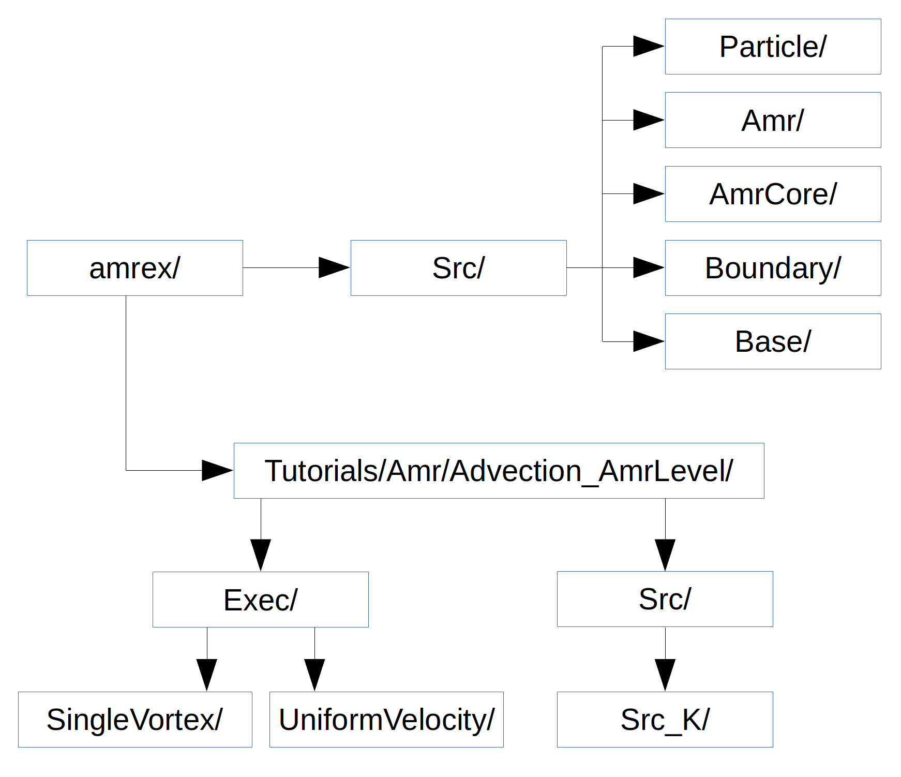

.. role:: cpp(code)
   :language: c++

.. role:: fortran(code)
   :language: fortran

Amr Class
=========

The :cpp:`Amr` class is designed to manage parts of the computation which do
not belong on a single level, like establishing and updating the hierarchy of
levels, global timestepping, and managing the different AmrLevels.  Most likely
you will not need to derive any classes from :cpp:`Amr`. Our mature application
codes use this base class without any derived classes.

One of the most important data members is an array of AmrLevels - the
:cpp:`Amr` class calls many functions from the :cpp:`AmrLevel` class to do
things like advance the solution on a level, compute a time step to be used for
a level, etc.

AmrLevel Class
==============

Pure virtual functions include:

-  :cpp:`computeInitialDt` Compute an array of time steps for each level of
   refinement. Called at the beginning of the simulation.

-  :cpp:`computeNewDt` Compute an array of time steps for each level of
   refinement. Called at the end of a coarse level advance.

-  :cpp:`advance` Advance the grids at a level.

-  :cpp:`post_timestep` Work after at time step at a given level. In this
   tutorial we do the AMR synchronization here.

-  :cpp:`post_regrid` Work after regridding. In this tutorial we redistribute
   particles.

-  :cpp:`post_init` Work after initialization. In this tutorial we perform AMR
   synchronization.

-  :cpp:`initData` Initialize the data on a given level at the beginning of the
   simulation.

-  :cpp:`init` There are two versions of this function used to initialize data
   on a level during regridding. One version is specifically for the case where
   the level did not previously exist (a newly created refined level)

-  :cpp:`errorEst` Perform the tagging at a level for refinement.

StateData
---------

The most important data managed by the :cpp:`AmrLevel` is an array of
:cpp:`StateData`, which holds the scalar fields, etc., in the boxes that
together make up the level.

:cpp:`StateData` is a class that essentially holds a pair of MultiFabs: one at
the old time and one at the new time. AMReX knows how to interpolate in time
between these states to get data at any intermediate point in time. The main
data that we care about in our applications codes (such as the fluid state)
will be stored as :cpp:`StateData`.  Essentially, data is made :cpp:`StateData`
if we need it to be stored in checkpoints/plotfiles, and/or we want it to be
automatically interpolated when we refine.  An :cpp:`AmrLevel` stores an array
of StateData (in a C++ array called :cpp:`state`). We index this array using
integer keys (defined via an enum in, e.g., AmrLevelAdv.H):

.. highlight:: c++

::

    enum StateType { Phi_Type = 0,
                     NUM_STATE_TYPE };

In our tutorial code, we use the function :cpp:`AmrLevelAdv::variableSetup` to
tell our simulation about the :cpp:`StateData` (e.g., how many variables, ghost
cells, nodality, etc.) Note that if you have more than one StateType, each of
the different StateData carried in the state array can have different numbers
of components, ghost cells, boundary conditions, etc. This is the main reason
we separate all this data into separate StateData objects collected together in
an indexable array.

LevelBld Class
==============

The :cpp:`LevelBld` class is a pure virtual class for defining variable types
and attributes. To more easily understand its usage, refer to the derived
class, :cpp:`LevelBldAdv` in the tutorial. The :cpp:`variableSetUp` and
:cpp:`variableCleanUp` are implemented, and in this tutorial call routines in
the :cpp:`AmrLevelAdv` class, e.g.,

.. highlight:: c++

::

    void
    AmrLevelAdv::variableSetUp ()
    {
        BL_ASSERT(desc_lst.size() == 0);

        // Get options, set phys_bc
        read_params();

        desc_lst.addDescriptor(Phi_Type,IndexType::TheCellType(),
                               StateDescriptor::Point,0,NUM_STATE,
                   &cell_cons_interp);

        int lo_bc[BL_SPACEDIM];
        int hi_bc[BL_SPACEDIM];
        for (int i = 0; i < BL_SPACEDIM; ++i) {
        lo_bc[i] = hi_bc[i] = INT_DIR;   // periodic boundaries
        }
        
        BCRec bc(lo_bc, hi_bc);

        desc_lst.setComponent(Phi_Type, 0, "phi", bc, 
                  StateDescriptor::BndryFunc(nullfill));
    }

We see how to define the :cpp:`StateType`, including nodality, whether or not
we want the variable to represent a point in time or an interval over time
(useful for returning the time associated with data), the number of ghost
cells, number of components, and the interlevel interpolation (See
AMReX_Interpolator for various interpolation types. We also see how to specify
physical boundary functions by providing a function (in this case,
:cpp:`nullfill` since we are not using physical boundary conditions), where
:cpp:`nullfill` is defined in a fortran routine in the tutorial source code.

Example: Advection_AmrLevel
===========================

.. _fig:AmrAdvection_AmrLevel_flowchart:

   Source code tree for the AmrAdvection_AmrLevel example.

The figure above shows the :ref:`fig:AmrAdvection_AmrLevel_flowchart`

-  amrex/Src/

   -  Base/ Base amrex library.

   -  Boundary/ An assortment of classes for handling boundary data.

   -  AmrCore/ AMR data management classes, described in more detail above.

   -  Amr/

-  ``Advection_AmrLevel/Src`` Source code specific to this example. Most notably
   is the AmrLevelAdv class, which is derived from AmrLevel. The subdirectories ``Src_2d``
   and ``Src_3d`` contain dimension specific routines. ``Src_nd`` contains dimension-independent routines.

-  Exec Contains a makefile so a user can write other examples besides SingleVortex and UniformVelocity.

-  SingleVortex and UniformVelocity
   Build the code here by editing the GNUmakefile and running make. There
   is also problem-specific source code here used for initialization or specifying the velocity field used in this
   simulation.

.. highlight:: c++

::

    /* Advection_AmrLevel Pseudocode */
    main()
      Amr amr;
      amr.init()
      loop { 
        amr.coarseTimeStep()
          /* compute dt */
          timeStep()
            amr_level[level]->advance()
            /* call timeStep r times for next-finer level */
            amr_level[level]->post_timestep() // AMR synchronization
          postCoarseTimeStep()
          /* write plotfile and checkpoint */
      }
      /* write final plotfile and checkpoint */

Particles
=========

There is an option to turn on passively advected particles. In the GNUmakefile,
add the line ``USE_PARTICLES = TRUE`` and build the code
(do a ``make realclean first``).
In the inputs file, add the line ``adv.do_tracers = 1``.
When you run the code, within each plotfile directory there will be a subdirectory
called "Tracer".

Copy the files from amrex/Tools/Py_util/amrex_particles_to_vtp into
the run directory and type, e.g.,

.. highlight:: console

::

    python amrex_binary_particles_to_vtp.py plt00000 Tracer

To generate a vtp file you can open with ParaView (Refer to the chapter on :ref:`Chap:Visualization`).
