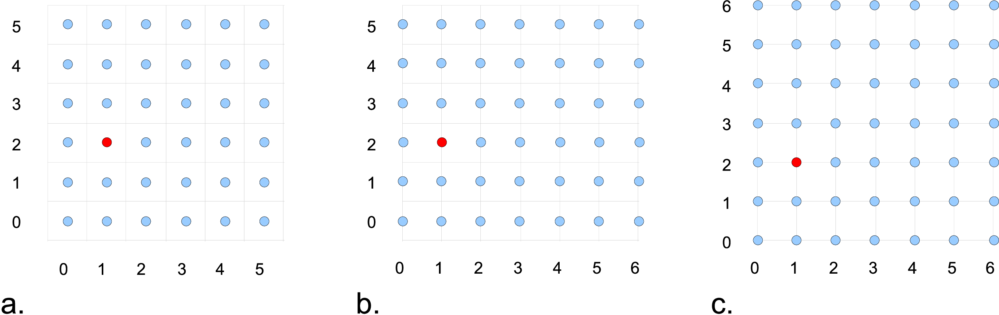
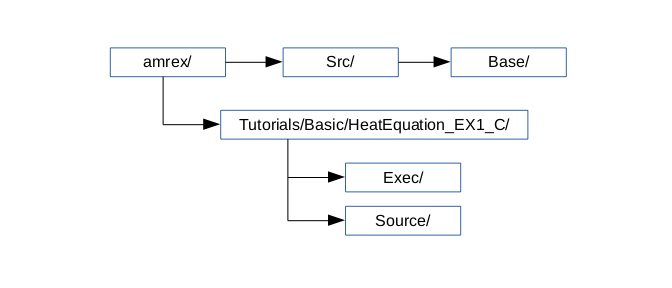

.. role:: cpp(code)
   :language: c++

.. role:: fortran(code)
   :language: fortran

.. _sec:basics:dim:

Dimensionality
==============

As we have mentioned in :ref:`Chap:BuildingAMReX`, the dimensionality of
AMReX must be set at compile time. A macro, ``AMREX_SPACEDIM``, is defined to
be the number of spatial dimensions. C++ codes can also use the
:cpp:`amrex::SpaceDim` variable. Fortran codes can use either the macro and
preprocessing or do

.. highlight:: fortran

::

        use amrex_fort_module, only : amrex_spacedim

The coordinate directions are zero based.

.. _sec:basics:vecandarr:

Vector and Array
================

:cpp:`Vector` class in ``AMReX_Vector.H`` is derived from :cpp:`std::vector`. The
main difference between :cpp:`Vector` and :cpp:`std::vector` is that
:cpp:`Vector::operator[]` provides bound checking when compiled with
:cpp:`DEBUG=TRUE`.

:cpp:`Array` class in ``AMReX_Array.H`` is simply an alias to :cpp:`std::array`.

Real
====

AMReX can be compiled to use either double precision (which is the default) or
single precision. :cpp:`amrex::Real` is typedef’d to either :cpp:`double` or
:cpp:`float`. C codes can use :cpp:`amrex_real`. They are defined in
:cpp:`AMReX_REAL.H`. The data type is accessible in Fortran codes via

.. highlight:: fortran

::

        use amrex_fort_module, only : amrex_real

.. _sec:basics:paralleldescriptor:

ParallelDescriptor
==================

AMReX users do not need to use MPI directly. Parallel communication is often
handled by the data abstraction classes (e.g.,MultiFab; section on
:ref:`sec:basics:multifab`). In addition, AMReX has provided namespace
:cpp:`ParallelDescriptor` in ``AMReX_ParallelDescriptor.H.`` The frequently
used functions are

.. highlight:: c++

::

     int myproc = ParallelDescriptor::MyProc();  // Return the rank

     int nprocs = ParallelDescriptor::NProcs();  // Return the number of processes

     if (ParallelDescriptor::IOProcessor()) {
         // Only the I/O process executes this
     }

     int ioproc = ParallelDescriptor::IOProcessorNumber();  // I/O rank

     ParallelDescriptor::Barrier();

     // Broadcast 100 ints from the I/O Processor
     Vector<int> a(100);
     ParallelDescriptor::Bcast(a.data(), a.size(),
                         ParallelDescriptor::IOProcessorNumber())

     // See AMReX_ParallelDescriptor.H for many other Reduce functions
     ParallelDescriptor::ReduceRealSum(x);

Additionally, ``amrex_paralleldescriptor_module`` in
``Src/Base/AMReX_ParallelDescriptor_F.F90`` provides a number of
functions for Fortran.

ParallelContext
===============

Users can also use groups of MPI subcommunicators to perform
simultaneous physics calculations.  These comms are managed by AMReX's
:cpp:`ParallelContext` in ``AMReX_ParallelContext.H.``  It maintains a
stack of :cpp:`MPI_Comm` handlers. A global comm is placed in the
:cpp:`ParallelContext` stack during AMReX's initialization and
additional subcommunicators can be handled by adding comms with 
:cpp:`push(MPI_Comm)` and removed using :cpp:`pop()`.  This creates a
hierarchy of :cpp:`MPI_Comm` objects that can be used to split work as
the user sees fit.   Note that ``ParallelDescriptor`` by default uses
AMReX's base comm, independent of the status of the
``ParallelContext`` stack.
 
:cpp:`ParallelContext` also tracks and returns information about the
local (most recently added) and global :cpp:`MPI_Comm`.  The most common
access functions are given below.  See ``AMReX_ParallelContext.H.`` for
a full listing of the available functions.

 .. highlight:: c++

::

     MPI_Comm subCommA = ....;
     MPI_Comm subCommB = ....;
     // Add a communicator to ParallelContext.
     // After these pushes, subCommB becomes the 
     //     "local" communicator.
     ParallelContext::push(subCommA);
     ParallelContext::push(subCommB);

     // Get Global and Local communicator (subCommB).
     MPI_Comm globalComm = ParallelContext::CommunicatorAll();
     MPI_Comm localComm  = ParallelContext::CommunicatorSub();

     // Get local number of ranks and global IO Processor Number.
     int localRanks = ParallelContext::NProcsSub();
     int globalIO     = ParallelContext::IOProcessorNumberAll();

     if (ParallelContext::IOProcessorSub()) {
         // Only the local I/O process executes this
     }

     // Translation of global rank to local communicator rank.
     // Returns MPI_UNDEFINED if comms do not overlap.
     int localRank = ParallelContext::global_to_local_rank(globalrank);

     // Translations of MPI rank IDs using integer arrays.
     // Returns MPI_UNDEFINED if comms do not overlap.
     ParallelContext::global_to_local_rank(local_array, global_array, n);
     ParallelContext::local_to_global_rank(global_array, local_array, n);

     // Remove the last added subcommunicator.
     // This would make "subCommA" the new local communicator.
     // Note: The user still needs to free "subCommB". 
     ParallelContext::pop();

.. _sec:basics:print:

Print
=====

AMReX provides classes in ``AMReX_Print.H`` for printing messages to standard
output or any C++ :cpp:`ostream`. The main reason one should use them instead
of :cpp:`std::cout` is that messages from multiple processes or threads do not
get mixed up. Below are some examples.

.. highlight:: c++

::

     Print() <<  "x = " << x << "\n"; // Print on I/O processor

     Real pi = std::atan(1.0)*4.0;
     // Print on rank 3 with precision of 17 digits
     // SetPrecision does not modify cout's floating-point decimal precision setting.
     Print(3).SetPrecision(17) << pi << "\n";

     int oldprec = std::cout.precision(10);
     Print() << pi << "\n";  // Print with 10 digits

     AllPrint() << "Every process prints\n";  // Print on every process

     std::ofstream ofs("my.txt", std::ofstream::out);
     Print(ofs) << "Print to a file" << std::endl;
     ofs.close();

     AllPrintToFile("file.") << "Each process appends to its own file (e.g., file.3)\n";

It should be emphasized that :cpp:`Print()` without any argument only
prints on the I/O process.  A common mistake in using it for debug
printing is one forgets that for non-I/O processes to print we should
use :cpp:`AllPrint()` or :cpp:`Print(rank)`.

.. _sec:basics:parmparse:

ParmParse
=========

:cpp:`ParmParse` in AMReX_ParmParse.H is a class providing a database for the
storage and retrieval of command-line and input-file arguments. When
:cpp:`amrex::Initialize(int& argc, char**& argv)` is called, the first command-line argument after the
executable name (if there is one and it does not contain character =) is taken
to be the inputs file, and the contents in the file are used to initialize the
:cpp:`ParmParse` database. The rest of the command-line arguments are also
parsed by :cpp:`ParmParse`. The format of the inputs file is a series of
definitions in the form of ``prefix.name = value value ....`` For each line,
text after # are comments. Here is an example inputs file.

    .. highlight:: python

    ::

        nsteps    = 100               # integer
        nsteps    = 1000              # nsteps appears a second time
        dt        = 0.03              # floating point number
        ncells    = 128 64 32         # a list of 3 ints
        xrange    = -0.5 0.5          # a list of 2 reals
        title     = "Three Kingdoms"  # a string
        hydro.cfl = 0.8               # with prefix, hydro

The following code shows how to use :cpp:`ParmParse` to get/query the values.

.. highlight:: c++

::

     ParmParse pp;

     int nsteps = 0;
     pp.query("nsteps", nsteps);
     amrex::Print() << nsteps << "\n";  // 1000

     Real dt;
     pp.get("dt", dt);  // runtime error if dt is not in inputs

     Vector<int> numcells;
     // The variable name 'numcells' can be different from parameter name 'ncells'.
     pp.getarr("ncells", numcells);
     amrex::Print() << numcells.size() << "\n";  // 3

     Vector<Real> xr {-1.0, 1.0};
     if (!queryarr("xrange", xr)) {
         amrex::Print() << "Cannot find xrange in inputs, "
                        << "so the default {-1.0,1.0} will be used\n";
     }

     std::string title;
     pp.query("title", title);  // query string

     ParmParse pph("hydro");  // with prefix 'hydro'
     Real cfl;
     pph.get("cfl", cfl);    // get parameter with prefix

Note that when there are multiple definitions for a parameter :cpp:`ParmParse`
by default returns the last one. The difference between :cpp:`query` and
:cpp:`get` should also be noted. It is a runtime error if :cpp:`get` fails to
get the value, whereas :cpp:`query` returns an error code without generating a
runtime error that will abort the run.  It is sometimes convenient to
override parameters with command-line arguments without modifying the inputs
file. The command-line arguments after the inputs file are added later than the
file to the database and are therefore used by default. For example, one can
run with

.. highlight:: console

::

        myexecutable myinputsfile ncells="64 32 16" hydro.cfl=0.9

to change the value of :cpp:`ncells` and :cpp:`hydro.cfl`.

.. _sec:basics:initialize:

Initialize and Finalize
=======================

As we have mentioned, :cpp:`Initialize` must be called to initialize
the execution environment for AMReX and :cpp:`Finalize` must be paired
with :cpp:`Initialize` to release the resources used by AMReX.  There
are two versions of :cpp:`Initialize`.

.. highlight:: c++

::

    void Initialize (MPI_Comm mpi_comm,
                     std::ostream& a_osout = std::cout,
                     std::ostream& a_oserr = std::cerr);

    void Initialize (int& argc, char**& argv, bool build_parm_parse=true,
                     MPI_Comm mpi_comm = MPI_COMM_WORLD,
                     const std::function<void()>& func_parm_parse = {},
                     std::ostream& a_osout = std::cout,
                     std::ostream& a_oserr = std::cerr);

:cpp:`Initialize` tests if MPI has been initialized.  If MPI has been
initialized, AMReX will duplicate the ``MPI_Comm`` argument.  If not,
AMReX will initialize MPI and ignore the ``MPI_Comm`` argument.

Both versions have two optional :cpp:`std::ostream` parameters, one
for standard output in :cpp:`Print` (section :ref:`sec:basics:print`)
and the other for standard error, and they can be accessed with
functions :cpp:`OutStream()` and :cpp:`ErrorStream()`.

The first version of :cpp:`Initialize` does not parse the command line
options, whereas the second version will build ParmParse database
(section :ref:`sec:basics:parmparse`) unless ``build_parm_parse``
parameter is :cpp:`false`.  In the second version, one can pass a
function that adds ParmParse parameters to the database instead of
reading from command line or input file.

Because many AMReX classes and functions (including destructors
inserted by the compiler) do not function properly after
:cpp:`amrex:Finalize` is called, it's best to put the codes between
:cpp:`amrex::Initialize` and :cpp:`amrex::Finalize` into its scope
(e.g., a pair of curly braces or a separate function) to make sure
resources are properly freed.

.. _sec:basics:amrgrids:

Example of AMR Grids
====================

In block-structured AMR, there is a hierarchy of logically rectangular grids.
The computational domain on each AMR level is decomposed into a union of
rectangular domains. :numref:`fig:basics:amrgrids` below shows an example of
AMR with three total levels.  In the AMReX numbering convention, the coarsest
level is level 0. The coarsest grid (*black*) covers the domain with
:math:`16^2` cells. Bold lines represent grid boundaries. There are two
intermediate resolution grids (*blue*) at level 1 and the cells are a factor of
two finer than those at level 0. The two finest grids (*red*) are at level 2
and the cells are a factor of two finer than the level 1 cells. There are 1, 2
and 2 Boxes on levels 0, 1, and 2, respectively. Note that there is no direct
parent-child connection. In this chapter, we will focus on single levels.

.. raw:: latex

   \begin{center}

.. _fig:basics:amrgrids:

   Example of AMR grids. There are three levels in total.
   There are 1, 2 and 2 Boxes on levels 0, 1, and 2, respectively.

.. raw:: latex

   \end{center}
   

.. _sec:basics:box:

Box, IntVect and IndexType
==========================

:cpp:`Box` in AMReX_Box.H is the data structure for representing a rectangular
domain in indexing space.  In :numref:`fig:basics:amrgrids`, there are 1, 2 and
2 Boxes on levels 0, 1 and 2, respectively.  :cpp:`Box` is a
dimension-dependent class. It has lower and upper corners (represented by
:cpp:`IntVect`) and an index type (represented by :cpp:`IndexType`). A
:cpp:`Box` contains no floating-point data.

IntVect
-------

:cpp:`IntVec` is a dimension-dependent class representing an integer vector in
:cpp:`AMREXSPACEDIM`-dimensional space. An :cpp:`IntVect` can be constructed
as follows,

.. highlight:: c++

::

     IntVect iv(AMREX_D_DECL(19, 0, 5));

Here :cpp:`AMREX_D_DECL` is a macro that expands :cpp:`AMREX_D_DECL(19,0,5)` to
either :cpp:`19` or :cpp:`19, 0` or :cpp:`19, 0, 5` depending on the number of
dimensions. The data can be accessed via :cpp:`operator[]`, and the internal
data pointer can be returned by function :cpp:`getVect`. For example

.. highlight:: c++

::

     for (int idim = 0; idim < AMREX_SPACEDIM; ++idim) {
         amrex::Print() << "iv[" << idim << "] = " << iv[idim] << "\n";
     }
     const int * p = iv.getVect();  // This can be passed to Fortran/C as an array

The class has a static function :cpp:`TheZeroVector()` returning the zero
vector, :cpp:`TheUnitVector()` returning the unit vector, and
:cpp:`TheDimensionVector (int dir)` returning a reference to a constant
:cpp:`IntVect` that is zero except in the :cpp:`dir`-direction. Note the
direction is zero-based. :cpp:`IntVect` has a number of relational operators,
:cpp:`==`, :cpp:`!=`, :cpp:`<`, :cpp:`<=`, :cpp:`>` , and :cpp:`>=` that can be
used for lexicographical comparison (e.g., key of :cpp:`std::map`), and a class
:cpp:`IntVect::shift_hasher` that can be used as a hash function (e.g., for
:cpp:`std::unordered_map`). It also has various arithmetic operators. For
example,

.. highlight:: c++

::

     IntVect iv(AMREX_D_DECL(19, 0, 5));
     IntVect iv2(AMREX_D_DECL(4, 8, 0));
     iv += iv2;  // iv is now (23,8,5)
     iv *= 2;    // iv is now (46,16,10);

In AMR codes, one often needs to do refinement and coarsening on
:cpp:`IntVect`. The refinement operation can be done with the multiplication
operation. However, the coarsening requires care because of the rounding
towards zero behavior of integer division in Fortran, C and C++. For example
:cpp:`int i = -1/2` gives :cpp:`i = 0`, and what we want is usually :cpp:`i =
-1`. Thus, one should use the coarsen functions:

.. highlight:: c++

::

      IntVect iv(AMREX_D_DECL(127,127,127));
      IntVect coarsening_ratio(AMREX_D_DECL(2,2,2));
      iv.coarsen(2);                 // Coarsen each component by 2
      iv.coarsen(coarsening_ratio);  // Component-wise coarsening
      const auto& iv2 = amrex::coarsen(iv, 2); // Return an IntVect w/o modifying iv
      IntVect iv3 = amrex::coarsen(iv, coarsening_ratio); // iv not modified

Finally, we note that :cpp:`operator<<` is overloaded for :cpp:`IntVect` and
therefore one can call

.. highlight:: c++

::

      amrex::Print() << iv << "\n";
      std::cout << iv << "\n";

IndexType
---------

This class defines an index as being cell based or node based in each
dimension. The default constructor defines a cell based type in all directions.
One can also construct an :cpp:`IndexType` with an :cpp:`IntVect` with zero and
one representing cell and node, respectively.

.. highlight:: c++

::

     // Node in x-direction and cell based in y and z-directions
     // (i.e., x-face of numerical cells)
     IndexType xface(IntVect{AMREX_D_DECL(1,0,0)});

The class provides various functions including

.. highlight:: c++

::

     // True if the IndexType is cell based in all directions.
     bool cellCentered () const;

     // True if the IndexType is cell based in dir-direction.
     bool cellCentered (int dir) const;

     // True if the IndexType is node based in all directions.
     bool nodeCentered () const;

     // True if the IndexType is node based in dir-direction.
     bool nodeCentered (int dir) const;

Index type is a very important concept in AMReX. It is a way of representing
the notion of indices :math:`i` and :math:`i+1/2`.

Box
---

A ``Box`` is an abstraction for defining discrete regions of
:cpp:`AMREX_SPACEDIM`-dimensional indexing space. Boxes have an
:cpp:`IndexType` and two :cpp:`IntVect`\ s representing the lower and upper
corners. Boxes can exist in positive and negative indexing space. Typical ways
of defining a :cpp:`Box` are

.. highlight:: c++

::

     IntVect lo(AMREX_D_DECL(64,64,64));
     IntVect hi(AMREX_D_DECL(127,127,127));
     IndexType typ({AMREX_D_DECL(1,1,1)});
     Box cc(lo,hi);        // By default, Box is cell based.
     Box nd(lo,hi+1,typ);  // Construct a nodal Box.
     Print() << "A cell-centered Box " << cc << "\n";
     Print() << "An all nodal Box    " << nd << "\n";

Depending the dimensionality, the output of the code above is

::

      A cell-centered Box ((64,64,64) (127,127,127) (0,0,0))
      An all nodal Box    ((64,64,64) (128,128,128) (1,1,1))

For simplicity, we will assume it is 3D for the rest of this section.  In the
output, three integer tuples for each box are the lower corner indices, upper
corner indices, and the index types. Note that 0 and 1 denote cell and node,
respectively. For each tuple like :cpp:`(64,64,64)`, the 3 numbers are for 3
directions. The two Boxes in the code above represent different indexing views
of the same domain of :math:`64^3` cells. Note that in AMReX convention, the
lower side of a cell has the same integer value as the cell centered index.
That is if we consider a cell based index represent :math:`i`, the nodal index
with the same integer value represents :math:`i-1/2`.
:numref:`fig:basics:indextypes` shows some of the different index types for 2D.

.. raw:: latex

   \begin{center}

.. _fig:basics:indextypes:

   Some of the different index types in two dimensions: (a) cell-centered, (b) :math:`x`-face-centered
   (i.e., nodal in :math:`x`-direction only), and (c) corner/nodal,
   i.e., nodal in all dimensions.

.. raw:: latex

   \end{center}

There are a number of ways of converting a :cpp:`Box` from one type to another.

.. highlight:: c++

::

      Box b0 ({64,64,64}, {127,127,127}); // Index type: (cell, cell, cell)

      Box b1 = surroundingNodes(b0);  // A new Box with type (node, node, node)
      Print() << b1;                  // ((64,64,64) (128,128,128) (1,1,1))
      Print() << b0;                  // Still ((64,64,64) (127,127,127) (0,0,0))

      Box b2 = enclosedCells(b1);     // A new Box with type (cell, cell, cell)
      if (b2 == b0) {                 // Yes, they are identical.
         Print() << "b0 and b2 are identical!\n";
      }

      Box b3 = convert(b0, {0,1,0});  // A new Box with type (cell, node, cell)
      Print() << b3;                  // ((64,64,64) (127,128,127) (0,1,0))

      b3.convert({0,0,1});            // Convert b0 to type (cell, cell, node)
      Print() << b3;                  // ((64,64,64) (127,127,128) (0,0,1))

      b3.surroundingNodes();          //  Exercise for you
      b3.enclosedCells();             //  Exercise for you

The internal data of :cpp:`Box` can be accessed via various member functions.
Examples are

.. highlight:: c++

::

      const IntVect& smallEnd () const&;  // Get the small end of the Box
      int bigEnd (int dir) const;         // Get the big end in dir direction
      const int* loVect () const&;        // Get a const pointer to the lower end
      const int* hiVect () const&;        // Get a const pointer to the upper end

Boxes can be refined and coarsened. Refinement or coarsening does not change
the index type. Some examples are shown below.

.. highlight:: c++

::

      Box ccbx ({16,16,16}, {31,31,31});
      ccbx.refine(2);
      Print() << ccbx;                   // ((32,32,32) (63,63,63) (0,0,0))
      Print() << ccbx.coarsen(2);        // ((16,16,16) (31,31,31) (0,0,0))

      Box ndbx ({16,16,16}, {32,32,32}, {1,1,1});
      ndbx.refine(2);
      Print() << ndbx;                   // ((32,32,32) (64,64,64) (1,1,1))
      Print() << ndbx.coarsen(2);        // ((16,16,16) (32,32,32) (1,1,1))

      Box facebx ({16,16,16}, {32,31,31}, {1,0,0});
      facebx.refine(2);
      Print() << facebx;                 // ((32,32,32) (64,63,63) (1,0,0))
      Print() << facebx.coarsen(2);      // ((16,16,16) (32,31,31) (1,0,0))

      Box uncoarsenable ({16,16,16}, {30,30,30});
      print() << uncoarsenable.coarsen(2); // ({8,8,8}, {15,15,15});
      print() << uncoarsenable.refine(2);  // ({16,16,16}, {31,31,31});
                                           // Different from the original!

Note that the behavior of refinement and coarsening depends on the
index type.  A refined :cpp:`Box` covers the same physical domain as
the original :cpp:`Box`, and a coarsened :cpp:`Box` also covers the
same physical domain if the original :cpp:`Box` is coarsenable.
:cpp:`Box uncoarsenable` in the example above is considered
uncoarsenable because its coarsened version does not cover the same
physical domain in the AMR context.

Boxes can grow in one or all directions.  There are a number of grow functions.
Some are member functions of the :cpp:`Box` class and others are free
functions in the :cpp:`amrex` namespace.

The :cpp:`Box` class provides the following member functions testing if a
:cpp:`Box` or :cpp:`IntVect` is contained within this :cpp:`Box`. Note that it
is a runtime error if the two Boxes have different types.

.. highlight:: c++

::

      bool contains (const Box& b) const;
      bool strictly_contains (const Box& b) const;
      bool contains (const IntVect& p) const;
      bool strictly_contains (const IntVect& p) const;

Another very common operation is the intersection of two Boxes like in the
following examples.

.. highlight:: c++

::

      Box b0 ({16,16,16}, {31,31,31});
      Box b1 ({ 0, 0,30}, {23,23,63});
      if (b0.intersects(b1)) {                  // true
          Print() << "b0 and b1 intersect.\n"; 
      }

      Box b2 = b0 & b1;     // b0 and b1 unchanged
      Print() << b2;        // ((16,16,30) (23,23,31) (0,0,0))

      Box b3 = surroundingNodes(b0) & surroundingNodes(b1); // b0 and b1 unchanged
      Print() << b3;        // ((16,16,30) (24,24,32) (1,1,1))

      b0 &= b2;             // b2 unchanged
      Print() << b0;        // ((16,16,30) (23,23,31) (0,0,0))

      b0 &= b3;             // Runtime error because of type mismatch!

.. _sec:basics:geom:

RealBox and Geometry
====================

A :cpp:`RealBox` stores the physical location in floating-point numbers of the
lower and upper corners of a rectangular domain.

The :cpp:`Geometry` class in AMReX_Geometry.H describes problem domain and
coordinate system for rectangular problem domains. A :cpp:`Geometry` object can
be constructed with

.. highlight:: c++

::

    explicit Geometry (const Box&     dom,
                       const RealBox* rb     = nullptr,
                       int            coord  = -1,
                       int*           is_per = nullptr);

Here the constructor takes a cell-centered :cpp:`Box` specifying the indexing
space domain, an optional argument of :cpp:`RealBox` pointer specifying the
physical domain, an optional :cpp:`int` specifying coordinate system type, and
an optional :cpp:`int *` specifying periodicity. If a :cpp:`RealBox` is not
given, AMReX will construct one based on :cpp:`ParmParse` parameters,
``geometry.prob_lo`` and ``geometry.prob_hi``, where each of the parameter is
an array of ``AMREX_SPACEDIM`` real numbers. It’s a runtime error if this
fails. The optional argument for coordinate system is an integer type with
valid values being 0 (Cartesian), or 1 (cylindrical), or 2 (spherical). If it
is invalid as in the case of the default argument value, AMReX will query the
:cpp:`ParmParse` database for ``geometry.coord_sys`` and use it if one is
found. If it cannot find the parameter, the coordinate system is set to 0
(i.e., Cartesian coordinates). The :cpp:`Geometry` class has the concept of
periodicity.  An optional argument can be passed specifying periodicity in each
dimension. If it is not given, the domain is assumed to be non-periodic unless
there is the :cpp:`ParmParse` integer array parameter ``geometry.is_periodic``
with 0 denoting non-periodic and 1 denoting periodic. Below is an example of
defining a :cpp:`Geometry` for a periodic rectangular domain of
:math:`[-1.0,1.0]` in each direction discretized with :math:`64` numerical
cells in each direction.

.. highlight:: c++

::

      int n_cell = 64;

      // This defines a Box with n_cell cells in each direction.
      Box domain(IntVect{AMREX_D_DECL(       0,        0,        0)},
                 IntVect{AMREX_D_DECL(n_cell-1, n_cell-1, n_cell-1)});

      // This defines the physical box, [-1,1] in each direction.
      RealBox real_box({AMREX_D_DECL(-1.0,-1.0,-1.0)},
                       {AMREX_D_DECL( 1.0, 1.0, 1.0)});
      
      // This says we are using Cartesian coordinates
      int coord = 0;
      
      // This sets the boundary conditions to be doubly or triply periodic
      Array<int,AMREX_SPACEDIM> is_periodic {AMREX_D_DECL(1,1,1)};
      
      // This defines a Geometry object
      Geometry geom(domain, &real_box, coord, is_periodic.data());

A :cpp:`Geometry` object can return various information of the physical domain
and the indexing space domain. For example,

::

      const Real* problo = geom.ProbLo();    // Lower corner of the physical domain
      Real yhi = geom.ProbHi(1);             // y-direction upper corner
      const Real* dx = geom.CellSize();      // Cell size for each direction
      const Box& domain = geom.Domain();     // Index domain
      bool is_per = Geometry::isPeriodic(0); // Is periodic in x-direction?
      if (Geometry::isAllPeriodic()) {}      // Periodic in all direction?
      if (Geometry::isAnyPeriodic()) {}      // Periodic in any direction?

.. _sec:basics:ba:

BoxArray
========

:cpp:`BoxArray` is a class in ``AMReX_BoxArray.H`` for storing a collection of
Boxes on a single AMR level. One can make a :cpp:`BoxArray` out of a single
:cpp:`Box` and then chop it into multiple Boxes.

.. highlight:: c++

::

      Box domain(IntVect{0,0,0}, IntVect{127,127,127});
      BoxArray ba(domain);  // Make a new BoxArray out of a single Box
      Print() << "BoxArray size is " << ba.size() << "\n";  // 1
      ba.maxSize(64);       // Chop into boxes of 64^3 cells
      Print() << ba;

The output is like below,

.. highlight:: c++

::

      (BoxArray maxbox(8)
             m_ref->m_hash_sig(0)
      ((0,0,0) (63,63,63) (0,0,0)) ((64,0,0) (127,63,63) (0,0,0))
      ((0,64,0) (63,127,63) (0,0,0)) ((64,64,0) (127,127,63) (0,0,0))
      ((0,0,64) (63,63,127) (0,0,0)) ((64,0,64) (127,63,127) (0,0,0))
      ((0,64,64) (63,127,127) (0,0,0)) ((64,64,64) (127,127,127) (0,0,0)) )

It shows that ``ba`` now has 8 Boxes, and it also prints out each Box.

In AMReX, :cpp:`BoxArray` is a global data structure. It holds all the Boxes in
a collection, even though a single process in a parallel run only owns some of
the Boxes via domain decomposition. In the example above, a 4-process run may
divide the work and each process owns say 2 Boxes (see section
on :ref:`sec:basics:dm`). Each process can then allocate memory for the
floating point data on the Boxes it owns (see sections
on :ref:`sec:basics:multifab` & :ref:`sec:basics:fab`).

:cpp:`BoxArray` has an indexing type, just like :cpp:`Box`. Each Box in a
BoxArray has the same type as the BoxArray itself. In the following example, we
show how one can convert BoxArray to a different type.

.. highlight:: c++

::

      BoxArray cellba(Box(IntVect{0,0,0}, IntVect{63,127,127}));
      cellba.maxSize(64);
      BoxArray faceba = cellba;       // Make a copy
      faceba.convert(IntVect{0,0,1}); // convert to index type (cell, cell, node)
      // Return an all node BoxArray
      const BoxArray& nodeba = amrex::convert(faceba, IntVect{1,1,1});
      Print() << cellba[0] << "\n";  // ((0,0,0) (63,63,63) (0,0,0))
      Print() << faceba[0] << "\n";  // ((0,0,0) (63,63,64) (0,0,1))  
      Print() << nodeba[0] << "\n";  // ((0,0,0) (64,64,64) (1,1,1))

As shown in the example above, :cpp:`BoxArray` has an :cpp:`operator[]` that
returns a :cpp:`Box` given an index. It should be emphasized that there is a
difference between its behavior and the usual behavior of an subscript operator
one might expect. The subscript operator in :cpp:`BoxArray` returns by **value
instead of reference**. This means code like below is meaningless because it
modifies a temporary return value.

.. highlight:: c++

::

      ba[3].coarsen(2);  // DO NOT DO THIS!  Doesn't do what one might expect.

:cpp:`BoxArray` has a number of member functions that allow the Boxes to be
modified. For example,

.. highlight:: c++

::

      BoxArray& refine (int refinement_ratio);   // Refine each Box in BoxArray
      BoxArray& refine (const IntVect& refinement_ratio);
      BoxArray& coarsen (int refinement_ratio);  // Coarsen each Box in BoxArray
      BoxArray& coarsen (const IntVect& refinement_ratio);

We have mentioned at the beginning of this section that :cpp:`BoxArray` is a
global data structure storing Boxes shared by all processes.  The operation of
a deep copy is thus undesirable because it is expensive and the extra copy
wastes memory. The implementation of the :cpp:`BoxArray` class uses
:cpp:`std::shared_ptr` to an internal container holding the actual Box data.
Thus making a copy of :cpp:`BoxArray` is a quite cheap operation. The
conversion of types and coarsening are also cheap because they can share the
internal data with the original :cpp:`BoxArray`. In our implementation,
function :cpp:`refine` does create a new deep copy of the original data. Also
note that a :cpp:`BoxArray` and its variant with a different type share the
same internal data is an implementation detail.  We discuss this so that the
users are aware of the performance and resource cost. Conceptually we can think
of them as completely independent of each other.

.. highlight:: c++

::

      BoxArray ba(...);  // original BoxArray
      BoxArray ba2 = ba; // a copy that shares the internal data with the original
      ba2.coarsen(2);    // Modify the copy
      // The original copy is unmodified even though they share internal data.

For advanced users, AMReX provides functions performing the intersection of a
:cpp:`BoxArray` and a :cpp:`Box`. These functions are much faster than a naive
implementation of performing intersection of the Box with each Box in the
BoxArray. If one needs to perform those intersections, functions
:cpp:`amrex::intersect`, :cpp:`BoxArray::intersects` and
:cpp:`BoxArray::intersections` should be used.

.. _sec:basics:dm:

DistributionMapping
===================

:cpp:`DistributionMapping` is a class in ``AMReX_DistributionMapping.H`` that
describes which process owns the data living on the domains specified by the
Boxes in a :cpp:`BoxArray`. Like :cpp:`BoxArray`, there is an element for each
:cpp:`Box` in :cpp:`DistributionMapping`, including the ones owned by other
parallel processes. One can construct a :cpp:`DistributionMapping` object given
a :cpp:`BoxArray`,

.. highlight:: c++

::

      DistributionMapping dm {ba};

or by simply making a copy, 

.. highlight:: c++

::

      DistributionMapping dm {another_dm};

Note that this class is built using :cpp:`std::shared_ptr`. Thus making a copy
is relatively cheap in terms of performance and memory resources. This class
has a subscript operator that returns the process ID at a given index.

By default, :cpp:`DistributionMapping` uses an algorithm based on space filling
curve to determine the distribution. One can change the default via the
:cpp:`ParmParse` parameter ``DistributionMapping.strategy``.  ``KNAPSACK`` is a
common choice that is optimized for load balance.  One can also explicitly
construct a distribution.  The :cpp:`DistributionMapping` class allows the user
to have complete control by passing an array of integers that represent the
mapping of grids to processes.

.. highlight:: c++

::

      DistributionMapping dm;   // empty object
      Vector<int> pmap {...};
      // The user fills the pmap array with the values specifying owner processes
      dm.define(pmap);  // Build DistributionMapping given an array of process IDs.

.. _sec:basics:fab:

BaseFab, FArrayBox and IArrayBox
================================

AMReX is a block-structured AMR framework. Although AMR introduces irregularity
to the data and algorithms, there is regularity at the block/Box level because
each is still logically rectangular, and the data structure at the Box level is
conceptually simple. :cpp:`BaseFab` is a class template for multi-dimensional
array-like data structure on a :cpp:`Box`. The template parameter is typically
basic types such as :cpp:`Real`, :cpp:`int` or :cpp:`char`. The dimensionality
of the array is ``AMREX_SPACEDIM`` *plus one*. The additional dimension is for
the number of components. The data are internally stored in a contiguous block
of memory in Fortran array order (i.e., column-major order) for
:math:`(x,y,z,\mathrm{component})`, and each component also occupies a
contiguous block of memory because of the ordering. For example, a
:cpp:`BaseFab<Real>` with 4 components defined on a three-dimensional
:cpp:`Box(IntVect{-4,8,32},IntVect{32,64,48})` is like a Fortran array of
:fortran:`real(amrex_real), dimension(-4:32,8:64,32:48,0:3)`.  Note that the
convention in C++ part of AMReX is the component index is zero based. The code
for constructing such an object is as follows,

.. highlight:: c++

::

      Box bx(IntVect{-4,8,32}, IntVect{32,64,48});
      int numcomps = 4;
      BaseFab<Real> fab(bx,numcomps);

Most applications do not use :cpp:`BaseFab` directly, but utilize specialized
classes derived from :cpp:`BaseFab`. The most common types are :cpp:`FArrayBox`
in AMReX_FArrayBox.H derived from :cpp:`BaseFab<Real>` and :cpp:`IArrayBox` in
AMReX_IArrayBox.H derived from :cpp:`BaseFab<int>`.

These derived classes also obtain many :cpp:`BaseFab` member functions via
inheritance. We now show some common usages of these functions.  To get the
:cpp:`Box` where a :cpp:`BaseFab` or its derived object is defined, one can
call

.. highlight:: c++

::

      const Box& box() const;

To the number of component, one can call

.. highlight:: c++

::

      int nComp() const;

To get a pointer to the array data, one can call

.. highlight:: c++

::

      T* dataPtr(int n=0);     // Data pointer to the nth component
                               // T is template parameter (e.g., Real)
      const T* dataPtr(int n=0) const; // const version

The typical usage of the returned pointer is then to pass it to a Fortran or C
function that works on the array data (see the section on
:ref:`sec:basics:fortran`).  :cpp:`BaseFab` has several functions that set the
array data to a constant value. Two examples are as follows.

.. highlight:: c++

::

      void setVal(T x);        // Set all data to x
      // Set the sub-region specified by bx to value x starting from component
      // nstart.  ncomp is the total number of component to be set.
      void setVal(T x, const Box& bx, int nstart, int ncomp);

One can copy data from one :cpp:`BaseFab` to another.

.. highlight:: c++

::

      BaseFab<T>& copy (const BaseFab<T>& src, const Box& srcbox, int srccomp,
                        const Box& destbox, int destcomp, int numcomp);

Here the function copies the data from the region specified by :cpp:`srcbox` in
the source :cpp:`BaseFab src` into the region specified by :cpp:`destbox` in
the destination BaseFab that invokes the function call. Note that although
:cpp:`srcbox` and :cpp:`destbox` may be different, they must be the same size,
shape and index type, otherwise a runtime error occurs. The user also specifies
how many components (:cpp:`int numcomp`) are copied starting at component
srccomp in src and stored starting at component destcomp. BaseFab has functions
returning the minimum or maximum value.

.. highlight:: c++

::

      T min (int comp=0) const;  // Minimum value of given component.
      T min (const Box& subbox, int comp=0) const; // Minimum value of given 
                                                   // component in given subbox.
      T max (int comp=0) const;  // Maximum value of given component.
      T max (const Box& subbox, int comp=0) const; // Maximum value of given 
                                                   // component in given subbox.

:cpp:`BaseFab` also has many arithmetic functions. Here are some examples using
FArrayBox.

.. highlight:: c++

::

      Box box(IntVect{0,0,0}, IntVect{63,63,63});
      int ncomp = 2;
      FArrayBox fab1(box, ncomp);
      FArrayBox fab2(box, ncomp);
      fab1.setVal(1.0);    // Fill fab1 with 1.0
      fab1.mult(10.0, 0);  // Multiply component 0 by 10.0
      fab2.setVal(2.0);    // Fill fab2 with 2.0
      Real a = 3.0;
      fab2.saxpy(a, fab1); // For both components, fab2 <- a * fab1 + fab2

For more complicated expressions that are not supported, one can write Fortran or C
functions for those (see the section on :ref:`sec:basics:fortran`).  Note that
BaseFab does provide operators for accessing the data directly in C++. For
example, the :cpp:`saxpy` example above can be done with

.. highlight:: c++

::

      // Iterate over all components
      for (int icomp=0; icomp < fab1.nComp(); ++icomp) {
          // Iterate over all cells in Box
          for (BoxIterator bit(fab1.box()); bit.ok(); ++bit) {
              // bit() returns IntVect
              fab2(bit(),icomp) = a * fab1(bit(),icomp) + fab2(bit(),icomp);
          }
      }

But this approach is generally not recommended for performance reasons.
However, it can be handy for debugging.

:cpp:`BaseFab` and its derived classes are containers for data on :cpp:`Box`.
Recall that :cpp:`Box` has various types (see the section on :ref:`sec:basics:box`).
The examples in this section so far use the default cell based type.  However,
some functions will result in a runtime error if the types mismatch.  For
example.

.. highlight:: c++

::

      Box ccbx ({16,16,16}, {31,31,31});           // cell centered box
      Box ndbx ({16,16,16}, {31,31,31}, {1,1,1});  // nodal box
      FArrayBox ccfab(ccbx);
      FArrayBox ndfab(ndbx);
      ccfab.setVal(0.0);
      ndfab.copy(ccfab);   // runtime error due to type mismatch

Because it typically contains a lot of data, BaseFab’s copy constructor and
copy assignment operator are disabled to prevent performance degradation. However, BaseFab does
provide a move constructor. In addition, it also provides a constructor for
making an alias of an existing object. Here is an example using
:cpp:`FArrayBox`.

.. highlight:: c++

::

      FArrayBox orig_fab(box, 4);  // 4-component FArrayBox
      // Make a 2-component FArrayBox that is an alias of orig_fab
      // starting from component 1.
      FArrayBox alias_fab(orig_fab, amrex::make_alias, 1, 2);

In this example, the alias :cpp:`FArrayBox` has only two components even though
the original one has four components. The alias has a sliced component view of
the original :cpp:`FArrayBox`. This is possible because of the array ordering.
However, it is not possible to slice in the real space (i.e., the first
``AMREX_SPACEDIM`` dimensions).  Note that no new memory is allocated in
constructing the alias and the alias contains a non-owning pointer. It should
be emphasized that the alias will contain a dangling pointer after the original
:cpp:`FArrayBox` reaches its end of life.

.. _sec:basics:multifab:

FabArray, MultiFab and iMultiFab
================================

:cpp:`FabArray<FAB>` is a class template in AMReX_FabArray.H for a collection
of FABs on the same AMR level associated with a :cpp:`BoxArray` (see the
section on :ref:`sec:basics:ba`). The template parameter :cpp:`FAB` is usually
:cpp:`BaseFab<T>` or its derived classes (e.g., :cpp:`FArrayBox`). However, FabArray
can also be used to hold other data structures. To construct a FabArray, a
:cpp:`BoxArray` must be provided because the FabArray is intended to hold *grid* data
defined on a union of rectangular regions embedded in a uniform index space.
For example, a FabArray object can be used to hold data for one level as in
:numref:`fig:basics:amrgrids`.

:cpp:`FabArray` is a parallel data structure that the data (i.e., FAB) are
distributed among parallel processes. For each process, a FabArray contains
only the FAB objects owned by that process, and the process operates only on
its local data. For operations that require data owned by other processes,
remote communications are involved. Thus, the construction of a :cpp:`FabArray`
requires a :cpp:`DistributionMapping` (see the section on :ref:`sec:basics:dm`)
that specifies which process owns which Box. For level 2 (*red*) in
:numref:`fig:basics:amrgrids`, there are two Boxes. Suppose there are two
parallel processes, and we use a DistributionMapping that assigns one Box to
each process. Then the :cpp:`FabArray` on each process is built on the
:cpp:`BoxArray` with both Boxes, but contains only the FAB associated with its process.

In AMReX, there are some specialized classes derived from :cpp:`FabArray`. The
:cpp:`iMultiFab` class in AMReX_iMultiFab.H is derived from
:cpp:`FabArray<IArrayBox>`. The most commonly used :cpp:`FabArray` kind class
is :cpp:`MultiFab` in AMReX_MultiFab.H derived from :cpp:`FabArray<FArrayBox>`.
In the rest of this section, we use :cpp:`MultiFab` as example. However, these
concepts are equally applicable to other types of FabArrays. There are many
ways to define a MultiFab. For example,

.. highlight:: c++

::

      // ba is BoxArray
      // dm is DistributionMapping
      int ncomp = 4;
      int ngrow = 1;
      MultiFab mf(ba, dm, ncomp, ngrow);

Here we define a :cpp:`MultiFab` with 4 components and 1 ghost cell. A MultiFab
contains a number of :cpp:`FArrayBox`\ es (see the section
on :ref:`sec:basics:fab`) defined on Boxes grown by the number of ghost cells
(1 in this example). That is the :cpp:`Box` in the :cpp:`FArrayBox` is not
exactly the same as in the :cpp:`BoxArray`.  If the :cpp:`BoxArray` has a
:cpp:`Box{(7,7,7) (15,15,15)}`, the one used for constructing :cpp:`FArrayBox`
will be :cpp:`Box{(8,8,8) (16,16,16)}` in this example. For cells in
:cpp:`FArrayBox`, we call those in the original :cpp:`Box` **valid cells** and
the grown part **ghost cells**. Note that :cpp:`FArrayBox` itself does not have
the concept of ghost cells.  Ghost cells are a key concept of
:cpp:`MultiFab`,however, that allows for local operations on ghost cell data
originated from remote processes. We will discuss how to fill ghost cells with
data from valid cells later in this section.  :cpp:`MultiFab` also has a
default constructor. One can define an empty :cpp:`MultiFab` first and then
call the :cpp:`define` function as follows.

.. highlight:: c++

::

      MultiFab mf;
      // ba is BoxArray
      // dm is DistributionMapping
      int ncomp = 4;
      int ngrow = 1;
      mf.define(ba, dm, ncomp, ngrow);

Given an existing :cpp:`MultiFab`, one can also make an alias :cpp:`MultiFab`
as follows.

.. highlight:: c++

::

      // orig_mf is an existing MultiFab
      int start_comp = 3;
      int num_comps = 1;
      MultiFab alias_mf(orig_mf, amrex::make_alias, start_comp, num_comps);

Here the first integer parameter is the starting component in the original
:cpp:`MultiFab` that will become component 0 in the alias :cpp:`MultiFab` and
the second integer parameter is the number of components in the alias. It’s a
runtime error if the sum of the two integer parameters is greater than the
number of the components in the original MultiFab. Note that the alias MultiFab
has exactly the same number of ghost cells as the original MultiFab.

We often need to build new MultiFabs that have the same :cpp:`BoxArray` and
:cpp:`DistributionMapping` as a given MultiFab.  Below is an example of how to
achieve this.

.. highlight:: c++

::

      // mf0 is an already defined MultiFab
      const BoxArray& ba = mf0.boxArray();
      const DistributionMapping& dm = mf0.DistributionMap();
      int ncomp = mf0.nComp();
      int ngrow = mf0.nGrow();
      MultiFab mf1(ba,dm,ncomp,ngrow);  // new MF with the same ncomp and ngrow
      MultiFab mf2(ba,dm,ncomp,0);      // new MF with no ghost cells
      // new MF with 1 component and 2 ghost cells
      MultiFab mf3(mf0.boxArray(), mf0.DistributionMap(), 1, 2);               

As we have repeatedly mentioned in this chapter that :cpp:`Box` and
:cpp:`BoxArray` have various index types. Thus, :cpp:`MultiFab` also has an
index type that is obtained from the :cpp:`BoxArray` used for defining the
:cpp:`MultiFab`. It should be noted again that index type is a very important
concept in AMReX. Let’s consider an example of a finite-volume code, in which
the state is defined as cell averaged variables and the fluxes are defined as
face averaged variables.

.. highlight:: c++

::

      // ba is cell-centered BoxArray
      // dm is DistributionMapping
      int ncomp = 3;  // Suppose the system has 3 components
      int ngrow = 0;  // no ghost cells
      MultiFab state(ba, dm, ncomp, ngrow);
      MultiFab xflux(amrex::convert(ba, IntVect{1,0,0}), dm, ncomp, 0);
      MultiFab yflux(amrex::convert(ba, IntVect{0,1,0}), dm, ncomp, 0);
      MultiFab zflux(amrex::convert(ba, IntVect{0,0,1}), dm, ncomp, 0);

Here all :cpp:`MultiFab`\ s  use the same :cpp:`DistributionMapping`, but their
:cpp:`BoxArrays` have different index types. The state is cell-based, whereas
the fluxes are on the faces. Suppose the cell based :cpp:`BoxArray` contains a
:cpp:`Box{(8,8,16), (15,15,31)}`. The state on that :cpp:`Box` is conceptually
a Fortran Array with the dimension of :fortran:`(8:15,8:15,16:31,0:2)`. The
fluxes are arrays with slightly different indices. For example, the
:math:`x`-direction flux for that :cpp:`Box` has the dimension of
:fortran:`(8:16,8:15,16:31,0:2)`. Note there is an extra element in
:math:`x`-direction.

The :cpp:`MultiFab` class provides many functions performing common arithmetic
operations on a :cpp:`MultiFab` or between :cpp:`MultiFab`\ s  built with the
*same* :cpp:`BoxArray` and :cpp:`DistributionMap`.  For example,

.. highlight:: c++

::

      Real dmin = mf.min(3);   // Minimum value in component 3 of MultiFab mf
                               // no ghost cells included
      Real dmax = mf.max(3,1); // Maximum value in component 3 of MultiFab mf
                               // including 1 ghost cell
      mf.setVal(0.0);          // Set all values to zero including ghost cells

      MultiFab::Add(mfdst, mfsrc, sc, dc, nc, ng);  // Add mfsrc to mfdst
      MultiFab::Copy(mfdst, mfsrc, sc, dc, nc, ng); // Copy from mfsrc to mfdst
      // MultiFab mfdst: destination 
      // MultiFab mfsrc: source
      // int      sc   : starting component index in mfsrc for this operation
      // int      dc   : starting component index in mfdst for this operation
      // int      nc   : number of components for this operation
      // int      ng   : number of ghost cells involved in this operation
      //                 mfdst and mfsrc may have more ghost cells

We refer the reader to ``amrex/Src/Base/AMReX_MultiFab.H`` and
``amrex/Src/Base/AMReX_FabArray.H`` for more details. It should be noted again
it is a runtime error if the two :cpp:`MultiFab`\ s  passed to functions like
:cpp:`MultiFab::Copy` are not built with the *same* :cpp:`BoxArray` (including
index type) and :cpp:`DistributionMapping`.

It is usually the case that the Boxes in the :cpp:`BoxArray` used for building
a :cpp:`MultiFab` are non-intersecting except that they can be overlapping due
to nodal index type. However, :cpp:`MultiFab` can have ghost cells, and in that
case FArrayBoxes are defined on Boxes larger than the Boxes in the
:cpp:`BoxArray`.  Parallel communication is then needed to fill the ghost cells
with valid cell data from other FArrayBoxes possibly on other parallel
processes. The function for performing this type of communication is
:cpp:`FillBoundary`.

.. highlight:: c++

::

      MultiFab mf(...parameters omitted...);
      Geometry geom(...parameters omitted...);
      mf.FillBoundary();                    // Fill ghost cells for all components
                                            // Periodic boundaries are not filled.
      mf.FillBoundary(geom.periodicity());  // Fill ghost cells for all components
                                            // Periodic boundaries are filled.
      mf.FillBoundary(2, 3);        // Fill 3 components starting from component 2
      mf.FillBoundary(geom.periodicity(), 2, 3);

Note that :cpp:`FillBoundary` does not modify any valid cells. Also note that
:cpp:`MultiFab` itself does not have the concept of periodic boundary, but
:cpp:`Geometry` has, and we can provide that information so that periodic
boundaries can be filled as well. You might have noticed that a ghost cell
could overlap with multiple valid cells from different FArrayBoxes in the case
of nodal index type. In that case, it is unspecified that which valid cell’s
value is used to fill the ghost cell. It ought to be the case the values in
those overlapping valid cells are the same up to roundoff errors.  If
a ghost cell does not overlap with any valid cells, its value will not
be modified by :cpp:`FillBoundary`.

Another type of parallel communication is copying data from one :cpp:`MultiFab`
to another :cpp:`MultiFab` with a different :cpp:`BoxArray` or the same
:cpp:`BoxArray` with a different :cpp:`DistributionMapping`. The data copy is
performed on the regions of intersection. The most generic interface for this
is

.. highlight:: c++

::

      mfdst.ParallelCopy(mfsrc, compsrc, compdst, ncomp, ngsrc, ngdst, period, op);

Here :cpp:`mfdst` and :cpp:`mfsrc` are destination and source MultiFabs,
respectively. Parameters :cpp:`compsrc`, :cpp:`compdst`, and :cpp:`ncomp` are
integers specifying the range of components. The copy is performed on
:cpp:`ncomp` components starting from component :cpp:`compsrc` of :cpp:`mfsrc`
and component :cpp:`compdst` of :cpp:`mfdst`. Parameters :cpp:`ngsrc` and
:cpp:`ngdst` specify the number of ghost cells involved for the source and
destination, respectively. Parameter :cpp:`period` is optional, and by default
no periodic copy is performed. Like :cpp:`FillBoundary`, one can use
:cpp:`Geometry::periodicity()` to provide the periodicity information. The last
parameter is also optional and is set to :cpp:`FabArrayBase::COPY` by default.
One could also use :cpp:`FabArrayBase::ADD`. This determines whether the
function copies or adds data from the source to the
destination. Similar to :cpp:`FillBoundary`, if a destination cell has
multiple cells as source, it is unspecified that which source cell is used in
:cpp:`FabArrayBase::COPY`, and, for :cpp:`FabArrayBase::ADD`, the multiple
values are all added to the destination cell.  This function has two
variants, in which the periodicity and operation type are also optional.

.. highlight:: c++

::

      mfdst.ParallelCopy(mfsrc, period, op);  // mfdst and mfsrc must have the same
                                              // number of components
      mfdst.ParallelCopy(mfsrc, compsrc, compdst, ncomp, period, op);

Here the number of ghost cells involved is zero, and the copy is performed on
all components if unspecified (assuming the two MultiFabs have the same number
of components).

.. _sec:basics:mfiter:

MFIter and Tiling
=================

In this section, we will first show how :cpp:`MFIter` works without tiling.
Then we will introduce the concept of logical tiling.  Finally we will show how
logical tiling can be launched via :cpp:`MFIter`.

.. _sec:basics:mfiter:notiling:

MFIter without Tiling
---------------------

In the section on :ref:`sec:basics:multifab`, we have shown some of the
arithmetic functionalities of :cpp:`MultiFab`, such as adding two MultiFabs
together. In this section, we will show how you can operate on the
:cpp:`MultiFab` data with your own functions. AMReX  provides an iterator,
:cpp:`MFIter` for looping over the FArrayBoxes in MultiFabs. For example,

.. highlight:: c++

::

      for (MFIter mfi(mf); mfi.isValid(); ++mfi) // Loop over grids
      {
          // This is the valid Box of the current FArrayBox.
          // By "valid", we mean the original ungrown Box in BoxArray.
          const Box& box = mfi.validbox();

          // A reference to the current FArrayBox in this loop iteration.
          FArrayBox& fab = mf[mfi];

          // Pointer to the floating point data of this FArrayBox.
          Real* a = fab.dataPtr();

          // This is the Box on which the FArrayBox is defined.
          // Note that "abox" includes ghost cells (if there are any),
          // and is thus larger than or equal to "box".
          const Box& abox = fab.box();

          // We can now pass the information to a function that does
          // work on the region (specified by box) of the data pointed to
          // by Real* a.  The data should be viewed as multidimensional
          // with bounds specified by abox.
          // Function f1 has the signature of
          // void f1(const int*, const int*, Real*, const int*, const int*);
          f1(box.loVect(), box.hiVect(), a, abox.loVect(), abox.hiVect());
      }

Here function :cpp:`f1` is usually a Fortran subroutine with ISO C binding
interface like below,

.. highlight:: fortran

::

      subroutine f1(lo, hi, a, alo, ahi) bind(c)
        use amrex_fort_module, only : amrex_real
        integer, intent(in) :: lo(3), hi(3), alo(3), ahi(3)
        real(amrex_real),intent(inout)::a(alo(1):ahi(1),alo(2):ahi(2),alo(3):ahi(3))
        integer :: i,j,k
        do     k = lo(3), hi(3)
          do   j = lo(2), hi(2)
            do i = lo(1), hi(1)
              a(i,j,k) = ...
            end do
          end do
        end do
      end subroutine f1

Here :fortran:`amrex_fort_module` is a Fortran module in AMReX and
:fortran:`amrex_real` is a Fortran kind parameter that matches
:cpp:`amrex::Real` in C++. In this example, we assumed the spatial dimension is
3. In 2D, the function interface is different. In the section on
:ref:`sec:basics:fortran`, we will present a dimension-agnostic approach
using macros provided by AMReX.

:cpp:`MFIter` only loops over grids owned by this process. For example, suppose
there are 5 Boxes in total and processes 0 and 1 own 2 and 3 Boxes,
respectively. That is the MultiFab on process 0 has 2 FArrayBoxes, whereas
there are 3 FArrayBoxes on process 1. Thus the numbers of iterations of MFIter
are 2 and 3 on processes 0 and 1, respectively.

In the example above, :cpp:`MultiFab` is assumed to have a single component. If
it has multiple components, we can call :cpp:`int nc = mf.nComp()` to get the
number of components and pass :cpp:`nc` to the kernel function.

There is only one :cpp:`MultiFab` in the example above. Below is an example of
working with multiple MultiFabs. Note that these two MultiFabs are not
necessarily built on the same :cpp:`BoxArray`.  But they must have the same
:cpp:`DistributionMapping`, and their BoxArrays are typically related (e.g.,
they are different due to index types).

.. highlight:: c++

::

      // U and F are MultiFabs
      int ncU = U.nComp();   // number of components
      int ncF = F.nComp();
      for (MFIter mfi(F); mfi.isValid(); ++mfi) // Loop over grids
      {
          const Box& box = mfi.validbox();

          const FArrayBox& ufab = U[mfi];
          FArrayBox&       ffab = F[mfi];

          Real* up = ufab.dataPtr();
          Real* fp = ufab.dataPtr();

          const Box& ubox = ufab.box();
          const Box& fbox = ffab.box();

          // Function f2 has the signature of 
          // void f2(const int*, const int*,
          //         const Real*, const int*, const int*, const int*
          //               Real*, const int*, const int*, const int*);
          // This will compute f using u as inputs.
          f2(box.loVect(), box.hiVect(),
             up, ubox.loVect(), ubox.hiVect(), &ncU,
             fp, fbox.loVect(), fbox.hiVect(), &ncF);
      }

Here again function :cpp:`f2` is usually a Fortran subroutine with ISO C
binding interface like below,

.. highlight:: fortran

::

    subroutine f2(lo, hi, u, ulo, uhi, nu, f, flo, fhi, nf) bind(c)
      use amrex_fort_module, only : amrex_real
      integer, intent(in) :: lo(3),hi(3),ulo(3),uhi(3),nu,flo(3),fhi(3),nf
      real(amrex_real),intent(in   )::u(ulo(1):uhi(1),ulo(2):uhi(2),ulo(3):uhi(3),nu)
      real(amrex_real),intent(inout)::f(flo(1):fhi(1),flo(2):fhi(2),flo(3):fhi(3),nf)
      integer :: i,j,k
      do n = 1, nf
        do     k = lo(3), hi(3)
          do   j = lo(2), hi(2)
            do i = lo(1), hi(1)
              f(i,j,k,n) = ... u(...) ...
            end do
          end do
        end do
      end do
    end subroutine f2

.. _sec:basics:mfiter:tiling:

MFIter with Tiling
------------------

Tiling, also known as cache blocking, is a well known loop transformation
technique for improving data locality. This is often done by transforming the
loops into tiling loops that iterate over tiles and element loops that iterate
over the data elements within a tile. For example, the original loops might
look like

.. highlight:: fortran

::

      do k = kmin, kmax
        do j = jmin, jmax
          do i = imin, imax
            A(i,j,k) = B(i+1,j,k)+B(i-1,j,k)+B(i,j+1,k)+B(i,j-1,k) &
                      +B(i,j,k+1)+B(i,j,k-1)-6.0d0*B(i,j,k)
          end do
        end do
      end do

And the manually tiled loops might look like

::

      jblocksize = 11
      kblocksize = 16
      jblocks = (jmax-jmin+jblocksize-1)/jblocksize
      kblocks = (kmax-kmin+kblocksize-1)/kblocksize
      do kb = 0, kblocks-1
        do jb = 0, jblocks-1
          do k = kb*kblocksize, min((kb+1)*kblocksize-1,kmax)
            do j = jb*jblocksize, min((jb+1)*jblocksize-1,jmax)
              do i = imin, imax
                A(i,j,k) = B(i+1,j,k)+B(i-1,j,k)+B(i,j+1,k)+B(i,j-1,k) &
                          +B(i,j,k+1)+B(i,j,k-1)-6.0d0*B(i,j,k)
              end do
            end do
          end do
        end do
      end do

As we can see, to manually tile individual loops is very labor-intensive and
error-prone for large applications. AMReX has incorporated the tiling construct
into :cpp:`MFIter` so that the application codes can get the benefit of tiling
easily. An :cpp:`MFIter` loop with tiling is almost the same as the non-tiling
version. The first example in (see the previous section on
:ref:`sec:basics:mfiter:notiling`) requires only two minor changes:

    #. passing :cpp:`true` when defining :cpp:`MFIter` to indicate tiling;
    #. calling :cpp:`tilebox` instead of :cpp:`validbox` to obtain the work region 
       for the loop iteration.

.. highlight:: c++

::

      //               * true *  turns on tiling
      for (MFIter mfi(mf,true); mfi.isValid(); ++mfi) // Loop over tiles
      {
          //                   tilebox() instead of validbox()
          const Box& box = mfi.tilebox();

          FArrayBox& fab = mf[mfi];
          Real* a = fab.dataPtr();
          const Box& abox = fab.box();

          f1(box.loVect(), box.hiVect(), a, abox.loVect(), abox.hiVect());
      }

The second example in the previous section on :ref:`sec:basics:mfiter:notiling`
also requires only two minor changes.

.. highlight:: c++

::

      //              * true *  turns on tiling  
      for (MFIter mfi(F,true); mfi.isValid(); ++mfi) // Loop over tiles
      {
          //                   tilebox() instead of validbox()
          const Box& box = mfi.tilebox();

          const FArrayBox& ufab = U[mfi];
          FArrayBox&       ffab = F[mfi];

          Real* up = ufab.dataPtr();
          Real* fp = ufab.dataPtr();

          const Box& ubox = ufab.box();
          const Box& fbox = ffab.box();

          f2(box.loVect(), box.hiVect(),
             up, ubox.loVect(), ubox.hiVect(), &ncU,
             fp, fbox.loVect(), fbox.hiVect(), &ncF);
      }

The kernels functions like :cpp:`f1` and :cpp:`f2` in the two examples here
usually require very little changes.

.. _fig:basics:cc_comparison:

.. table:: Comparison of :cpp:`MFIter` with (right) and without (left) tiling.
   :align: center
   
   +-----------------------------------------------------+------------------------------------------------------+
   |                        |a|                          |                        |b|                           |
   +-----------------------------------------------------+------------------------------------------------------+
   | | Example of cell-centered valid boxes.             | | Example of cell-centered tile boxes. Each grid     |
   | | There are two valid boxes in this example.        | | is *logically* broken into 4 tiles, and each tile  |
   | | Each has :math:`8^2` cells.                       | | as :math:`4^2` cells. There are 8 tiles in total.  |
   +-----------------------------------------------------+------------------------------------------------------+

:numref:`fig:basics:cc_comparison` shows an example of the difference between
:cpp:`validbox` and :cpp:`tilebox`. In this example, there are two grids of
cell-centered index type. The function :cpp:`validbox` always returns a
:cpp:`Box` for the valid region of an :cpp:`FArrayBox` no matter whether or not
tiling is enabled, whereas the function :cpp:`tilebox` returns a :cpp:`Box` for
a tile. (Note that when tiling is disabled, :cpp:`tilebox` returns the same
:cpp:`Box` as :cpp:`validbox`.) The number of loop iteration is 2 in the
non-tiling version, whereas in the tiling version the kernel function is called
8 times.

It is important to use the correct :cpp:`Box` when implementing tiling, especially
if the box is used to define a work region inside of the loop. For example: 

.. highlight:: c++

::

    // MFIter loop with tiling on.
    for (MFIter mfi(mf,true); mfi.isValid(); ++mfi)
    {
        Box bx = mfi.validbox();     // Gets box of entire, untiled region.
        calcOverBox(bx);             // ERROR! Works on entire box, not tiled box.
                                     // Other iterations will redo many of the same cells.  
    }

The tile size can be explicitly set when defining :cpp:`MFIter`.

.. highlight:: c++

::

      // No tiling in x-direction. Tile size is 16 for y and 32 for z.
      for (MFIter mfi(mf,IntVect(1024000,16,32)); mfi.isValid(); ++mfi) {...}

An :cpp:`IntVect` is used to specify the tile size for every dimension.  A tile
size larger than the grid size simply means tiling is disabled in that
direction. AMReX has a default tile size :cpp:`IntVect{1024000,8,8}` in 3D and
no tiling in 2D. This is used when tile size is not explicitly set but the
tiling flag is on. One can change the default size using :cpp:`ParmParse`
(section :ref:`sec:basics:parmparse`) parameter ``fabarray.mfiter_tile_size.``

.. _fig:basics:ec_comparison:

.. table:: Comparison of :cpp:`MFIter` with (right) and without (left) tiling, for face-centered nodal indexing.
   :align: center
   
   +-----------------------------------------------------+------------------------------------------------------+
   |                        |c|                          |                        |d|                           |
   +-----------------------------------------------------+------------------------------------------------------+
   | | Example of face valid boxes. There are two        | | Example of face tile boxes. Each grid is           |
   | | valid boxes in this example. Each has             | | *logically* broken into 4 tiles as indicated by    |
   | | :math:`9\times 8` points. Note that points in one | | the symbols. There are 8 tiles in total. Some      |
   | | :cpp:`Box` may overlap with points in the other   | | tiles have :math:`5\times 4` points, whereas       | 
   | | :cpp:`Box`. However, the memory locations for     | | others have :math:`4 \times 4` points. Points from |
   | | storing floating point data of those points do    | | different Boxes may overlap, but points from       |
   | | not overlap, because they belong to seperate      | | different tiles of the same Box do not.            |
   | | FArrayBoxes.                                      |                                                      |
   +-----------------------------------------------------+------------------------------------------------------+

Dynamic tiling, which runs one box per OpenMP thread, is also available. 
This is useful when the underlying work cannot benefit from thread
parallelization.  Dynamic tiling is implemented using the :cpp:`MFItInfo`
object and requires the :cpp:`MFIter` loop to be defined in an OpenMP
parallel region:

.. highlight:: c++

::

  // Dynamic tiling, one box per OpenMP thread.
  // No further tiling details,
  //   so each thread works on a single tilebox. 
  #ifdef _OPENMP 
  #pragma omp parallel
  #endif
      for (MFIter mfi(mf,MFItInfo().SetDynamic(true)); mfi.isValid(); ++mfi)
      {  
          const Box& bx = mfi.validbox();
          ...
      }

Dynamic tiling also allows explicit definition of a tile size:

.. highlight:: c++

::

  // Dynamic tiling, one box per OpenMP thread.
  // No tiling in x-direction. Tile size is 16 for y and 32 for z.
  #ifdef _OPENMP 
  #pragma omp parallel
  #endif
      for (MFIter mfi(mf,MFItInfo().SetDynamic(true).EnableTiling(1024000,16,32)); mfi.isValid(); ++mfi)
      {  
          const Box& bx = mfi.tilebox();
          ...
      }

Usually :cpp:`MFIter` is used for accessing multiple MultiFabs like the second
example, in which two MultiFabs, :cpp:`U` and :cpp:`F`, use :cpp:`MFIter` via
:cpp:`operator[]`. These different MultiFabs may have different BoxArrays. For
example, :cpp:`U` might be cell-centered, whereas :cpp:`F` might be nodal in
:math:`x`-direction and cell in other directions. The :cpp:`MFIter::validbox`
and :cpp:`tilebox` functions return Boxes of the same type as the
:cpp:`MultiFab` used in defining the :cpp:`MFIter` (:cpp:`F` in this example).
:numref:`fig:basics:ec_comparison` illustrates an example of non-cell-centered
valid and tile boxes. Besides :cpp:`validbox` and :cpp:`tilebox`, :cpp:`MFIter`
has a number of functions returning various Boxes.  Examples include,

.. highlight:: c++

::

      Box fabbox() const;       // Return the Box of the FArrayBox

      // Return grown tile box.  By default it grows by the number of
      // ghost cells of the MultiFab used for defining the MFIter.
      Box growntilebox(int ng=-1000000) const;

      // Return tilebox with provided nodal flag as if the MFIter
      // is constructed with MultiFab of such flag.
      Box tilebox(const IntVect& nodal_flag); 

It should be noted that the function :cpp:`growntilebox` does not grow the tile
Box like a normal :cpp:`Box`. Growing a :cpp:`Box` normally means the Box is
extended in every face of every dimension.  However, the function
:cpp:`growntilebox` only extends the tile Box in such a way that tiles from the
same grid do not overlap. This is the basic design principle of these various
tiling functions. Tiling is a way of domain decomposition for work sharing.
Overlapping tiles is undesirable because work would be wasted and for
multi-threaded codes race conditions could occur.

.. _fig:basics:growbox_comparison:

.. table:: Comparing growing cell-type and face-type tile boxes.
   :align: center
   
   +-----------------------------------------------------+------------------------------------------------------+
   |                        |e|                          |                        |f|                           |
   +-----------------------------------------------------+------------------------------------------------------+
   | | Example of cell-centered grown tile boxes. As     | | Example of face type grown tile boxes. As          |
   | | indicated by symbols, there are 8 tiles and four  | | indicated by symbols, there are 8 tiles and four   |
   | | in each grid in this example. Tiles from the      | | in each grid in this example. Tiles from the       |
   | | same grid do not overlap. But tiles from          | | same grid do not overlap even though they          | 
   | | different grids may overlap.                      | | have face index type.                              |
   |                                                     |                                                      |
   +-----------------------------------------------------+------------------------------------------------------+

:numref:`fig:basics:growbox_comparison` illustrates an example of
:cpp:`growntilebox`. These functions in :cpp:`MFIter` return :cpp:`Box` by
value. There are three ways of using these functions.

.. highlight:: c++

::

      const Box& bx = mfi.validbox();  // const& to temporary object is legal

      // Make a copy if Box needs to be modified later.
      // Compilers can optimize away the temporary object.
      Box bx2 = mfi.validbox();
      bx2.surroundingNodes();

      Box&& bx3 = mfi.validbox(); // bound to the return value
      bx3.enclosedCells();

But :cpp:`Box& bx = mfi.validbox()` is not legal and will not compile.

.. _sec:basics:fortran:

Fortran, C and C++ Kernels
==========================

In the section on :ref:`sec:basics:mfiter`, we have shown that a typical
pattern for working with MultiFabs is to use :cpp:`MFIter` to iterate over the
data. In each iteration, a kernel function is called to work on the data and
the work region is specified by a :cpp:`Box`.  When tiling is used, the work
region is a tile. The tiling is logical in the sense that there is no data
layout transformation. The kernel function still gets the whole arrays in
:cpp:`FArrayBox`\ es, even though it is supposed to work on a tile region of the
arrays.  Fortran is often used for writing these kernels because of its
native multi-dimensional array support.  To C++, these kernel functions are 
C functions, whose function signatures are typically declared in a header file
named ``*_f.H`` or ``*_F.H``. We recommend the users to follow this convention.
Examples of these function declarations are as follows.

.. highlight:: c++

::

      #include <AMReX_BLFort.H>
      #ifdef __cplusplus
      extern "C"
      {
      #endif
          void f1(const int*, const int*, amrex_real*, const int*, const int*);
          void f2(const int*, const int*,
                  const amrex_real*, const int*, const int*, const int*
                  amrex_real*, const int*, const int*, const int*);
      #ifdef __cplusplus
      }
      #endif

One can write the functions in C and should include the header containing the
function declarations in the C source code to ensure type safety. However, we
typically write these kernel functions in Fortran because of the native
multi-dimensional array support by Fortran. As we have seen in the section on
:ref:`sec:basics:mfiter`, these Fortran functions take C pointers and view them
as multi-dimensional arrays of the shape specified by the additional integer
arguments.  Note that Fortran takes arguments by reference unless the
:fortran:`value` keyword is used. So an integer argument on the Fortran side
matches an integer pointer on the C++ side. Thanks to Fortran 2003, function
name mangling is easily achieved by declaring the Fortran function as
:fortran:`bind(c)`.

AMReX provides many macros for passing an FArrayBox’s data into Fortran/C. For
example

.. highlight:: c++

::

      for (MFIter mfi(mf,true); mfi.isValid(); ++mfi)
      {
          const Box& box = mfi.tilebox();
          f(BL_TO_FORTRAN_BOX(box),
            BL_TO_FORTRAN_ANYD(mf[mfi]));
      }

Here :cpp:`BL_TO_FORTRAN_BOX` takes a :cpp:`Box` and provides two :cpp:`int *`
s specifying the lower and upper bounds of the Box.  :cpp:`BL_TO_FORTRAN_ANYD`
takes an :cpp:`FArrayBox` returned by :cpp:`mf[mfi]` and the preprocessor turns
it into :cpp:`Real *, int *, int *`, where :cpp:`Real *` is the data pointer
that matches real array argument in Fortran, the first :cpp:`int *` (which
matches an integer argument in Fortran) specifies the lower bounds, and the
second :cpp:`int *` the upper bounds of the spatial dimensions of the array.
Similar to what we have seen in the section on :ref:`sec:basics:mfiter`, a
matching Fortran function is shown below,

.. highlight:: fortran

::

    subroutine f(lo, hi, u, ulo, uhi) bind(c)
      use amrex_fort_module, only : amrex_real
      integer, intent(in) :: lo(3),hi(3),ulo(3),uhi(3)
      real(amrex_real),intent(inout)::u(ulo(1):uhi(1),ulo(2):uhi(2),ulo(3):uhi(3))
    end subroutine f

Here, the size of the integer arrays is 3, the maximal number of spatial
dimensions. If the actual spatial dimension is less than 3, the values in the
degenerate dimensions are set to zero. So the Fortran function interface does
not have to change according to the spatial dimensionality, and the bound of
the third dimension of the data array simply becomes :fortran:`0:0`. With the
data passed by :cpp:`BL_TO_FORTRAN_BOX` and :cpp:`BL_FORTRAN_ANYD`, this
version of Fortran function interface works for any spatial dimensions. If one
wants to write a special version just for 2D and would like to use 2D arrays,
one can use

.. highlight:: fortran

::

    subroutine f2d(lo, hi, u, ulo, uhi) bind(c)
      use amrex_fort_module, only : amrex_real
      integer, intent(in) :: lo(2),hi(2),ulo(2),uhi(2)
      real(amrex_real),intent(inout)::u(ulo(1):uhi(1),ulo(2):uhi(2))
    end subroutine f2d

Note that this does not require any changes in the C++ part, because when
C++ passes an integer pointer pointing to an array of three integers Fortran
can treat it as a 2-element integer array.

Another commonly used macro is :cpp:`BL_TO_FORTRAN`. This macro takes an
:cpp:`FArrayBox` and provides a real pointer for the floating point data array
and a number of integer scalars for the bounds.  However, the number of the
integers depends on the dimensionality.  More specifically, there are 6 and 4
integers for 2D and 3D, respectively. The first half of the integers are the
lower bounds for each spatial dimension and the second half the upper bounds.
For example,

.. highlight:: fortran

::

    subroutine f2d(u, ulo1, ulo2, uhi1, uhi2) bind(c)
      use amrex_fort_module, only : amrex_real
      integer, intent(in) :: ulo1, ulo2, uhi1, uhi2
      real(amrex_real),intent(inout)::u(ulo1:uhi1,ulo2:uhi2)
    end subroutine f2d

    subroutine f3d(u, ulo1, ulo2, ulo3, uhi1, uhi2, uhi3) bind(c)
      use amrex_fort_module, only : amrex_real
      integer, intent(in) :: ulo1, ulo2, ulo3, uhi1, uhi2, uhi3
      real(amrex_real),intent(inout)::u(ulo1:uhi1,ulo2:uhi2,ulo3:uhi3)
    end subroutine f3d

Here for simplicity we have omitted passing the tile Box.

Usually :cpp:`MultiFab`\ s  have multiple components. Thus we often also need to
pass the number of component into Fortran functions. We can obtain the number
by calling the :cpp:`MultiFab::nComp()` function, and pass it to Fortran as we
have seen in the section on :ref:`sec:basics:mfiter`.  We can also use the
:cpp:`BL_TO_FORTRAN_FAB` macro that is similar to :cpp:`BL_TO_FORTRAN_ANYD`
except that it provides an additional :cpp:`int *` for the number of
components. The Fortran function matching :cpp:`BL_TO_FORTRAN_FAB(fab)` is then
like below,

.. highlight:: fortran

::

    subroutine f(u, ulo, uhi,nu) bind(c)
      use amrex_fort_module, only : amrex_real
      integer, intent(in) :: lo(3),hi(3),ulo(3),uhi(3),nu
      real(amrex_real),intent(inout)::u(ulo(1):uhi(1),ulo(2):uhi(2),ulo(3):uhi(3),nu)
    end subroutine f

There is a potential type safety issue when calling Fortran functions
from C++.  If there is a mismatch between the function declaration on
the C++ side and the function definition in Fortran, the compiler
cannot catch it.  For example

.. highlight:: c++

::

    // function declaration
    extern "C" {
        void f (amrex_real* x);
    }
    
    for (MFIter mfi(mf,true); mfi.isValid(); ++mfi)
    {
        f(mf[mfi].dataPtr()));
    }

    ! Fortra definition
    subroutine f(x,y) bind(c)
        implicit none
        integer x, y
    end subroutine f

The code above will compile without errors even though the number of
arguments and types don't match.  

To help detect this kind of issues, AMReX provides a type check tool.
Note that it only works when GCC is used.  In the directory an AMReX
based code is compiled, type

.. highlight:: console

::

    make typecheck

Extra arguments used in a usual AMReX build (e.g., USE_MPI=TRUE DIM=2)
can be added.  When it finishes, the output may look like,

.. highlight:: console

::

    Function my_f in main_F.H vs. Fortran procedure in f.f90
        number of arguments 1 does NOT match 2.
        arg #1: C type ['double', 'pointer'] does NOT match Fortran type ('INTEGER 4', 'pointer', 'x').
    22 functions checked, 1 error(s) found.  More details can be found in tmp_build_dir/t/3d.gnu.DEBUG.EXE/amrex_typecheck.ou.

It should be noted that Fortran by default passes argument by
reference.  In the example output above, ``pointer`` in ``Fortran type
('INTEGER 4', 'pointer', 'x')`` means it's a reference to argument
(i.e., C pointer), not a Fortran pointer.

The type check tool has known limitations.  For a function to be
checked by the tool in the GNU make build system, the declaration must
be in a header file named ``*_f.H`` or ``*_F.H``, and the header file
must be in the ``CEXE_headers`` make variable.  The headers are
preprocessed first by cpp as C language, and is then parsed by
pycparser (https://pypi.python.org/pypi/pycparser) that needs to be
installed on your system.  Because pycparser is a C parser, C++ parts
of the headers (e.g., :cpp:`extern "C" {`) need to be hidden with
macro :cpp:`#ifdef __cplusplus`.  Headers like ``AMReX_BLFort.H`` can
be used as a C header, but most other AMReX headers cannot and should
be hidden by :cpp:`#ifdef __cplusplus` if they are included.  More
details can be found at ``amrex/Docs/Readme.typecheck``.  Despite
these limitations, it is recommended to use the type check tool and
report issues to us.

.. _sec:basics:cppkernel:

Writing kernels in C++ is also an option.  AMReX provides a
multi-dimensional array type of syntax, similar to Fortran,
that is readable and easy to implement. An example is given below: 

.. highlight:: c++

::

    void f (Box const& bx, FArrayBox& fab1, FArrayBox const& fab2)
    {
        const Dim3 lo = amrex::lbound(bx);
        const Dim3 hi = amrex::hbound(bx);

        Array4<Real> const& src = fab1.array();
        Array4<Real> const& dst = fab2.array();

        for         (int k = lo.z; k <= hi.z; ++k) {
            for     (int j = lo.y; j <= hi.y; ++j) {
                AMREX_PRAGMA_SIMD
                for (int i = lo.x; i <= hi.x; ++i) {
                    dst(i,j,k) = 0.5*(src(i,j,k)+src(i+1,j,k));
                }
            }
        }
    }

    for (MFIter mfi(mf1,true); mfi.isValid(); ++mfi)
    {
        const Box& box = mfi.tilebox();
        f(box, mf1[mfi], mf2[mfi]);
    }

A :cpp:`Box` and two :cpp:`FArrayBox`\es are passed to a C++ kernel 
function.  In the function, :cpp:`amrex::lbound` and :cpp:`amrex::hbound`
are called to get the start and end of the loops from :cpp:`Box::smallend()`
and :cpp:`Box::bigend` of ``bx``.  Both functions return a 
:cpp:`amrex::Dim3`, a Plain Old Data (POD) type containing three integers.
The individual components are accessed by using :cpp:`.x`, :cpp:`.y` and
:cpp:`.z`, as shown in the :cpp:`for` loops. 

:cpp:`BaseFab::array()` is called to obtain an :cpp:`Array4` object that is
designed as an independent, :cpp:`operator()` based accessor to the
:cpp:`BaseFab` data. :cpp:`Array4` is an AMReX class that contains a
pointer to the :cpp:`FArrayBox` data and two :cpp:`Dim3` vectors that
contain the bounds of the :cpp:`FArrayBox`.  The bounds are stored to 
properly translate the three dimensional coordinates to the appropriate
location in the one-dimensional array.  :cpp:`Array4`\'s :cpp:`operator()` 
can also take a fourth integer to access across states of the 
:cpp:`FArrayBox` and can be used in lower dimensions by passing `0` to
the higher order dimensions.

The ``AMREX_PRAGMA_SIMD`` macro is placed in the innermost loop to notify
the compiler that loop iterations are independent and it is safe to
vectorize the loop.  This should be done whenever possible to achieve the
best performance. Be aware: the macro generates a compiler dependent
pragma, so their exact effect on the resulting code is also compiler
dependent.  It should be emphasized that using the ``AMREX_PRAGMA_SIMD``
macro on loops that are not safe for vectorization will lead to a variety
of errors, so if unsure about the independence of the iterations of a
loop, test and verify before adding the macro.

These loops should always use :cpp:`i <= hi.x`, not :cpp:`i < hi.x`, when 
defining the loop bounds. If not, the highest index cells will be left out
of the calculation. 

Ghost Cells
===========

AMReX uses a :cpp:`MultiFab` as a container for floating point data on
multiple Boxes at a single level of refinement. Each rectangular Box has its own boundaries
on the low and high side in each coordinate direction.
Each Box within a :cpp:`MultiFab` can have ghost cells for storing data outside
the Box's valid region. This allows us to, e.g., perform stencil-type operations on
regular arrays. There are three basic types of boundaries:

    #. interior boundary
    #. coarse/fine boundary
    #. physical boundary

Interior boundary is the border among the grid Boxes themselves.  For example,
in :numref:`fig:basics:amrgrids`, the two blue grid Boxes on level 1 share an
interior boundary that is 10 cells long. For a :cpp:`MultiFab` with ghost cells
on level 1, we can use the :cpp:`MultiFab::FillBoundary` function introduced in
the section on :ref:`sec:basics:multifab` to fill ghost cells at the interior
boundary with valid cell data from other Boxes.  :cpp:`MultiFab::FillBoundary`
can optionally fill periodic boundary ghost cells as well.

A coarse/fine boundary is the border between two AMR levels.
:cpp:`FillBoundary` does not fill these ghost cells. These ghost cells on the
fine level need to be interpolated from the coarse level data.  This is a
subject that will be discussed in the section on :ref:`sec:amrcore:fillpatch`.

Note that periodic boundary is not considered a basic type in the discussion here because
after periodic transformation it becomes either interior boundary or
coarse/fine boundary.

The third type of boundary is the physical boundary at the physical domain.
Note that both coarse and fine AMR levels could have grids touching the
physical boundary. It is up to the application codes to properly fill the ghost
cells at the physical boundary. However, AMReX does provide support for some
common operations.  See the section on :ref:`sec:basics:boundary` for a
discussion on domain boundary conditions in general, including how to implement
physical (non-periodic) boundary conditions.

.. _sec:basics:boundary:

Boundary Conditions
===================

This section describes how to implement domain boundary conditions in AMReX.  A
ghost cell that is outside of the valid region can be thought of as either
“interior” (which includes periodic and coarse-fine ghost cells), or “physical”.
Physical boundary conditions can occur on domain boundaries and can
be characterized as inflow, outflow, slip/no-slip walls, etc., and are
ultimately linked to mathematical Dirichlet or Neumann conditions.

The basic idea behind physical boundary conditions is as follows:

-  Create a :cpp:`BCRec` object, which is essentially a multidimensional
   integer array of :cpp:`2*DIM` components. Each component defines a boundary
   condition type for the lo/hi side of the domain, for each direction.  See
   ``amrex/Src/Base/AMReX_BC_TYPES.H`` for common physical and mathematical
   types.  If there is more than one variable, we can create an array of BCRec
   objects, and pass in a pointer to the 0-index component since the arrays for
   all the components are contiguous in memory.  Here we need to provide
   boundary types to each component of the :cpp:`MultiFab`. Below is an example
   of setting up :cpp:`Vector<BCRec>` before the call to ghost cell routines.
   
   .. highlight:: c++

   ::

         // Set up BC; see ``amrex/Src/Base/AMReX_BC_TYPES.H`` for supported types
         Vector<BCRec> bc(phi.nComp());
         for (int n = 0; n < phi.nComp(); ++n)
         {
             for (int idim = 0; idim < AMREX_SPACEDIM; ++idim)
             {
                 if (Geometry::isPeriodic(idim))
                 {
                     bc[n].setLo(idim, BCType::int_dir); // interior
                     bc[n].setHi(idim, BCType::int_dir);
                 }
                 else
                 {
                     bc[n].setLo(idim, BCType::foextrap); // first-order extrapolation
                     bc[n].setHi(idim, BCType::foextrap);
                 }
             }
         }

   :cpp:`amrex::BCType` has the following types,

       int_dir
           Interior, including periodic boundary

       ext_dir
           “External Dirichlet”. It is the user’s responsibility to write a routine
           to fill ghost cells (more details below).

       foextrap
           “First Order Extrapolation”
           First order extrapolation from last cell in interior.

       reflect_even
           Reflection from interior cells with sign
           unchanged, :math:`q(-i) = q(i)`.

       reflect_odd
           Reflection from interior cells with sign
           changed, :math:`q(-i) = -q(i)`.

-  We have interfaces to a fortran routine that fills ghost cells at domain
   boundaries based on the boundary condition type defined in the :cpp:`BCRec`
   object.  It is the user’s responsibility to have a consisent definition of
   what the ghost cells represent. A common option used in AMReX codes is to
   fill the domain ghost cells with the value that lies on the boundary (as
   opposed to another common option where the value in the ghost cell represents
   an extrapolated value based on the boundary condition type). Then in our
   stencil based “work” codes, we also pass in the :cpp:`BCRec` object and use
   modified stencils near the domain boundary that know the value in the first
   ghost cell represents the value on the boundary.

Depending on the level of complexity of your code, there are various options
for filling domain boundary ghost cells.

For single-level codes built from ``amrex/Src/Base`` (excluding the
``amrex/Src/AmrCore`` and ``amrex/Src/Amr`` source code directories), you will
have single-level MultiFabs filled with data in the valid region where you need
to fill the ghost cells on each grid. There are essentially three ways to fill
the ghost cells. (refer to ``amrex/Tutorials/Basic/HeatEquation_EX2_C`` for an
example).

.. highlight:: c++

::

    MultiFab mf;
    Geometry geom;
    Vector<BCRec> bc;

    // ...

    // fills interior and periodic domain boundary ghost cells
    mf.FillBoundary(geom.periodicity());

    // fills interior (but not periodic domain boundary) ghost cells
    mf.FillBoundary();

    // fills physical domain boundary ghost cells for a cell-centered multifab
    // except for external Dirichlet
    FillDomainBoundary(mf, geom, bc);

:cpp:`FillDomainBoundary()` is a function in
``amrex/Src/Base/AMReX_BCUtil.cpp`` that fills the physical domain
boundary ghost cells with Fortran function ``amrex_fab_filcc`` except
for external Dirichlet (i.e., :cpp:`BCType:ext_dir`).  The user can
use it as a template and insert their own function for
:cpp:`BCType:ext_dir` like below

.. highlight:: c++

::

    if (! grown_domain_box.contains(fab_box))
    {
        amrex_fab_filcc(BL_TO_FORTRAN_FAB(fab),
                        BL_TO_FORTRAN_BOX(domain_box),
                        dx, prob_lo,
                        bc[0].data());
        user_fab_filcc(BL_TO_FORTRAN_FAB(fab),
                       BL_TO_FORTRAN_BOX(domain_box),
                       dx, prob_lo,
                       bc[0].data());
    }

    
Memory Allocation
=================

AMReX has a Fortran module, :fortran:`amrex_mempool_module` that can be used to
allocate memory for Fortran pointers. The reason that such a module exists in
AMReX, is that memory allocation is often very slow in multi-threaded OpenMP
parallel regions. AMReX :cpp:`amrex_mempool_module` provides a much faster
alternative approach, in which each thread has its own memory pool. Here are
examples of using the module.

.. highlight:: fortran

::

      use amrex_mempool_module, only : amrex_allocate, amrex_deallocate
      real(amrex_real), pointer, contiguous :: a(:,:,:), b(:,:,:,:)
      integer :: lo1, hi1, lo2, hi2, lo3, hi3, lo(4), hi(4)
      ! lo1 = ...
      ! a(lo1:hi1, lo2:hi2, lo3:hi3)
      call amrex_allocate(a, lo1, hi1, lo2, hi2, lo3, hi3)
      ! b(lo(1):hi(1),lo(2):hi(2),lo(3):hi(3),lo(4):hi(4))
      call amrex_allocate(b, lo, hi)
      ! ......
      call amrex_deallocate(a)
      call amrex_deallocate(b)

The downside of this is we have to use :fortran:`pointer` instead of
:fortran:`allocatable`. This means we must explicitly free the memory via
:fortran:`amrex_deallocate` and we need to declare the pointers as
:fortran:`contiguous` for performance reason.  Also, we often
pass the Fortran pointer to a procedure with explicit array argument
to get rid of the pointerness completely.

Abort, Assertion and Backtrace
==============================

:cpp:`amrex::Abort(const char * message)` is used to terminate a run usually
when something goes wrong. This function takes a message and writes it to
stderr. Files named like ``Backtrace.1`` (where 1 means process 1)
are produced containing backtrace information of the call stack. In Fortran, we
can call :fortran:`amrex_abort` from the :fortran:`amrex_error_module`, which
takes a Fortran character variable with assumed size (i.e., :fortran:`len=*`)
as a message.  A ``ParmParse`` runtime boolean parameter
``amrex.throw_handling`` (which is defaulted to 0, i.e., :cpp:`false`)
can be set to 1 (i.e., :cpp:`true`) so that AMReX will throw an
exception instead of aborting.

:cpp:`AMREX_ASSERT` is a macro that takes a Boolean expression. For debug build
(e.g., ``DEBUG=TRUE`` using the GNU Make build system), if the expression at
runtime is evaluated to false, :cpp:`amrex::Abort` will be called and the run
is thus terminated. For optimized build (e.g., ``DEBUG=FALSE`` using the GNU
Make build system), the :cpp:`AMREX_ASSERT` statement is removed at compile
time and thus has no effect at runtime. We often use this as a means of putting
debug statement in the code without adding any extra cost for production runs.
For example,

.. highlight:: c++

::

      AMREX_ASSERT(mf.nGrow() > 0 && mf.nComp() == mf2.nComp());

Here for debug build we like to assert that :cpp:`MultiFab mf` has ghost cells
and it also has the same number of components as :cpp:`MultiFab mf2`. If we
always want the assertion, we can use :cpp:`AMREX_ALWAYS_ASSERT`.  The
assertion macros have a ``_WITH_MESSAGE`` variant that will print a
message when assertion fails.  For example,

.. highlight:: c++

::

      AMREX_ASSERT_WITH_MESSAGE(mf.boxArray() == mf2.boxArray(),
                                "These two mfs must have the same BoxArray");

Backtrace files are produced by AMReX signal handler by default when
segfault occurs or ``Abort`` is called.  If the application does not
want AMReX to handle this, ``ParmParse`` parameter
`amrex.signal_handling=0` can be used to disable it.

Debugging
=========

Debugging is an art.  Everyone has their own favorite method.  Here we
offer a few tips we have found to be useful.

Compiling in debug mode (e.g., ``make DEBUG=TRUE``) and running with
``ParmParse`` parameter ``amrex.fpe_trap_invalid=1`` can be helpful.
In debug mode, many compiler debugging flags are turned on and all
``MultiFab`` data are initialized to signaling NaNs.  The
``amrex.fpe_trap_invalid`` parameter will result in backtrace files
when floating point exception occurs.  One can then examine those
files to track down the origin of the issue.

Writing a ``MultiFab`` to disk with

.. highlight:: c++

::

    VisMF::Write(const FabArray<FArrayBox>& mf, const std::string& name)

in ``AMReX_VisMF.H`` and examining it with ``Amrvis`` (section
:ref:`sec:amrvis`) can be helpful as well.  In
``AMReX_MultiFabUtil.H``, function

.. highlight:: c++

::

    void print_state(const MultiFab& mf, const IntVect& cell, const int n=-1);

can output the data for a single cell.

Valgrind is one of our favorite debugging tool.  For MPI runs, one can
tell valgrind to output to different files for different processes.
For example,

.. highlight:: console

::

    mpiexec -n 4 valgrind --leak-check=yes --track-origins=yes --log-file=vallog.%p ./foo.exe ...
    
.. _sec:basics:heat1:

Example: HeatEquation_EX1_C
===========================

We now present an example of solving the heat equation.  The source
code tree for the heat equation example is simple, as shown in
:numref:`fig:Basics_Heat_flowchart`. We recommend you study
``main.cpp`` and ``advance.cpp`` to see some of the classes described
below in action.

.. raw:: latex

   \begin{center}

.. _fig:Basics_Heat_flowchart:

   Diagram of the source code structure for the HeatEquation_EX1_C example.

.. raw:: latex

   \end{center}

Source code tree for the HeatEquation_EX1_C example

    amrex/Src/Base
        Contains source code for single-level simulations.  Note that in
        ``amrex/Src`` there are many sub-directories, e.g., ``Base``, ``Amr``,
        ``AmrCore``, ``LinearSolvers``, etc.  In this tutorial the only source
        code directory we need is ``Base``.

    amrex/Tutorials/HeatEquation_EX1_C/Source
        Contains the following source code specific to this tutorial:
        
        #. ``Make.package``: lists the source code files
        #. ``main.cpp``: contains the C++ ``main`` function
        #. ``advance.cpp``: advance the solution by a time step
        #. ``init_phi_Xd.f90, advance_Xd.f90``: fortran work functions used to
           initialize and advance the solution
        #. ``myfunc.H``: header file for C++ functions
        #. ``myfunc_F.H``: header file for fortran90 functions that are called
           in .cpp files

    amrex/Tutorials/HeatEquation_EX1_C/Exec
        This is where you build the code with make.  There is a GNUmakefile
        and inputs files, inputs_2d and inputs_3d.

Now we highlight a few key sections of the code.  In ``main.cpp`` we
demonstrate how to read in parameters from the inputs file:

.. highlight:: c++

::

    // inputs parameters
    {
        // ParmParse is way of reading inputs from the inputs file
        ParmParse pp;

        // We need to get n_cell from the inputs file - this is the number of cells on each side of 
        //   a square (or cubic) domain.
        pp.get("n_cell",n_cell);

        // The domain is broken into boxes of size max_grid_size
        pp.get("max_grid_size",max_grid_size);

        // Default plot_int to -1, allow us to set it to something else in the inputs file
        //  If plot_int < 0 then no plot files will be writtenq
        plot_int = -1;
        pp.query("plot_int",plot_int);

        // Default nsteps to 10, allow us to set it to something else in the inputs file
        nsteps = 10;
        pp.query("nsteps",nsteps);

        pp.queryarr("is_periodic", is_periodic);
    }

In ``main.cpp`` we demonstrate how to define a ``Box`` for the problem domain,
and then how to chop that ``Box`` up into multiple boxes that define a
``BoxArray``  We also define a ``Geometry`` object that knows about the problem
domain, the physical coordinates of the box, and the periodicity:

::

    // make BoxArray and Geometry
    BoxArray ba;
    Geometry geom;
    {
        IntVect dom_lo(AMREX_D_DECL(       0,        0,        0));
        IntVect dom_hi(AMREX_D_DECL(n_cell-1, n_cell-1, n_cell-1));
        Box domain(dom_lo, dom_hi);

        // Initialize the boxarray "ba" from the single box "bx"
        ba.define(domain);
        // Break up boxarray "ba" into chunks no larger than "max_grid_size" along a direction
        ba.maxSize(max_grid_size);

       // This defines the physical box, [-1,1] in each direction.
        RealBox real_box({AMREX_D_DECL(-1.0,-1.0,-1.0)},
                         {AMREX_D_DECL( 1.0, 1.0, 1.0)});

        // This defines a Geometry object
        geom.define(domain,&real_box,CoordSys::cartesian,is_periodic.data());
    }

In ``main.cpp`` we demonstrate how to build a ``DistributionMapping`` from the
``BoxArray``, and then build ``MultiFabs`` with a desired number of components
and ghost cells associated with each grid:

::

    // Nghost = number of ghost cells for each array 
    int Nghost = 1;
    
    // Ncomp = number of components for each array
    int Ncomp  = 1;
  
    // How Boxes are distrubuted among MPI processes
    DistributionMapping dm(ba);

    // we allocate two phi multifabs; one will store the old state, the other the new.
    MultiFab phi_old(ba, dm, Ncomp, Nghost);
    MultiFab phi_new(ba, dm, Ncomp, Nghost);

We demonstrate how to build an array of face-based ``MultiFabs`` :

::

    // build the flux multifabs
    std::array<MultiFab, AMREX_SPACEDIM> flux;
    for (int dir = 0; dir < AMREX_SPACEDIM; dir++)
    {
        // flux(dir) has one component, zero ghost cells, and is nodal in direction dir
        BoxArray edge_ba = ba;
        edge_ba.surroundingNodes(dir);
        flux[dir].define(edge_ba, dm, 1, 0);
    }

To access and/or modify data n a ``MultiFab`` we use the ``MFIter``, where each
processor loops over grids it owns to access and/or modify data on that grid:

::

    // Initialize phi_new by calling a Fortran routine.
    // MFIter = MultiFab Iterator
    for ( MFIter mfi(phi_new); mfi.isValid(); ++mfi )
    {
        const Box& bx = mfi.validbox();

        init_phi(BL_TO_FORTRAN_BOX(bx),
                 BL_TO_FORTRAN_ANYD(phi_new[mfi]),
                 geom.CellSize(), geom.ProbLo(), geom.ProbHi());
    }

Note that these calls to fortran subroutines require a header in
``myfunc_F.H``:

::

    void init_phi(const int* lo, const int* hi,
                  amrex_real* data, const int* dlo, const int* dhi,
                  const amrex_real* dx, const amrex_real* prob_lo, const amrex_real* prob_hi);

The associated fortran routines must shape the data accordinly:

::

 subroutine init_phi(lo, hi, phi, philo, phihi, dx, prob_lo, prob_hi) bind(C, name="init_phi")

   use amrex_fort_module, only : amrex_real

   implicit none

   integer, intent(in) :: lo(2), hi(2), philo(2), phihi(2)
   real(amrex_real), intent(inout) :: phi(philo(1):phihi(1),philo(2):phihi(2))
   real(amrex_real), intent(in   ) :: dx(2) 
   real(amrex_real), intent(in   ) :: prob_lo(2) 
   real(amrex_real), intent(in   ) :: prob_hi(2) 

   integer          :: i,j
   double precision :: x,y,r2

   do j = lo(2), hi(2)
      y = prob_lo(2) + (dble(j)+0.5d0) * dx(2)
      do i = lo(1), hi(1)
         x = prob_lo(1) + (dble(i)+0.5d0) * dx(1)

         r2 = ((x-0.25d0)**2 + (y-0.25d0)**2) / 0.01d0

         phi(i,j) = 1.d0 + exp(-r2)

      end do
   end do

 end subroutine init_phi

Ghost cells are filled using the ``FillBoundary`` function:

::

    // Fill the ghost cells of each grid from the other grids
    // includes periodic domain boundaries
    phi_old.FillBoundary(geom.periodicity());
