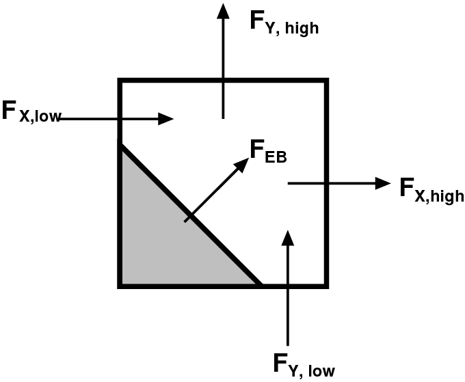

.. role:: cpp(code)
   :language: c++

.. role:: fortran(code)
   :language: fortran

.. _sec:EB:EBOverview:

Overview of Embedded Boundary Description
=========================================

For computations with complex geometries, AMReX provides data structures and
algorithms to employ an embedded boundary (EB) approach to PDE discretizations.
In this approach, the underlying computational mesh is uniform and
block-structured, but the boundary of the irregular-shaped computational domain
conceptually cuts through this mesh. Each cell in the mesh becomes labeled as
regular, cut or covered, and the finite-volume based discretization methods
traditionally used in AMReX applications can be modified to incorporate these
cell shapes. See :numref:`fig::ebexample` for an illustration.

.. raw:: latex

   \begin{center}

.. _fig::ebexample:

.. figure:: ./EB/EB_example.png
   :width: 50.0%

   : In the embedded boundary approach to discretizing PDEs, the (uniform)
   rectangular mesh is cut by the irregular shape of the computational domain.
   The cells in the mesh are label as regular, cut or covered.

.. raw:: latex

   \end{center}

Because this is a relatively simple grid generation technique, computational
meshes for rather complex geometries can be generated quickly and robustly.
However, the technique can produce arbitrarily small cut cells in the domain.
In practice such small cells can have significant impact on the robustness and
stability of traditional finite volume methods. In this chapter we overview a
class of approaches to deal with this “small cell” problem in a robust and
efficient way, and discuss the tools and data that AMReX provides in order to
implement them.

Note that in a completely general implementation of the EB approach, there
would be no restrictions on the shape or complexity of the EB surface.  With
this generality comes the possibility that the process of "cutting" the cells
results in a single :math:`(i,j,k)` cell being broken into multiple cell
fragments.  The current release of AMReX does not support multi-valued cells,
thus there is a practical restriction on the complexity of domains (and
numerical algorithms) supported.

This chapter discusses the EB tools, data structures and algorithms currently
supported by AMReX to enable the construction of discretizations of
conservation law systems. The discussion will focus on general requirements
associated with building fluxes and taking divergences of them to advance such
systems. We also give examples of how to initialize the geometry data
structures and access them to build the numerical difference
operators.  Finally we present EB support of linear solvers.

Finite Volume Discretizations
-----------------------------

Consider a system of PDEs to advance a conserved quantity :math:`U` with fluxes
:math:`F`:

.. math:: \frac{\partial U}{\partial t} + \nabla \cdot F = 0.
  :label: eqn::hypsys

A conservative, finite volume discretization starts with the divergence theorm

.. math:: \int_V \nabla \cdot F dV = \int_{\partial V} F \cdot n dA.

In an embedded boundary cell, the “conservative divergence” is discretized (as
:math:`D^c(F)`) as follows

.. math::
  :label: eqn::ebdiv

   D^c(F) = \frac{1}{\kappa h} \left( \sum^D_{d = 1}
     (F_{d, \mathrm{hi}} \, \alpha_{d, \mathrm{hi}} - F_{d, \mathrm{lo}}\, \alpha_{d, \mathrm{lo}})
     + F^{EB} \alpha^{EB} \right).

Geometry is discretely represented by volumes (:math:`V = \kappa h^d`) and
apertures (:math:`A= \alpha h^{d-1}`), where :math:`h` is the (uniform) mesh
spacing at that AMR level, :math:`\kappa` is the volume fraction and
:math:`\alpha` are the area fractions.  Without multivalued cells the volume
fractions, area fractions and cell and face centroids (see
:numref:`fig::volume`) are the only geometric information needed to compute
second-order fluxes centered at the face centroids, and to infer the
connectivity of the cells.  Cells are connected if adjacent on the Cartesian
mesh, and only via coordinate-aligned faces on the mesh. If an aperture,
:math:`\alpha = 0`, between two cells, they are not directly connected to each
other.

.. raw:: latex

   \begin{center}

.. |a| image:: ./EB/areas_and_volumes.png
       :width: 100%

.. _fig::volume:

.. table:: Illustration of embedded boundary cutting a two-dimensional cell.
   :align: center

   +-----------------------------------------------------+------------------------------------------------------+
   |                        |a|                          |                        |b|                           |
   +-----------------------------------------------------+------------------------------------------------------+
   | | A typical two-dimensional uniform cell that is    | | Fluxes in a cut cell.                              |
   | | cut by the embedded boundary. The grey area       | |                                                    |
   | | represents the region excluded from the           | |                                                    |
   | | calculation. The portion of the cell faces        | |                                                    |
   | | faces (labelled with A) through which fluxes      | |                                                    |
   | | flow are the "uncovered" regions of the full      | |                                                    |
   | | cell faces. The volume (labelled V) is the        | |                                                    |
   | | uncovered region of the interior.                 | |                                                    |
   +-----------------------------------------------------+------------------------------------------------------+

.. raw:: latex

   \end{center}

Small Cells And Stability
-------------------------

In the context of time-explicit advance methods for, say hyperbolic
conservation laws, a naive discretization in time of :eq:`eqn::hypsys` using
:eq:`eqn::ebdiv`,

.. math:: U^{n+1} = U^{n} - \delta t D^c(F)

would have a time step constraint :math:`\delta t \sim h \kappa^{1/D}/V_m`,
which goes to zero as the size of the smallest volume fraction :math:`\kappa`
in the calculation. Since EB volume fractions can be arbitrarily small, this is
an unacceptable constraint. One way to remedy this is to create
“non-conservative” approximation to the divergence :math:`D^{nc}`, which at a
cell :math:`{\bf i}`, can be formed as an average of the conservative
divergences in the neighborhood, :math:`N_{\bf i}`, of :math:`{\bf i}`.

.. math:: D^{nc}(F)_{\bf i}= \frac{\sum_{{\bf j}\in N_{\bf i}}\kappa_{\bf j}D(F)_{\bf j}}{\sum_{{\bf j}\in N_{\bf i}}\kappa_{\bf j}}

Incorporating this form, the solution can be updated using a *hybrid
divergence*, :math:`D^H(F) = \kappa D^c(F) + (1-\kappa)D^{nc}`:

.. math:: U^{n+1,*} = U^n - \delta t D^H(F)

However, we would like our finite-volume scheme to strictly conserve the field
quantities over the domain. To enforce this, we calculate :math:`\delta M`, the
mass gained or lost by not using :math:`D^c` directly,

.. math:: \delta M_{\bf i}= \kappa (1-\kappa)(D^c(F)_{\bf i}- D^{nc}(F)_{\bf i})

This “excess material” (mass, if :math:`U=\rho`) can be *redistributed* in a
time-explicit fashion to neighboring cells, :math:`{\bf j}\in N_{\bf i}`:

.. math:: \delta M_{\bf i}= \sum_{{\bf j}\in N_{\bf i}} \delta M_{{\bf j}, {\bf i}}.

in order to preserve strict conservation over :math:`N_{\bf i}`.

Note that the physics at hand may impact the optimal choice of precisely how
the excess mass is distributed in this fashion. We introduce a weighting for
redistribution, :math:`W`,

.. math::
  :label: eqn::massweight

   \delta M_{{\bf j}, {\bf i}} =  \frac{\delta M_{\bf i}\kappa_{\bf j}
     W_{\bf j}}{\sum_{{\bf k}\in N_{\bf i}} \kappa_{\bf k}W_{\bf k}}

For all :math:`{\bf j}\in N_{\bf i}`,

.. math::

   U^{n+1}_{\bf j}= U^{n+1,*}_{\bf j}+
    \frac{\delta M_{\bf i}
     W_{\bf j}}{\sum_{{\bf k}\in N_{\bf i}} \kappa_{\bf k}W_{\bf k}}.

Typically, the redistribution neighborhood for each cell is one that can be
reached via a monotonic path in each coordinate direction of unit length (see,
e.g., :numref:`fig::redistribution`)

.. raw:: latex

   \begin{center}

.. _fig::redistribution:

.. figure:: ./EB/redist.png
   :width: 50.0%

   : Redistribution illustration. Excess mass due to using a hybrid divergence
   :math:`D^H` instead of the conservative divergence :math:`D^C` is
   distributed to neighbor cells.

.. raw:: latex

   \end{center}

.. _sec:EB:ebinit:

Initializing the Geometric Database
===================================

In AMReX geometric information is stored in a distributed database
class that must be initialized at the start of the calculation. The
procedure for this goes as follows:

- Define an implicit function of position which describes the surface of the 
  embedded object. Specifically, the function class must have a public member function
  that takes a position and returns a negative value if that position is
  inside the fluid, a positive value in the body, and identically zero
  at the embedded boundary.

.. highlight:: c++

::

   Real operator() (const Array<Real,AMREX_SPACEDIM>& p) const;

- Make a :cpp:`EB2::GeometryShop` object using the implicit function. 

- Build an :cpp:`EB2::IndexSpace` with the
  :cpp:`EB2::GeometryShop` object and a :cpp:`Geometry` object that
  contains the information about the domain and the mesh.

Here is a simple example of initialize the database for an embedded sphere.

.. highlight:: c++

::

    Real radius = 0.5;
    Array<Real,AMREX_SPACEDIM> center{0., 0., 0.}; //Center of the sphere
    bool inside = false;  // Is the fluid inside the sphere?
    EB2::SphereIF sphere(radius, center, inside);

    auto shop = EB2::makeShop(sphere);

    Geometry geom(...);
    EB2::Build(shop, geom, 0, 0);

Implicit Function
-----------------

In ``amrex/Src/EB/``, there are a number of predefined implicit
function classes for basic shapes.  One can use these directly or as
template for their own classes.  

- :cpp:`AllRegularIF`:  No embedded boundaries at all.

- :cpp:`BoxIF`: Box.

- :cpp:`CylinderIF`: Cylinder.

- :cpp:`EllipsoidIF`: Ellipsoid.

- :cpp:`PlaneIF`: Half-space plane.

- :cpp:`SphereIF`: Sphere.

AMReX also provides a number of transformation operations to apply to an object.

- :cpp:`makeComplement`: Complement of an object. E.g. a sphere with fluid on outside becomes a sphere with fluid inside. 

- :cpp:`makeIntersection`: Intersection of two or more objects.

- :cpp:`makeUnion`: Union of two or more objects.

- :cpp:`Translate`: Translates an object.

- :cpp:`scale`: Scales an object.

- :cpp:`rotate`: Rotates an object.

- :cpp:`lathe`: Creates a surface of revolution by rotating a 2D object around an axis.

Here are some examples of using these functions.

.. highlight: c++

::

    EB2::SphereIF sphere1(...);
    EB2::SphereIF sphere2(...);
    EB2::BoxIF box(...);
    EB2::CylinderIF cylinder(...);
    EB2::PlaneIF plane(...);

    // union of two spheres
    auto twospheres = EB2::makeUnion(sphere1, sphere2);

    // intersection of a rotated box, a plane and the union of two spheres
    auto box_plane = EB2::makeIntersection(amrex::rotate(box,...),
                                           plane,
                                           twospheres);

    // scale a cylinder by a factor of 2 in x and y directions, and 3 in z-direction.
    auto scylinder = EB2::scale(cylinder, {2., 2., 3.});

:cpp:`EB2::GeometryShop`
------------------------

Given an implicit function object, say :cpp:`f`, we can make a
:cpp:`GeometryShop` object with

.. highlight: c++

::

    auto shop = EB2::makeShop(f);

:cpp:`EB2::IndexSpace`
----------------------

We build :cpp:`EB2::IndexSpace` with a template function

.. highlight: c++

::

    template <typename G>
    void EB2::Build (const G& gshop, const Geometry& geom,
                     int required_coarsening_level,
                     int max_coarsening_level,
                     int ngrow = 4);

Here the template parameter is a :cpp:`EB2::GeometryShop`.
:cpp:`Geometry` (see section :ref:`sec:basics:geom`) describes the
rectangular problem domain and the mesh on the finest AMR level.
Coarse level EB data is generated from coarsening the original fine data.  The
:cpp:`int required_coarsening_level` parameter specifies the number of
coarsening levels required.  This is usually set to :math:`N-1`, where
:math:`N` is the total number of AMR levels.  The :cpp:`int
max_coarsening_levels` parameter specifies the number of coarsening
levels AMReX should try to have.  This is usually set to a big number,
say 20 if multigrid solvers are used.  This essentially tells the build to
coarsen as much as it can.  If there are no multigrid solvers, the
parameter should be set to the same as
:cpp:`required_coarsening_level`.  It should be noted that coarsening could
create multi-valued cells even if the fine level does not have any
multi-valued cells. This occurs when the embedded boundary cuts a cell 
in such a way that there is fluid on multiple sides of the boundary within
that cell.  Because multi-valued cells are not supported, it
will cause a runtime error if the required coarsening level generates
multi-valued cells.  The optional :cpp:`int ngrow` parameter specifies
the number of ghost cells outside the domain on required levels.  For
levels coarser than the required level, no EB data are generated for
ghost cells outside the domain.

The newly built :cpp:`EB2::IndexSpace` is pushed on to a stack.  Static
function :cpp:`EB2::IndexSpace::top()` returns a :cpp:`const &` to the
new :cpp:`EB2::IndexSpace` object.  We usually only need to build one
:cpp:`EB2::IndexSpace` object.  However, if your application needs
multiple :cpp:`EB2::IndexSpace` objects, you can save the pointers for
later use.  For simplicity, we assume there is only one
`EB2::IndexSpace` object for the rest of this chapter.

EBFArrayBoxFactory
==================

After the EB database is initialized, the next thing we build is
:cpp:`EBFArrayBoxFactory`.  This object provides access to the EB
database in the format of basic AMReX objects such as :cpp:`BaseFab`,
:cpp:`FArrayBox`, :cpp:`FabArray`, and :cpp:`MultiFab`.   We can
construct it with

.. highlight: c++

::

    EBFArrayBoxFactory (const Geometry& a_geom,
                        const BoxArray& a_ba,
                        const DistributionMapping& a_dm,
                        const Vector<int>& a_ngrow,
                        EBSupport a_support);

or 

.. highlight: c++

::

    std::unique_ptr<EBFArrayBoxFactory>
    makeEBFabFactory (const Geometry& a_geom,
                      const BoxArray& a_ba,
                      const DistributionMapping& a_dm,
                      const Vector<int>& a_ngrow,
                      EBSupport a_support);

Argument :cpp:`Vector<int> const& a_ngrow` specifies the number of
ghost cells we need for EB data at various :cpp:`EBSupport` levels,
and argument :cpp:`EBSupport a_support` specifies the level of support
needed.

- :cpp:`EBSupport:basic`:  basic flags for cell types
- :cpp:`EBSupport:volume`: basic plus volume fraction and centroid
- :cpp:`EBSupport:full`: volume plus area fraction, boundary centroid
  and face centroid

:cpp:`EBFArrayBoxFactory` is derived from :cpp:`FabFactory<FArrayBox>`.  
:cpp:`MultiFab` constructors have an optional argument :cpp:`const
FabFactory<FArrayBox>&`.  We can use :cpp:`EBFArrayBoxFactory` to
build :cpp:`MultiFab`\ s that carry EB data.  Member function of
:cpp:`FabArray` 

.. highlight: c++

::

    const FabFactory<FAB>& Factory () const;

can then be used to return a reference to the
:cpp:`EBFArrayBoxFactory` used for building the :cpp:`MultiFab`.
Using :cpp:`dynamic_cast`, we can test whether a :cpp:`MultiFab` is
built with an :cpp:`EBFArrayBoxFactory`.

.. highlight: c++

::

    auto factory = dynamic_cast<EBFArrayBoxFactory const*>(&(mf.Factory()));
    if (factory) {
        // this is EBFArrayBoxFactory
    } else {
        // regular FabFactory<FArrayBox>
    }

EB Data
=======

Through member functions of :cpp:`EBFArrayBoxFactory`, we have access
to the following data:

.. highlight: c++

::

    // see section on EBCellFlagFab
    const FabArray<EBCellFlagFab>& getMultiEBCellFlagFab () const;

    // volume fraction
    const MultiFab& getVolFrac () const;

    // volume centroid
    const MultiCutFab& getCentroid () const;

    // embedded boundary centroid
    const MultiCutFab& getBndryCent () const;

    // area fractions
    Array<const MultiCutFab*,AMREX_SPACEDIM> getAreaFrac () const;

    // face centroid
    Array<const MultiCutFab*,AMREX_SPACEDIM> getFaceCent () const;

Volume fraction is in a single-component :cpp:`MultiFab`, and it is
zero for covered cells, one for regular cells, and in between for cut
cells.  Centroid is in a :cpp:`MultiCutFab` with ``AMREX_SPACEDIM``
components with each component of the data is in the range of
:math:`[-0.5,0.5]`. The centroid is based on each cell's local
coordinates with respect to the embedded boundary.  
A :cpp:`MultiCutFab` is very similar to a
:cpp:`MultiFab`.  Its data can be accessed with subscript operator

.. highlight: c++

::

    const CutFab& operator[] (const MFIter& mfi) const;

Here :cpp:`CutFab` is derived from :cpp:`FArrayBox` and can be passed
to Fortran just like :cpp:`FArrayBox`.  The difference between
:cpp:`MultiCutFab` and :cpp:`MultiFab` is that to save memory
:cpp:`MultiCutFab` only has data on boxes that contain cut cells.  It
is an error to call :cpp:`operator[]` if that box does not have cut
cells.  Thus the call must be in a :cpp:`if` test block (see section
:ref:`sec:EB:flag`).  Boundary centroid is also a :cpp:`MultiCutFab`
with ``AMREX_SPACEDIM`` components, and it uses each cell's local
coordinates.  Area fractions and face centroids are returned in
:cpp:`Array` of :cpp:`MultiCutFab` pointers.  For each direction, area
fraction is for the face of that direction.  As for face centroids,
there are two components for each direction and the ordering is always
the same as the original ordering of the coordinates.  For example,
for :math:`y` face, the component 0 is for :math:`x` coordinate and 1
for :math:`z`.  The coordinates are in each face's local frame
normalized to the range of :math:`[-0.5,0.5]`.

.. _sec:EB:flag:

:cpp:`EBCellFlagFab`
--------------------

:cpp:`EBCellFlagFab` contains information on cell types.  We can use
it to determine if a box contains cut cells.

.. highlight: c++

::

    auto const& flags = factory->getMultiEBCellFlagFab();
    MultiCutFab const& centroid = factory->getCentroid();
    
    for (MFIter mfi ...) {
        const Box& bx = mfi.tilebox();
        FabType t = flags[mfi].getType(bx);
        if (FabType::regular == t) {
            // This box is regular
        } else if (FabType::covered == t) {
            // This box is covered
        } else if (FabType::singlevalued == t) {
            // This box has cut cells
            // Getting cutfab is safe
            const auto& centroid_fab = centroid[mfi];
        }
    }

:cpp:`EBCellFlagFab` is derived from :cpp:`BaseFab`.  Its data are
stored in an array of 32-bit integers, and can be used in C++ or
passed to Fortran just like an :cpp:`IArrayBox` (section
:ref:`sec:basics:fab`).  AMReX provides a Fortran module called
``amrex_ebcellflag_module``. This module contains procedures for testing cell types
and getting neighbor information.  For example

.. highlight:: fortran

::

    use amrex_ebcellflag_module, only : is_regular_cell, is_single_valued_cell, is_covered_cell

    integer, intent(in) :: flags(...)

    integer :: i,j,k

    do k = ...
    do j = ...
    do i = ...
       if (is_covered_cell(flags(i,j,k))) then
           ! this is a completely covered cells
       else if (is_regular_cell(flags(i,j,k))) then
           ! this is a regular cell
       else if (is_single_valued_cell(flags(i,j,k))) then
           ! this is a cut cell
       end if
    end do     
    end do     
    end do     

.. _sec:EB:LevelSet:

Level Sets
==========

In order to speed up direct interactions with embedded boundaries, AMReX also
provides a way to construct level-sets representing the signed distance function
from the closest EB surface. In our implementation, the level-set data is stored
as a 1-component nodal :cpp:`MultiFab` (cf. :ref:`sec:basics:multifab`) where
each node stores its closest distance to the EB. The subroutine
:fortran:`amrex_eb_interp_levelset` (in `/Scr/EB/AMREX_EB_levelset_F.F90`)
interpolates the level-set :math:`\phi(\mathbf{r})` to any position
:math:`\mathbf{r}` from the pre-computed level-set :cpp:`MultiFab`. Likewise the
subroutine :fortran:`amrex_eb_normal_levelset` interpolated the normal
:math:`\mathbf{\hat{n}}(\mathbf{r})` at any position from the derivative of the
level-set function :math:`\mathbf{\hat{n}}(\mathbf{r}) = \nabla
\phi(\mathrm{r})`. **Note** that since the normal is computed by taking the
derivative of the interpolation function, it is discontinuous at positions
corresponding to the nodal points of the level-set :cpp:`MultiFab` (i.e.
:math:`\mathbf{r} = (i, j, k) \cdot h`).

AMReX provides collection of functions and subroutines to fill single and
multi-level level-set data. For convenience, the :cpp:`amrex::LSFactory` helps
manage the level-set data for a single AMR level. And :cpp:`amrex::LSCore`
manages multi-level level-set data. These are described in further detail below.

A Note on Filling Level-Sets from :cpp:`EBFArrayBoxFactory`
-----------------------------------------------------------

The data stored in a :cpp:`EBFArrayBoxFactory`, represents the embedded boundary
as a discrete collection of volume fraction, and area fractions over a grid.
Here this is further simplified by thinking of the EB as a collection of planar
facets. This means that for any given node in a grid, the nearest EB facet might
be in another grid. Hence if the :cpp:`EBFArrayBoxFactory` has :cpp:`n_pad`
ghost cells, then for any given grid, there could be EB facets that are
:cpp:`n_pad + 1` cells away, and we would *not* "see". In other words, if the
:cpp:`EBFArrayBoxFactory` is defined on a grid with spacing :math:`h`, then, and
we do not have any EB facets in the current grid, then any node within that grid
is *at least* :math:`(\mathrm{n_{pad}}+1)h` away from the nearest EB surface.

Hence, when filling a level-set, it will "max-out" at
:math:`\pm(\mathrm{n_{pad}}+1)h`. Hence it is recommended to think of this kind
of level-set function as the point being "at least" :math:`\phi(\mathbf{r})`
from the EB surface.

.. _fig::local_levelset:

.. figure:: ./EB/loc_ls_ex.png
   :width: 50.0%

   : Example of a "local" level-set representing a cylinder. The level-set
   function is a (linear) signed distance function near the EB-surface, and it
   plateaus further away from it.

Figure :numref:`fig::local_levelset` shows an example of such a local level-set
description. Only cells that are within :math:`\pm(\mathrm{n_{pad}}+1)h` of the
EB surface are filled with a level-set. The rest is filled with lower (upper)
bound. If the goal is capture interactions between the EB surface and a point
somewhere else, this approach usually suffices as we only need to know if we are
"far enough" from the EB in most applications.

Since finding the closest distance between a point and an arbitrary surface is
computationally expensive, we advice that :cpp:`n_pad` is chosen as the smallest
necessary number for the application.

Filling Level-Sets without :cpp:`LSFactory`
-------------------------------------------

The static function :cpp:`amrex::LSFactory::fill_data` (defined in
`Src/EB/AMReX_EB_levelset.cpp`) fills a :cpp:`MultiFab` with the nodal level-set
values and another :cpp:`iMultiFab` with integer tags that are 1 whenever a node
is near the EB surface. It is then left up to the application to manage the
level-set :cpp:`MultiFab`.

AMReX defines its embedded surfaces using implicit functions (see above).
Normally these implicit functions are usually *not* signed distance functions
(i.e. their value at :math:`\mathbf{r}` is not the minimal distance to the EB
surface). However, in rare cases such as the :cpp:`EB2::PlaneIF`, it is. In this
case, the most straight-forward way to fill a level-set. If an signed-distance
implicit function is know, and stored as a :cpp:`MultiFab mf_impfunc`, then we
can use

.. highlight:: c++

::

   static void fill_data (MultiFab & data, iMultiFab & valid,
                          const MultiFab & mf_impfunc,
                          int eb_pad, const Geometry & eb_geom);

so then the function call

.. highlight:: c++

::

   // Fill implicit function
   GShopLSFactory<EB2::CylinderIF> cylinder_lsgs(cylinder_ghsop, geom, ba, dm, 0);
   std::unique_ptr<MultiFab> cylinder_mf_impfunc = cylinder_lsgs.fill_impfunc();

   
   MultiFab ls_grid(ba, dm, 1, 0);
   iMultiFab ls_valid(ba, dm, 1, 0);
   amrex::LSFactory::fill_data(ls_grid, ls_valid, mf_impfunc, 2, geom_eb);

fills a :cpp:`MultiFab ls_grid` with level-set data given the implicit function
stored in the :cpp:`MultiFab mf_impfunc`, and a threshold of
:cpp:`2*geom_eb.CellSize()`. The helper class :cpp:`GShopLSFactory` converts EB2
implicit functions to :cpp:`MultiFabs` (defined in
`Src/EB/AMReX_EB_levelset.H`).

The much more interesting application of :cpp:`amrex::LSFactory::fill_data` is filling a level-set given a :cpp:`EBFArrayBoxFactory`:

.. highlight:: c++

::

   static void fill_data (MultiFab & data, iMultiFab & valid,
                          const EBFArrayBoxFactory & eb_factory,
                          const MultiFab & eb_impfunc,
                          const IntVect & ebt_size, int ls_ref, int eb_ref,
                          const Geometry & geom, const Geometry & geom_eb);

which fills the :cpp:`MultiFab data` with level-set data from the
:cpp:`EBFArrayBoxFactory eb_factory`. Here the user must still supply the EB
implicit function using the :cpp:`MultiFab eb_impfunc`, as this is used to
determine the inside/outside when no EB facets can be found, or in special
edge-cases. The user also needs to specify the tile size (:cpp:`IntVect
ebt_size`), the level-set and EB refinement (i.e. the grid over which `data` is
defined is refined by a factor of :cpp:`ls_ref/eb_ref` compared to the
:cpp:`eb_factory` 's grid), and the Geometries :cpp:`geom` and :cpp:`geom_eb`
corresponding to the grids of :cpp:`data` and :cpp:`eb_factory` respectively.

When filling :cpp:`data`, a tile-size of `ebt_size` is used. Only EB facets
within a tile (plus the :cpp:`eb_factory` 's ghost cells) are considered. Hence,
chosing an appropriately small :cpp:`ebt_size` can significantly increase
performance.

Hence the following fills a level-set with a cylinder EB (like that shown in
Fig. :numref:`fig::local_levelset`).

.. highlight:: c++

::

   // Define nGrow of level-set and EB
   int ls_pad = 1;
   int eb_pad = 2;

   // Define EB
   EB2::CylinderIF cylinder(radius, centre, true);
   EB2::GeometryShop<EB2::CylinderIF> cylinder_gshop(cylinder);
   
   // Build EB
   EB2::Build(cylinder_gshop, geom, max_level, max_level);
   const EB2::IndexSpace & cylinder_ebis = EB2::IndexSpace::top();
   const EB2::Level &      cylinder_lev  = cylinder_ebis.getLevel(geom);

   // Build EB factory
   EBFArrayBoxFactory eb_factory(cylinder_lev, geom, ba, dm, {eb_pad, eb_pad, eb_pad});

   // Fill implicit function
   GShopLSFactory<EB2::CylinderIF> cylinder_lsgs(cylinder_ghsop, geom, ba, dm, ls_pad);
   std::unique_ptr<MultiFab> cylinder_mf_impfunc = cylinder_lsgs.fill_impfunc();

   // Fill level-set
   MultiFab ls_grid(ba, dm, 1, ls_pad);
   iMultiFab ls_valid(ba, dm, 1, ls_pad);
   LSFactory::fill_data(ls_grid, ls_valid, eb_factory, * cylinder_mf_impfunc,
                        ebt_size, 1, 1, geom, geom);

Note that in theory the :cpp:`EBFArrayBoxFactory eb_factory` could be defined on
a different resolution as the the :cpp:`BoxArray ba`. In this case, the
appropriate refinements and geometries must be specified. Also note that the
thresholding behaviour (due to :cpp:`eb_pad`, is specified via the
:cpp:`EBFArrayBoxFactory` constructor. The implicit function MultiFab needs to
have the same grids as `data`.

Since this relies on the interplay of many different parameters, a number of
utility functions and helper classes have been created. These are discussed in
the subsequent section.

Using :cpp:`LSFactory`
----------------------

In the previous section, we've seen that the level-set and EB grids can exist on
different levels of refinement. The practical reason behind this is that
sometimes we want to capture interactions that are very sensitive close to EBs,
but this can sometimes be difficult to keep track off. Hence the
:cpp:`LSFactory` can be helpful int taking care of all of these parameters.

The basic principle of the :cpp:`LSFactory` (defined in
`Src/EB/AMReX_EB_levelset.H`) is that it is created relative to some reference
:cpp:`BoxArray ba`, :cpp:`Geometry geom`, and :cpp:`DistributionMapping dm`. The
user then specifies refinement factors :cpp:`ls_ref` of the level-set data and
:cpp:`eb_ref` of the EB grid. Calling the constructor:

.. highlight:: c++

::

   LSFactory(int lev, int ls_ref, int eb_ref, int ls_pad, int eb_pad,
             const BoxArray & ba, const Geometry & geom, const DistributionMapping & dm,
             int eb_tile_size = 32);

Then creates all appropriate grids and geometries. Note that we can also specify
the tile size used in the `LSFactory::fill_data` function.

When a :cpp:`LSFacotry` is first created, it is set to :fortran:`huge(amrex_real)`. Ie. there are no surfaces, and so the level-set value is effectively infinite. It can then be filled just like in the previous section:

.. highlight:: c++

::

   // Define refinement of level-set and EB
   int ls_ref = 4;
   int eb_ref = 1;

   // Define nGrow of level-set and EB
   int ls_pad = 1;
   int eb_pad = 2;

   // Define EB
   EB2::CylinderIF cylinder(radius, centre, true);
   EB2::GeometryShop<EB2::CylinderIF> cylinder_gshop(cylinder);

   // Build level-set factory
   LSFactory level_set(0, ls_ref, eb_ref, ls_pad, eb_pad, ba, geom, dm);

   // Build EB
   const Geometry & eb_geom = level_set.get_eb_geom()
   EB2::Build(cylinder_gshop, eb_geom, max_level, max_level);

   const EB2::IndexSpace & cylinder_ebis = EB2::IndexSpace::top();
   const EB2::Level &      cylinder_lev  = cylinder_ebis.getLevel(eb_geom);

   // Build EB factory
   EBFArrayBoxFactory eb_factory(cylinder_lev, eb_geom, level_set.get_eb_ba(), dm,
                                 {level_set.get_eb_pad(), level_set.get_eb_pad(),
                                  level_set.get_eb_pad()});

   // Fill level-set (factory)
   GShopLSFactory<EB2::CylinderIF> cylinder_lsgs(cylinder_ghsop, level_set);
   std::unique_ptr<MultiFab> cylinder_mf_impfunc = cylinder_lsgs.fill_impfunc();
   level_set.Fill(eb_factory, * cylinder_mf_impfunc);

where the level-set data can now be accessed using:

.. highlight:: c++

::

   const MultiFab * level_set_data = level_set.get_data();

or alternatively a copy of the data can be generated using:

.. highlight:: c++

::

   std::unique_ptr<MultiFab> level_set_data = level_set.copy_data();

Both of the data above are on grids what have been refined by :cpp:`ls_ref`
(with respect to the :cpp:`BoxArray ba`). In order to get a copy of the
level-set data at the coarseness of the original grids, use:

.. highlight:: c++

::

   std::unique_ptr<MultiFab> level_set_data_crse = level_set.coarsen_data();

.. Using :cpp:`LSCore`
.. -------------------

.. Utility Functions
.. -----------------

Linear Solvers
==============

Linear solvers for the canonical form (equation :eq:`eqn::abeclap`)
have been discussed in chapter :ref:`Chap:LinearSolvers`.  Currently,
AMReX supports cell-centered solver with homogeneous Neumann boundary
condition on the EB. A cell-centered solver with Dirichlet boundary
condition on the EB and a nodal solver are under development.

To use cell-centered solver for EB, one builds linear operator
:cpp:`MLEBABecLap` with :cpp:`EBFArrayBoxFactory`.

.. highlight:: c++

::

    MLEBABecLap (const Vector<Geometry>& a_geom,
                 const Vector<BoxArray>& a_grids,
                 const Vector<DistributionMapping>& a_dmap,
                 const LPInfo& a_info,
                 const Vector<EBFArrayBoxFactory const*>& a_factory);

The usage of this EB specified class is essentially the same as
:cpp:`MLABecLaplacian`.

Tutorials
=========

``amrex/Tutorials/EB/CNS`` is an AMR code for solving compressible
Navier-Stokes equations with the embedded boundary approach.

