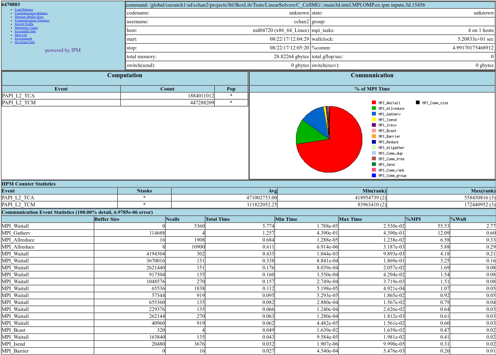
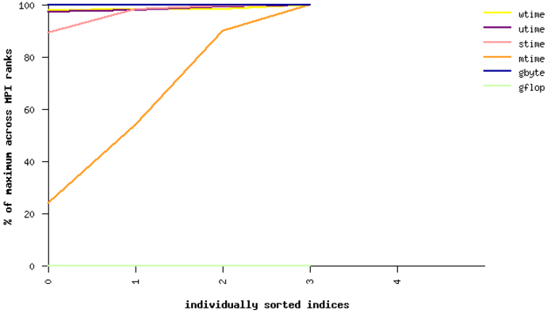
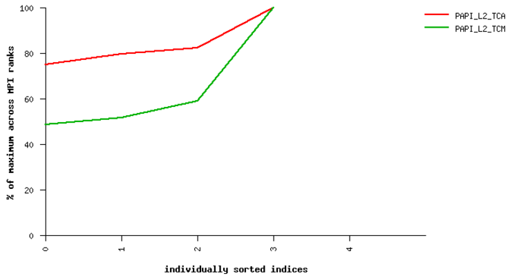
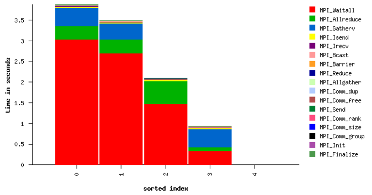
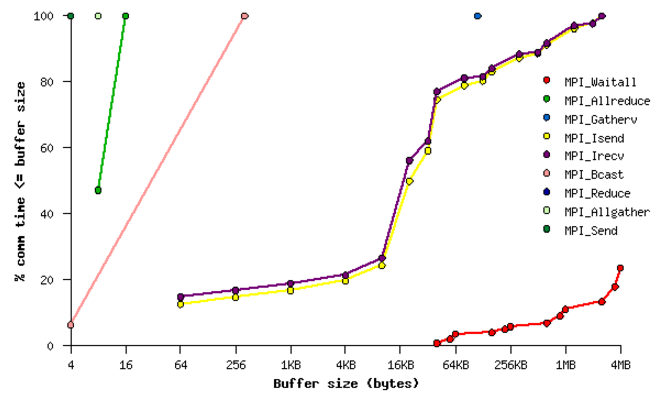
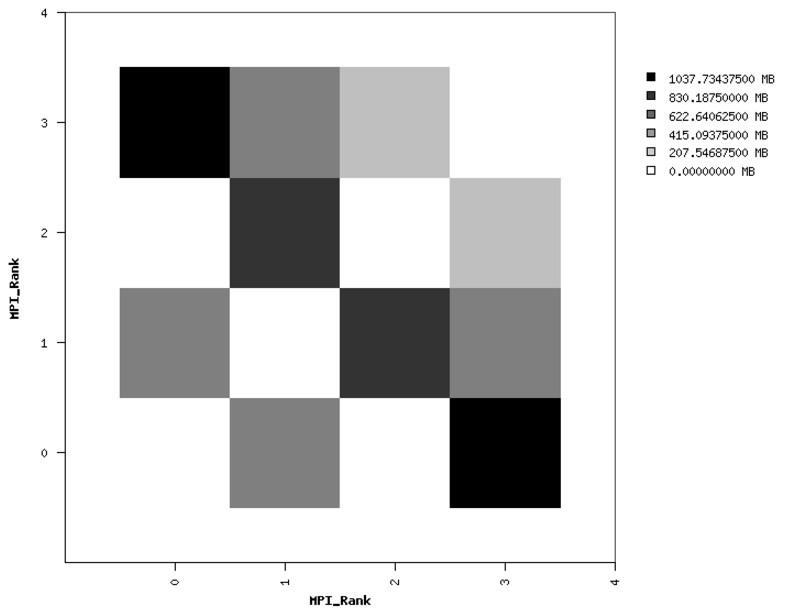

.. role:: cpp(code)
   :language: c++

.. role:: fortran(code)
   :language: fortran

CrayPat
=======

The profiling suite available on Cray XC systems is Cray Performance
Measurement and Analysis Tools (“CrayPat”) [1]_.  Most CrayPat functionality is
supported for all compilers available in the Cray “programming environments“
(modules which begin “``PrgEnv-``”); however, a few features, chiefly the
“Reveal” tool, are supported only on applications compiled with Cray’s compiler
CCE [2]_ [3]_.

CrayPat supports both high-level profiling tools, as well as fine-grained
performance analysis, such as reading hardware counters. The default behavior
uses sampling to identify the most time-consuming functions in an application.

High-level application profiling
--------------------------------

The simplest way to obtain a high-level overview of an application’s
performance consists of the following steps:

#. Load the ``perftools-base`` module, then the ``perftools-lite`` module. (The
   modules will not work if loaded in the opposite order.)

#. Compile the application with the Cray compiler wrappers ``cc``, ``CC``,
   and/or ``ftn``. This works with any of the compilers available in the
   ``PrgEnv-`` modules. E.g., on the Cori system at NERSC, one can use the
   Intel, GCC, or CCE compilers. No extra compiler flags are necessary in order
   for CrayPat to work. CrayPat instruments the application, so the
   ``perftools-`` modules must be loaded before one compiles the application.

#. Run the application as normal. No special flags are required. Upon
   application completion, CrayPat will write a few files to the directory from
   which the application was launched. The profiling database is a single file
   with the ``.ap2`` suffix.

#. One can query the database in many different ways using the ``pat_report``
   command on the ``.ap2`` file. ``pat_report`` is available on login nodes, so
   the analysis need not be done on a compute node.  Querying the database with
   no arguments to ``pat_report`` prints several different profiling reports to
   STDOUT, including a list of the most time-consuming regions in the
   application. The output of this command can be long, so it can be convenient
   to pipe the output to a pager or a file. A portion of the output from
   ``pat_report <file>.ap2`` is shown below:

   ::

       Table 1:  Profile by Function

         Samp% |    Samp |  Imb. |  Imb. | Group
               |         |  Samp | Samp% |  Function
               |         |       |       |   PE=HIDE

        100.0% | 5,235.5 |    -- |    -- | Total
       |-----------------------------------------------------------------------------
       |  50.2% | 2,628.5 |    -- |    -- | USER
       ||----------------------------------------------------------------------------
       ||   7.3% |   383.0 |  15.0 |  5.0% | eos_module_mp_iterate_ne_
       ||   5.7% |   300.8 | 138.2 | 42.0% | amrex_deposit_cic
       ||   5.1% |   265.2 |  79.8 | 30.8% | update_dm_particles
       ||   2.8% |   147.2 |   5.8 |  5.0% | fort_fab_setval
       ||   2.6% |   137.2 |  48.8 | 34.9% | amrex::ParticleContainer<>::Where
       ||   2.6% |   137.0 |  11.0 |  9.9% | ppm_module_mp_ppm_type1_
       ||   2.5% |   133.0 |  24.0 | 20.4% | eos_module_mp_nyx_eos_t_given_re_
       ||   2.1% |   107.8 |  33.2 | 31.4% | amrex::ParticleContainer<>::IncrementWithTotal
       ||   1.7% |    89.2 |  19.8 | 24.2% | f_rhs_
       ||   1.4% |    74.0 |   7.0 | 11.5% | riemannus_
       ||   1.1% |    56.0 |   2.0 |  4.6% | amrex::VisMF::Write
       ||   1.0% |    50.5 |   1.5 |  3.8% | amrex::VisMF::Header::CalculateMinMax
       ||============================================================================
       |  28.1% | 1,471.0 |    -- |    -- | ETC
       ||----------------------------------------------------------------------------
       ||   7.4% |   388.8 |  10.2 |  3.4% | __intel_mic_avx512f_memcpy
       ||   6.9% |   362.5 |  45.5 | 14.9% | CVode
       ||   3.1% |   164.5 |   8.5 |  6.6% | __libm_log10_l9
       ||   2.9% |   149.8 |  29.2 | 21.8% | _INTERNAL_25_______src_kmp_barrier_cpp_5de9139b::__kmp_hyper_barrier_gather
       ||============================================================================
       |  16.8% |   879.8 |    -- |    -- | MPI
       ||----------------------------------------------------------------------------
       ||   5.1% |   266.0 | 123.0 | 42.2% | MPI_Allreduce
       ||   4.2% |   218.2 | 104.8 | 43.2% | MPI_Waitall
       ||   2.9% |   151.8 |  78.2 | 45.4% | MPI_Bcast
       ||   2.6% |   135.0 |  98.0 | 56.1% | MPI_Barrier
       ||   2.0% |   105.8 |   5.2 |  6.3% | MPI_Recv
       ||============================================================================
       |   1.9% |    98.2 |    -- |    -- | IO
       ||----------------------------------------------------------------------------
       ||   1.8% |    93.8 |   6.2 |  8.3% | read
       ||============================================================================

IPM - Cross-Platform Integrated Performance Monitoring
======================================================

IPM provides portable profiling capabilities across HPC platforms, including
support on selected Cray and IBM machines (cori and (TODO: verify it works on)
summit). Running an IPM instrumented binary generates a summary of number of
calls and time spent on MPI communication library functions. In addition,
hardware performance counters can also be collected through PAPI.

Detailed instructions can be found at  [4]_ and [5]_.

Building with IPM on cori
-------------------------

Steps:

#. Run module load ipm.

#. Build code as normal with make.

#. Re-run the link command (e.g. cut-and-paste) with ``$IPM`` added to the end of the line.

Running with IPM on cori
------------------------

#. Set environment variables: ``export IPM_REPORT=full IPM_LOG=full IPM_LOGDIR= <dir>``

#. Results will be printed to stdout and an xml file generated in the directory specified by ``IPM_LOGDIR``.

#. Post-process the xml with ``ipm_parse -html <xmlfile>``, which produces an directory with html.

Summary MPI Profile
-------------------

Example MPI profile output:

.. highlight:: console

::

    ##IPMv2.0.5########################################################
    #
    # command   : /global/cscratch1/sd/cchan2/projects/lbl/BoxLib/Tests/LinearSolvers/C_CellMG/./main3d.intel.MPI.OMP.ex.ipm inputs.3d.25600 
    # start     : Tue Aug 15 17:34:23 2017   host      : nid11311        
    # stop      : Tue Aug 15 17:34:35 2017   wallclock : 11.54
    # mpi_tasks : 128 on 32 nodes            %comm     : 32.51
    # mem [GB]  : 126.47                     gflop/sec : 0.00
    #
    #           :       [total]        <avg>          min          max
    # wallclock :       1188.42         9.28         8.73        11.54 
    # MPI       :        386.31         3.02         2.51         4.78 
    # %wall     :
    #   MPI     :                      32.52        24.36        41.44 
    # #calls    :
    #   MPI     :       5031172        39306        23067        57189
    # mem [GB]  :        126.47         0.99         0.98         1.00 
    #
    #                             [time]        [count]        <%wall>
    # MPI_Allreduce               225.72         567552          18.99
    # MPI_Waitall                  92.84         397056           7.81
    # MPI_Recv                     29.36            193           2.47
    # MPI_Isend                    25.04        2031810           2.11
    # MPI_Irecv                     4.35        2031810           0.37
    # MPI_Allgather                 2.60            128           0.22
    # MPI_Barrier                   2.24            512           0.19
    # MPI_Gatherv                   1.70            128           0.14
    # MPI_Comm_dup                  1.23            256           0.10
    # MPI_Bcast                     1.14            256           0.10
    # MPI_Send                      0.06            319           0.01
    # MPI_Reduce                    0.02            128           0.00
    # MPI_Comm_free                 0.01            128           0.00
    # MPI_Comm_group                0.00            128           0.00
    # MPI_Comm_size                 0.00            256           0.00
    # MPI_Comm_rank                 0.00            256           0.00
    # MPI_Init                      0.00            128           0.00
    # MPI_Finalize                  0.00            128           0.00

The total, average, minimum, and maximum wallclock and MPI times across ranks
is shown.  The memory footprint is also collected.  Finally, results include
number of calls and total time spent in each type of MPI call.

PAPI Performance Counters
-------------------------

To collect performance counters, set ``IPM_HPM=<list>``, where the list is a
comma-separated list of PAPI counters. For example: ``export
IPM_HPM=PAPI_L2_TCA,PAPI_L2_TCM``.

For reference, here is the list of available counters on cori, which can be
found by running ``papi_avail``:

.. highlight:: console

::

        Name        Code    Avail Deriv Description (Note)
    PAPI_L1_DCM  0x80000000  Yes   No   Level 1 data cache misses
    PAPI_L1_ICM  0x80000001  Yes   No   Level 1 instruction cache misses
    PAPI_L1_TCM  0x80000006  Yes   Yes  Level 1 cache misses
    PAPI_L2_TCM  0x80000007  Yes   No   Level 2 cache misses
    PAPI_TLB_DM  0x80000014  Yes   No   Data translation lookaside buffer misses
    PAPI_L1_LDM  0x80000017  Yes   No   Level 1 load misses
    PAPI_L2_LDM  0x80000019  Yes   No   Level 2 load misses
    PAPI_STL_ICY 0x80000025  Yes   No   Cycles with no instruction issue
    PAPI_BR_UCN  0x8000002a  Yes   Yes  Unconditional branch instructions
    PAPI_BR_CN   0x8000002b  Yes   No   Conditional branch instructions
    PAPI_BR_TKN  0x8000002c  Yes   No   Conditional branch instructions taken
    PAPI_BR_NTK  0x8000002d  Yes   Yes  Conditional branch instructions not taken
    PAPI_BR_MSP  0x8000002e  Yes   No   Conditional branch instructions mispredicted
    PAPI_TOT_INS 0x80000032  Yes   No   Instructions completed
    PAPI_LD_INS  0x80000035  Yes   No   Load instructions
    PAPI_SR_INS  0x80000036  Yes   No   Store instructions
    PAPI_BR_INS  0x80000037  Yes   No   Branch instructions
    PAPI_RES_STL 0x80000039  Yes   No   Cycles stalled on any resource
    PAPI_TOT_CYC 0x8000003b  Yes   No   Total cycles
    PAPI_LST_INS 0x8000003c  Yes   Yes  Load/store instructions completed
    PAPI_L1_DCA  0x80000040  Yes   Yes  Level 1 data cache accesses
    PAPI_L1_ICH  0x80000049  Yes   No   Level 1 instruction cache hits
    PAPI_L1_ICA  0x8000004c  Yes   No   Level 1 instruction cache accesses
    PAPI_L2_TCH  0x80000056  Yes   Yes  Level 2 total cache hits
    PAPI_L2_TCA  0x80000059  Yes   No   Level 2 total cache accesses
    PAPI_REF_CYC 0x8000006b  Yes   No   Reference clock cycles

Due to hardware limitations, there is a limit to which counters can be
collected simultaneously in a single run. Some counters may map to the same
registers and thus cannot be collected at the same time.

Example HTML Performance Summary
--------------------------------

Running ``ipm_parse -html <xmlfile>`` on the generated xml file will produce an
HTML document that includes summary performance numbers and automatically
generated figures. Some examples are shown here.

   Sample performance summary generated by IPM

.. _fig:Timings:

.. table:: Example of performance graphs generated by IPM
   :align: center
   
   +-----------------------------------------------------+------------------------------------------------------+
   |                        |a|                          |                        |b|                           |
   +-----------------------------------------------------+------------------------------------------------------+
   | | Timings                                           | | PAPI Counters                                      |
   +-----------------------------------------------------+------------------------------------------------------+
   |                        |c|                          |                        |d|                           |
   +-----------------------------------------------------+------------------------------------------------------+
   | | MPI Time by Function                              | | MPI Time by Message Size                           |
   +-----------------------------------------------------+------------------------------------------------------+
   |                        |e|                          | | (left) Point-to-Point Communication Volume         |
   +-----------------------------------------------------+------------------------------------------------------+

.. [1]
   https://pubs.cray.com/content/S-2376/6.4.6/cray-performance-measurement-and-analysis-tools-user-guide-646-s-2376

.. [2]
   https://pubs.cray.com/content/S-2179/8.5/cray-c-and-c++-reference-manual-85

.. [3]
   https://pubs.cray.com/content/S-3901/8.5/cray-fortran-reference-manual-85

.. [4]
   http://ipm-hpc.sourceforge.net/userguide.html

.. [5]
   https://www.nersc.gov/users/software/performance-and-debugging-tools/ipm/
