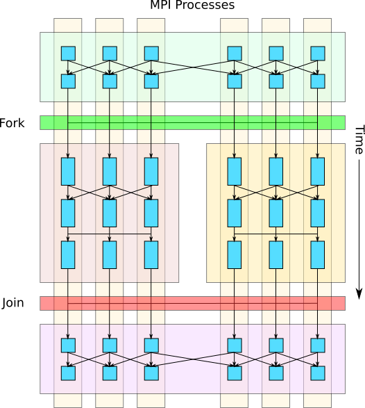

.. role:: cpp(code)
   :language: c++

.. role:: fortran(code)
   :language: fortran

Fork-Join
=========

An AMReX program consists of a set of MPI ranks cooperating together on
distributed data.
Typically, all of the ranks in a job compute in a bulk-synchronous,
data-parallel fashion, where every rank does the same sequence of
operations, each on different parts of the distributed data.

The AMReX Fork-Join functionality described here allows the user to divide the
job's MPI ranks into subgroups (i.e. `fork`) and assign each subgroup
an independent task to compute in parallel with each other.
After all of the forked child tasks complete, they synchronize
(i.e. `join`), and the parent task continues execution as before.

   Example of a fork-join operation where the parent task's MPI processes (ranks) are
   split into two independent child tasks that execute in parallel and
   then join to resume execution of the parent task.

The Fork-Join operation can also be invoked in a nested fashion,
creating a hierarchy of fork-join operations, where each fork further
subdivides the ranks of a task into child tasks.
This approach enables heterogeneous computation and reduces the strong
scaling penalty for operations with less inherent parallelism or with
large communication overheads.

   Example of nested fork-join operations where a child task is further
   split into more subtasks.

The fork-join operation is accomplished by:

  a) redistributing MultiFab data so that **all** of the data in each
     registered MultiFab is visible to ranks within a subtask, and

  b) dividing the root MPI communicator into sub-communicators so that
     each subgroup of ranks in a tasks will only synchronize with each
     other during subtask collectives (e.g. for ``MPI_Allreduce``).

When the program starts, all of the ranks in the MPI communicator are
in the root task.

