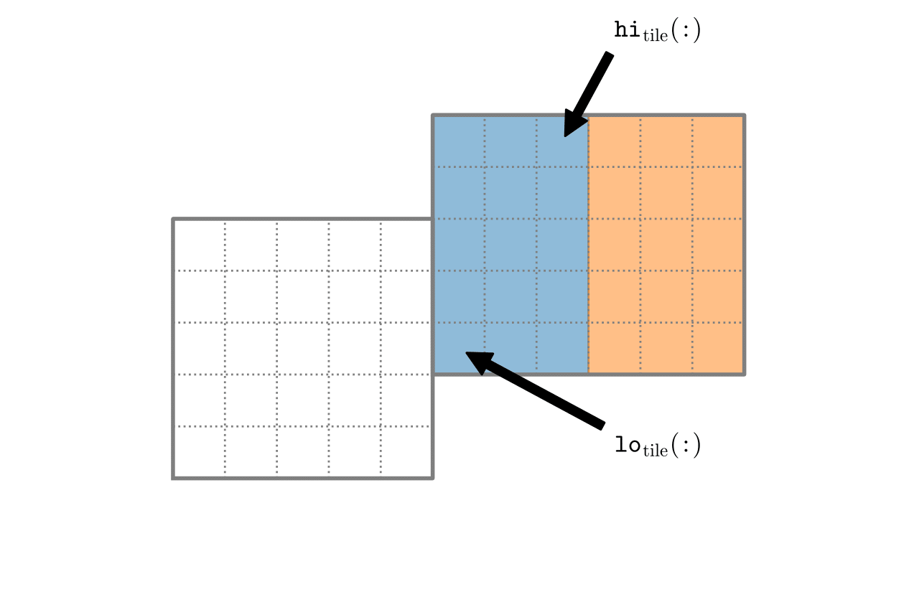
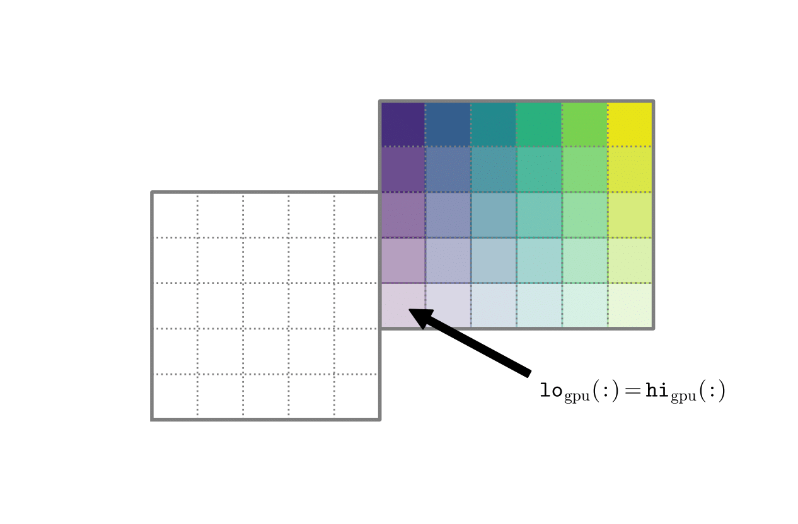
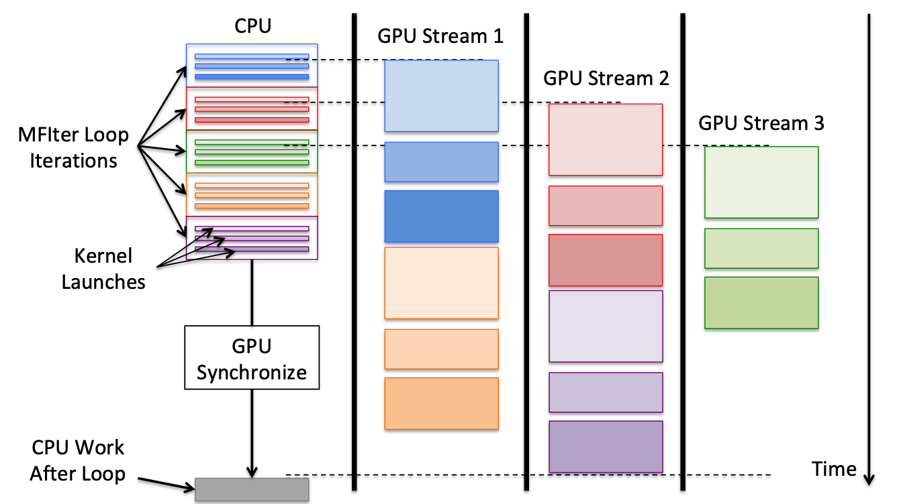

.. role:: cpp(code)
   :language: c++

.. role:: fortran(code)
   :language: fortran

.. _sec:gpu:overview:

Overview of AMReX GPU Strategy
==============================

AMReX's GPU strategy focuses on providing performant GPU support
with minimal changes and maximum flexibility.  This allows 
application teams to get running on GPUs quickly while allowing
long term perfomance tuning and programming model selection.  AMReX
uses CUDA for GPUs, but application teams can use CUDA, CUDA 
Fortran, OpenACC or OpenMP in their individual codes.

When running AMReX on a CPU system, the parallelization strategy is a
combination of MPI and OpenMP using tiling, as detailed in
:ref:`sec:basics:mfiter:tiling`. However, tiling is ineffective on GPUs
due to the overhead associated with kernel launching.  Instead, 
efficient use of the GPU's resources is the primary concern.  Improving
resource efficiency allows a larger percentage of GPU threads to work
simultaneously, increasing effective parallelism and decrease the time
to solution. 

When running on CPUs, AMReX uses an ``MPI+X`` strategy where the ``X``
threads are used to perform parallelization techniques like tiling.
The most common ``X`` is ``OpenMP``.  On GPUs, AMReX requires CUDA and
can be further combined with other parallel GPU languages, including
``OpenACC`` and ``OpenMP``, to control the offloading of subroutines
to the GPU.  This ``MPI+CUDA+X`` GPU strategy has been developed
to give users the maximum flexibility to find the best combination of
portability, readability and performance for their applications. 

Presented here is an overview of important features of AMReX's GPU strategy.
Additional information that is required for creating GPU applications is
detailed throughout the rest of this chapter: 

- Each MPI rank offloads its work to a single GPU. ``(MPI ranks == Number of GPUs)`` 

- Calculations that can be offloaded efficiently to GPUs use CUDA threads
  to parallelize over a valid box at a time.  This is done by using a lot
  of CUDA threads that only work on a few cells each. This work
  distribution is illustrated in :numref:`fig:gpu:threads`.
  (Note: OpenMP is currently incompatible with AMReX builds using CUDA.
  This feature is under development, although most applications will 
  have no need for this feature when initially converting to GPUs.)

.. _fig:gpu:threads:

.. table:: Comparison of OpenMP and CUDA work distribution. Pictures provided by Mike Zingale and the CASTRO team.

   +-----------------------------------------------------+------------------------------------------------------+
   |                        |a|                          |                        |b|                           |
   +-----------------------------------------------------+------------------------------------------------------+
   | | OpenMP tiled box.                                 | | CUDA threaded box.                                 |
   | | OpenMP threads break down the valid box           | | Each CUDA thread works on a few cells of the       |
   |   into two large boxes (blue and orange).           |   valid box. This example uses one cell per          |
   |   The lo and hi of one tiled box are marked.        |   thread, each thread using a box with lo = hi.      |
   +-----------------------------------------------------+------------------------------------------------------+

- C++ macros and CUDA extended lambdas are used to provide performance
  portability while making the code as understandable as possible to
  science-focused code teams.

- AMReX utilizes CUDA managed memory to automatically handle memory 
  movement for mesh and particle data.  Simple data structures, such
  as :cpp:`IntVect`\s can be passed by value and temporaries, such as
  :cpp:`FArrayBox`\es, have specialized AMReX classes to handle the
  data movement for the user.  Tests have shown CUDA managed memory
  to be efficient and reliable, especially when applications remove
  any unnecessary data accesses.

- Application teams should strive to keep mesh and particle data structures
  on the GPU for as long as possible, minimizing movement back to the CPU.
  This strategy lends itself to AMReX applications readily; the mesh and
  particle data can stay on the GPU for most subroutines with the exception
  of redistribution and I/O operations.

- AMReX's GPU strategy is focused on launching GPU kernels inside 
  :cpp:`MFIter` loops.  By performing GPU work within :cpp:`MFIter`
  loops, GPU work is isolated to independent data sets on simple AMReX data
  objects, providing consistency and safety that matches AMReX's coding
  methodology.

- AMReX further parallelizes GPU applications by utilizing CUDA streams.
  CUDA guarantees execution order of kernels within the same stream, while
  allowing different streams to run simultaneously. AMReX places each iteration
  of :cpp:`MFIter` loops on separate streams, allowing each independent
  iterations to be run simultaneously and maximize available GPU resources.

  The AMReX implementation of CUDA streams is illustrated in :numref:`fig:gpu:streams`.
  The CPU runs the first iteration of the MFIter loop (blue), which contains three
  GPU kernels.  The kernels begin immediately in GPU Stream 1 and run in the same
  order they were added. The second (red) and third (green) iterations are similarly
  launched in Streams 2 and 3. The fourth (orange) and fifth (purple) iterations
  require more GPU resources than remain, so they have to wait until resources are
  freed before beginning. Meanwhile, after all the loop iterations are launched, the
  CPU reaches a synchronize in the MFIter's destructor and waits for all GPU launches
  to complete before continuing. 

.. raw:: latex

   \begin{center}

.. _fig:gpu:streams:

   Timeline illustration of GPU streams. Illustrates the case of an
   MFIter loop of five iterations with three GPU kernels each being
   ran with three GPU streams.

.. raw:: latex

   \end{center}

.. _sec:gpu:build:

Building GPU Support
====================

Building with GNU Make
----------------------

To build AMReX with GPU support, add ``USE_CUDA=TRUE`` to the 
``GNUmakefile`` or as a command line argument.

Only IBM and PGI support CUDA Fortran, which is also built when
``USE_CUDA=TRUE``.

AMReX does not require OpenACC or CUDA Fortran, but application codes
can use them if they are supported by the compiler.  For OpenACC support, add
``USE_ACC=TRUE``.  PGI, Cray and GNU compilers support OpenACC.  Thus, 
for OpenACC, you must use ``COMP=pgi``, ``COMP=cray`` or ``COMP=gnu``.

Currently, only IBM is supported with OpenMP offloading. To use OpenMP
offloading, make with ``USE_OMP_OFFLOAD=TRUE``.

Compiling AMReX with CUDA requires compiling the code through NVIDIA's 
CUDA compiler driver in addition to the standard compiler.  This driver
is called ``nvcc`` and it requires a host compiler to work through. 
The default host compiler for NVCC is GCC even if ``COMP`` is set to 
a different compiler.  One can change this by setting ``NVCC_HOST_COMP``.
For example, ``COMP=pgi`` alone will compile C/C++ codes with NVCC/GCC
and Fortran codes with PGI, and link with PGI.  Using ``COMP=pgi`` and 
``NVCC_HOST_COMP=pgi`` will compile C/C++ codes with PGI and NVCC/PGI.

You can use ``Tutorials/Basic/HelloWorld_C`` to test your programming
environment.  Building with:

.. highlight:: console

::

   make COMP=gnu USE_CUDA=TRUE

should produce an executable named ``main3d.gnu.DEBUG.CUDA.ex``.  You
can run it and that will generate results like:

.. highlight:: console

::

   $ ./main3d.gnu.DEBUG.CUDA.ex 
   CUDA initialized with 1 GPU
   AMReX (18.12-95-gf265b537f479-dirty) initialized
   Hello world from AMReX version 18.12-95-gf265b537f479-dirty
   [The         Arena] space (kilobyte): 8192
   [The  Device Arena] space (kilobyte): 8192
   [The Managed Arena] space (kilobyte): 8192
   [The  Pinned Arena] space (kilobyte): 8192
   AMReX (18.12-95-gf265b537f479-dirty) finalized

Building with CMake
-------------------
To build AMReX with GPU support in CMake, add ``ENABLE_CUDA=YES`` to the
``cmake`` invocation. By default, CMake will try to determine which GPU
architecture is supported by the system. If more than one is found, CMake
will build for all of them. This will generally results in a larger library.
If autodetection fails, a set of "common" architectures is assumed.
You can specify the target architecture to build for via the configuration option
``-DCUDA_ARCH=<target-achitecture>``, where ``<target-architecture>`` can be either
the name of the NVIDIA GPU, i.e. ``Turing``, ``Volta``, ``Pascal``, ``...`` , or its
version number, i.e. ``10.0``, ``9.0``, ``8.0``, ``...`` .
For example, on Cori GPUs you can specify the architecture as follows:

.. highlight:: console
               
::

   cmake [options] -DENABLE_CUDA=yes -DCUDA_ARCH=Volta /path/to/amrex/source
   

Note that AMReX only supports GPU architectures with version number ``6.0`` or higher. 

.. ===================================================================

.. _sec:gpu:namespace:

Gpu Namespace and Macros
========================

Most GPU related classes and functions are in ``namespace Gpu``,
which is inside ``namespace amrex``. For example, the GPU configuration
class ``Device`` can be referenced to at ``amrex::Gpu::Device``. Other
important objects in the Gpu namespace include objects designed to work
with GPU memory spaces, such as ``AsyncFab`` a temporary
:cpp:`FArrayBox` designed to work with CUDA streams. 

For portability, AMReX defines some macros for CUDA function qualifiers
and they should be preferred to allow execution with ``USE_CUDA=FALSE``.
These include:

.. highlight:: c++

::

   #define AMREX_GPU_HOST        __host__
   #define AMREX_GPU_DEVICE      __device__
   #define AMREX_GPU_GLOBAL      __global__
   #define AMREX_GPU_HOST_DEVICE __host__ __device__

Note that when AMReX is not built with CUDA, these macros expand to
empty space.

When AMReX is compiled with ``USE_CUDA=TRUE``, the preprocessor 
macros ``AMREX_USE_CUDA`` and ``AMREX_USE_GPU`` are defined for 
conditional programming.  For PGI and IBM compilers, 
``AMREX_USE_CUDA_FORTRAN`` is also defined, as well as
``-DAMREX_CUDA_FORT_GLOBAL='attributes(global)'``,
``-DAMREX_CUDA_FORT_DEVICE='attributes(device)'``, and
``-DAMREX_CUDA_FORT_HOST='attributes(host)'`` so that CUDA Fortran
functions can be properly labelled.  When AMReX is compiled with
``USE_ACC=TRUE``, ``AMREX_USE_ACC`` is defined.

In addition to AMReX's preprocessor macros, CUDA provides the 
``__CUDA_ARCH__`` macro which is only defined when in device code.
``__CUDA_ARCH__`` should be used when a ``__host__ __device__``
function requires separate code for the CPU and GPU implementations.

.. ===================================================================

.. _sec:gpu:memory:

Memory Allocation
=================

To provide portability and improve memory allocation performance,
AMReX provides a number of memory pools.  When compiled without
CUDA, all :cpp:`Arena`\ s use standard :cpp:`new` and :cpp:`delete`
operators. With CUDA, the :cpp:`Arena`\ s each allocate with a
specific type of GPU memory:

.. raw:: latex

    \begin{center}

.. _tab:gpu:arena:

.. table:: Memory Arenas

    +---------------------+------------------+
    | Arena               |    Memory Type   |
    +=====================+==================+
    | The_Arena()         |  unified memory  | 
    +---------------------+------------------+
    | The_Device_Arena()  |  device memory   | 
    +---------------------+------------------+
    | The_Managed_Arena() |  unified memory  | 
    +---------------------+------------------+
    | The_Pinned_Arena()  |  pinned memory   | 
    +---------------------+------------------+

.. raw:: latex

    \end{center}

The Arena object returned by these calls provides access
to two functions:

.. highlight:: c++

::

   void* alloc (std::size_t sz);
   void free (void* p);

:cpp:`The_Arena()` is used for memory allocation of data in
:cpp:`BaseFab`.  Therefore the data in a :cpp:`MultiFab` is placed in
unified memory and is accessible from both CPU host and GPU device.  
This allows application codes to develop their GPU capability
gradually.  :cpp:`The_Managed_Arena()` is a separate pool of
unified memory, that is distinguished from :cpp:`The_Arena()` for 
performance reasons.  If you want to print out the current memory usage
of the Arenas, you can call :cpp:`amrex::Arena::PrintUsage()`.

.. ===================================================================

.. _sec:gpu:classes:

GPU Safe Classes and Functions
==============================

AMReX GPU work takes place inside of MFIter and particle loops. 
Therefore, there are two ways classes and functions have been modified 
to interact with the GPU: 

1. A number of functions used within these loops are labelled using
``AMREX_GPU_HOST_DEVICE`` and can be called on the device. This includes member 
functions, such as :cpp:`IntVect::type()`, as well as non-member functions,
such as :cpp:`amrex::min` and :cpp:`amrex::max`. In specialized cases,
classes are labeled such that the object can be constructed, destructed 
and its functions can be implemented on the device, including ``IntVect``.

2. Functions that contain MFIter or particle loops have been rewritten
to contain device launches. For example, the :cpp:`FillBoundary`
function cannot be called from device code, but calling it from
CPU will launch GPU kernels if AMReX is compiled with GPU support. 

Necessary and convenient AMReX functions and objects have been given a device
version and/or device access.

In this section, we discuss some examples of AMReX device classes and functions 
that are important for programming GPUs.

GpuArray
--------

:cpp:`std::array` is used throughout AMReX, however its functions are not defined
in device code. :cpp:`GpuArray` is AMReX's built-in alternative. It is a POD (plain old
data structure) that can be passed to the device by value and has device functions
for the :cpp:`[]` operator, :cpp:`size()` and a :cpp:`data()` function that returns a
pointer to the underlying data. :cpp:`GpuArray` can be used whenever a fixed size array
needs to be passed to the GPU.  :cpp:`GpuArray` is also portable; when compiled without
CUDA, it is simply aliased to a :cpp:`std::array`.

A variety of functions have been created to return :cpp:`GpuArray` instead of :cpp:`std::array`,
and allow direct access to GPU-ready data structures from common AMReX classes. For example,
:cpp:`GeometryData::CellSizeArray()`, :cpp:`GeometryData::InvCellSizeArray()`
and :cpp:`Box::length3d()` all return :cpp:`GpuArray`\s.

.. _sec:gpu:classes:asyncarray:

AsyncArray
----------

Where the :cpp:`GpuArray` is a statically-sized array designed to be passed
by value onto the device, :cpp:`AsyncArray` is a dynamically-sized array
container designed to work between the CPU and GPU. :cpp:`AsyncArray`
stores a CPU pointer and a GPU pointer and coordinates the movement of an
array of objects between the two.  It is a one-time container, designed to
take an initial value for the objects, move it to the GPU, work in a manner that
allows full asynchronously between the CPU and GPU, and return a final value
back to the device.  If the data needs to be returned to the GPU again, it will
be necessary to build a new :cpp:`AsyncArray`.

The call to the destructor of :cpp:`AsyncArray` is added to the GPU stream as
a callback function. This guarantees the :cpp:`AsyncArray` built in each loop
iteration continues to exist until after all GPU kernels are completed without
forcing the code to become serialized. The resulting :cpp:`AsyncArray` class
is "Async-safe", meaning it can be safely used in asynchronous code regions
that contain both CPU work and GPU launches, including :cpp:`MFIter` loops.

:cpp:`AsyncArray` is also portable. When built without ``USE_CUDA``, the
object only stores and handles the CPU version of the data.

A :cpp:`AsyncArray` is used by constructing it from a reference to a host
object containing an initial value, retrieving the associated device pointer,
passing the pointer into an device function and copying the final value back
to the CPU. An example using :cpp:`AsyncArray` is given below, which finds 
the avarage value of all the boundary cells of a :cpp:`MultiFab`: 

.. highlight:: c++

::

    // Previously defined MultiFab "multiFab".
    // Find the average value of boundary cells.
    {
        Real avg_val = 0;
        AsyncArray<Real> a_avg(&avg_val, 1);     // Build AsyncArray
        Real* d_avg = a_avg.data(); 		      // Get associated device ptr.

        long total_cells = 0;

        for (MFIter mfi(multiFab); mfi.isValid(); ++mfi)
        {
            const Box& gbx = mfi.fabbox();
            const Box& vbx = mfi.validbox();
            BoxList blst = amrex::boxDiff(gbx,vbx);
            const int nboxes = blst.size();
            if (nboxes > 0)
            {
                // Create AsyncArray for boxes describing boundary and
                //    obtain associated device pointer.
                AsyncArray<Box> async_boxes(blst.data().data(), nboxes);
                Box const* pboxes = async_boxes.data();

                long ncells = 0;
                for (const auto& b : blst) {
                    ncells += b.numPts();
                }
                total_cells += ncells;

                const FArrayBox* fab = multiFab.fabPtr(mfi);
                amrex::ParallelFor ( ncells,
                [=] AMREX_GPU_DEVICE(long icell)
                {
                    // Use async_boxes to calc cell for this thread.
                    const Dim3 cell = amrex::getCell(pboxes, nboxes, icell).dim3();
                    for (int n = strt_comp; n < strt_comp+ncomp; ++n)
                    {
                        *d_avg += fab(cell.x,cell.y,cell.z,n);   // Add cell value to total.
                    }
                });

            }
        }
        a_avg.copyToHost(&avg_val, 1);         // Return d_avg value to host in avg_val.

        avg_val = avg_val / total_cells; 
    }

Note that there are two :cpp:`AsyncArray`\s: one which is constructed outside
the :cpp:`MFIter` loop and stores the sum of the cell values and one that is
constructed inside that stores the data from the :cpp:`BoxArray` that
defines the boundary. :cpp:`avg_val` needs to be returned after the sum of
cell values is completed, so an explicit call to :cpp:`copyToHost` is made
after the loop, but the :cpp:`async_boxes` is only used on the device, so no
return call is needed.

ManagedVector
-------------

AMReX also provides a dynamic memory allocation object for GPU managed memory:
:cpp:`Gpu::ManagedVector`.  This class behaves identically to an
:cpp:`amrex::Vector`, (see :ref:`sec:basics:vecandarr`), except the vector's 
allocator has been changed to allocate and deallocate its data in CUDA
managed memory whenever ``USE_CUDA=TRUE``.

While the data is managed and available on GPUs, the member functions of
:cpp:`Gpu::ManagedVector` are not. To use the data on the GPU, it is
necessary to pass the underlying data pointer to the GPU. The managed data
pointer can be accessed using the :cpp:`data()` member function. 

Be aware: resizing of dynamically allocated memory on the GPU is unsupported.
All resizing of the vector should be done on the CPU, in a manner that avoids
race conditions with concurrent GPU kernels.

Also note: :cpp:`Gpu::ManagedVector` is not Async-safe.  It cannot be safely
constructed inside of an MFIter loop with GPU kernels and great care should
be used when accessing :cpp:`Gpu::ManagedVector` data on GPUs to avoid race
conditions.

CUDA's Thrust Vectors 
---------------------

CUDA's Thrust library can also be used to manage dynamically sized data sets.
However, if Thrust is used directly in AMReX code, it will be unable to compile
for cases when ``USE_CUDA=FALSE``.  To alleviate this issue, 
:cpp:`thrust::host_vector` and :cpp:`thrust::device_vector` have been wrapped
into the AMReX classes :cpp:`Gpu::HostVector` and :cpp:`Gpu::DeviceVector`.
When ``USE_CUDA=FALSE``, these classes revert to AMReX's Vector class. When 
``USE_CUDA=TRUE``, these classes become the corresponding Thrust vector.

Just like with Thrust vectors, :cpp:`HostVector` and :cpp:`DeviceVector` cannot 
be directly used on the device. For convenience, the :cpp:`dataPtr()` member
function has been altered to implement :cpp:`thrust::raw_pointer_cast` and 
return the raw data pointer which can be used to access the vector's underlying
data on the GPU.

It has proven useful to have a version of Thrust's :cpp:`device_vector` 
that uses CUDA managed memory. This is provided by :cpp:`Gpu::ManagedDeviceVector`. 

:cpp:`thrust::copy` is also commonly used in AMReX applications. It can be
implemented portably using :cpp:`Gpu::thrust_copy`. 

:cpp:`Gpu::DeviceVector` and :cpp:`Gpu::ManagedDeviceVector` are configured to 
use the memory Arenas provided by AMReX (see :ref:`sec:gpu:memory:`). This
means that you can create temporary versions of these containers on-the-fly
without needing to performance expensive device memory allocate and free
operations. 

amrex::min and amrex::max
-------------------------

GPU versions of ``std::min`` and ``std::max`` are not provided in CUDA.
So, AMReX provides a templated :cpp:`min` and :cpp:`max` with host and 
device versions to allow functionality on GPUs. Invoke the explicitly 
namespaced :cpp:`amrex::min(A, B)` or :cpp:`amrex::max(x, y)` to use the 
GPU safe implementations. These functions are variadic, so they can take
any number of arguments and can be invoked with any standard data type. 

MultiFab Reductions
-------------------

AMReX provides functions for performing standard reduction operations on 
:cpp:`MultiFabs`, including :cpp:`MultiFab::sum` and :cpp:`MultiFab::max`.
When ``USE_CUDA=TRUE``, these functions automatically implement the 
corresponding reductions on GPUs in an efficient manner.

Function templates :cpp:`amrex::ReduceSum`, :cpp:`amrex::ReduceMin` and
:cpp:`amrex::ReduceMax` can be used to implement user-defined reduction
functions over :cpp:`MultiFab`\ s. These same templates are implemented 
in the :cpp:`MultiFab` functions, so they can be used as a reference to
build a custom reduction. For example, the :cpp:`MultiFab:Dot` 
implementation is reproduced here:

.. highlight:: c++

::

    Real sm = amrex::ReduceSum(x, y, nghost,
    [=] AMREX_GPU_HOST_DEVICE (Box const& bx, FArrayBox const& xfab, FArrayBox const& yfab) -> Real
    {
        return xfab.dot(bx,xcomp,yfab,bx,ycomp,numcomp);
    });

    if (!local) ParallelAllReduce::Sum(sm, ParallelContext::CommunicatorSub());

    return sm;

:cpp:`amrex::ReduceSum` takes two :cpp:`MultiFab`\ s, ``x`` and ``y`` and
returns the sum of the value returned from the given lambda function.
In this case, :cpp:`BaseFab::dot` is returned, yielding a sum of the
dot product of each local pair of :cpp:`BaseFab`\ s. Finally, 
:cpp:`ParallelAllReduce` is used to sum the dot products across all
MPI ranks and return the total dot product of the two
:cpp:`MultiFab`\ s.

To implement a different reduction, replace the code block inside the
lambda function with the operation that should be applied, being sure
to return the value to be summed, minimized, or maximized.  The reduction
templates have a few different interfaces to accomodate a variety of 
reductions.  The :cpp:`amrex::ReduceSum` reduction template has varieties
that take either one, two or three ::cpp:`MultiFab`\ s. 
:cpp:`amrex::ReduceMin` and :cpp:`amrex::ReduceMax` can take either one
or two.

Box, IntVect and IndexType
--------------------------

In AMReX, :cpp:`Box`, :cpp:`IntVect` and :cpp:`IndexType` 
are classes for representing indices.  These classes and most of 
their member functions, including constructors and destructors,
have both host and device versions.  They can be used freely
in device code.

Geometry
--------

AMReX's :cpp:`Geometry` class is not a GPU safe class.  However, we often need
to use geometric information such as cell size and physical coordinates
in GPU kernels.  To utilize :cpp:`Geometry` on the GPUs, the data is copied
into a GPU safe class that can be passed by value to GPU kernels. This class 
is called :cpp:`GeometryData`, which is created by calling :cpp:`Geometry::data()`.
The accessor functions of :cpp:`GeometryData` are identical to :cpp:`Geometry`.

.. One limitation of this strategy is that :cpp:`Geometry` cannot be changed
   on the device. :cpp:`GeometryData` holds a disposable copy of the data that 
   does not synchronize with :cpp:`Geometry` after use. Therefore, only change 
   :cpp:`Geometry` on the CPU and outside of MFIter loops with GPU kernels to
   avoid race conditions.

.. _sec:gpu:classes:basefab:

BaseFab, FArrayBox, IArrayBox and AsyncFab
------------------------------------------

:cpp:`BaseFab<T>`, :cpp:`IArrayBox` and :cpp:`FArrayBox`
have some GPU support.  They cannot be constructed in device code, but
a pointer to them can be passed to GPU kernels from CPU code.  Many
of their member functions can be used in device code as long as they
have been allocated in device memory. Some of the device member
functions include :cpp:`view`, :cpp:`dataPtr`, :cpp:`box`, 
:cpp:`nComp`, and :cpp:`setVal`.

All :cpp:`BaseFab<T>` objects in :cpp:`FabArray<FAB>` are allocated in
unified memory, including :cpp:`IArrayBox` and :cpp:`FArrayBox`, which are
derived from :cpp:`BaseFab`. A :cpp:`BaseFab<T>` object created 
on the stack in CPU code cannot be used in GPU device code, because
the object is in CPU memory.  However, a :cpp:`BaseFab` created with
:cpp:`new` on the heap is GPU safe, because :cpp:`BaseFab` has its own
overloaded :cpp:`operator new` that allocates memory from
:cpp:`The_Arena()`, a managed memory arena.  For example,

.. highlight:: c++

::

    // We are in CPU code

    FArrayBox cpu_fab(box,ncomp);
    // FArrayBox* p_cpu_fab = &(cpu_fab) cannot be used in GPU device code!

    FArrayBox* p_gpu_fab = new FArrayBox(box,ncomp);
    // FArrayBox* p_gpu_fab can be used in GPU device code.

Temporary :cpp:`FArrayBox`\es are also available for GPU work through the 
:cpp:`AsyncFab` class.  :cpp:`AsyncFab`\s are async-safe and should be used
whenever a temporary :cpp:`FArrayBox` is needed for intermediate calculations
on the GPU.

It behaves similarly to the :ref:`sec:gpu:classes:asyncarray`.  It contains
pointers for the CPU and GPU :cpp:`FArrayBox` and storage for the associated
metadata to minimize data movement.  The :cpp:`AsyncFab` is async-safe and can
be used inside of an :cpp:`MFIter` loop without reducing CPU-GPU asynchronicity.
It is portable, reducing to a simple :cpp:`FArrayBox` pointer when ran without
CUDA.  An example of using :cpp:`AsyncFab` is given below:

.. highlight:: c++

::

   for (MFIter mfi(some_multifab); mfi.isValid(); ++mfi)
   {
      const Box& bx = mfi.validbox();

      // Create temporary FAB with given box & number of components.
      AsyncFab q_box(bx, 1);
      FArrayBox* q_fab = q_box.fabPtr();  // Get device pointer to fab.

      amrex::launch(bx,
      {
          Calcs q_fab 
      });

      amrex::launch(bx,
      {
          Uses q_fab
      });

      q_box.clear();  // Added to the stream's kernel launch stack.
                      // So, q_box remains until completed.

      amrex::launch(bx,
      {
          More work w/o q_fab.
      }
   }

MultiFabs and Accessing FArrayBoxes 
-----------------------------------

:cpp:`MultiFabs` CANNOT be constructed or moved onto the GPU.  However,
the underlying :cpp:`FArrayBox`\es are automatically managed during the
:cpp:`MultiFab`\'s construction.  The associated metadata has two copies,
one on the CPU and one managed copy designed to live on the GPU, each 
accessed with a different :cpp:`MultiFab` member function. Users should
always use the appropriate accessor to minimize data movement and
optimize performance.

To access the CPU :cpp:`FArrayBox` reference, use :cpp:`operator[]`.

To access the GPU :cpp:`FArrayBox` managed pointer, use :cpp:`fabPtr()`. 

.. highlight:: c++

::

    // Multifab mf( .... );

    for (MFIter mfi(mf); mfi.isValid(); ++mfi)
    {
        FArrayBox& fab = mf[mfi];                // CPU version.
        FArrayBox* d_fab_ptr = mf.fabPtr(mfi);   // GPU version.
    }

.. ===================================================================

.. _sec:gpu:launch:

Kernel Launch
=============

In this section, how to offload work to the GPU will be demonstrated.
AMReX supports offloading work with CUDA, CUDA Fortran, OpenACC or OpenMP. 

When using CUDA, AMReX provides users with portable C++ function calls or
C++ macros that launch a user-defined lambda function.  When compiled without CUDA,
the lambda function is ran on the CPU. When compiled with CUDA, the launch function
prepares and launches the lambda function on the GPU. The preparation includes
calculating the appropriate number of blocks and threads, selecting the CUDA stream
and defining the appropriate work chunk for each CUDA thread. 

When using OpenACC or OpenMP offloading pragmas, the users add the appropriate
pragmas to their work loops and functions to offload to the GPU.  These work
in conjunction with AMReX's internal CUDA-based memory management, described
earlier, to ensure the required data is available on the GPU when the offloaded
function is executed.

The available launch schema are presented here in three categories: launching
nested loops over `Box`/es or 1D arrays, launching generic work and launching using
OpenACC or  OpenMP pragmas. The latest versions of the examples used in this section
of the documentation can be found in the AMReX source code at ``amrex/Tutorials/GPU/Launch``.
Users should also refer to Chapter :ref:`Chap:Basics` as needed for information about basic
AMReX classes.

AMReX also recommends writing primary floating point operation kernels in C++
using AMReX's :cpp:`Array4` object syntax.  It converts the 1D floating point data 
array into a simple to understand 3D loop structure, similar in appearance to Fortran,
while maintaining performance.  The details can be found in :ref:`C++ Kernel <sec:basics:cppkernel>`.

.. Overview table???

Launching C++ nested loops
--------------------------

The most common AMReX work construct is a set of nested loops over
the cells in a box. AMReX provides C++ functions and macro equivalents to port nested
loops efficiently onto the GPU.  There are 3 different nested loop GPU
launches: a 4D launch for work over a box and a number of components, a 3D
launch for work over a box and a 1D launch for work over a number of arbitrary elements. 
Each of these launches provides a performance portable set of nested loops for
both CPU and GPU applications.

These loop launches should only be used when each iteration of the nested loop is
independent of other iterations.  When running on GPUs, loops with a dependent
ordering would run substanitally slower, due to the need for appropriate atomic
operations across the GPU threads.  Therefore, these launches have been marked
with ``AMREX_PRAGMA_SIMD`` when using the CPU and they should only be used for
``simd``-capable nested loops.  Calculations that cannot vectorize should be rewritten
whereever possible to allow efficient utilization of GPU hardware.

However, it is important for applications to use these launches whenever appropriate
because they contain numerous optimizations for both CPU and GPU variations of nested
loops.  For example, on the GPU the spatial coordinate loops are reduced to a single
loop and the component loop is moved to these inner most loop.  AMReX's launch functions
apply the appropriate optimizations for ``USE_CUDA=TRUE`` and ``USE_CUDA=FALSE`` in a
compact and readable format.  Failing to use the nested loop launches where appropriate
eliminate these optimizations and reduce performance on CPU, GPU or both systems. 

AMReX also provides a variation of the launch function that is implemented as a
C++ macro.  It behaves identically to the function, but hides the lambda function 
from to the user.  There are some subtle differences between the two implementations,
that will be discussed.  It is up to the user to select which version they would like
to use.  For simplicity, the function variation will be discussed throughout the rest of
this documenation, however all code snippets will also include the macro variation
for reference.

A 4D example of the launch function, ;cpp:`amrex::ParallelFor`, is given here: 

.. highlight:: c++

::

    for (MFIter mfi(mf,TilingIfNotGPU()); mfi.isValid(); ++mfi)
    {
        const Box& bx = mfi.tilebox();
        Array4<Real> const& fab = mf.array(mfi);
        int ncomp = mf.nComp();

        amrex::ParallelFor(bx, ncomp,
        [=] AMREX_GPU_DEVICE (int i, int j, int k, int n)
        {
            fab(i,j,k,n) += 1.;
        });

        /* MACRO VARIATION:
        /
        /   AMREX_PARALLEL_FOR_4D ( bx, ncomp, i, j, k, n,
        /   {
        /       fab(i,j,k,n) += 1.;
        /   });
        */
    }

This code works whether it is compiled for GPUs or CPUs. :cpp:`TilingIfNotGPU()`
returns ``false`` in the GPU case to turn off tiling and maximize the amount of
work given to the GPU in each launch. When tiling is off, :cpp:`tilebox()`
returns the :cpp:`validbox()`.  The :cpp:`BaseFab::array()` function returns a
lightweight :cpp:`Array4` object that defines access to the underlying :cpp:`FArrayBox`
data.  The :cpp:`Array4`\s is then captured by the C++ lambda functions defined in the
launch function.

``amrex::ParallelFor()`` expands into different variations of a quadruply-nested 
:cpp:`for` loop depending dimensionality and whether it is being implemented on CPU or GPU. 
The best way to understand this macro is to take a look at the 4D :cpp:`amrex::ParallelFor`
that is implemented when ``USE_CUDA=FALSE``. A simplified version is reproduced here:

.. highlight:: c++

::

    void ParallelFor (Box const& box, int ncomp, /* LAMBDA FUNCTION */)
    {
        const Dim3 lo = amrex::lbound(box);
        const Dim3 hi = amrex::ubound(box);

        for (int n = 0; n < ncomp; ++n) {
            for (int z = lo.z; z <= hi.z; ++z) {
            for (int y = lo.y; y <= hi.y; ++y) {
            AMREX_PRAGMA_SIMD
            for (int x = lo.x; x <= hi.x; ++x) {
                /* LAUNCH LAMBDA FUNCTION (x,y,z,n) */
            }}}
        }
    }

:cpp:`amrex::ParallelFor` takes a :cpp:`Box` and a number of components, which define the bounds 
of the quadruply-nested :cpp:`for` loop, and a lambda function to run on each iteration of the
nested loop.  The lambda function takes the loop iterators as parameters, allowing the current 
cell to be indexed in the lambda.  In addition to the loop indices, the lambda function captures
any necessary objects defined in the local scope.  CUDA lambda functions can only capture
by value, as the information must be able to be copied onto the device.  Therefore, any local
objects used in the lambda function must be non-reference objects, such as pointers.

In this example, the lambda function captures a :cpp:`Array4` object, ``fab``, that defines how
to access the :cpp:`FArrayBox`.  The macro uses ``fab`` to increment the value of each cell
within the :cpp:`Box bx`.  If ``USE_CUDA=TRUE``, this incrementation is performed on the GPU,
with GPU optimized loops.

This 4D launch can also be used to work over any sequential set of components, by passing the
number of consecutive components and adding the iterator to the starting component: 
:cpp:`fab(i,j,k,n_start+n)`.

The 3D variation of the loop launch does not include a component loop and has the syntax
shown here:

.. highlight:: c++

::

    for (MFIter mfi(mf,TilingIfNotGPU()); mfi.isValid(); ++mfi)
    {
        const Box& bx = mfi.tilebox();
        Array4<Real> const& fab = mf.array(mfi);
        amrex::ParallelFor(bx,
        [=] AMREX_GPU_DEVICE (int i, int j, int k)
        {
            fab(i,j,k) += 1.;
        });

        /* MACRO VARIATION:
        /
        /   AMREX_PARALLEL_FOR_3D ( bx, i, j, k,
        /   {
        /       fab(i,j,k) += 1.;
        /   });
        */
    }

The 3D loop launch can be used on a single component by calling the ``fab`` with a fixed 
component index: :cpp:`fab(i,j,k,0)`.

Finally, a 1D version is available for looping over a number of elements, such as particles.
An example of a 1D function launch is given here:

.. highlight:: c++

::

    for (MFIter mfi(mf); mfi.isValid(); ++mfi)
    {
        FArrayBox& fab = mf[mfi];
        Real* AMREX_RESTRICT p = fab.dataPtr();
        const long nitems = fab.box().numPts() * mf.nComp();

        amrex::ParallelFor(nitems,
        [=] AMREX_GPU_DEVICE (long idx)
        {
            p[idx] += 1.;
        });

        /* MACRO VARIATION:
        /
        /   AMREX_PARALLEL_FOR_1D ( nitems, idx,
        /   {
        /       p[idx] += 1.;
        /   });
        */
    }

Instead of passing an :cpp:`Array4`, :cpp:`FArrayBox::dataPtr()` is called to obtain a
CUDA managed pointer to the :cpp:`FArrayBox` data.  This is an alternative way to access
the :cpp:`FArrayBox` data on the GPU. Instead of passing a :cpp:`Box` to define the loop
bounds, a :cpp:`long` or :cpp:`int` number of elements is passed to bound the single
:cpp:`for` loop.  This construct can be used to work on any contiguous set of memory by 
passing the number of elements to work on and indexing the pointer to the starting
element: :cpp:`p[idx + 15]`. 

Launching general kernels 
-------------------------

To launch more general work on the GPU, AMReX provides a standard launch function: 
:cpp:`amrex::launch`.  Instead of creating an optimized nested loops, this function
prepares the device launch based on a :cpp:`Box`, launches with an appropriate sized
GPU kernel and constructs a thread :cpp:`Box` that defines the work for each thread.
On the CPU, the thread :cpp:`Box` is set equal to the total launch :cpp:`Box`, so
tiling works as expected.  On the GPU, the thread :cpp:`Box` is a very small number
of cells (~1 to 5) to allow all GPU threads to be utilized effectively. 

An example of a generic function launch, including both a C++ and Fortran function
launch, is shown here: 

.. highlight:: c++

::

    for (MFIter mfi(mf,TilingIfNotGPU()); mfi.isValid(); ++mfi)
    {
        const Box& bx = mfi.tilebox();
        FArrayBox* fab = mf.fabPtr(mfi);

        amrex::launch(bx,
        [=] AMREX_GPU_DEVICE (Box const& tbx)
        {
            plusone_cudacpp(tbx, *fab);
            plusone_cudafort(BL_TO_FORTRAN_BOX(tbx),
                             BL_TO_FORTRAN_ANYD(*fab));
        }

        /* MACRO VARIATION
        /
        /   AMREX_LAUNCH_DEVICE_LAMBDA ( bx, tbx,
        /   {
        /       plusone_cudacpp(tbx, *fab);
        /       plusone_cudafort(BL_TO_FORTRAN_BOX(tbx),
        /                        BL_TO_FORTRAN_ANYD(*fab));
        /   });
    }

:cpp:`TilingIfNotGPU()` returns ``false`` in the GPU case to turn off
tiling and maximize the amount of work given to the GPU in each launch,
which substantially improves performance.  When tiling is off,
:cpp:`tilebox()` returns the :cpp:`validbox()` of the :cpp:`FArrayBox`
for that iteration.  The :cpp:`MultiFab::fabPtr` returns a CUDA managed
pointer to the current :cpp:`FArrayBox`, which is captured by the lambda
function.

:cpp:`amrex::launch` takes two arguments: a :cpp:`Box` denoting the
region to work over and the lambda function defining the work for each 
thread.  The lambda function is passed the thread :cpp:`Box`, which is 
calculated in the launch function and passed into the lambda. The user can
select the name of the thread :cpp:`Box`.  In this example, ``tbx`` was used.
Finally, the lambda also captures any local parameters needed to perform the
designated work.   CUDA lambda functions can only capture by value, as the
information must be able to be copied onto the device.  Therefore, any local
objects used in the lambda function must be non-reference objects, such as pointers.

In this example, both a C++ and a Fortran function are called.  These functions are
labeled device functions using ``AMREX_GPU_DEVICE`` and ``AMREX_CUDA_FORT_DEVICE``,
respectively, but are otherwise identical to what would be ran on CPUs.  In this
example, each cell is incremented by two, first from a C++ function and then from a
Fortran function.  There is no guarantee the C++ function completes on all cells of
a given :cpp:`FArrayBox` before the Fortran function is implemented, but because all
of the threads work on independent cells, there are no race conditions and the
calculation works as expected.

Offloading work using OpenACC or OpenMP pragmas
-----------------------------------------------

When using OpenACC or OpenMP with AMReX, the GPU offloading work is done
with pragmas placed on the nested loops. This leaves the :cpp:`MFIter` loop
largely unchanged.  An example GPU pragma based :cpp:`MFIter` loop that calls
a Fortran function is given here: 

.. highlight:: c++

::

    for (MFIter mfi(mf,TilingIfNotGPU()); mfi.isValid(); ++mfi)
    {
        const Box& bx = mfi.tilebox();
        FArrayBox& fab = mf[mfi];
        plusone_acc(BL_TO_FORTRAN_BOX(tbx),
                    BL_TO_FORTRAN_ANYD(fab));
    }

The :cpp:`MultiFab::operator[]` is used to get a reference to
:cpp:`FArrayBox` rather than using :cpp:`MultiFab::fabPtr` to get
a pointer, as suggested for CUDA kernels.  Using the reference
is optimal when passing pointers to kernels is not required,
which includes CPU code sections and pragma based GPU implementations.

The function ``plusone_acc`` is a CPU host function.  The reference
from :cpp:`operator[]` is a reference to a :cpp:`FArrayBox` in host
memory with data that has been placed in managed CUDA memory. 
``BL_TO_FORTRAN_BOX`` and ``BL_TO_FORTRAN_ANYD`` behave identically
to implementations used on the CPU.  These macros return the 
individual components of the AMReX C++ objects to allow passing to
the Fortran function.

The corresponding OpenACC labelled loop in ``plusone_acc`` is: 

.. highlight:: fortran 

::

    !dat = pointer to fab's managed data 

    !$acc kernels deviceptr(dat)
    do       k = lo(3), hi(3)
       do    j = lo(2), hi(2)
          do i = lo(1), hi(1)
             dat(i,j,k) = dat(i,j,k) + 1.0_amrex_real
          end do
       end do
    end do
    !$acc end kernels

Since the data pointer passed to ``plusone_acc`` points to 
unified memory, OpenACC can be told the data is available on the
device using the ``deviceptr`` construct.  For further details
about OpenACC programming, consult the OpenACC user's guide. 

The OpenMP implementation of this loop is similar, only requiring
changing the pragmas utilized to obtain the proper offloading. The
OpenMP labelled version of this loop is:

::
    !dat = pointer to fab's managed data

    !$omp target teams distribute parallel do collapse(3) schedule(static,1) is_device_ptr(dat)
    do       k = lo(3), hi(3)
       do    j = lo(2), hi(2)
          do i = lo(1), hi(1)
             dat(i,j,k) = dat(i,j,k) + 1.0_amrex_real
          end do
       end do
    end do

In this case, ``is_device_ptr`` is used to indicate that :cpp:`dat`
is available in device memory. For further details about programming
with OpenMP for GPU offloading, consult the OpenMP user's guide.

Kernel launch details
---------------------

CUDA kernel calls are asynchronous and they return before the kernel 
is finished on the GPU. So the :cpp:`MFIter` loop finishes iterating on
the CPU and is ready to move on to the next work before the actual 
work completes on the GPU.  To guarantee consistency,
there is an implicit device synchronization (a GPU barrier) in 
the destructor of :cpp:`MFIter`.  This ensures that all GPU work
inside of an :cpp:`MFIter` loop will complete before code outside of
the loop is executed. Any CUDA kernel launches made outside of an 
:cpp:`MFIter` loop must ensure appropriate device synchronization
occurs. This can be done by calling :cpp:`Gpu::Device::synchronize()`.

CUDA supports multiple streams and kernels. Kernels launched in the 
same stream are executed sequentially, but different streams of kernel
launches may be run in parallel.  For each iteration of :cpp:`MFIter`, 
AMReX uses a different CUDA stream (up to 16 streams in total).  
This allows each iteration of an :cpp:`MFIter` loop to run indepenently,
but in the expected sequence, and maximize the use of GPU parallelism.

However, AMReX uses the default CUDA stream outside of :cpp:`MFIter` loops. The
default stream implements implicit synchronization: it behaves as though a device
synchronization was called before and after each launch.  So, any launches
placed outside of an :cpp:`MFIter` loop will be fully synchronous across
both the CPU and the GPU.

Launching kernels with AMReX's launch macros or functions implement
a C++ lambda function. Lambdas functions used with CUDA have some 
restrictions the user must understand.  First, the function enclosing the
extended lamdba must not have private or protected access within its parent
class,  otherwise the code will not compile.  This can be fixed by changing
the access of the enclosing function to public. 

Another pitfall that must be considered: if the lambda function 
accesses a member of the enclosing class, the lambda function actually
captures :cpp:`this` pointer by value and accesses variables and functions
via :cpp:`this->`.  If the object is not accessible on GPU, the code will
not work as intended.  For example,

.. highlight:: c++

::

    class MyClass {
    public:
        Box bx;
        int m;                           // Unmanaged integer created on the host.
        void f () { 
            amrex::launch(bx,
            [=] AMREX_GPU_DEVICE (Box const& tbx)
            {
                printf("m = %d\n", m);   // Failed attempt to use m on the GPU.
            });
        }
    };

The function ``f`` in the code above will not work unless the :cpp:`MyClass`
object is in unified memory.  If it is undesirable to put the class into
unified memory, a local copy of the information can be created for the
lambda to capture. For example:

.. highlight:: c++

::

    class MyClass {
    public:
        Box bx;
        int m;
        void f () {
            int local_m = m;                  // Local temporary copy of m.
            amrex::launch(bx,
            [=] AMREX_GPU_DEVICE (Box const& tbx)
            {
                printf("m = %d\n", local_m);  // Lambda captures local_m by value.
            });
        }
    };

C++ macros have some important limitations. For example, commas outside
of a set of parentheses are interpreted by the macro, leading to errors such
as:

.. highlight:: c++

::

    AMREX_PARALLEL_FOR_3D (bx, tbx,
    {
        Real a, b;   <---- Error. Macro reads "{ Real a" as a parameter
                                                 and "b; }" as another.
        Real (a, b);    <----  Correct. Comma not interpreted by macro.
    });

Users that choose to implement the macro launches should be aware of the limitations
of C++ preprocessing macros to ensure GPU offloading is done properly.

Finally, AMReX's expected OpenMP strategy for GPUs is to utilize OpenMP
in CPU regions to maintain multi-threaded parallelism on work that cannot be
offloaded efficiently, while using CUDA independently in GPU regions.  
This means OpenMP pragmas need to be maintained when ``USE_CUDA=FALSE``
and turned off in locations CUDA is implemented when ``USE_CUDA=TRUE``.

This can currently be implemented in preparation for an OpenMP strategy and
users are highly encouraged to do so now.  This prevents having to track
down and label the appropriate OpenMP regions in the future and
clearly labels for readers that OpenMP and GPUs are not being used at the
same time.  OpenMP pragmas can be turned off using the conditional pragma
and :cpp:`Gpu::notInLaunchRegion()`, as shown below:

.. highlight:: c++

::

    #ifdef _OPENMP
    #pragma omp parallel if (Gpu::notInLaunchRegion())
    #endif

This should be added only to MFIter loops that contain GPU work.

.. _sec:gpu:example:

An Example of Migrating to GPU
==============================

The nature of GPU programming poses difficulties for a number
of common AMReX patterns, such as the one below:

.. highlight:: c++

::

   // Given MultiFab uin and uout
   FArrayBox q;
   for (MFIter mfi(uin); mfi.isValid(); ++mfi)
   {
       const Box& vbx = mfi.validbox();
       const Box& gbx = amrex::grow(vbx,1);
       q.resize(gbx);

       // Do some work with uin[mfi] as input and q as output.
       // The output region is gbx;
       f1(gbx, q, uin[mfi]);

       // Then do more work with q as input and uout[mfi] as output.
       // The output region is vbx.
       f2(vbx, uout[mfi], q);
   }

There are several issues in migrating this code to GPUs that need to
be addressed.  First, functions ``f1`` and ``f2`` have different
work regions (``vbx`` and ``gbx``, respectively) and there are data
dependencies between the two (``q``). This makes it difficult to put
them into a single GPU kernel, so two separate kernels will be
launched, one for each function.

As we have discussed in Section :ref:`sec:gpu:classes:basefab`, 
:cpp:`FArrayBox`\ es in the two :cpp:`MultiFab`\ s, :cpp:`uin`
and :cpp:`uout`, are available on GPUs through unified memory.
But :cpp:`FArrayBox q` is built locally, so it is only available in host memory.
Creating ``q`` as a managed object using the overloaded :cpp:`new` operator:

.. highlight:: c++

::

    FArrayBox* q = new FArrayBox;

does not solve the problem completely because GPU kernel calls are
asynchronous from the CPU's point of view.  This creates a race
condition: GPU kernels in different iterations of :cpp:`MFIter`
will compete for access to ``q``.  One possible failure is a 
segfault when :cpp:`resize` changes the size of the ``q`` object
when the previous iteration of the loop is still using an old size.

Moving the line into the body of :cpp:`MFIter` loop will make ``q`` 
a local variable to each iteration, but it has a new issue.  When 
is ``q`` deleted?  To the CPU, the resource of ``q`` 
should be freed at the end of the scope, otherwise there will be 
a memory leak.  But at the end of the CPU scope, which is the end
of each iteration of the :cpp:`MFIter` loop, GPU kernels will still
be performing work that needs it.

One way to fix this is put the temporary :cpp:`FArrayBox` objects in a
:cpp:`MultiFab` defined outside the loop.  This creates a separate
:cpp:`FArrayBox` for each loop iteration, eliminating the race
condition.  Another way is to use :cpp:`AsyncFab` designed for 
this kind of situation.  The code below shows how :cpp:`AsyncFab`
is used and how this MFIter loop can be rewritten for GPUs. 

.. highlight:: c++

::

   for (MFIter mfi(uin); mfi.isValid(); ++mfi)
   {
       const Box& vbx = mfi.validbox();              // f2 work domain
       const Box& gbx = amrex::grow(vbx,1);          // f1 work domain
       AsyncFab q(gbx);                              // Local, GPU managed FArrayBox
       FArrayBox const* uinfab  = uin.fabPtr();      // Managed GPU capturable
       FArrayBox      * uoutfab = uout.fabPtr();     //   pointers to MultiFab's FABs.

       amrex::launch(gbx,                            // f1 GPU launch
       [=] AMREX_GPU_DEVICE (Box const& tbx) 
       {
           f1(tbx, q.fab(), *uinfab);
       };

       amrex::launch(vbx,                            // f2 GPU launch
       [=] AMREX_GPU_DEVICE (Box const& tbx)
       {
           f2(tbx, *uoutfab, q.fab());
       });
   }                                                 // Implicit GPU barrier after
                                                     //   all iters are launched.

.. ===================================================================

.. _sec:gpu:assertion:

Assertions, Error Checking and Synchronization
================================================

To help debugging, we often use :cpp:`amrex::Assert` and
:cpp:`amrex::Abort`.  These functions are GPU safe and can be used in
GPU kernels.  However, implementing these functions requires additional
GPU registers, which will reduce overall performance.  Therefore, it
is preferred to implement such calls in debug mode only by wraping the
calls using ``#ifdef AMREX_DEBUG``. 

In CPU code, :cpp:`AMREX_GPU_ERROR_CHECK()` can be called
to check the health of previous GPU launches.  This call
looks up the return message from the most recently completed GPU
launch and aborts if it was not successful. Many kernel
launch macros as well as the :cpp:`MFIter` destructor include a call 
to :cpp:`AMREX_GPU_ERROR_CHECK()`. This prevents additional launches
from being called if a previous launch caused an error and ensures
all GPU launches within an :cpp:`MFIter` loop completed successfully
before continuing work.

However, due to asynchronicity, determining the source of the error 
can be difficult.  Even if GPU kernels launched earlier in the code 
result in a CUDA error, the error may not be output at a nearby call to
:cpp:`AMREX_GPU_ERROR_CHECK()` by the CPU.  When tracking down a CUDA
launch error, :cpp:`Gpu::Device::synchronize()` and 
:cpp:`Gpu::Device::streamSynchronize()` can be used to synchronize
the device or the CUDA stream, respectively, and track down the specific
launch that causes the error.

.. ===================================================================

Particle Support
================

.. _sec:gpu:particle:

AMReX's GPU particle support relies on Thrust, a parallel algorithms library maintained by
Nvidia. Thrust provides a GPU-capable vector container that is otherwise similar to the one
in the C++ Standard Template Library, along with associated sorting, searching, and prefix
summing operations. Combined with Cuda's unified memory, Thrust forms the basis of AMReX's
GPU support for particles. 

When compiled with ``USE_CUDA=TRUE``, AMReX places all its particle data in instances of
``thrust::device_vector`` that have been configured using a custom memory allocator using 
``cudaMallocManaged``. This means that the :cpp:`dataPtr` associated with particle data 
is managed and can be passed into GPU kernels, similar to the way it would be passed into
a Fortran subroutine in typical AMReX CPU code. As with the mesh data, these kernels can
be launched with a variety of approaches, including Cuda C / Fortran and OpenACC. An example
Fortran particle subroutine offloaded via OpenACC might look like the following:

.. highlight:: fortran

::

   subroutine push_position_boris(np, structs, uxp, uyp, uzp, gaminv, dt)

   use em_particle_module, only : particle_t
   use amrex_fort_module, only : amrex_real
   implicit none
   
   integer,          intent(in), value  :: np
   type(particle_t), intent(inout)      :: structs(np)
   real(amrex_real), intent(in)         :: uxp(np), uyp(np), uzp(np), gaminv(np)
   real(amrex_real), intent(in), value  :: dt
      
   integer                              :: ip

   !$acc parallel deviceptr(structs, uxp, uyp, uzp, gaminv)
   !$acc loop gang vector
   do ip = 1, np
       structs(ip)%pos(1) = structs(ip)%pos(1) + uxp(ip)*gaminv(ip)*dt
       structs(ip)%pos(2) = structs(ip)%pos(2) + uyp(ip)*gaminv(ip)*dt
       structs(ip)%pos(3) = structs(ip)%pos(3) + uzp(ip)*gaminv(ip)*dt
   end do
   !$acc end loop
   !$acc end parallel

   end subroutine push_position_boris
      
Note the use of the :fortran:`!$acc parallel deviceptr` clause to specify which data has been placed
in managed memory. This instructs OpenACC to treat those variables as if they already live on
the device, bypassing the usual copies. For a complete example of a particle code that has been ported
to GPUs using OpenACC, please see :cpp:`Tutorials/Particles/ElectromagneticPIC`. 
      
For portability, we have provided a set of Vector classes that wrap around the Thrust and
STL vectors. When ``USE_CUDA = FALSE``, these classes reduce to the normal :cpp:`amrex::Vector`.
When ``USE_CUDA = TRUE``, they have different meanings. :cpp:`Cuda::HostVector` is a wrapper
around :cpp:`thrust::host_vector`. :cpp:`Cuda::DeviceVector` is a wrapper around :cpp:`thrust::device_vector`,
while :cpp:`Cuda::ManagedDeviceVector` is a :cpp:`thrust::device_vector` that lives in managed memory.
These classes are useful when there are certain stages of an algorithm that will always
execute on either the host or the device. For example, the following code generates particles on
the CPU and copies them over to the GPU in one batch per tile:

.. highlight:: cpp

::

       for(MFIter mfi = MakeMFIter(lev); mfi.isValid(); ++mfi)
       {
           const Box& tile_box  = mfi.tilebox();      
           Cuda::HostVector<ParticleType> host_particles;
                           
           for (IntVect iv = tile_box.smallEnd(); iv <= tile_box.bigEnd(); tile_box.next(iv))
           {
               < generate some particles... >
           }

           auto& particles = GetParticles(lev);
           auto& particle_tile = particles[std::make_pair(mfi.index(), mfi.LocalTileIndex())];
           auto old_size = particle_tile.GetArrayOfStructs().size();
           auto new_size = old_size + host_particles.size();
           particle_tile.resize(new_size);
           
           Cuda::thrust_copy(host_particles.begin(),
                             host_particles.end(),
                             particle_tile.GetArrayOfStructs().begin() + old_size);
        }

The following example shows how to use :cpp:`Cuda::DeviceVector`. Specifically, this code creates
temporary device vectors for the particle x, y, and z positions, and then copies from an Array-of-Structs
to a Struct-of-Arrays representation, all without copying any particle data off the GPU:

.. highlight:: cpp

::
   
   Cuda::DeviceVector<Real> xp, yp, zp;

   for (WarpXParIter pti(*this, lev); pti.isValid(); ++pti)
   {
       pti.GetPosition(xp, yp, zp);

       < use xp, yp, zp... >
   }
           
Note that the above code will cause problems if multiple streams are used to launch kernels inside the
particle iterator loop. This is because the temporary variables :cpp:`xp`, :cpp:`yp`, and :cpp:`zp` are
shared between different iterations. However, if all the kernel launches happen on the default stream,
so that the kernels are guaranteed to complete in order, then the above approach will give the
expected results.

Finally, AMReX's :cpp:`Redistribute()`, which moves particles back to the proper grids after their positions
have changed, has been ported to work on the GPU as well. It cannot be called from device code,
but it can be called on particles that reside on the device and it won't trigger any unified
memory traffic. As with :cpp:`MultiFab` data, the MPI portion of the particle redistribute is set
up to take advantange of the Cuda-aware MPI implementations available on platforms such as
ORNL's Summit and Summit-dev.

Profiling with GPUs
===================

.. _sec:gpu:profiling:

When profiling for GPUs, AMReX recommends ``nvprof``, NVIDIA's visual
profiler.  ``nvprof`` returns data on how long each kernel launch lasted on
the GPU, the number of threads and registers used, the occupancy of the GPU
and recommendations for improving the code.  For more information on how to
use ``nvprof``, see NVIDIA's User's Guide as well as the help webpages of
your favorite supercomputing facility that uses NVIDIA GPUs.

AMReX's internal profilers currently cannot hook into profiling information
on the GPU and an efficient way to time and retrieve that information is
being explored. In the meantime, AMReX's timers can be used to report some
generic timers that are useful in categorizing an application. 

Due to the asynchonous launching of GPU kernels, any AMReX timers inside of 
asynchronous regions or inside GPU kernels will not measure useful 
information.  However, since the :cpp:`MFIter` synchronizes when being 
destroyed, any timer wrapped around an :cpp:`MFIter` loop will yield a
consistent timing of the entire set of GPU launches contained within. For
example:

.. highlight:: cpp

::

    BL_PROFILE_VAR("MFIter: Init", mfinit);     // Profiling start
    for (MFIter mfi(phi_new); mfi.isValid(); ++mfi)
    {
        const Box& vbx = mfi.validbox();
        const GeometryData& geomdata = geom.data();
        FArrayBox* phiNew = phi_new.fabPtr(mfi);

        AMREX_LAUNCH_DEVICE_LAMBDA(vbx, tbx,
        {
            init_phi(BL_TO_FORTRAN_BOX(tbx),
                     BL_TO_FORTRAN_ANYD(*phiNew),
                     geomdata.CellSize(), geomdata.ProbLo(), geomdata.ProbHi());
        });

    }
    BL_PROFILE_STOP(mfinit);                    // Profiling stop

For now, this is the best way to profile GPU codes using ``TinyProfiler``. 
If you require further profiling detail, use ``nvprof``.

Performance Tips
================

.. _sec:gpu:performance:

Here are some helpful performance tips to keep in mind when working with
AMReX for GPUs:

* It is important to use :cpp:`fabPtr` and :cpp:`operator[]` in the 
  appropriate places to minimize unnecessary data movement.
  If a :cpp:`FArrayBox` functions are called from a :cpp:`FArrayBox*`
  created by on the device, the associated meta-data will be transferred
  back to the CPU, causing substantial slow-downs. 

* To obtain the best performance when using CUDA kernel launches, all
  device functions called within the launch region should be inlined.
  Inlined functions use substantially fewer registers, freeing up GPU
  resources to perform other tasks. This increases parallel performance
  and greatly reduces runtime.

  Functions are written inline by including their declarations in the
  ``.H`` file and using the ``AMREX_INLINE`` AMReX macro.  Examples can
  be found in ``Tutorials\GPU\Launch``. For example: 

.. highlight:: cpp

::

    AMREX_GPU_DEVICE
    AMREX_INLINE
    void plusone_cudacpp (amrex::Box const& bx, amrex::FArrayBox& fab)
    {
        const auto len = amrex::length(bx);  // length of box
        const auto lo  = amrex::lbound(bx);  // lower bound of box
        const auto data = fab.view(lo);  // a view starting from lo

        for         (int k = 0; k < len.z; ++k) {
            for     (int j = 0; j < len.y; ++j) {
                // We know this is safe for simd on cpu.  So let's give compiler some help.
                AMREX_PRAGMA_SIMD
                for (int i = 0; i < len.x; ++i) {
                    data(i,j,k) += 1.0;
                }
            }
        }
    }

.. ===================================================================

Limitations
===========

.. _sec:gpu:limits:

GPU support in AMReX is still under development.  There are some known
limitations:

- By default, AMReX assumes the MPI library used is GPU aware.  The
  communication buffers given to MPI functions are allocated in device
  memory.

- OpenMP is currently not compatible with building AMReX with CUDA. 
  ``USE_CUDA=TRUE`` and ``USE_OMP=TRUE`` will fail to compile.

- CMake is not yet supported for building AMReX GPU support.

- Many multi-level functions in AMReX have not been ported to GPUs.

- Linear solvers have not been ported to GPUs.

- Embedded boundary capability has not been ported to GPUs.

- The Fortran interface of AMReX does not currently have GPU support.
