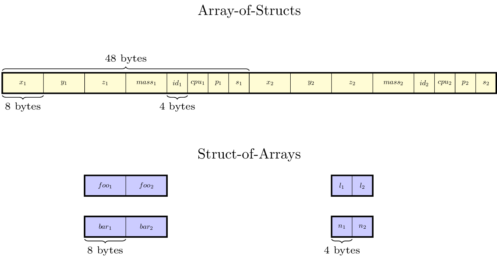
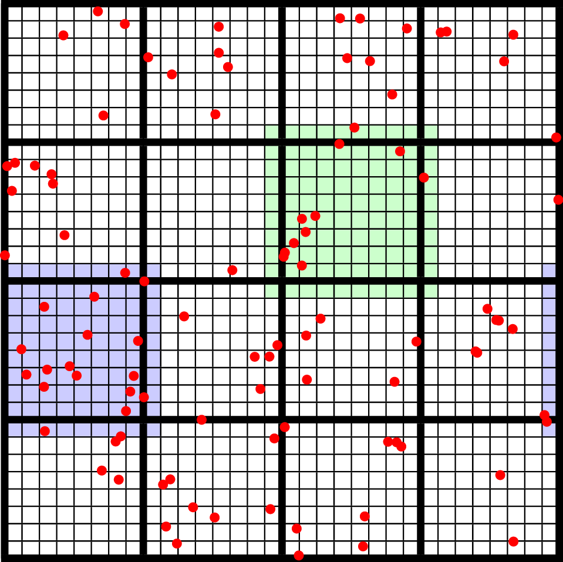
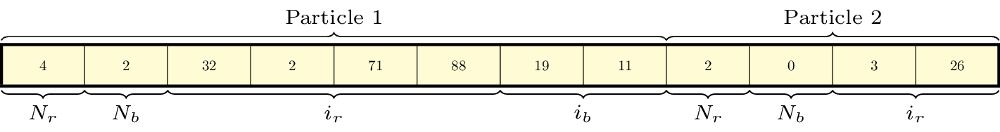

.. role:: cpp(code)
   :language: c++

.. role:: fortran(code)
   :language: fortran

.. _sec:Particles:Particle:

The Particle
============

The particle classes can be used by including the header AMReX_Particles.H. The
most basic particle data structure is the particle itself:

.. highlight:: c++

::

      Particle<3, 2> p;

This is a templated data type, designed to allow flexibility in the number and
type of components that the particles carry. The first template parameter is the
number of extra :cpp:`Real` variables this particle will have (either single or
double precision [1]_), while the second is the number of extra integer
variables.  It is important to note that this is the number of *extra* real and
integer variables; a particle will always have at least :cpp:`BL_SPACEDIM` real
components that store the particle’s position and 2 integer components that
store the particle’s :cpp:`id` and :cpp:`cpu` numbers. [2]_

The particle struct is designed to store these variables in a way that
minimizes padding, which in practice means that the :cpp:`Real` components
always come first, and the integer components second. Additionally, the
required particle variables are stored before the optional ones, for both the
real and the integer components. For example, say we want to define a particle
type that stores a mass, three velocity components, and two extra integer
flags. Our particle struct would be set up like:

::

      Particle<4, 2> p;

and the order of the particle components in would be (assuming :cpp:`BL_SPACEDIM` is 3): 
:cpp:`x y z m vx vy vz id cpu flag1 flag2`.  [3]_

Setting Particle data
---------------------

The :cpp:`Particle` struct provides a number of methods for getting and setting
a particle’s data. For the required particle components, there are special,
named methods. For the “extra” real and integer data, you can use the
:cpp:`rdata` and :cpp:`idata` methods, respectively.

.. highlight:: c++

::

      Particle<2, 2> p;

      p.pos(0) = 1.0;
      p.pos(1) = 2.0;
      p.pos(2) = 3.0;
      p.id() = 1;
      p.cpu()  = 0;

      // p.rdata(0) is the first extra real component, not the
      // first real component overall
      p.rdata(0) = 5.0;
      p.rdata(1) = 5.0;

      // and likewise for p.idata(0);
      p.idata(0) = 17;
      p.idata(1) = -64;

.. _sec:Particles:ParticleContainer:

The ParticleContainer
=====================

One particle by itself is not very useful. To do real calculations, a
collection of particles needs to be defined, and the location of the particles
within the AMR hierarchy (and the corresponding MPI process) needs to be
tracked as the particle positions change. To do this, we provide the
:cpp:`ParticleContainer` class:

::

      ParticleContainer<3, 2, 4, 4> mypc;

Arrays-of-Structs and Structs-of-Arrays
---------------------------------------

Like the :cpp:`Particle` class itself, the :cpp:`ParticleContainer`
class is templated. The first two template parameters have the same meaning as
before: they define the number of each type of variables that the particles in
this container will store. Particles added to the container are stored in the
Array-of-Structs (AoS) style. In addition, there are two more optional template
parameters that allow the user to specify additional particle variables that
will be stored in Struct-of-Array (SoA) form. The difference between
Array-of-Struct and Struct-of-Array data is in how the data is laid out in
memory. For the AoS data, all the variables associated with particle 1 are next
to each other in memory, followed by all the variables associated with particle
2, and so on. For variables stored in SoA style, all the particle data for a
given component is next to each other in memory, and each component is stored
in a separate array. For convenience, we (arbitrarily) refer to the components
in the particle struct as particle *data*, and components stored in the
Struct-of-Arrays as particle *attributes*. See the figure
:ref:`below<fig:particles:particle_arrays>` for an illustration.

.. raw:: latex

   \begin{center}

.. _fig:particles:particle_arrays:

   An illustration of how the particle data for a single tile is arranged in
   memory. This particle container has been defined with :cpp:`NStructReal =
   1`, :cpp:`NStructInt = 2`, :cpp:`NArrayReal = 2`, and :cpp:`NArrayInt = 2`.
   In this case, each tile in the particle container has five arrays: one with
   the particle struct data, two additional real arrays, and two additional
   integer arrays.  In the tile shown, there are only 2 particles. We have
   labelled the extra real data member of the particle struct to be
   :cpp:`mass`, while the extra integer members of the particle struct are
   labeled :cpp:`p`, and :cpp:`s`, for “phase” and “state”. The variables in
   the real and integer arrays are labelled :cpp:`foo`, :cpp:`bar`, :cpp:`l`,
   and :cpp:`n`, respectively. We have assumed that the particles are double
   precision.

.. raw:: latex

   \end{center}

To see why the distinction between AoS and SoA data is important, consider the
following extreme case. Say you have particles that carry 100 different
components, but that most of the time, you only need to do calculations
involving 3 of them (say, the particle positions) at once. In this case,
storing all 100 particle variables in the particle struct is clearly
inefficient, since most of the time you are reading 97 extra variables into
cache that you will never use. By splitting up the particle variables into
stuff that gets used all the time (stored in the AoS) and stuff that only gets
used infrequently (stored in the SoA), you can in principle achieve much better
cache reuse. Of course, the usage pattern of your application likely won’t be
so clear-cut. Flexibility in how the particle data is stored also makes it
easier to interface between AMReX and already-existing Fortran subroutines.

Note that while “extra” particle data can be stored in either the SoA or AoS
style, the particle positions and id numbers are **always** stored in the
particle structs. This is because these particle variables are special and used
internally by AMReX to assign the particles to grids and to mark particles as
valid or invalid, respectively.

Constructing ParticleContainers
-------------------------------

A particle container is always associated with a particular set of AMR grids
and a particular set of DistributionMaps that describes which MPI processes
those grids live on.  For example, if you only have one level, you can define a
:cpp:`ParticleContainer` to store particles on that level using the following
constructor:

.. highlight:: c++

::

        ParticleContainer (const Geometry            & geom,
                           const DistributionMapping & dmap,
                           const BoxArray            & ba);

Or, if you have multiple levels, you can use following constructor instead:

.. highlight:: c++

::

        ParticleContainer (const Vector<Geometry>            & geom,
                           const Vector<DistributionMapping> & dmap,
                           const Vector<BoxArray>            & ba,
                           const Vector<int>                 & rr);

Note the set of grids used to define the :cpp:`ParticleContainer` doesn’t have
to be the same set used to define the simulation’s mesh data. However, it is
often desirable to have the two hierarchies track each other. If you are using
an :cpp:`AmrCore` class in your simulation (see the Chapter on
:ref:`Chap:AmrCore`), you can achieve this by using the
:cpp:`AmrParticleContainer` class. The constructor for this class takes a
pointer to your AmrCore derived class, instead:

.. highlight:: c++

::

      AmrTracerParticleContainer (AmrCore* amr_core);

In this case, the :cpp:`Vector<BoxArray>` and :cpp:`Vector<DistributionMap>`
used by your :cpp:`ParticleContainer` will be updated automatically to match
those in your :cpp:`AmrCore`.

The :cpp:`ParticleContainer` stores the particle data in a manner prescribed by
the set of AMR grids used to define it. If tiling is turned off, then every
grid has its own Array-of-Structs and Struct-of-Arrays. Which AMR grid a
particle is assigned to is determined by examining its position and binning it,
using the domain left edge as an offset.  By default, a particle is assigned to
the finest level that contains its position, although this behavior can be
tweaked if desired.  When tiling is enabled, then each *tile* gets its own
Struct-of-Arrays and Array-of-Structs instead. Note that this is different than
what happens with mesh data. With mesh data, the tiling is strictly logical;
the data is laid out in memory the same whether tiling is turned on or off.
With particle data, however, the particles are actually stored in different
arrays when tiling is enabled. As with mesh data, the particle tile size can be
tuned so that an entire tile’s worth of particles will fit into a cache line at
once.

Once the particles move, their data may no longer be in the right place in the
container. They can be reassigned by calling the :cpp:`Redistribute()` method
of :cpp:`ParticleContainer`.  After calling this method, all the particles will
be moved to their proper places in the container, and all invalid particles
(particles with id set to :cpp:`-1`) will be removed. All the MPI communication
needed to do this happens automatically.

Application codes will likely want to create their own derived
ParticleContainer class that specializes the template parameters and adds
additional functionality, like setting the initial conditions, moving the
particles, etc. See the ``amrex/Tutorials/Particles`` for examples of this.

.. _sec:Particles:Initializing:

Initializing Particle Data
==========================

In the following code snippet, we demonstrate how to set particle initial
conditions for both SoA and AoS data. We loop over all the tiles using
:cpp:`MFIter`, and add as many particles as we want to each one.

.. highlight:: c++

::

    for (MFIter mfi = MakeMFIter(lev); mfi.isValid(); ++mfi) {

        // ``particles'' starts off empty
        auto& particles = GetParticles(lev)[std::make_pair(mfi.index(),
                                            mfi.LocalTileIndex())];

        ParticleType p;
        p.id()   = ParticleType::NextID();
        p.cpu()  = ParallelDescriptor::MyProc();
        p.pos(0) = ...
        etc...

        // AoS real data
        p.rdata(0) = ...
        p.rdata(1)  = ...

        // AoS int data
        p.idata(0) = ...
        p.idata(1) = ...

        // Particle real attributes (SoA)
        std::array<double, 2> real_attribs;
        real_attribs[0] = ...
        real_attribs[1] = ...

        // Particle int attributes (SoA)
        std::array<int, 2> int_attribs;
        int_attribs[0] = ...
        int_attribs[1]  = ...

        particles.push_back(p);
        particles.push_back_real(real_attribs);
        particles.push_back_int(int_attribs);

        // ... add more particles if desired ...
      }

Often, it makes sense to have each process only generate particles that it
owns, so that the particles are already in the right place in the container.
In general, however, users may need to call :cpp:`Redistribute()` after adding
particles, if the processes generate particles they don’t own (for example, if
the particle positions are perturbed from the cell centers and thus end up
outside their parent grid).

.. _sec:Particles:Iterating:

Iterating over Particles
========================

To iterate over the particles on a given level in your container, you can use
the :cpp:`ParIter` class, which comes in both const and non-const flavors. For
example, to iterate over all the AoS data:

.. highlight:: c++

::

    using MyParIter = ConstParIter<2*BL_SPACEDIM>;
    for (MyParIter pti(pc, lev); pti.isValid(); ++pti) {
        const auto& particles = pti.GetArrayOfStructs();
        for (const auto& p : particles) {
            // do stuff with p...
        }
    }

The outer loop will execute once every grid (or tile, if tiling is enabled)
*that contains particles*; grids or tiles that don’t have any particles will be
skipped. You can also access the SoA data using the :math:`ParIter` as follows:

.. highlight:: c++

::

    using MyParIter = ParIter<0, 0, 2, 2>;
    for (MyParIter pti(pc, lev); pti.isValid(); ++pti) {
        auto& particle_attributes = pti.GetStructOfArrays();
        Vector<Real>& real_comp0 = particle_attributes.GetRealData(0);
        Vector<int>&  int_comp1  = particle_attributes.GetIntData(1);
        for (int i = 0; i < pti.numParticles; ++i) {
            // do stuff with your SoA data...
        }
    }

.. _sec:Particles:Fortran:

Passing particle data into Fortran routines
===========================================

Because the AMReX particle struct is a Plain-Old-Data type, it is interoperable
with Fortran when the :fortran:`bind(C)` attribute is used. It is therefore
possible to pass a grid or tile worth of particles into fortran routines for
processing, instead of iterating over them in C++. You can also define a
Fortran derived type that is equivalent to C struct used for the particles. For
example:

.. highlight:: fortran

::

        use amrex_fort_module, only: amrex_particle_real
        use iso_c_binding ,    only: c_int

        type, bind(C)  :: particle_t
           real(amrex_particle_real) :: pos(3)
           real(amrex_particle_real) :: vel(3)
           real(amrex_particle_real) :: acc(3)
           integer(c_int)   :: id
           integer(c_int)   :: cpu
        end type particle_t

is equivalent to a particle struct you get with :cpp:`Particle<6, 0>`. Here,
:fortran:`amrex_particle_real` is either single or doubled precision, depending
on whether ``USE_SINGLE_PRECISION_PARTICLES`` is ``TRUE`` or not. We recommend
always using this type in Fortran routines that work on particle data to avoid
hard-to-debug incompatibilities between floating point types.

.. _sec:Particles:Interacting:

Interacting with Mesh Data
==========================

It is common to want to have the mesh communicate information to the particles
and vice versa. For example, in Particle-in-Cell calculations, the particles
deposit their charges onto the mesh, and later, the electric fields computed on
the mesh are interpolated back to the particles. Below, we show examples of
both these sorts of operations.

.. highlight:: c++

::

    Ex.FillBoundary(gm.periodicity());
    Ey.FillBoundary(gm.periodicity());
    Ez.FillBoundary(gm.periodicity());
    for (MyParIter pti(MyPC, lev); pti.isValid(); ++pti) {
        const Box& box = Ex[pti].validBox();

        const auto& particles = pti.GetArrayOfStructs();
        int nstride = particles.dataShape().first;
        const long np  = pti.numParticles();

        const FArrayBox& exfab = Ex[pti];
        const FArrayBox& eyfab = Ey[pti];
        const FArrayBox& ezfab = Ex[pti];

        interpolate_cic(particles.data(), nstride, np,
                        exfab.dataPtr(), eyfab.dataPtr(), ezfab.dataPtr(),
                        box.loVect(), box.hiVect(), plo, dx, &ng);
        }

Here, :fortran:`interpolate_cic` is a Fortran subroutine that actually performs
the interpolation on a single box. :cpp:`Ex`, :cpp:`Ey`, and :cpp:`Ez` are
MultiFabs that contain the electric field data. These MultiFabs must be defined
with the correct number of ghost cells to perform the desired type of
interpolation, and we call :cpp:`FillBoundary` prior to the Fortran call so
that those ghost cells will be up-to-date.

In this example, we have assumed that the :cpp:`ParticleContainer MyPC` has
been defined on the same grids as the electric field MultiFabs, so that we use
the :cpp:`ParIter` to index into the MultiFabs to get the data associated with
current tile. If this is not the case, then an additional copy will need to be
performed. However, if the particles are distributed in an extremely uneven
fashion, it is possible that the load balancing improvements associated with
the two-grid approach are worth the cost of the extra copy.

The inverse operation, in which the particles communicate data *to* the mesh,
is quite similar:

.. highlight:: c++

::

    rho.setVal(0.0, ng);
    for (MyParIter pti(*this, lev); pti.isValid(); ++pti) {
        const Box& box = rho[pti].validbox();

        const auto& particles = pti.GetArrayOfStructs();
        int nstride = particles.dataShape().first;
        const long np  = pti.numParticles();

        FArrayBox& rhofab = (*rho[lev])[pti];

        deposit_cic(particles.data(), nstride, np, rhofab.dataPtr(),
                    box.loVect(), box.hiVect(), plo, dx);
        }

    rho.SumBoundary(gm.periodicity());

As before, we loop over all our particles, calling a Fortran routine that
deposits them on to the appropriate :cpp:`FArrayBox rhofab`. The :cpp:`rhofab`
must have enough ghost cells to cover the support of all the particles
associated with them. Note that we call :cpp:`SumBoundary` instead of
:cpp:`FillBoundary` after performing the deposition, to add up the charge in
the ghost cells surrounding each Fab into the corresponding valid cells.

For a complete example of an electrostatic PIC calculation that includes static
mesh refinement, please see ``amrex/Tutorials/Particles/ElectrostaticPIC``.

.. _sec:Particles:ShortRange:

Short Range Forces
==================

In a PIC calculation, the particles don’t interact with each other directly;
they only see each other through the mesh. An alternative use case is particles
that exert short-range forces on each other. In this case, beyond some cut-off
distance, the particles don’t interact with each other and therefore don’t need
to be included in the force calculation. Our approach to these kind of
particles is to fill “neighbor buffers” on each tile that contain copies of the
particles on neighboring tiles that are within some number of cells :math:`N_g`
of the tile boundaries. See :numref:`fig:particles:neighbor_particles`, below
for an illustration. By choosing the number of ghost cells to match the
interaction radius of the particles, you can capture all of the neighbors that
can possibly influence the particles in the valid region of the tile. The
forces on the particles on different tiles can then be computed independently
of each other using a variety of methods.

.. raw:: latex

   \begin{center}

.. _fig:particles:neighbor_particles:

   : An illustration of filling neighbor particles for short-range force
   calculations. Here, we have a domain consisting of one :math:`32 \times 32`
   grid, broken up into :math:`8 \times 8` tiles. The number of ghost cells is
   taken to be :math:`1`.  For the tile in green, particles on other tiles in
   the entire shaded region will copied and packed into the green tile’s
   neighbor buffer. These particles can then be included in the force
   calculation. If the domain is periodic, particles in the grown region for
   the blue tile that lie on the other side of the domain will also be copied,
   and their positions will modified so that a naive distance calculation
   between valid particles and neighbors will be correct.

.. raw:: latex

   \end{center}

For a :cpp:`ParticleContainer` that does this neighbor finding, please see
:cpp:`NeighborParticleContainer` in
``amrex/Src/Particles/AMReX_NeighborParticleContainer.H.`` This
:cpp:`ParticleContainer` has additional methods called :cpp:`fillNeighbors()`
and :cpp:`clearNeighbors()` that fill the :cpp:`neighbors` data structure with
copies of the proper particles. A tutorial that uses these features is
available at ``amrex/Tutorials/Particles/ShortRangeParticles``. This tutorial
computes the forces on a given tile via direct summation by passing the real
and neighbor particles into a Fortran subroutine, as follows:

.. highlight:: c++

::

    void ShortRangeParticleContainer::computeForces() {
        for (MyParIter pti(*this, lev); pti.isValid(); ++pti) {
            AoS& particles = pti.GetArrayOfStructs();
            int Np = particles.size();
            PairIndex index(pti.index(), pti.LocalTileIndex());
            int Nn = neighbors[index].size();
            amrex_compute_forces(particles.data(), &Np,
                                 neighbors[index].dataPtr(), &Nn);
        }
    }

Alternatively, one can avoid doing a direct :math:`N^2` summation over the
particles on a tile by binning the particles by cell and building a neighbor
list. A tutorial that demonstrates this process is available at
``amrex/Tutorials/Particles/NeighborList``. The data structure used to represent
the neighbor lists is illustrated in :numref:`fig:particles:neighbor_list`.

.. raw:: latex

   \begin{center}

.. _fig:particles:neighbor_list:

   : An illustration of the neighbor list data structure used by AMReX. The
   list for each tile is represented by an array of integers. The first number
   in the array is the number of real (i.e., not in the neighbor buffers)
   collision partners for the first particle on this tile, while the second is
   the number of collision partners from nearby tiles in the neighbor buffer.
   Based on the number of collision partners, the next several entries are the
   indices of the collision partners in the real and neighbor particle arrays,
   respectively. This pattern continues for all the particles on this tile.

.. raw:: latex

   \end{center}

This array can then be used to compute the forces on all the particles in one
scan. Users can define their own :cpp:`NeighborParticleContainer` subclasses
that have their own collision criteria by overloading the virtual
:cpp:`check_pair` function. For an example of this in action, please see the
:cpp:`NeighborList` Tutorial.

.. _sec:Particles:IO:

Particle IO
===========

AMReX provides routines for writing particle data to disk for analysis,
visualization, and for checkpoint / restart. The most important methods are the
:cpp:`WritePlotFile`, :cpp:`Checkpoint`, and :cpp:`Restart` methods of
:cpp:`ParticleContainer`, which all use a parallel-aware binary file format for
reading and writing particle data on a grid-by-grid basis. These methods are
designed to complement the functions in AMReX_PlotFileUtil.H for performing
mesh data IO. For example:

.. highlight:: c++

::

    WriteMultiLevelPlotfile("plt00000", output_levs, GetVecOfConstPtrs(output),
                            varnames, geom, 0.0, level_steps, outputRR);
    pc.Checkpoint("plt00000", "particle0");

will create a plot file called “plt00000” and write the mesh data in :cpp:`output` to it, and then write the particle data in a subdirectory called “particle0”. There is also the :cpp:`WriteAsciiFile` method, which writes the particles in a human-readable text format. This is mainly useful for testing and debugging.

The binary file format is currently readable by :cpp:`yt`. In additional, there is a Python conversion script in 
``amrex/Tools/Py_util/amrex_particles_to_vtp`` that can convert both the ASCII and the binary particle files to a 
format readable by Paraview. See the chapter on :ref:`Chap:Visualization` for more information on visualizing AMReX datasets, including those with particles.

.. [1]
   Particles default to double precision for their real data. To use single precision, compile your code with ``USE_SINGLE_PRECISION_PARTICLES=TRUE``.

.. [2]
   Note that :cpp:`cpu` stores the number of the process the particle was *generated* on, not the one it's currently assigned to. This number is set on initialization and never changes, just like the particle :cpp:`id`. In essence, the particles have two integer id numbers, and only the combination of the two is unique. This was done to facilitate the creation of particle initial conditions in parallel.

.. [3]
   Note that for the extra particle components, which component refers to which
   variable is an application-specific convention - the particles have 4 extra real comps, but which one is “mass” is up to the user. We suggest using an :cpp:`enum` to keep these indices straight; please see ``amrex/Tutorials/Particles/ElectrostaticPIC/ElectrosticParticleContainer.H`` for an example of this.
