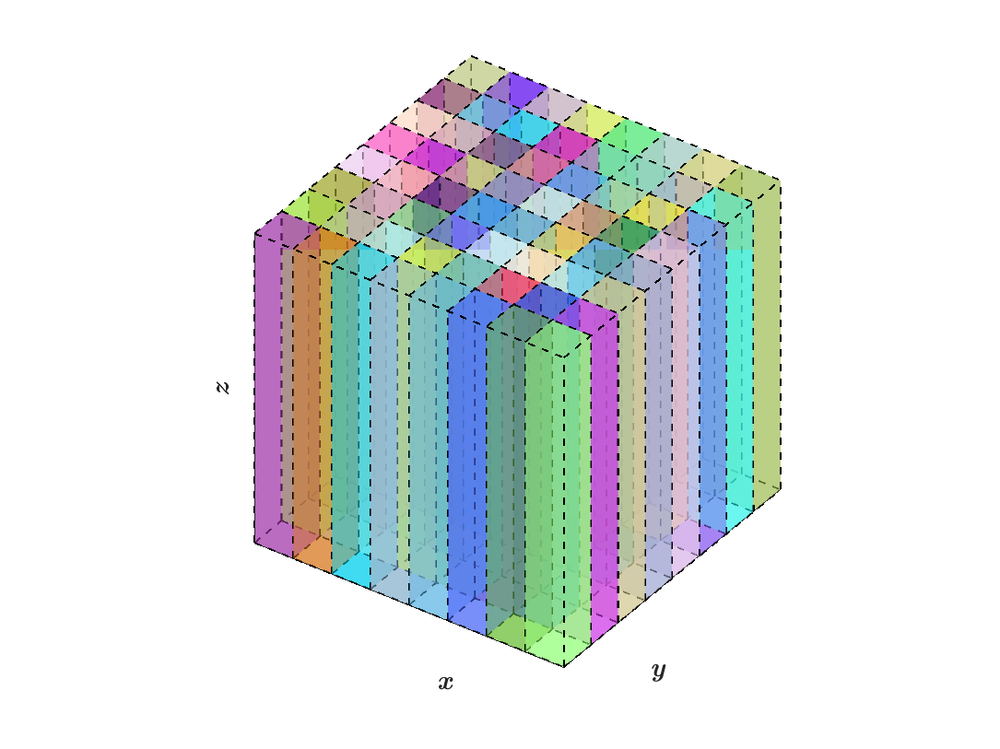
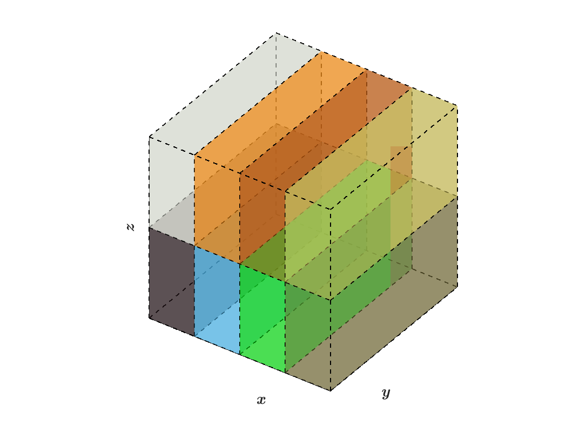

.. role:: cpp(code)
   :language: c++

.. role:: fortran(code)
   :language: fortran

.. role:: underline
    :class: underline

.. _swfftdoc:	    
	    
SWFFT
=======

``hacc/SWFFT``, developed by Adrian Pope et al. at Argonne National Lab, provides the functionality to perform forward and reverse Fast Fourier Transforms (FFT) within a fully parallelized framework built in C++ and F90. In the words of HACC's developers, SWFFT is a "distributed-memory, pencil-decomposed, parallel 3D FFT." [1]_ The SWFFT source code is also contained in the following directory within AMReX: ``amrex/Src/Extern/SWFFT``. [2]_

Pencil Redistribution
--------------------------------

As input, SWFFT takes three-dimensional arrays of data distributed across block-structured grids, and redistributes the data into "pencil" grids in :math:`z, x,` and then :math:`y`, belonging to different MPI processes. After each pencil conversion, a 1D FFT is performed on the data along the pencil direction using calls to the FFTW [3]_ library. The ``README`` files in the tutorial directories specify the relationship between the number of grids and the number of MPI processes that should be used. The ``hacc/SWFFT`` ``README`` document by Adrian Pope et al. explains restrictions on grid dimensions in relation to the number of MPI processes [1]_  [2]_:

      [...] A rule of thumb is that [SWFFT] generally works when the number of vertexes along
      one side of the global 3D grid ("ng") can be factored into small primes, and
      when the number of MPI ranks can also be factored into small primes.
      I believe that all of the unique prime factors of the number of MPI ranks
      must be present in the set of prime factors of the grid, eg. if you have
      20 MPI ranks then ng must be a multiple of 5 and 2. The ``CheckDecomposition``
      utility is provided to check (on one rank) whether a proposed grid size and
      number of MPI ranks will work, which can be done before submitting a large
      test with ``TestDfft/TestFDfft``.

The relationship between the number of processes versus global grid dimensions is determined by how the total number of grids can be factored from a three dimensional grid structure (block structured grids) into a two dimensional structure (pencil arrays), as shown in the figures below.

The following figures illustrate how data is distributed from block structured grids to pencil arrays within SWFFT, where the colors of each box indicate which MPI rank it belongs to:

.. |a| image:: ./SWFFT/figs/grid_4x4x4.png
       :width: 100%

.. |d| image:: ./SWFFT/figs/grid_4x2x1.png
       :width: 100%

.. |e| image:: ./SWFFT/figs/grid_1x4x2.png
       :width: 100%

.. table:: SWFFT Redistribution from :math:`4 \times 4 \times 4` Box Array into Pencils
   :align: center
   
   +---------------------------------------------------------+------------------------------------------------------+
   |                        |a|                              |                        |b|                           |
   +---------------------------------------------------------+------------------------------------------------------+
   | | (a) Block structured grids: :math:`N_x=4,N_y=4,N_z=4` | | (b) Z-pencils: :math:`N_x=8,N_y=8,N_z=1`           |
   +---------------------------------------------------------+------------------------------------------------------+

.. table:: SWFFT Redistribution from :math:`2 \times 2 \times 2` Box Array into Pencils
   :align: center

   +---------------------------------------------------------+------------------------------------------------------+
   |                        |c|                              |                        |d|                           |
   +---------------------------------------------------------+------------------------------------------------------+
   | | (a) Block structured grids: :math:`N_x=2,N_y=2,N_z=2` | | (b) Z-pencils: :math:`N_x=4,N_y=2,N_z=1`           |
   +---------------------------------------------------------+------------------------------------------------------+
   |                        |e|                              |                        |f|                           |
   +---------------------------------------------------------+------------------------------------------------------+
   | | (c) X-pencils: :math:`N_x=1,N_y=4,N_z=2`              | | (d) Y-pencils: :math:`N_x=4,N_y=1,N_z=2`           |
   +---------------------------------------------------------+------------------------------------------------------+

Using the same number of AMReX grids as processes has been verified to work in the ``SWFFT_poisson`` and ``SWFFT_simple`` tutorials. This can be illustrated by the following equation for the total number of grids, :math:`N_{b}`, in a regularly structured domain:

.. math:: N_{b} = m_{bi} m_{bj} = n_{bi} n_{bj} n_{bk},

where :math:`n_{bi}, n_{bj},` and  :math:`n_{bk}` are the number of grids, or boxes, in the :math:`x, y,` and :math:`z` dimensions of the block-structured grid. Analogously, for pencil distributions, :math:`m_{bi}` and :math:`m_{bj}` are the number of grids along the remaining dimensions if pencils are taken in the :math:`k` direction. There are many possible ways of redistributing the data, for example :math:`m_{bi} = n_{bi}n_{bk}` & :math:`m_{bj} = n_{bj}` is one possible simple configuration. However, it is evident from the figures above that the SWFFT redistribution algorithm has a more sophisticated method for finding the prime factors of the grid.

Tutorials
--------------------------------

AMReX contains two SWFFT tutorials, ``SWFFT_poisson`` and ``SWFFT_simple``:

- ``SWFFT_poisson`` tutorial: The tutorial found in ``amrex/Tutorials/SWFFT/SWFFT_poisson`` solves a Poisson equation with periodic boundary conditions.  In it, both a forward FFT and reverse FFT are called to solve the equation, however, no reordering of the DFT data in k-space is performed.

- ``SWFFT_simple`` tutorial: This tutorial: ``amrex/Tutorials/SWFFT/SWFFT_simple``, is useful if the objective is to simply take a forward FFT of data, and the DFT's ordering in k-space matters to the user.  This tutorial initializes a 3D or 2D :cpp:`MultiFab`, takes a forward FFT, and then redistributes the data in k-space back to the "correct," 0 to :math:`2\pi`, ordering.  The results are written to a plot file.

.. [1]
   https://xgitlab.cels.anl.gov/hacc/SWFFT

.. [2]
   SWFFT source code directory in AMReX: amrex/Src/Extern/SWFFT

.. [3]
   http://www.fftw.org/
