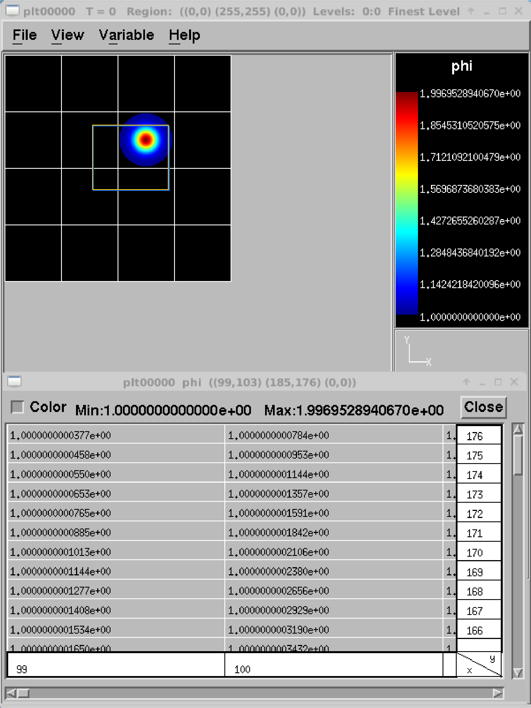
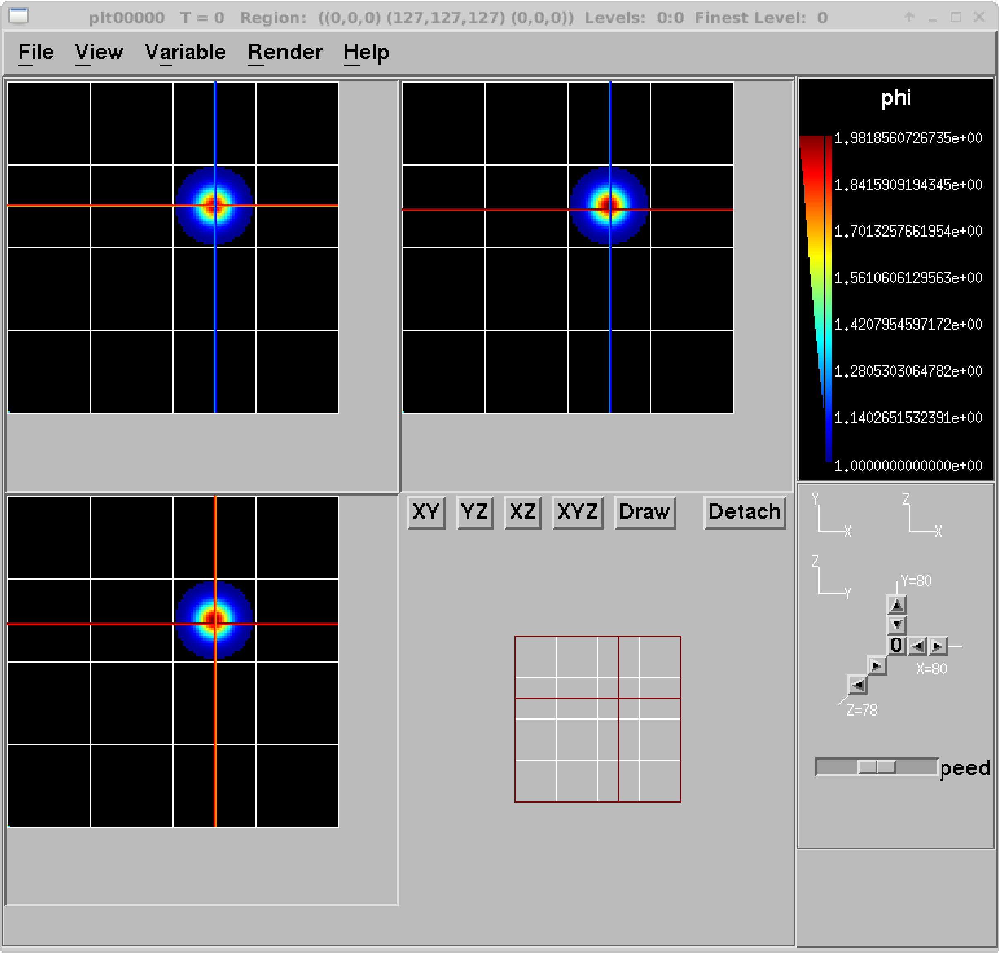
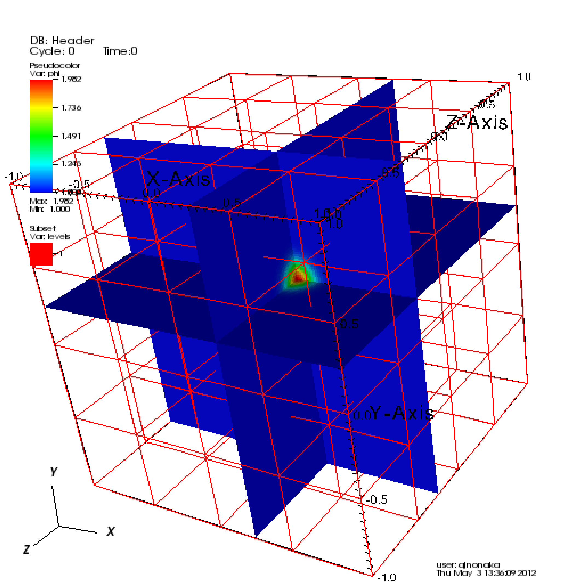
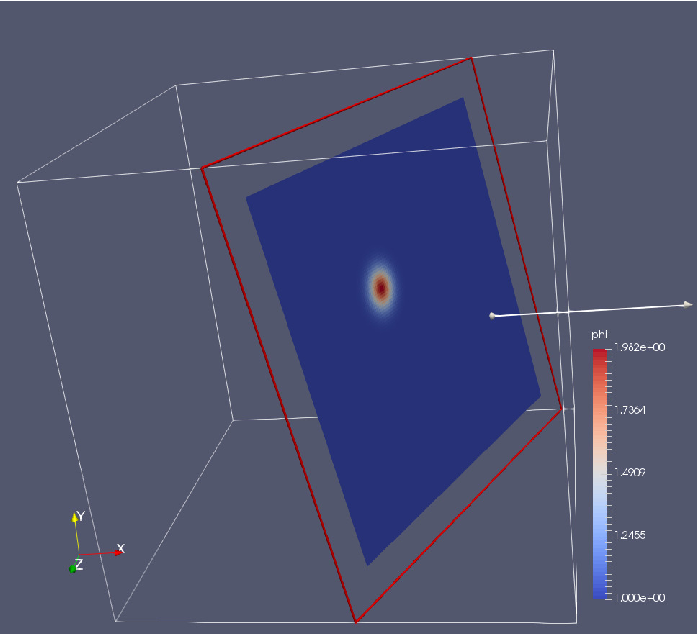
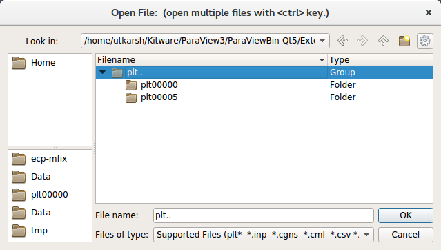
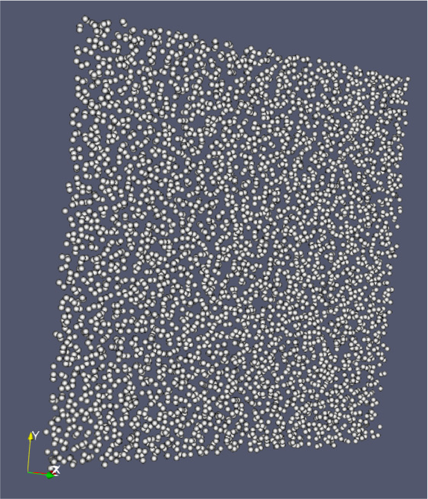
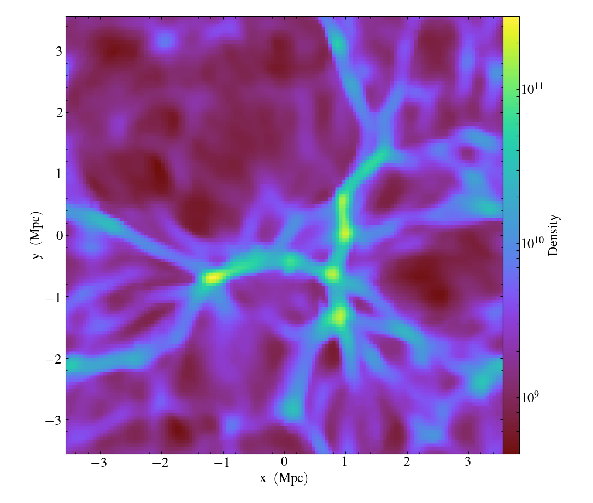
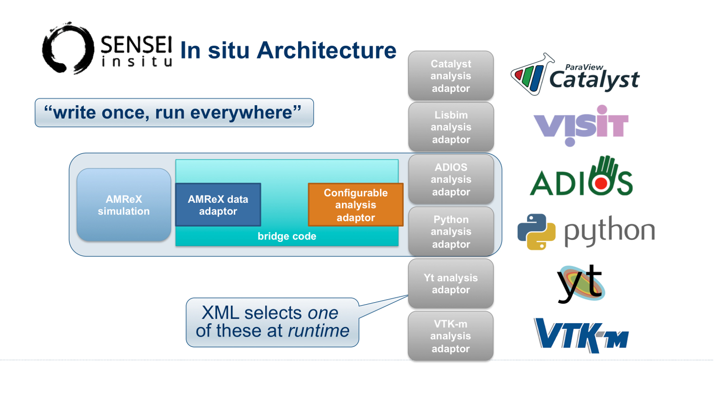
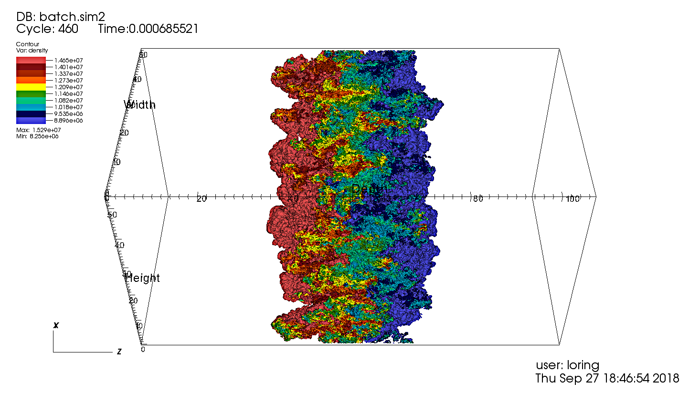
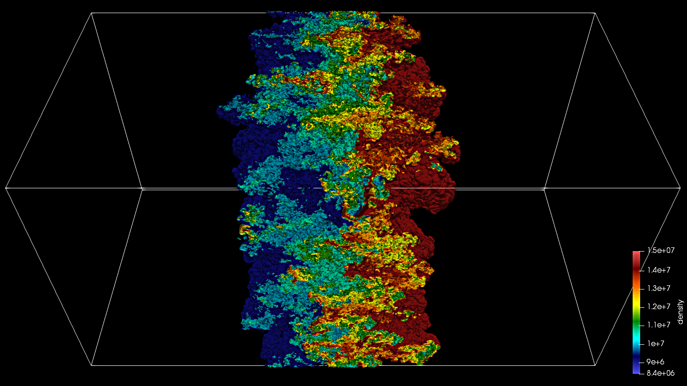

.. role:: cpp(code)
   :language: c++

.. _sec:amrvis:

Amrvis
======

Our favorite visualization tool is Amrvis. We heartily encourage you to build
the ``amrvis1d``, ``amrvis2d``, and ``amrvis3d`` executables, and to try using
them to visualize your data. A very useful feature is View/Dataset, which
allows you to actually view the numbers in a spreadsheet that is nested to
reflect the AMR hierarchy – this can be handy for debugging. You can modify how
many levels of data you want to see, whether you want to see the grid boxes or
not, what palette you use, etc. Below are some instructions and tips for using
Amrvis; you can find additional information in Amrvis/Docs/Amrvis.tex (which
you can build into a pdf using pdflatex).

#. Download and build :

   .. highlight:: console

   ::

       git clone https://github.com/AMReX-Codes/Amrvis

   Then cd into Amrvis/, edit the GNUmakefile by setting ``COMP`` to the
   compiler suite you have.

   Type ``make DIM=1``, ``make DIM=2``, or ``make DIM=3`` to build, resulting
   in an executable that looks like amrvis2d...ex.

   If you want to build amrvis with ``DIM=3``, you must first download and build
   ``volpack``:

   .. highlight:: console

   ::

       git clone https://ccse.lbl.gov/pub/Downloads/volpack.git

   Then cd into volpack/ and type ``make``.

   Note: Amrvis requires the OSF/Motif libraries and headers. If you don’t have
   these you will need to install the development version of motif through your
   package manager.  ``lesstif`` gives some functionality and will allow you to
   build the amrvis executable, but Amrvis may exhibit subtle anomalies.

   On most Linux distributions, the motif library is provided by the
   ``openmotif`` package, and its header files (like Xm.h) are provided by
   ``openmotif-devel``. If those packages are not installed, then use the
   OS-specific package management tool to install them.

   You may then want to create an alias to amrvis2d, for example

   .. highlight:: console

   ::

       alias amrvis2d /tmp/Amrvis/amrvis2d...ex

#. Run the command ``cp Amrvis/amrvis.defaults ~/.amrvis.defaults``.  Then, in
   your copy, edit the line containing “palette” line to point to, e.g.,
   “palette /home/username/Amrvis/Palette”. The other lines control options
   such as the initial field to display, the number format, widow size, etc.
   If there are multiple instances of the same option, the last option takes
   precedence.

#. Generally the plotfiles have the form pltXXXXX (the plt prefix can be
   changed), where XXXXX is a number corresponding to the timestep the file was
   output. ``amrvis2d <filename>`` or ``amrvis3d <filename>`` to see a single
   plotfile, or for 2D data sets, ``amrvis2d -a plt*``, which will animate the
   sequence of plotfiles. FArrayBoxes and MultiFabs can also be viewed with the
   ``-fab`` and ``-mf`` options. When opening MultiFabs, use the name of the
   MultiFab’s header file ``amrvis2d -mf MyMultiFab_H``.

   You can use the “Variable” menu to change the variable.
   You can left-click drag a box around a region and click "View”
   :math:`\rightarrow` “Dataset” in order to look at the actual numerical
   values (see :numref:`Fig:Amrvis`).  Or you can simply left
   click on a point to obtain the numerical value.  You can also export the
   pictures in several different formats under "File/Export".  In 2D you can
   right and center click to get line-out plots.  In 3D you can right and
   center click to change the planes, and the hold shift+(right or center)
   click to get line-out plots.

   We have created a number of routines to convert AMReX plotfile data other
   formats (such as matlab), but in order to properly interpret the
   hierarchical AMR data, each tends to have its own idiosyncrasies. If you
   would like to display the data in another format, please contact Marc Day
   (MSDay@lbl.gov) and we will point you to whatever we have that can help.

.. _Fig:Amrvis:

.. table:: 2D and 3D images generated using Amrvis
   :align: center

   +-----+-----+
   | |a| | |b| |
   +-----+-----+

Building Amrvis on macOS
------------------------

As previously outlined at the end of section :ref:`sec:build:make`, it is
recommended to build using the `homebrew <https://brew.sh>`_ package manager to
install gcc. Furthermore, you will also need x11 and openmotif. These can be
installed using homebrew also:

#. ``brew cask install xquartz``
#. ``brew install openmotif``

Note that when the ``GNUmakefile`` detects a macOS install, it assumes that
dependencies are installed in the locations that Homebrew uses. Namely the
``/usr/local/`` tree for regular dependencies and the ``/opt/`` tree for X11.

.. _sec:visit:

VisIt
=====

AMReX data can also be visualized by VisIt, an open source visualization and
analysis software. To follow along with this example, first build and run the
first heat equation tutorial code (see the section on :ref:`sec:heat
equation`).

Next, download and install VisIt from
https://wci.llnl.gov/simulation/computer-codes/visit.  To open a single
plotfile, run VisIt, then select “File” :math:`\rightarrow` “Open file ...”,
then select the Header file associated the the plotfile of interest (e.g.,
plt00000/Header).  Assuming you ran the simulation in 2D, here are instructions
for making a simple plot:

-  To view the data, select “Add” :math:`\rightarrow` “Pseudocolor”
   :math:`\rightarrow` “phi”, and then select “Draw”.

-  To view the grid structure (not particularly interesting yet, but when we
   add AMR it will be), select “ :math:`\rightarrow` “subset”
   :math:`\rightarrow` “levels”. Then double-click the text “Subset - levels”,
   enable the “Wireframe” option, select “Apply”, select “Dismiss”, and then
   select “Draw”.

-  To save the image, select “File” :math:`\rightarrow` “Set save options”,
   then customize the image format to your liking, then click “Save”.

Your image should look similar to the left side of :numref:`Fig:VisIt`.

.. raw:: latex

   \begin{center}

.. |c| image:: ./Visualization/VisIt_2D.png
       :width: 100%

.. _Fig:VisIt:

.. table:: : 2D (left) and 3D (right) images generated using VisIt.
   :align: center

   +-----+-----+
   | |c| | |d| |
   +-----+-----+

.. raw:: latex

   \end{center}

In 3D, you must apply the “Operators” :math:`\rightarrow` “Slicing”
:math:`\rightarrow` “ThreeSlice”, with the “ThreeSlice operator attribute” set
to ``x=0.25``, ``y=0.25``, and ``z=0.25``. You can left-click and drag over the
image to rotate the image to generate something similar to right side of
:numref:`Fig:VisIt`.

To make a movie, you must first create a text file named ``movie.visit`` with a
list of the Header files for the individual frames. This can most easily be
done using the command:

.. highlight:: console

::

    ~/amrex/Tutorials/Basic/HeatEquation_EX1_C> ls -1 plt*/Header | tee movie.visit
    plt00000/Header
    plt01000/Header
    plt02000/Header
    plt03000/Header
    plt04000/Header
    plt05000/Header
    plt06000/Header
    plt07000/Header
    plt08000/Header
    plt09000/Header
    plt10000/Header

The next step is to run VisIt, select “File” :math:`\rightarrow` “Open file
...”, then select movie.visit. Create an image to your liking and press the
“play” button on the VCR-like control panel to preview all the frames. To save
the movie, choose “File” :math:`\rightarrow` “Save movie ...”, and follow the
on-screen instructions.

Caveat: 

The Visit reader determines "Cycle" from the name of the plotfile (directory),  
specifically from the integer that follows the string "plt" in the plotfile name.

So ... if you call it plt00100 or myplt00100 or this_is_my_plt00100 then it will
correctly recognize and print Cycle: 100.

If you call it plt00100_old it will also correctly recognize and print Cycle: 100

But, if you do not have "plt" followed immediately by the number,
e.g. you name it pltx00100, then VisIt will not be able to correctly recognize 
and print the value for "Cycle".  (It will still read and display the data itself.)

.. _section-1:

ParaView
========

The open source visualization package ParaView v5.5 can be used to view 3D
plotfiles, and particle data. Download the package at
https://www.paraview.org/.

To open a single plotfile (for example, you could run the
``HeatEquation_EX1_C`` in 3D):

#. Run ParaView v5.5, then select “File” :math:`\rightarrow` “Open”.

#. Navigate **into** the plotfile directory, and **manually** type in “Header”.
   ParaView will ask you about the file type – choose “Boxlib 3D Files”

#. Under the “Cell Arrays” field, select a variable (e.g., “phi”) and click
   “Apply”.

#. Under “Representation” select “Surface”.

#. Under “Coloring” select the variable you chose above.

#. To add planes, near the top left you will see a cube icon with a green plane
   slicing through it. If you hover your mouse over it, it will say “Slice”.
   Click that button.

#. You can play with the Plane Parameters to define a plane of data to view, as
   shown in :numref:`fig:ParaView`.

.. raw:: latex

   \begin{center}

.. _fig:ParaView:

   : Plotfile image generated with ParaView

.. raw:: latex

   \end{center}

To visualize particle data within plofile directories (for example, you could
run the ``ShortRangeParticles`` example):

#. Run ParaView v5.5, and select  then  “File” :math:`\rightarrow` “Open”. You
   will see a combined “plt..” group. Click on “+” to expand the group, if you
   want inspect the files in the group. You can select an individual plotfile
   directory or select a group of directories to read them a time series, as
   shown in :numref:`fig:ParaView_filegroup`, and click OK.

.. raw:: latex

   \begin{center}

.. _fig:ParaView_filegroup:

   : File dialog in ParaView showing a group of plotfile directories selected

.. raw:: latex

   \end{center}

#. The “Properties” panel in ParaView allows you to specify the “Particle
   Type”, which defaults to “particles”. Using the “Properties” panel, you can
   also choose which point arrays to read.

#. Click “Apply” and under “Representation” select “Point Gaussian”.

#. Change the Gaussian Radius if you like. You can scroll through the frames
   with the VCR-like controls at the top, as shown in
   :numref:`fig:ParaView_particles`.

.. raw:: latex

   \begin{center}

.. _fig:ParaView_particles:

   : Particle image generated with ParaView

.. raw:: latex

   \end{center}

.. _section-2:

yt
==

yt, an open source Python package available at http://yt-project.org/, can be
used for analyzing and visualizing mesh and particle data generated by
AMReX codes. Some of the AMReX developers are also yt project members.  Below
we describe how to use  on both a local workstation, as well as at the NERSC
HPC facility for high-throughput visualization of large data sets.

Note - AMReX datasets require yt version 3.4 or greater.

Using  on a local workstation
-----------------------------

Running yt on a local system generally provides good interactivity, but limited
performance. Consequently, this configuration is best when doing exploratory
visualization (e.g., experimenting with camera angles, lighting, and color
schemes) of small data sets.

To use yt on an AMReX plot file, first start a Jupyter notebook or an IPython
kernel, and import the ``yt`` module:

.. highlight:: python

::

    In [1]: import yt

    In [2]: print(yt.__version__)
    3.4-dev

Next, load a plot file; in this example we use a plot file from the Nyx
cosmology application:

.. highlight:: python

::

    In [3]: ds = yt.load("plt00401")
    yt : [INFO     ] 2017-05-23 10:03:56,182 Parameters: current_time              = 0.00605694344696544
    yt : [INFO     ] 2017-05-23 10:03:56,182 Parameters: domain_dimensions         = [128 128 128]
    yt : [INFO     ] 2017-05-23 10:03:56,182 Parameters: domain_left_edge          = [ 0.  0.  0.]
    yt : [INFO     ] 2017-05-23 10:03:56,183 Parameters: domain_right_edge         = [ 14.24501  14.24501  14.24501]

    In [4]: ds.field_list
    Out[4]:
    [('DM', 'particle_mass'),
     ('DM', 'particle_position_x'),
     ('DM', 'particle_position_y'),
     ('DM', 'particle_position_z'),
     ('DM', 'particle_velocity_x'),
     ('DM', 'particle_velocity_y'),
     ('DM', 'particle_velocity_z'),
     ('all', 'particle_mass'),
     ('all', 'particle_position_x'),
     ('all', 'particle_position_y'),
     ('all', 'particle_position_z'),
     ('all', 'particle_velocity_x'),
     ('all', 'particle_velocity_y'),
     ('all', 'particle_velocity_z'),
     ('boxlib', 'density'),
     ('boxlib', 'particle_mass_density')]

From here one can make slice plots, 3-D volume renderings, etc. An example of
the slice plot feature is shown below:

.. highlight:: python

::

    In [9]: slc = yt.SlicePlot(ds, "z", "density")
    yt : [INFO     ] 2017-05-23 10:08:25,358 xlim = 0.000000 14.245010
    yt : [INFO     ] 2017-05-23 10:08:25,358 ylim = 0.000000 14.245010
    yt : [INFO     ] 2017-05-23 10:08:25,359 xlim = 0.000000 14.245010
    yt : [INFO     ] 2017-05-23 10:08:25,359 ylim = 0.000000 14.245010

    In [10]: slc.show()

    In [11]: slc.save()
    yt : [INFO     ] 2017-05-23 10:08:34,021 Saving plot plt00401_Slice_z_density.png
    Out[11]: ['plt00401_Slice_z_density.png']

The resulting image is :numref:`fig:yt_Nyx_slice_plot`. One can also make
volume renderings with ; an example is show below:

.. _fig:yt_Nyx_slice_plot:

   : Slice plot of :math:`128^3` Nyx simulation using yt.

.. highlight:: python

::

    In [12]: sc = yt.create_scene(ds, field="density", lens_type="perspective")

    In [13]: source = sc[0]

    In [14]: source.tfh.set_bounds((1e8, 1e15))

    In [15]: source.tfh.set_log(True)

    In [16]: source.tfh.grey_opacity = True

    In [17]: sc.show()
    <Scene Object>:
    Sources:
        source_00: <Volume Source>:YTRegion (plt00401): , center=[  1.09888770e+25   1.09888770e+25   1.09888770e+25] cm, left_edge=[ 0.  0.  0.] cm, right_edge=[  2.19777540e+25   2.19777540e+25   2.19777540e+25] cm transfer_function:None
    Camera:
        <Camera Object>:
        position:[ 14.24501  14.24501  14.24501] code_length
        focus:[ 7.122505  7.122505  7.122505] code_length
        north_vector:[ 0.81649658 -0.40824829 -0.40824829]
        width:[ 21.367515  21.367515  21.367515] code_length
        light:None
        resolution:(512, 512)
    Lens: <Lens Object>:
        lens_type:perspective
        viewpoint:[ 0.95423473  0.95423473  0.95423473] code_length

    In [19]: sc.save()
    yt : [INFO     ] 2017-05-23 10:15:07,825 Rendering scene (Can take a while).
    yt : [INFO     ] 2017-05-23 10:15:07,825 Creating volume
    yt : [INFO     ] 2017-05-23 10:15:07,996 Creating transfer function
    yt : [INFO     ] 2017-05-23 10:15:07,997 Calculating data bounds. This may take a while.
    Set the TransferFunctionHelper.bounds to avoid this.
    yt : [INFO     ] 2017-05-23 10:15:16,471 Saving render plt00401_Render_density.png

The output of this is :numref:`fig:yt_Nyx_vol_rend`.

.. _fig:yt_Nyx_vol_rend:

   Volume rendering of :math:`128^3` Nyx simulation using yt. This corresponds
   to the same plot file used to generate the slice plot in
   :numref:`fig:yt_Nyx_slice_plot`.

Using yt at NERSC (*under development*)
---------------------------------------

Because yt is Python-based, it is portable and can be used in many software
environments. Here we focus on yt’s capabilities at NERSC, which provides
resources for performing both interactive and batch queue-based visualization
and analysis of AMReX data. Coupled with yt’s MPI and OpenMP parallelization
capabilities, this can enable high-throughput visualization and analysis
workflows.

Interactive yt with Jupyter notebooks
~~~~~~~~~~~~~~~~~~~~~~~~~~~~~~~~~~~~~

Unlike VisIt (see the section on :ref:`sec:visit`), yt has no client-server
interface. Such an interface is often crucial when one has large data sets
generated on a remote system, but wishes to visualize the data on a local
workstation. Both copying the data between the two systems, as well as
visualizing the data itself on a workstation, can be prohibitively slow.

Fortunately, NERSC has implemented several resources which allow one to
interact with yt remotely, emulating a client-server model. In particular,
NERSC now hosts Jupyter notebooks which run IPython kernels on the Cori system;
this provides users access to the ``$HOME``, ``/project``, and ``$SCRATCH``
file systems from a web browser-based Jupyter notebook.  ***Please note that
Jupyter hosting at NERSC is still under development, and the environment may
change without notice.***

NERSC also provides Anaconda Python, which allows users to create their own
customizable Python environments. It is recommended to install yt in such an
environment. One can do so with the following example:

.. highlight:: console

::

    user@cori10:~> module load python/3.5-anaconda
    user@cori10:~> conda create -p $HOME/yt-conda numpy
    user@cori10:~> source activate $HOME/yt-conda
    (/global/homes/u/user/yt-conda/) user@cori10:~> pip install yt

More information about Anaconda Python at NERSC is here:
http://www.nersc.gov/users/data-analytics/data-analytics/python/anaconda-python/.

One can then configure this Anaconda environment to run in a Jupyter notebook
hosted on the Cori system. Currently this is available in two places: on
https://ipython.nersc.gov, and on https://jupyter-dev.nersc.gov.  The latter
likely reflects what the stable, production environment for Jupyter notebooks
will look like at NERSC, but it is still under development and subject to
change. To load this custom Python kernel in a Jupyter notebook, follow the
instructions at this URL under the “Custom Kernels” heading:
http://www.nersc.gov/users/data-analytics/data-analytics/web-applications-for-data-analytics.
After writing the appropriate ``kernel.json`` file, the custom kernel will
appear as an available Jupyter notebook. Then one can interactively visualize
AMReX plot files in the web browser. [1]_

Parallel
~~~~~~~~

Besides the benefit of no longer needing to move data back and forth between
NERSC and one’s local workstation to do visualization and analysis, an
additional feature of yt which takes advantage of the computational resources
at NERSC is its parallelization capabilities. yt supports both MPI- and
OpenMP-based parallelization of various tasks, which are discussed here:
http://yt-project.org/doc/analyzing/parallel_computation.html.

Configuring yt for MPI parallelization at NERSC is a more complex task than
discussed in the official yt documentation; the command ``pip install mpi4py``
is not sufficient. Rather, one must compile ``mpi4py`` from source using the
Cray compiler wrappers ``cc``, ``CC``, and ``ftn`` on Cori. Instructions for
compiling ``mpi4py`` at NERSC are provided here:
http://www.nersc.gov/users/data-analytics/data-analytics/python/anaconda-python/#toc-anchor-3.
After ``mpi4py`` has been compiled, one can use the regular Python interpreter
in the Anaconda environment as normal; when executing yt operations which
support MPI parallelization, the multiple MPI processes will spawn
automatically.

Although several components of yt support MPI parallelization, a few are
particularly useful:

- **Time series analysis.** Often one runs a simulation for many time steps
  and periodically writes plot files to disk for visualization and
  post-processing. yt supports parallelization over time series data via the
  ``DatasetSeries`` object. yt can iterate over a ``DatasetSeries`` in
  parallel, with different MPI processes operating on different elements of the
  series. This page provides more documentation:
  http://yt-project.org/doc/analyzing/time_series_analysis.html#time-series-analysis.

- **Volume rendering**. yt implements spatial decomposition among MPI
  processes for volume rendering procedures, which can be computationally
  expensive. Note that yt also implements OpenMP parallelization in volume
  rendering, and so one can execute volume rendering with a hybrid MPI+OpenMP
  approach. See this URL for more detail:
  http://yt-project.org/doc/visualizing/volume_rendering.html?highlight=openmp#openmp-parallelization.

- **Generic parallelization over multiple objects.** Sometimes one wishes to
  loop over a series which is not a ``DatasetSeries``, e.g., performing
  translational or rotational operations on a camera to make a volume rendering
  in which the field of view moves through the simulation. In this case, one is
  applying a set of operations on a single object (a single plot file), rather
  than over a time series of data. For this workflow, yt provides the
  ``parallel_objects()`` function. See this URL for more details:
  http://yt-project.org/doc/analyzing/parallel_computation.html#parallelizing-over-multiple-objects.

   An example of MPI parallelization in yt is shown below, where one animates a
   time series of plot files from an IAMR simulation while revolving the camera
   such that it completes two full revolutions over the span of the animation:

   .. highlight:: python

   ::

       import yt
       import glob
       import numpy as np

       yt.enable_parallelism()

       base_dir1 = '/global/cscratch1/sd/user/Nyx_run_p1'
       base_dir2 = '/global/cscratch1/sd/user/Nyx_run_p2'
       base_dir3 = '/global/cscratch1/sd/user/Nyx_run_p3'

       glob1 = glob.glob(base_dir1 + '/plt*')
       glob2 = glob.glob(base_dir2 + '/plt*')
       glob3 = glob.glob(base_dir3 + '/plt*')

       files = sorted(glob1 + glob2 + glob3)

       ts = yt.DatasetSeries(files, parallel=True)

       frame = 0
       num_frames = len(ts)
       num_revol = 2

       slices = np.arange(len(ts))

       for i in yt.parallel_objects(slices):
           sc = yt.create_scene(ts[i], lens_type='perspective', field='z_velocity')

           source = sc[0]
           source.tfh.set_bounds((1e-2, 9e+0))
           source.tfh.set_log(False)
           source.tfh.grey_opacity = False

           cam = sc.camera

           cam.rotate(num_revol*(2.0*np.pi)*(i/num_frames),
                      rot_center=np.array([0.0, 0.0, 0.0]))

           sc.save(sigma_clip=5.0)

   When executed on 4 CPUs on a Haswell node of Cori, the output looks like the following:

   ::

       user@nid00009:~/yt_vis/> srun -n 4 -c 2 --cpu_bind=cores python make_yt_movie.py
       yt : [INFO     ] 2017-05-23 16:51:33,565 Global parallel computation enabled: 0 / 4
       yt : [INFO     ] 2017-05-23 16:51:33,565 Global parallel computation enabled: 2 / 4
       yt : [INFO     ] 2017-05-23 16:51:33,566 Global parallel computation enabled: 1 / 4
       yt : [INFO     ] 2017-05-23 16:51:33,566 Global parallel computation enabled: 3 / 4
       P003 yt : [INFO     ] 2017-05-23 16:51:33,957 Parameters: current_time              = 0.103169376949795
       P003 yt : [INFO     ] 2017-05-23 16:51:33,957 Parameters: domain_dimensions         = [128 128 128]
       P003 yt : [INFO     ] 2017-05-23 16:51:33,957 Parameters: domain_left_edge          = [ 0.  0.  0.]
       P003 yt : [INFO     ] 2017-05-23 16:51:33,958 Parameters: domain_right_edge         = [ 6.28318531  6.28318531  6.28318531]
       P000 yt : [INFO     ] 2017-05-23 16:51:33,969 Parameters: current_time              = 0.0
       P000 yt : [INFO     ] 2017-05-23 16:51:33,969 Parameters: domain_dimensions         = [128 128 128]
       P002 yt : [INFO     ] 2017-05-23 16:51:33,969 Parameters: current_time              = 0.0687808060674485
       P000 yt : [INFO     ] 2017-05-23 16:51:33,969 Parameters: domain_left_edge          = [ 0.  0.  0.]
       P002 yt : [INFO     ] 2017-05-23 16:51:33,969 Parameters: domain_dimensions         = [128 128 128]
       P000 yt : [INFO     ] 2017-05-23 16:51:33,970 Parameters: domain_right_edge         = [ 6.28318531  6.28318531  6.28318531]
       P002 yt : [INFO     ] 2017-05-23 16:51:33,970 Parameters: domain_left_edge          = [ 0.  0.  0.]
       P002 yt : [INFO     ] 2017-05-23 16:51:33,970 Parameters: domain_right_edge         = [ 6.28318531  6.28318531  6.28318531]
       P001 yt : [INFO     ] 2017-05-23 16:51:33,973 Parameters: current_time              = 0.0343922351851018
       P001 yt : [INFO     ] 2017-05-23 16:51:33,973 Parameters: domain_dimensions         = [128 128 128]
       P001 yt : [INFO     ] 2017-05-23 16:51:33,974 Parameters: domain_left_edge          = [ 0.  0.  0.]
       P001 yt : [INFO     ] 2017-05-23 16:51:33,974 Parameters: domain_right_edge         = [ 6.28318531  6.28318531  6.28318531]
       P000 yt : [INFO     ] 2017-05-23 16:51:34,589 Rendering scene (Can take a while).
       P000 yt : [INFO     ] 2017-05-23 16:51:34,590 Creating volume
       P003 yt : [INFO     ] 2017-05-23 16:51:34,592 Rendering scene (Can take a while).
       P002 yt : [INFO     ] 2017-05-23 16:51:34,592 Rendering scene (Can take a while).
       P003 yt : [INFO     ] 2017-05-23 16:51:34,593 Creating volume
       P002 yt : [INFO     ] 2017-05-23 16:51:34,593 Creating volume
       P001 yt : [INFO     ] 2017-05-23 16:51:34,606 Rendering scene (Can take a while).
       P001 yt : [INFO     ] 2017-05-23 16:51:34,607 Creating volume

   Because the ``parallel_objects()`` function transforms the loop into a
   data-parallel problem, this procedure strong scales nearly perfectly to an
   arbitrarily large number of MPI processes, allowing for rapid rendering of
   large time series of data.

.. [1]
   It is convenient to use the
   magic command ``%matplotlib inline`` in order to render matplotlib
   figures in the same browser window as the notebook, as opposed to displaying it
   as a new window.

SENSEI
======
SENSEI is a light weight framework for in situ data analysis. SENSEI's data
model and API provide uniform access to and run time selection of a diverse set
of visualization and analysis back ends including VisIt Libsim, ParaView
Catalyst, VTK-m, Ascent, ADIOS, Yt, and Python.

System Architecture
-------------------

.. _sensei_arch:

   SENSEI's in situ architecture enables use of a diverse of back ends which
   can be selected at run time via an XML configuration file

The three major architectural components in SENSEI are *data adaptors* which
present simulation data in SENSEI's data model, *analysis adaptors* which
present the back end data consumers to the simulation, and *bridge code* from
which the simulation manages adaptors and periodically pushes data through the
system. SENSEI comes equipped with a number of analysis adaptors enabling use
of popular analysis and visualization libraries such as VisIt Libsim, ParaView
Catalyst, Python, and ADIOS to name a few. AMReX contains SENSEI data adaptors
and bridge code making it easy to use in AMReX based simulation codes.

SENSEI provides a *configurable analysis adaptor* which uses an XML file to
select and configure one or more back ends at run time. Run time selection of
the back end via XML means one user can access Catalyst, another Libsim, yet
another Python with no changes to the code.  This is depicted in figure
:numref:`sensei_arch`. On the left side of the figure AMReX produces data, the
bridge code pushes the data through the configurable analysis adaptor to the
back end that was selected at run time.

AMReX Integration
------------------
AMReX codes based on :cpp:`amrex::Amr` can use SENSEI simply by enabling it in
the build and run via ParmParse parameters.  AMReX codes based on
:cpp:`amrex::AmrMesh` need to additionally invoke the bridge code in
:cpp:`amrex::AmrMeshInSituBridge`.

Compiling with GNU Make
-----------------------
For codes making use of AMReX's build system add the following variable to the
code's main :code:`GNUmakefile`.

.. code-block:: bash

   USE_SENSEI_INSITU = TRUE

When set, AMReX's make files will query environment variables for the lists of
compiler and linker flags, include directories, and link libraries. These lists
can be quite elaborate when using more sophisticated back ends, and are best
set automatically using the :code:`sensei_config` command line tool that should
be installed with SENSEI. Prior to invoking make use the following command to
set these variables:

.. code-block:: bash

   source sensei_config

Typically, the :code:`sensei_config` tool is in the users PATH after loading
the desired SENSEI module. After configuring the build environment with
:code:`sensei_config`, proceed as usual.

.. code-block:: bash

   make -j4 -f GNUmakefile

Compiling with CMake
--------------------
For codes making use of AMReX's CMake based build, one needs to enable SENSEI
and point to the CMake configuration installed with SENSEI.

.. code-block:: bash

   cmake -DENABLE_SENSEI=ON -DSENSEI_DIR=<path to install>/lib/cmake ..

When CMake generates the make files proceed as usual.

.. code-block:: bash

   make -j4 -f GNUmakefile

ParmParse Configuration
-----------------------
Once an AMReX code has been compiled with SENSEI features enabled, it will need
to be enabled and configured at runtime. This is done using ParmParse input file.
The following 3 ParmParse parameters are used:

.. code-block:: python

   sensei.enabled = 1
   sensei.config = render_iso_catalyst_2d.xml
   sensei.frequency = 2

:code:`sensei.enabled` turns SENSEI on or off.  :code:`sensei.config` points to
the SENSEI XML file which selects and configures the desired back end.
:code:`sensei.frequency` controls the number of level 0 time steps in between
SENSEI processing.

Back-end Selection and Configuration
------------------------------------
The back end is selected and configured at run time using the SENSEI XML file.
The XML sets parameters specific to SENSEI and to the chosen back end. Many of
the back ends have sophisticated configuration mechanisms which SENSEI makes
use of.  For example the following XML configuration was used on NERSC's Cori
with IAMR to render 10 iso surfaces, shown in figure :numref:`rt_visit`, using
VisIt Libsim.

.. code-block:: xml

    <sensei>
      <analysis type="libsim" frequency="1" mode="batch"
        visitdir="/usr/common/software/sensei/visit"
        session="rt_sensei_configs/visit_rt_contour_alpha_10.session"
        image-filename="rt_contour_%ts" image-width="1555" image-height="815"
        image-format="png" enabled="1"/>
    </sensei>

The *session* attribute names a session file that contains VisIt specific
runtime configuration. The session file is generated using VisIt GUI on a
representative dataset. Usually this data set is generated in a low resolution
run of the desired simulation.

.. _rt_visit:

   SENSEI-Libsim in situ visualization of a Raleigh-Taylor instability computed
   by IAMR on NERSC Cori using 2048 cores.

The same run and visualization was repeated using ParaView Catalyst, shown in
figure :numref:`rt_pv`, by providing the following XML configuration.

.. code-block:: xml

    <sensei>
      <analysis type="catalyst" pipeline="pythonscript"
        filename="rt_sensei_configs/rt_contour.py" enabled="1" />
    </sensei>

Here the *filename* attribute is used to pass Catalyst a Catalyst specific
configuration that was generated using the ParaView GUI on a representative
dataset.

.. _rt_pv:

   SENSEI-Catalyst in situ visualization of a Raleigh-Taylor instability
   computed by IAMR on NERSC Cori using 2048 cores.

Obtaining SENSEI
-----------------
SENSEI is hosted on Kitware's Gitlab site at https://gitlab.kitware.com/sensei/sensei
It's best to checkout the latest release rather than working on the master branch.

To ease the burden of wrangling back end installs SENSEI provides two platforms
with all dependencies pre-installed, a VirtualBox VM, and a NERSC Cori
deployment. New users are encouraged to experiment with one of these.

SENSEI VM
~~~~~~~~~
The SENSEI VM comes with all of SENSEI's dependencies and the major back ends
such as VisIt and ParaView installed. The VM is the easiest way to test things
out. It also can be used to see how installs were done and the environment
configured.

NERSC Cori
~~~~~~~~~~
SENSEI is deployed at NERSC on Cori. The NERSC deployment includes the major
back ends such as ParaView Catalyst, VisIt Libsim, and Python.

AmrLevel Tutorial with Catalyst
+++++++++++++++++++++++++++++++
The following steps show how to run the tutorial with ParaView Catalyst. The
simulation will periodically write images during the run.

.. code-block:: bash

   ssh cori.nersc.gov
   cd $SCRATCH
   git clone https://github.com/AMReX-Codes/amrex.git
   cd amrex/Tutorials/Amr/Advection_AmrLevel/Exec/SingleVortex
   module use /usr/common/software/sensei/modulefiles
   module load sensei/2.1.0-catalyst-shared
   source sensei_config
   vim GNUmakefile
   # USE_SENSEI_INSITU=TRUE
   make -j4 -f GNUmakefile
   vim inputs
   # sensei.enabled=1
   # sensei.config=sensei/render_iso_catalyst_2d.xml
   salloc -C haswell -N 1 -t 00:30:00 -q debug
   cd $SCRATCH/amrex/Tutorials/Amr/Advection_AmrLevel/Exec/SingleVortex
   ./main2d.gnu.haswell.MPI.ex inputs

AmrLevel Tutorial with Libsim
+++++++++++++++++++++++++++++
The following steps show how to run the tutorial with VisIt Libsim. The
simulation will periodically write images during the run.

.. code-block:: bash

   ssh cori.nersc.gov
   cd $SCRATCH
   git clone https://github.com/AMReX-Codes/amrex.git
   cd amrex/Tutorials/Amr/Advection_AmrLevel/Exec/SingleVortex
   module use /usr/common/software/sensei/modulefiles
   module load sensei/2.1.0-libsim-shared
   source sensei_config
   vim GNUmakefile
   # USE_SENSEI_INSITU=TRUE
   make -j4 -f GNUmakefile
   vim inputs
   # sensei.enabled=1
   # sensei.config=sensei/render_iso_libsim_2d.xml
   salloc -C haswell -N 1 -t 00:30:00 -q debug
   ./main2d.gnu.haswell.MPI.ex inputs

