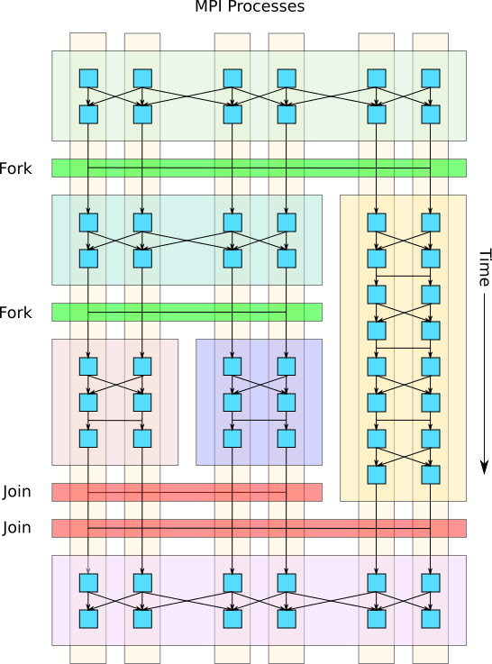

.. role:: cpp(code)
   :language: c++

.. role:: fortran(code)
   :language: fortran

Tutorials/Forkjoin
==================

There are two examples in the Tutorials/ForkJoin directory.

**ForkJoin/Simple**: demonstrates how to construct a ``ForkJoin`` object, specify
configuration parameters, register MultiFabs with different access
patterns, and invoke the ``ForkJoin::fork_join()`` operation.

**ForkJoin/MLMG**: demonstrates how to do more advanced fork-join operations,
including nested fork-joins, heterogeneous tasks, customized MultiFab
component splitting, and reusing ``ForkJoin`` objects for multiple
invocations.

**General Concepts**
--------------------

An AMReX program consists of a set of MPI ranks cooperating together on
distributed data.
Typically, all of the ranks in a job compute in a bulk-synchronous,
data-parallel fashion, where every rank does the same sequence of
operations, each on different parts of the distributed data.

The ForkJoin functionality described here allows the user to divide the
job's MPI ranks into subgroups (i.e. `fork`) and assign each subgroup
an independent task to compute in parallel with each other.
After all of the forked child tasks complete, they synchronize
(i.e. `join`), and the parent task continues execution as before.

.. figure:: figs/fork_join_tasks.png
   :scale: 80 %
   :align: center
   :alt: Fork-Join Tasks

   Example of a fork-join operation where the parent task's MPI processes (ranks) are
   split into two independent child tasks that execute in parallel and
   then join to resume execution of the parent task.

The fork-join operation can also be invoked in a nested fashion,
creating a hierarchy of fork-join operations, where each fork further
subdivides the ranks of a task into child tasks.
This approach enables heterogeneous computation and reduces the strong
scaling penalty for operations with less inherent parallelism or with
large communication overheads.

   Example of nested fork-join operations where a child task is further
   split into more subtasks.

The fork-join operation is accomplished by:

  a) redistributing MultiFab data so that **all** of the data in each
     registered MultiFab is visible to ranks within a subtask, and

  b) dividing the root MPI communicator into sub-communicators so that
     each subgroup of ranks in a tasks will only synchronize with each
     other during subtask collectives (e.g. for ``MPI_Allreduce``).

When the program starts, all of the ranks in the MPI communicator are
in the root task.

**ForkJoin/Simple**
-------------------

The main function in this tutorial is in ``MyTest.cpp:runTest()``.
It does the following things:

1. Create a ``ForkJoin`` object: the constructor takes the number of
tasks to split the calling (in this case, root) task.
This version of the constructor will divide the ranks in the calling
(parent) task evenly across the spawned (child) tasks.
To allow uneven distribution of ranks across tasks, there are other
versions of the ``ForkJoin`` constructor that allow the user to specify
the number (or percent) of ranks to include in each of the subtasks.

2. Set the verbosity flag and task output directory:
``ForkJoin::set_verbose()`` and ``ForkJoin::set_task_output_dir()``
are used to set each these parameters, overriding their default values.
Since the forked tasks run in parallel, their output to stdout
is interleaved and may be difficult to read.
By specifying a task output directory, the output from each task
is written to its own file (in addition to stdout).

3. Register three MultiFab data structures:
The ``ForkJoin`` object needs to know what data will be utilized within the
spawned subtasks and how they will be accessed.
For each MultiFab that will be accessed within the subtasks, there are
two main parameters that need to be specified: Strategy and Intent.
Strategy describes whether the MultiFab will be ``duplicate`` across
all tasks, ``split`` (component-wise) across the subtasks, or accessed
in only a ``single`` subtask.
Intent describes whether the data is an input and/or output to the
forked subtasks, and controls whether the data is copied in and/or out
of the subtask from the calling task.

.. figure:: figs/mf_remap_hires.png
   :align: center
   :scale: 7 %
   :alt: Examples of how to register MultiFabs

   Examples of how a MultiFab can be registered for a fork-join operation
   with varying Strategy and Intent.

During registration, the number of ghost cells in each dimension is
also specified, along with the ID of the owner task in the case that
``Strategy == single``.
No data is actually copied during the call to ``reg_mf()`` -- the MultiFab
is only registered to be copied later when the ``fork_join()`` call is invoked.

4. Invoke the ``fork_join()`` operation, calling ``myFunction`` in every task:
The ``fork_join()`` function launches the passed function (or lambda) on
all of the spawned tasks.
The passed function must take a single argument: a reference to the
managing ``ForkJoin`` object, which can be queried for the subtask's ID,
references to the registered MultiFabs, and other metadata such as the
component bounds of a registered MultiFab.
The tutorial's ``myFunction`` demonstrates these capabilities.

**ForkJoin/MLMG**
-----------------

This tutorial demonstrates some more advanced fork-join usage:

1. Nested fork-join: ``top_fork()`` invokes the first level fork-join,
   which assigns one rank to the task 0 and the rest of the ranks to task 1
   via the constructor: ``ForkJoin fj(Vector<int> {1, proc_n - 1});``.
   Task 1 then calls ``fork_solve()``, which further forks the task
   into sub-tasks.

2. Passing a lambda function to ``fork_join()`` and heterogeneous tasking:
   In ``top_fork()``, we pass a lambda that takes the ForkJoin object
   reference as an argument.
   The ForkJoin object can be queried for the task ID, which is used to
   dispatch to different tasks for heterogeneous task execution.

3. Custom component splitting: if a MultiFab is registered with
   ``Strategy == split``, then all the components of the MultiFab are
   split as evenly as possible across the tasks.
   In some cases, it may be desirable to either omit some components
   entirely or split the components in an uneven fashion.
   In ``fork_solve``, we demonstrate how to specify a custom component
   split across the tasks by using the ``modify_split`` member function
   of the ForkJoin object after a MultiFab has been registered.
   The ``modify_split`` function takes a ``Vector`` of ``ComponentSet``
   objects, each specifying the custom range of components to be passed
   to the task.
   In this example, we omit the first component from being passed to the
   child subtasks.

4. Reusing ForkJoin objects: if several successive fork-join operations
   are required with the same subranks and MultiFab access pattern,
   we can reuse the ForkJoin object across multiple invocations.
   Reusing the ForkJoin object avoids unnecessary overhead of recreating
   the forked data structures and metadata associated with the operation.
   The ``fork_solve()`` function demonstrates this capability by invoking
   ``fork_join()`` for two iterations.
