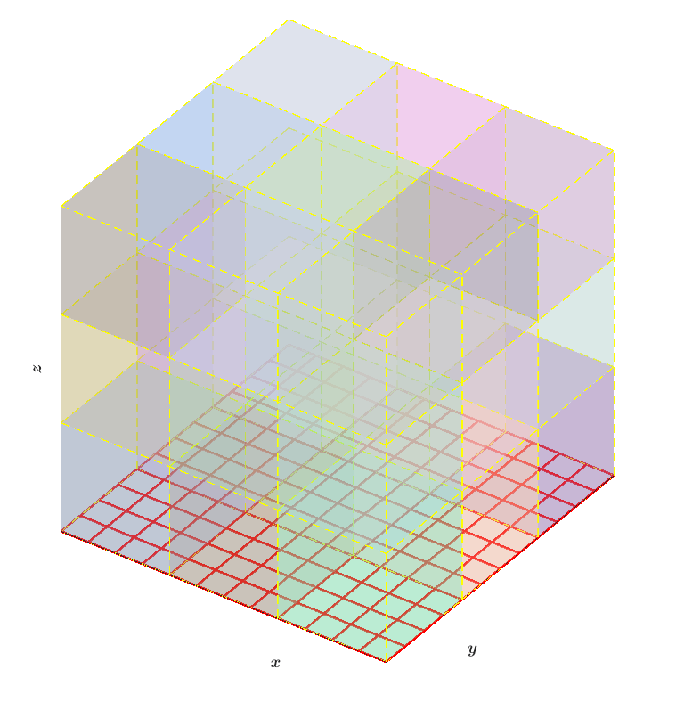

.. role:: cpp(code)
   :language: c++

.. role:: fortran(code)
   :language: fortran

Tutorials/MUI
==========================

The goal of this tutorial is to incorporate the MxUI/MUI (Multiscale Universal Interface) framework into AMReX. This framework allows two separate executables to communicate with one another in parallel using MPI. In addition, this framework is adaptable for different geometries, in which the bounds of data one would like to send and/or receive can be specified using the ``announce_send_span()`` and ``announce_recv_span()`` commands.

In this tutorial, two different C++ codes are built separately. Each has different spatial dimensions: one is built in 3D (``AMREX_SPACEDIM = 3``), and the other in 2D (``AMREX_SPACEDIM = 2``). Each code is compiled separately within their respective "exec" directories ``Exec_01`` & ``Exec_02``}, after which the two executables are run together using the following command, specifying the number of MPI processes to designate to each executable:

.. highlight:: console 

::

   $ mpirun -np N1 ../Exec_01/main3d.gnu.MPI.ex inputs
   : -np n2 ../Exec_02/main2d.gnu.MPI.ex inputs

on a single line within the ``Exec_coupled`` directory. ``N1`` and ``n2`` are the number of MPI ranks designated for each executable, respectively. Each executable is given the same inputs file within ``Exec_coupled``. Input variables ``max_grid_size_3d`` and ``max_grid_size_2d`` determine the respective grid sizes for 3D and 2D. As far as I am aware, the code works for any AMReX grid structure. Details of how to build and run the code are contained in the script ``cmd_mpirun``.

The figure below shows one possible grid structure of the 2D (red grid) and 3D (multicolored blocks) setup.

.. table::
   :align: center
   
   +------------------------------------------------------+
   |                        |a|                           |
   +------------------------------------------------------+
   | | MUI interface: 2D and 3D grid setup                |
   +------------------------------------------------------+

The 3D code initializes a 3D MultiFab (Note: with no ghost cells), and sends a 2D slice of this data at the :math:`k = 0` location to the 2D executable, which stores the data in a 2D MultiFab, multiplies the data by a constant, and sends the modified platter back to the 3D executable. Finally, the 3D executable receives the modified data and places it back into the 3D MultiFab, at :math:`k = 0`.

The 2D, original 3D, and modified 3D data are all written to separate plot files, which can be visualized using software such as Amrvis.

Although our code does not include this, it would be possible to pair an AMReX code with code that is outside of the AMReX framework, because each code is compiled separately. For example, using the ``announce_send_span()`` and ``announce_recv_span()`` commands, MUI would be able to determine the overlap between the two regions to correctly exchange the data, even if the two grid structures differ.
